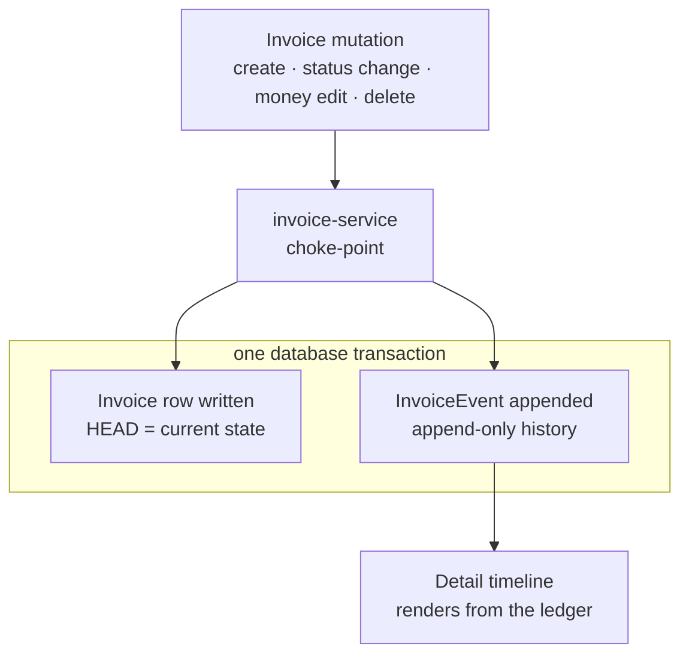

# InvoiceEvent Ledger — Requirements

## Summary

Add an append-only `InvoiceEvent` ledger that records the meaningful changes to each invoice — creation, status transitions, money-field edits, and deletion — and turn the invoice detail timeline into a truthful "who did what, when" feed. Every invoice mutation routes through one service choke-point that writes the change and its event together in a single transaction. The materialized invoice row stays the source of truth; the ledger is the history of how it got there.

## Problem Frame

The timeline on the invoice detail page is reconstructed from the invoice's current fields — `apps/web/src/components/InvoiceTimeline.tsx` derives its nodes from `status`, `createdAt`, and `paidDate` (its own comment notes "no fabricated 'Viewed' step"). That makes it a surface that misrepresents history: an invoice that was disputed and later paid shows no dispute ever happened, because only the final state survives. Mutations compound the problem — `updateInvoice` (`apps/api/src/invoices/handlers.ts:212`) overwrites the row in place, and `delete` hard-removes it, so there is no record of who changed an amount, who approved, or what a deleted invoice contained.

For a two-party approval workflow over money, that absence bites when it matters: a contractor disputes a rejected invoice, the landlord needs to show what changed and when, or IRS-style retention expects the record to exist. Building the ledger now, before more status logic accretes and before the contractor portal multiplies the actors mutating rows, is cheap; reconstructing years of history after the fact is not.

## Key Decisions

- **Audit over compliance (day-one job).** The first job is an honest, queryable record of who changed what and when, for the landlord — not bypass-proof compliance auditing. This sets the event scope and an application-level (not database-level) integrity model.
- **The materialized row stays the source of truth.** The invoice row remains live state ("HEAD"); the ledger is the append-only log of deltas. This is not event-sourcing — state is never rebuilt by replaying events.
- **Business-meaningful events, not field-diff-everything.** Record named events (a status transition, a money edit) rather than a generic diff of every column on every write, so the ledger reads as a story and stays low-noise.
- **Ledger-as-archive for deletes.** Deletion keeps hard-removing the row so list, stats, and export queries stay clean; the deletion event carries a full snapshot to preserve the record. Chosen over a `deletedAt` soft-delete flag specifically to avoid adding a `deleted_at IS NULL` filter to every invoice query.
- **Service choke-point capture.** Emit events explicitly from one invoice-service module, wrapping each mutation and its event in a single transaction — chosen over a Prisma client extension or Postgres triggers. It fits the codebase's explicit, typed, testable style and lets events carry the acting user and real business meaning. The trade-off is that it is discipline-dependent: a write path that bypasses the service would lose events, mitigated by funneling all invoice writes through the module.
- **Backfill with labeled synthetic events.** Reconstruct history for the existing invoices from their fields, labeled as inferred, rather than leaving them blank or maintaining a second field-derived display path.

## Requirements

**What gets recorded**

- R1. Recorded events are: creation, every status transition, edits to financially-material fields (amount, vendor, and the invoice's date field(s)), and deletion. Edits to other fields and read/view actions are not recorded.

**Capture mechanism**

- R2. Every invoice mutation records its event in the same database transaction as the mutation: if the event write fails the mutation rolls back, and there is no mutation without its event nor an orphan event without its mutation.
- R3. All invoice mutations route through a single invoice-service choke-point, so no write path can change an invoice without going through event capture. (Routing through the choke-point does not by itself emit an event — only the R1 set does; see Outstanding Questions on the export-stamp write.)
- R4. Each event records the acting session user, a timestamp, the target invoice, the event type, and — for edits — the field changed with its old and new values.

**Integrity and retention**

- R5. Events are append-only: application code never updates or deletes an event once written.
- R6. Deletion hard-removes the invoice row, and the deletion event carries a full snapshot of the invoice's final state, so the record stays reconstructable from the ledger.
- R7. Event reads are ownership-scoped to the session user, matching invoice access — no cross-owner history is ever visible, with no existence leak for non-owned invoices.

**Timeline surface**

- R8. The invoice detail timeline renders from recorded events — status transitions, money-field edits (showing old → new), creation, and deletion — each with its actor and timestamp.
- R9. For invoices created after the ledger ships, the timeline shows only recorded events; it never reconstructs status history from current fields.

**Backfill**

- R10. A one-time migration generates reconstructed events for invoices that predate the ledger, derived from their existing fields (at minimum a creation event, plus a paid event where a paid date exists).
- R11. Reconstructed events are labeled as inferred so the timeline distinguishes them from events recorded live.

## Key Flows

- F1. Status transition with event
  - **Trigger:** The landlord changes an invoice's status (e.g., marks it approved or paid).
  - **Steps:** The change goes through the invoice-service; within one transaction the row's status updates and a status-change event (old → new, actor, timestamp) is appended.
  - **Outcome:** The new status is live and the transition is permanently on the timeline.
  - **Covered by:** R2, R3, R4, R8

- F2. Money-field edit with event
  - **Trigger:** The landlord edits a tracked field (amount, vendor, or date).
  - **Steps:** The service computes the old → new delta for each tracked field changed and appends one event per change in the same transaction as the update.
  - **Outcome:** The edit is live; the timeline shows what changed, from what, to what, by whom.
  - **Covered by:** R1, R2, R4, R8

- F3. Deletion as tombstone
  - **Trigger:** The landlord deletes an invoice.
  - **Steps:** Within one transaction, the service appends a deletion event carrying a full snapshot of the invoice and hard-removes the row.
  - **Outcome:** The invoice no longer appears in lists/stats/export, but its final state and the deletion (actor, timestamp) remain in the ledger.
  - **Covered by:** R5, R6, R7

- F4. Viewing history
  - **Trigger:** The landlord opens an invoice's detail page.
  - **Steps:** The timeline loads the invoice's events (ownership-scoped) and renders them in order; for a pre-ledger invoice, reconstructed events appear labeled as inferred.
  - **Outcome:** The landlord sees a truthful change history.
  - **Covered by:** R7, R8, R9, R11

## Acceptance Examples

- AE1. **Covers R2, R4.** **When** the landlord changes status PENDING → APPROVED, **then** a status-change event is recorded with actor, timestamp, old status PENDING, and new status APPROVED, written in the same transaction as the status update.
- AE2. **Covers R1, R4.** **When** the landlord edits an invoice amount from $420 to $450, **then** an event records the amount change old → new; **when** they edit an untracked field, **then** no event is recorded.
- AE3. **Covers R5, R6.** **When** an invoice is deleted, **then** the row is removed and a deletion event holds a full snapshot of its final state, so the deleted invoice's contents remain visible in the ledger.
- AE4. **Covers R2.** **When** the event write fails mid-transaction, **then** the invoice mutation rolls back and the invoice is left unchanged.
- AE5. **Covers R8, R9, R11.** **When** the landlord opens a pre-ledger invoice, **then** the timeline shows reconstructed creation/paid events labeled as inferred; **when** they open a post-ledger invoice, **then** the timeline shows only live-recorded events.

## Scope Boundaries

- Full event-sourcing (rebuilding invoice state by replaying events) — out; the materialized row stays the source of truth.
- An account-wide activity feed across all invoices — deferred; this delivers the per-invoice timeline only.
- Downstream consumers the ledger enables — email reminders, a contractor activity feed, surfacing Sheets sync status as an event — deferred; the substrate supports them but none are built here.
- Database-level tamper-proofing (Postgres triggers, revoked UPDATE/DELETE grants) — out; append-only is application-enforced, matching the audit-over-compliance priority.
- Read/view event tracking — out.

## Dependencies / Assumptions

- This introduces the first database transactions in the codebase — invoice writes are single statements today (`apps/api/src/invoices/handlers.ts`), so the atomic capture mechanism depends on adding transactional writes.
- The acting session user is available on every mutation handler (via `request.user`) to stamp as the event actor.
- Ownership scoping (no existence leak, per the project's invoice-access decision) governs event reads exactly as it governs invoice reads.
- Postgres remains the source of truth; this adds a table and does not change the Sheets export-only model.
- Event volume grows faster than invoice count, so the ledger needs its own index and a retention posture (sized in planning).

## Outstanding Questions

**Deferred to planning**

- The stored shape of an event — a single table with an event-type field plus a structured `detail` payload, versus typed columns per event kind — and the exact event-type taxonomy.
- Whether reconstructed backfill events are persisted rows or computed on read; either way R11's "labeled inferred" requirement holds.
- Index design and any retention/archival policy for the ledger as it grows.
- Whether the Sheets export-stamp write (`sheetsSyncedAt`) should route through the choke-point as a (non-timeline) event now, or stay deferred with the other consumers. Leaning deferred, but cheap to include if planning wants the sync-as-event story early.
