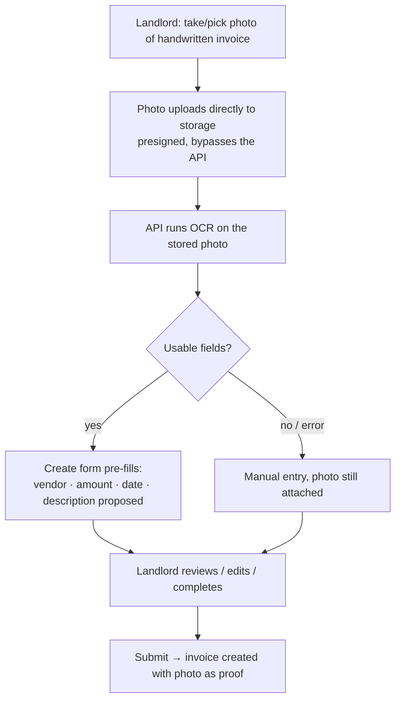

# Photo Invoice Capture — Requirements

## Summary

Let a photo of a contractor's handwritten invoice become an invoice in the app. The landlord attaches the photo, an OCR step extracts what it can (vendor, amount, date, description) and pre-fills the create form, and the landlord completes and submits — creating the invoice with the photo kept as proof. Photos can also be attached to any invoice for record-keeping, and the same "extract from photo" action is reusable on any invoice that has one.

## Problem Frame

Contractors write their invoices by hand — in a notebook — then send the landlord the handwritten invoice or a photo of it (by text, email, or similar). Today the landlord re-types every figure into the create form by hand, off a photo on their phone. That retyping is the most manual moment in the product, and it discards the photo entirely — yet the photo is exactly the proof a landlord wants on record for a payment. The `InvoiceImage` model and a "Scan a receipt" tile already exist in the codebase but are unwired, so the capability the product was shaped around has never shipped.

## Key Decisions

- **OCR is core, and handwriting-tolerant.** The source is handwritten invoices, so extraction is imperfect by nature; the feature is designed as "fills what it can, the landlord completes the rest," with success measured as saved typing — not flawless reads.
- **One photo per invoice.** The invoice photo is both the scan source and the proof on record. The categorized cash/parts/check multi-photo model (the schema's `ImageType` enum) is deferred.
- **Attach is a general capability; extract is a reusable action.** A photo can be attached to any invoice (at creation, on a manually-typed invoice, or later on the detail page). "Extract from photo" is one action, reused by the scan-to-create entry and runnable on any invoice that has a photo.
- **Pre-fill and create once — no persisted draft.** Scanning pre-fills the form; the invoice is created only on submit. The draft/review-queue model is simpler to skip for a single landlord and waits for the contractor portal.
- **The landlord is the only in-app actor.** Contractors send photos out-of-band today; contractor self-submission waits for the portal.
- **Extract suggests, never silently overwrites.** On an invoice that already has values, extraction fills blanks and *proposes* for filled fields; the landlord accepts or edits every value before it persists.
- **Photos upload directly to storage, not through the API.** Vercel's 60-second function limit rules out streaming files through the API, so the client uploads to object storage directly (presigned) and the API handles metadata and OCR (see Dependencies).

## Actors

- A1. Landlord — the only in-app actor. Uploads photos, runs extraction, reviews and creates invoices, and views the proof.
- A2. Contractor — writes the handwritten invoice and sends its photo to the landlord through an external channel. Not a system user in this v1 (the off-app source of the photo).
- A3. OCR provider (system) — extracts fields from a photo via an external API, behind the mockable, error-sanitizing integration seam.
- A4. Object storage (system) — holds uploaded photos; receives direct presigned uploads from the client.

## Requirements

**Photo attachment**

- R1. An invoice holds at most one photo, attachable at creation or later, on any invoice (scanned or manually typed).
- R2. Attaching a photo when one already exists replaces it; the prior image is no longer referenced by the invoice.
- R3. The landlord can supply a photo from a phone camera or a file on any device, through a single control that offers both.

**Scan and extract**

- R4. "Extract from photo" runs OCR on an invoice's photo and proposes values for vendor, amount, invoice date, and description.
- R5. Extraction fills empty fields and *proposes* (does not silently overwrite) fields that already hold a value; the landlord accepts or edits every value before it persists.
- R6. When extraction returns nothing usable or errors, the flow falls back to manual entry with the photo still attached — it never blocks invoice creation.
- R7. Category and status are not extracted; they remain the landlord's choice (status defaults to PENDING).

**Scan-to-create flow**

- R8. The create form offers a "Scan an invoice" entry that attaches a photo, runs extraction, and pre-fills the form in one step; the landlord reviews, completes, and submits once.
- R9. Scanning produces no persisted draft — the invoice exists only after submit.

**Viewing and integrity**

- R10. An invoice's photo is viewable on its detail page as the proof on record.
- R11. Attaching, replacing, and removing a photo are recorded in the invoice event ledger.
- R12. Photos are ownership-scoped like invoices — only the owner can view or change an invoice's photo, with no existence leak for others' invoices.

## Key Flows

- F1. Scan an invoice → create
  - **Trigger:** The landlord starts "Scan an invoice" on the create form.
  - **Steps:** Pick or take a photo → the photo uploads to storage → extraction runs → the form pre-fills with proposed values → the landlord reviews, edits, and completes → submit creates the invoice with the photo attached.
  - **Covers:** R3, R4, R5, R8

- F2. Attach a photo to an existing invoice
  - **Trigger:** The landlord opens an invoice's detail and attaches a photo.
  - **Steps:** Pick or take → upload → the photo shows as proof; the ledger records the attach.
  - **Covers:** R1, R10, R11

- F3. Extract on an existing invoice
  - **Trigger:** The landlord runs "extract from photo" on an invoice that already has a photo.
  - **Steps:** OCR proposes values; blanks fill, already-filled fields are offered (not overwritten); the landlord applies or edits.
  - **Covers:** R4, R5

- F4. Failed or empty extraction
  - **Trigger:** OCR returns nothing usable or errors.
  - **Steps:** The flow surfaces that nothing was extracted and leaves the form for manual entry, photo still attached; creation still succeeds.
  - **Covers:** R6

- F5. Replace a photo
  - **Trigger:** The landlord attaches a photo to an invoice that already has one.
  - **Steps:** The new photo replaces the old reference; the ledger records the replace.
  - **Covers:** R2, R11

## Acceptance Examples

- AE1. **Covers R4, R5.** **Given** a legible handwritten-invoice photo, **when** the landlord scans it, **then** vendor, amount, date, and description are proposed and pre-filled, and the landlord can edit any of them before submitting.
- AE2. **Covers R5.** **Given** an invoice that already has an amount entered, **when** extraction reads a different amount, **then** the entered amount is not silently overwritten — the suggestion is shown and the landlord chooses.
- AE3. **Covers R6.** **Given** a blurry or unreadable photo, **when** extraction fails, **then** the form remains for manual entry with the photo attached, and creating the invoice still succeeds.
- AE4. **Covers R2, R11.** **Given** an invoice that already has a photo, **when** the landlord attaches a new one, **then** it replaces the old photo and an attach/replace event is recorded in the ledger.
- AE5. **Covers R12.** **Given** another user's invoice, **when** the landlord requests its photo, **then** it is not accessible (404, no existence leak).
- AE6. **Covers R9.** **Given** a scan in progress, **when** the landlord abandons it before submitting, **then** no invoice and no draft is created.

## Scope Boundaries

**Deferred for later**
- Categorized multi-photo proof — multiple photos per invoice typed as cash/parts/check (`ImageType`).
- Contractor self-submission of invoices or photos — gated on the contractor portal.
- A persisted draft / review queue for incoming scans.
- Line-item / parts-breakdown extraction — only header fields (vendor, amount, date, description) are extracted.

## Dependencies / Assumptions

- An object-storage bucket (with credentials) must be provisioned by the user. The upload is a direct presigned client→storage transfer — Vercel's 60-second function limit rules out streaming files through the API.
- An OCR provider account (with per-call cost) must be provisioned; handwriting support is a selection criterion (e.g., Google Document AI, AWS Textract). Provider choice is deferred to planning.
- Both providers sit behind the mockable, error-sanitizing integration seam (CONV-016 / DEC-022); tests mock them, with no live calls.
- Handwriting extraction is imperfect by nature; the design assumes partial extraction is the norm and manual completion is always available.
- The InvoiceEvent ledger (recently shipped) gains image attach / replace / remove event types.
- Ownership-scoping with no existence leak (DEC-019) governs photo access as it governs invoices.

## Success Criteria

- A typical legible scan pre-fills at least the amount and vendor, so the landlord confirms rather than types them.
- Every invoice can show its photo as proof on the detail page.
- A failed or empty extraction never blocks invoice creation — the manual path always works.
- No photo is ever accessible across owners.

## Outstanding Questions

**Deferred to planning**
- OCR provider and object-storage provider selection (handwriting accuracy, free-tier limits, per-call cost).
- Image constraints — maximum size, accepted formats, and whether to downscale client-side before upload.
- Whether to surface per-field OCR confidence or simply pre-fill the proposed values.
- A photo's lifecycle when its invoice is deleted — the DELETED tombstone keeps the record, but the stored object needs an explicit keep-or-clean decision.
