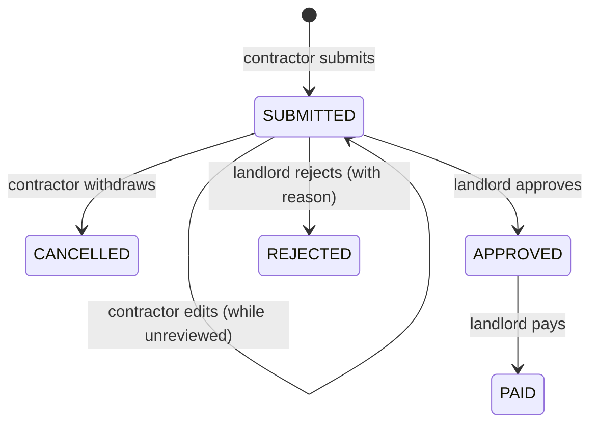

# Contractor Submission Links — Requirements

## Summary

Let the landlord collect invoices from contractors via a no-login link instead of receiving texted photos and re-entering everything. The landlord adds each contractor and gives them a permanent, revocable link; the contractor opens it on their phone (no account, no password), submits an invoice (amount, date, description, photo), and can check their own submissions' statuses. Submissions land as a new SUBMITTED status in the landlord's review queue, where they are approved (finally wiring the dead Approve action) or rejected with a reason, then paid. Every invoice stays owned by the landlord — the contractor is only the submitter — so the single-owner model is untouched.

## Problem Frame

The app's whole premise is "contractor submits → landlord reviews → approves/rejects → pays," but only one party has ever existed: the landlord, who today re-types every figure off a texted photo. The obvious build — a contractor portal with accounts — is the wrong shape: non-technical tradespeople resist creating accounts and remembering passwords, and adding a second logged-in actor would force re-architecting the ownership model (every invoice read/write is hard-scoped to one `userId` with no existence leak). The contractors' real current behavior is fire-and-forget: snap a photo, text it. A no-login link that mirrors that behavior — tap the link I texted you, submit — clears the adoption barrier and, because the invoice stays landlord-owned, leaves the ownership model intact. The `CONTRACTOR` role and the ledger's submitter/owner split already exist for exactly this; only the `APPROVED` status sits unwired.

## Key Decisions

- **Tokenized links, not accounts.** Contractors never log in. Each contractor has a permanent, revocable link whose token authorizes a narrow scope: submit invoices and read their own submissions' statuses. Accounts/passwords were rejected as the adoption killer.
- **The contractor is a lightweight entity, not a User.** A new "contractor" record (name + a contact field + a link token), belonging to one landlord. It is not in the auth/User system and has no password or session — so there is no auth rework.
- **Ownership is unchanged.** A submission creates an invoice owned by the contractor's landlord; the contractor is recorded as the submitter. The single-owner scoping and no-existence-leak rule (DEC-019) are untouched — the link is a token-scoped channel, not a session.
- **A new SUBMITTED entry status, and APPROVED finally wired.** Submissions start SUBMITTED (a distinct "to review" queue); the landlord approves → APPROVED or rejects with a reason → REJECTED, then pays → PAID. The contractor sees these as Submitted / Approved / Paid / Rejected. This is enum-driven, so it touches the status enum, badges, counts, and dashboard.
- **The landlord categorizes on review.** Contractors submit amount/date/description/photo; the tax category stays the landlord's to set (a consequential decision the contractor shouldn't own). The submitted invoice's vendor defaults to the contractor's name.
- **Submissions are editable/withdrawable while SUBMITTED.** Once the landlord acts, the submission locks.
- **In-app notifications for v1.** The landlord learns of submissions via the review queue / SUBMITTED count; the contractor gets an on-submit confirmation and the status view. Email/SMS is deferred.

## Actors

- A1. Landlord — the only logged-in user (existing session auth, unchanged). Manages contractors and their links, reviews submissions (approve/reject/pay), and owns every invoice.
- A2. Contractor — a person the landlord works with, **not** a logged-in user. Known to the app only through their link token. Submits invoices and views their own submissions' statuses via the link.
- A3. Submission link (token) — the bearer credential that authorizes a contractor's submit + own-status scope; revocable and regenerable by the landlord.

## Requirements

**Contractor management (landlord)**

- R1. The landlord can add a contractor (name + a contact field) and see them in a managed Contractors list.
- R2. Each contractor has a permanent submission link the landlord can copy/share and can revoke or regenerate at any time; revoking invalidates the old link.
- R3. A contractor belongs to exactly one landlord (v1).

**Submission (contractor, via link, no login)**

- R4. Opening a valid link lets the contractor submit an invoice — amount, date, description, and a photo — with no login.
- R5. The submitted invoice's vendor defaults to the contractor's name; the contractor does not choose a tax category (the landlord sets it on review).
- R6. The contractor gets a confirmation on submit and sees a list of their own submissions with each status (Submitted / Approved / Paid / Rejected, with the rejection reason when present) — scoped to that link only.
- R7. While a submission is still SUBMITTED, the contractor can edit it or withdraw it; once the landlord has acted, it locks.
- R8. A revoked or invalid link can neither submit nor read; it shows a clear "link no longer active" state.

**Lifecycle and landlord review**

- R9. A contractor submission lands as a new SUBMITTED status — a "to review" queue distinct from the landlord's own invoices.
- R10. From a SUBMITTED invoice the landlord can approve (→ APPROVED), reject with a reason (→ REJECTED), and pay (→ PAID) — wiring the Approve action that exists in the enum but has no UI today.
- R11. The landlord can see which invoices were contractor-submitted (and by whom) and how many are awaiting review.

**Ownership and integrity**

- R12. Every invoice, including contractor submissions, is owned by the landlord; the landlord's existing reads/writes stay scoped with no existence leak.
- R13. A submission, its edits, its withdrawal, and each status change are recorded in the invoice event ledger, attributed to the acting contractor or landlord.
- R14. A contractor (via their link) can only ever submit/edit/withdraw/read their own submissions — never another contractor's, and never the landlord's other invoices.

**Security**

- R15. The link token is a bearer credential: rate-limited, never logged, and invalidated on revoke/regenerate.

## Key Flows

- F1. Add a contractor and share the link
  - **Trigger:** The landlord adds a contractor on the Contractors page.
  - **Steps:** Enter name + contact → the app issues a permanent link → the landlord copies/texts it.
  - **Covers:** R1, R2

- F2. Contractor submits an invoice
  - **Trigger:** The contractor opens their link on a phone.
  - **Steps:** Fill amount/date/description + attach a photo → submit → confirmation. A new invoice is created in SUBMITTED, owned by the landlord, with this contractor as submitter.
  - **Covers:** R4, R5, R9, R12

- F3. Contractor edits or withdraws
  - **Trigger:** The contractor reopens a still-SUBMITTED submission.
  - **Steps:** Edit a field (e.g., a wrong amount) or withdraw it; the change is recorded in the ledger. A reviewed submission is read-only.
  - **Covers:** R7, R13

- F4. Contractor checks status
  - **Trigger:** The contractor opens their link.
  - **Steps:** See their own submissions and each status (and the rejection reason when present) — nothing else.
  - **Covers:** R6, R14

- F5. Landlord reviews a submission
  - **Trigger:** A submission appears in the landlord's review queue.
  - **Steps:** See the submitter + photo → approve, or reject with a reason, or pay → the status updates and the contractor's link reflects it.
  - **Covers:** R9, R10, R11

- F6. Revoke or regenerate a link
  - **Trigger:** A link leaks, or a contractor relationship ends.
  - **Steps:** The landlord revokes/regenerates → the old link is inert.
  - **Covers:** R2, R8, R15

## Acceptance Examples

- AE1. **Covers R4, R9, R12.** **Given** a valid link, **when** the contractor submits amount/date/description/photo, **then** a new invoice is created in SUBMITTED, owned by the landlord, with the contractor recorded as submitter, and the contractor sees a confirmation.
- AE2. **Covers R7.** **Given** a SUBMITTED submission, **when** the contractor edits the amount, **then** it updates; **when** the landlord has already approved it, **then** the contractor can no longer edit it.
- AE3. **Covers R10.** **Given** a SUBMITTED invoice, **when** the landlord approves it, **then** status → APPROVED and the link shows "Approved"; **when** rejected with a reason, **then** the contractor sees "Rejected" and the reason.
- AE4. **Covers R14.** **Given** contractor A's link, **when** used, **then** it can only see/act on A's submissions — never B's nor the landlord's other invoices (no existence leak).
- AE5. **Covers R8, R15.** **Given** a revoked link, **when** opened, **then** it can neither submit nor read and shows "link no longer active."
- AE6. **Covers R5.** **Given** a submission, **then** its vendor defaults to the contractor's name and it has no category until the landlord sets one on review.

## Scope Boundaries

**Deferred for later**
- Email/SMS notifications — v1 is the in-app review queue + an on-submit confirmation and status view.
- A contractor working with more than one landlord.
- Contractors choosing a category or entering line items.
- Bulk review actions on the landlord's queue.

**Outside this product's identity**
- Contractor accounts, logins, or passwords — the no-login link is the whole point; adding accounts would re-introduce the adoption barrier and the ownership-model rework this design avoids.
- A full vendor / accounts-payable / accounting system — this is a focused submission inbox, not that.

## Dependencies / Assumptions

- The contractor is a new lightweight entity, not a User — the landlord's existing session auth (`apps/api/src/auth`) is unchanged.
- A new SUBMITTED status is enum-driven and touches the status enum, badges, status counts, and the dashboard (all built to be enum-driven).
- The contractor's photo upload reuses the just-shipped storage upload, scoped to the contractor's link token rather than a session.
- The InvoiceEvent ledger records the contractor as the submitter/actor; its actor field is a plain string today, so a contractor reference fits (exact representation is a planning detail).
- Single landlord today, so "the contractor's landlord" is the one who created them.
- Ownership-scoping with no existence leak (DEC-019) and Postgres source of truth (DEC-001) hold.

## Success Criteria

- A contractor can submit an invoice from their phone via the link in under a minute, with no account.
- New submissions surface to the landlord as a clear "to review" queue they can approve/reject/pay from.
- A contractor can self-check whether they've been paid without contacting the landlord.
- No contractor can ever see another contractor's or the landlord's other invoices, and a revoked link is inert.

## Outstanding Questions

**Deferred to planning**
- The exact representation of the contractor as the ledger actor and as the invoice's submitter relation.
- Whether SUBMITTED is best modeled as a status enum value or a separate review flag (the decision leans status; planning weighs the enum change against alternatives).
- Link-token format, rotation mechanics, and rate-limit thresholds for the public (unauthenticated) submission endpoint.
- Whether contractor-submitted invoices count toward the landlord's dashboard spend / Sheets export immediately or only once approved (SUBMITTED is arguably not yet "spend").
- The contact field on a contractor (phone vs email) and whether it is used beyond display in v1.
