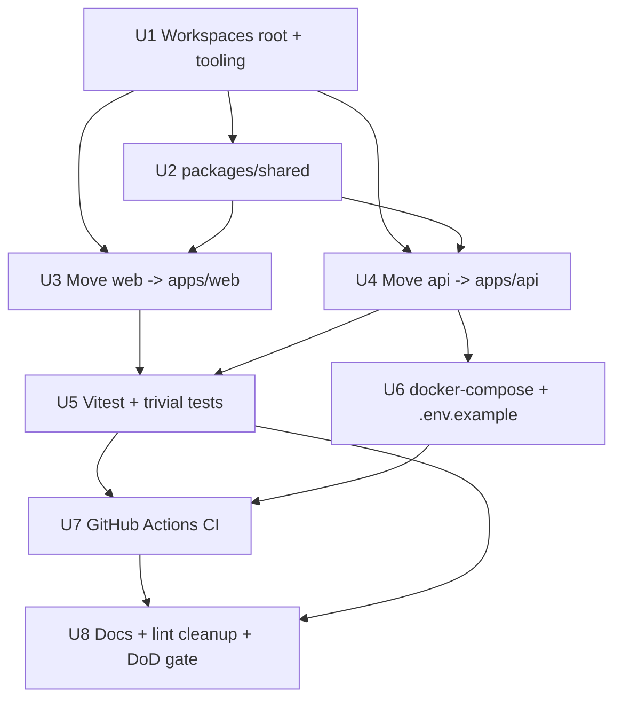

# feat: Invoice Manager — Phase 0 Monorepo Foundation (Execution Plan)

**Created:** 2026-06-20
**Origin:** `PROJECT_PLAN.md` (the compound-engineering build plan; this document is its execution layer)
**Plan depth:** Deep
**Status:** Phase 0 implementation-ready; Phases 1–6 outlined for sequencing only

---

## Summary

`PROJECT_PLAN.md` describes a near-greenfield npm-workspaces monorepo (`apps/web`, `apps/api`, `packages/shared`) with a rich data model and session auth. The repository today is a **working single-package app** under `src/` (Vite + Fastify together, Prisma 7, real seeded 2025 invoice data). This plan drives the existing app toward the target state **in phase order**, with Phase 0 reconciled to be a **risk-free mechanical restructure** — workspace migration, shared tooling, local Postgres, CI, and trivial tests — that changes **no runtime behavior and no database schema**. Every risky change (the §5 schema overhaul, auth, Google Sheets) is sequenced into its own later phase as a small, verifiable slice.

This document plans **Phase 0 in full detail**. Phases 1–6 are outlined with reconciliation notes (what exists vs. what the plan needs) and will be planned in full when each is reached.

---

## Problem Frame

The compound-engineering discipline in `PROJECT_PLAN.md` §0 requires green feedback loops (`lint`, `typecheck`, `test`, `format`) and a Phase-0-first foundation before any feature work. The current repo violates several Phase 0 preconditions:

- **No workspaces** — single `package.json`; web and API share one dependency tree and one `src/` tree.
- **No test runner** — Vitest is not installed; there are zero tests.
- **No `test`/`typecheck`/`format` scripts** — only `lint`, `dev`, `build`, `start`, and db scripts exist.
- **No local Postgres definition** — no `docker-compose.yml`; `.env` exists but no committed `.env.example`.
- **No CI** — no `.github/workflows/`.
- **ESLint is browser-only** — `eslint.config.js` sets `globals.browser`, but `apps/api` is Node; lint does not currently cover server code correctly.

The goal of Phase 0 is to satisfy the §10 Phase 0 Definition of Done — `npm run lint && npm run typecheck && npm run test` green locally and in CI — while preserving the running app exactly as-is.

---

## Decisions Made (this planning session)

These were confirmed with the user and supersede the corresponding rows of `PROJECT_PLAN.md` §3 where they differ:

- **D-A — Migrate to the monorepo layout.** Adopt `apps/web` + `apps/api` + `packages/shared` exactly as §4 specifies, using npm workspaces. The restructure is Phase 0 work.
- **D-B — Adopt the §5 data model, remap seed data — in Phase 2, not Phase 0.** Phase 0 makes **zero** schema changes. In Phase 2 the schema migrates to §5 (cuid IDs, `invoiceNumber`/`vendorName`/`amount`/`category`/`status` enums, `User.passwordHash`, `Session`) and the existing 2025 seed data is remapped lossily (`price→amount`, `date→invoiceDate`, `location`/`parts`/`quantity`→`notes`/`description`, synthesize `vendorName`/`category`).
- **D-C — Plan the full roadmap, detail Phase 0 only.** All phases are mapped for sequencing; only Phase 0 has implementation-ready units. Later phases are re-planned when reached.
- **D-D — Keep installed library versions over §3's table.** The repo already runs React 19, React Router 7, TanStack Query 5, RHF 7, Zod 4, Tailwind v4, and Prisma 7. `PROJECT_PLAN.md` §3 lists React 18 / React Router v6 — keep what's installed; these are newer and working. (Record in §12 Decision Log as a new DEC entry.)

---

## Requirements Traceability (Phase 0)

Maps directly to `PROJECT_PLAN.md` §10 Phase 0 checklist:

| Plan §10 Phase 0 item | Covered by |
|---|---|
| Init npm workspaces (`apps/web`, `apps/api`, `packages/shared`) | U1, U2, U3, U4 |
| TypeScript **strict** everywhere; path alias for `@shared` | U1 (base config), U2 (`@shared` export) |
| ESLint + Prettier + editorconfig; root scripts `lint`/`format`/`typecheck`/`test` | U1, U8 |
| `docker-compose.yml` with Postgres; `.env.example` filled | U6 |
| Vitest in `api` and `web` (one trivial passing test each) | U5 |
| GitHub Actions `ci.yml`: install → lint → typecheck → test | U7 |
| **DoD:** all four loops green locally and in CI | U8 (final gate) |

---

## Key Technical Decisions (Phase 0)

- **KTD-1 — Restructure preserves behavior; verify the app still runs after each move.** The web move (U3) and API move (U4) must each end with the app booting and serving as before. No route, handler, or DB call changes in Phase 0.
- **KTD-2 — `packages/shared` ships TypeScript source, consumed directly.** For a solo monorepo, the simplest reliable setup is for `apps/web` and `apps/api` to import `@shared` as TS source via path aliases / workspace resolution rather than a build step. No separate compile/publish in Phase 0. (Revisit only if a bundler boundary forces it.)
- **KTD-3 — Prisma stays a single schema owned by `apps/api`.** Move `src/prisma/` → `apps/api/prisma/`, move `prisma.config.ts` into `apps/api`, and regenerate the client to `apps/api/prisma/generated`. Update all generated-client import paths. The web app never imports Prisma.
- **KTD-4 — ESLint flat config gets per-area language options.** One root config with overrides: browser globals for `apps/web/**`, Node globals for `apps/api/**` and `packages/shared/**`. Resolves the current browser-only gap.
- **KTD-5 — Two existing route implementations (`myRoutes`/`myHandlers` vs. `routes`/`handlers`) move as-is in Phase 0.** Consolidation is a behavior decision deferred to Phase 1 (see Open Questions OQ-1). Phase 0 keeps whichever the server currently imports wired exactly as today.
- **KTD-6 — Root keeps the package name `mac-invoices`.** §4's tree header `invoice-manager/` is illustrative; do not rename the repo or root package.

---

## High-Level Technical Design

### Target monorepo layout (Output Structure)

```
mac-invoices/                      # repo root (workspaces: apps/*, packages/*)
├── package.json                   # workspaces root + delegating scripts
├── tsconfig.base.json             # shared strict TS base + @shared path
├── .prettierrc , .editorconfig
├── docker-compose.yml             # local Postgres
├── .env.example
├── .github/workflows/ci.yml
├── docs/
│   ├── specs/                     # one md per feature (Phase 1+)
│   ├── DECISIONS.md               # mirror of PROJECT_PLAN §12
│   ├── CONVENTIONS.md             # mirror of PROJECT_PLAN §11
│   └── plans/                     # this plan + future phase plans
├── packages/
│   └── shared/
│       ├── package.json
│       ├── tsconfig.json
│       └── src/{index.ts, schemas/}   # real Zod schemas land in Phase 2
└── apps/
    ├── api/                       # Fastify (from src/api + src/lib/prisma + src/prisma)
    │   ├── package.json, tsconfig.json, vitest.config.ts
    │   ├── prisma/{schema.prisma, seed.ts, seed-data.csv, migrations/, generated/}
    │   ├── prisma.config.ts
    │   ├── src/{server.ts, lib/prisma.ts, invoices/*, db/*}
    │   └── test/smoke.test.ts
    └── web/                       # React (from src/ web files)
        ├── package.json, tsconfig.json, vite.config.ts, vitest.config.ts
        ├── index.html, components.json
        ├── src/{main.tsx, App.tsx, *.css, components/, lib/utils.ts, assets/}
        └── test/smoke.test.tsx
```

### Phase 0 unit dependency graph



---

## Implementation Units — Phase 0

> Execution posture for U3 and U4: **behavior-preserving refactor.** After each, boot the app and confirm it serves exactly as before moving. Commit each unit separately so a regression is bisectable.

### U1. Workspaces root + shared tooling

**Goal:** Convert the root into an npm-workspaces project with shared strict TS, Prettier, editorconfig, and delegating root scripts. No app files move yet.

**Requirements:** §10 Phase 0 — workspaces init, strict TS, ESLint/Prettier/editorconfig, root scripts.

**Dependencies:** none.

**Files:**
- `package.json` (root) — add `"workspaces": ["apps/*", "packages/*"]`; replace app-specific scripts with delegating scripts: `dev`, `build`, `lint`, `typecheck`, `test`, `format` (run across workspaces); keep `db:*` pointed at the api workspace.
- `tsconfig.base.json` (new) — strict base; `paths` includes `@shared/*` and `@/*`; consumed via `extends` by each workspace tsconfig.
- `.prettierrc` (new), `.prettierignore` (new), `.editorconfig` (new).
- `eslint.config.js` — restructure to flat config with per-area `languageOptions` (browser for web, node for api/shared); add `ignores` for `**/generated/**`, `dist`, `node_modules`.

**Approach:** Root `package.json` becomes the orchestrator. Decide `typecheck` = `tsc -b` across workspace references (or per-workspace `tsc --noEmit`). `format` = `prettier --write .`; add a `format:check` for CI. Do not move source in this unit — only configuration, so the next units have a stable base to move into.

**Patterns to follow:** existing `eslint.config.js` flat-config style; existing `tsconfig.json` project-references pattern (`tsconfig.app.json` + `tsconfig.node.json`).

**Test scenarios:** Test expectation: none — pure tooling/config. Verification is loop-based, not unit tests.

**Verification:** `npm install` resolves the workspace graph without error; `npm run format:check` runs; `npx eslint .` runs without config errors (lint *findings* may exist until U8).

---

### U2. Create `packages/shared` workspace

**Goal:** Stand up the shared package that will hold Zod schemas + types (real content arrives in Phase 2), wired so both apps can import `@shared`.

**Requirements:** §10 Phase 0 — workspaces, `@shared` path alias.

**Dependencies:** U1.

**Files:**
- `packages/shared/package.json` (name e.g. `@mac-invoices/shared`, `"type": "module"`, `main`/`exports` → `src/index.ts`).
- `packages/shared/tsconfig.json` (extends `tsconfig.base.json`, strict).
- `packages/shared/src/index.ts` (placeholder export, e.g. a version const or a single shared type).
- `packages/shared/src/schemas/.gitkeep` (Phase 2 fills `invoice.ts`).

**Approach:** Confirm the `@shared` alias resolves both via TS (path mapping) and at runtime for the API (tsx) and build-time for web (Vite alias) — set those aliases here so U3/U4 inherit working imports. Keep content trivial; the package's job in Phase 0 is to exist and resolve.

**Patterns to follow:** `@/*` alias already configured in `tsconfig` and `vite.config.ts` — mirror that wiring for `@shared`.

**Test scenarios:** Test expectation: none — placeholder package. Resolution is proven by U5 importing it in a smoke test.

**Verification:** `npm run typecheck` resolves `@shared` from a temporary import; no module-resolution errors.

---

### U3. Move web app → `apps/web`

**Goal:** Relocate all frontend files into `apps/web` and keep the Vite dev server and production build working unchanged.

**Requirements:** §10 Phase 0 — workspaces; KTD-1 behavior preservation.

**Dependencies:** U1, U2.

**Files (move + re-point):**
- Move `src/main.tsx`, `src/App.tsx`, `src/App.css`, `src/index.css`, `src/assets/`, `src/components/`, `src/lib/utils.ts` → `apps/web/src/...`
- Move `index.html`, `components.json`, `vite.config.ts` → `apps/web/`
- Create `apps/web/package.json` (web deps: react, react-dom, react-router, tanstack-query, react-hook-form, zod, tailwind, radix, etc.) and `apps/web/tsconfig.json` (from current `tsconfig.app.json`).
- Update `@` alias and any Tailwind/shadcn paths to the new root.

**Approach:** This is a mechanical move + path re-pointing. The Fastify `src/api` and `src/lib/prisma.ts` are **not** touched here (they move in U4). Keep `src/lib/utils.ts` (web util) distinct from `src/lib/prisma.ts` (api). Confirm Tailwind v4 Vite plugin and shadcn `components.json` paths still resolve.

**Patterns to follow:** current `vite.config.ts` alias + `@tailwindcss/vite` setup.

**Test scenarios:** Test expectation: none in this unit (smoke test added in U5). Manual run is the verification.

**Verification:** `npm run dev -w apps/web` boots the Vite server and the current form renders; `npm run build -w apps/web` (`tsc -b && vite build`) succeeds.

---

### U4. Move API app → `apps/api` (including Prisma)

**Goal:** Relocate the Fastify server, invoice routes/handlers/types, db connector/script, the Prisma schema/seed/migrations/generated client, and `prisma.config.ts` into `apps/api`, and keep the server booting and serving `/api/invoices` against the existing database.

**Requirements:** §10 Phase 0 — workspaces; KTD-1, KTD-3.

**Dependencies:** U1, U2.

**Files (move + re-point):**
- Move `src/api/server.ts`, `src/api/invoices/*` (both `myRoutes`/`myHandlers`/`myTypes` and `routes`/`handlers`/`types` — see KTD-5), `src/api/db/connector.ts`, `src/api/db/script.ts` → `apps/api/src/...`
- Move `src/lib/prisma.ts` → `apps/api/src/lib/prisma.ts`
- Move `src/prisma/` (schema, seed.ts, seed-data.csv, migrations/, generated/) → `apps/api/prisma/`
- Move `prisma.config.ts` → `apps/api/prisma.config.ts`; update its `schema`/`migrations.path`/`seed` to api-relative paths.
- Create `apps/api/package.json` (api deps: fastify, fastify-plugin, fastify-cli, @prisma/client, @prisma/adapter-pg, pg, csv-parse, zod, tsx, prisma) and `apps/api/tsconfig.json` (from current `tsconfig.node.json`, Node libs/globals).
- Update **all** imports of the generated Prisma client to the new path; re-run generate.

**Approach:** Highest-risk Phase 0 unit because of Prisma path coupling. Sequence inside the unit: (1) move files, (2) update `prisma.config.ts` and regenerate the client into `apps/api/prisma/generated`, (3) fix generated-client and `@/`→relative import paths, (4) point root `db:*` scripts at the api workspace, (5) boot and smoke-test against the existing DB. Keep `DATABASE_URL` resolution working (api reads `.env`).

**Patterns to follow:** current `prisma.config.ts`; `src/lib/prisma.ts` adapter-pg setup; `src/api/server.ts` plugin registration order.

**Test scenarios:** Test expectation: none in this unit (smoke test in U5). Verification is a live request.

**Verification:** `npm run start -w apps/api` boots Fastify on its port; `GET /api/invoices` returns the existing seeded invoices; `npm run db:generate` and `npm run db:seed` run from root and target `apps/api`.

---

### U5. Vitest in both workspaces + one trivial passing test each

**Goal:** Install and configure Vitest in `apps/api` and `apps/web`, each with a single passing test, wired into `npm run test` at the root.

**Requirements:** §10 Phase 0 — Vitest in api and web, one trivial passing test each.

**Dependencies:** U3, U4.

**Files:**
- `apps/api/vitest.config.ts`, `apps/api/test/smoke.test.ts`
- `apps/web/vitest.config.ts`, `apps/web/test/smoke.test.tsx` (jsdom env)
- add `vitest` (+ `@testing-library/react`, `jsdom` for web) as dev deps in the respective workspaces
- root `test` script fans out to both workspaces

**Approach:** Keep tests trivial but meaningful enough to prove wiring: the API smoke test imports something real from `@shared` (proving cross-workspace resolution from KTD-2); the web smoke test renders a trivial component under Testing Library (proving jsdom + React setup). These become the templates later phases copy (CONV pattern).

**Test scenarios:**
- API: a trivial assertion plus an `import` from `@shared` that resolves and is usable. *Covers KTD-2 resolution.*
- Web: render a minimal component and assert it mounts (jsdom + react-jsx working).

**Verification:** `npm run test` exits 0 with both workspaces' tests passing.

---

### U6. Local Postgres (`docker-compose.yml`) + `.env.example`

**Goal:** Provide a one-command local Postgres and a committed environment reference.

**Requirements:** §10 Phase 0 — docker-compose Postgres, `.env.example` filled.

**Dependencies:** U4.

**Files:**
- `docker-compose.yml` (Postgres 16, volume, port 5432, db/user/pass matching `.env.example`).
- `.env.example` (from §13: `DATABASE_URL`, `NODE_ENV`, `SESSION_SECRET`, `GOOGLE_SERVICE_ACCOUNT_KEY`, `GOOGLE_SHEET_ID`, `VITE_API_URL`).
- Confirm `.gitignore` excludes `.env` (keep) and includes generated artifacts.

**Approach:** `DATABASE_URL` in `.env.example` must match the compose service. Document the bring-up order (compose up → `db:push`/`db:seed`) — but no schema change occurs (D-B); seed/push run against the **current** schema.

**Test scenarios:** Test expectation: none — infra config.

**Verification:** `docker compose up -d` starts Postgres; `apps/api` connects and `GET /api/invoices` works against the container; `.env.example` copied to `.env` yields a working local setup.

---

### U7. GitHub Actions CI

**Goal:** CI that runs install → lint → typecheck → test on every PR, with a Postgres service for any DB-touching test.

**Requirements:** §10 Phase 0 — `ci.yml`: install → lint → typecheck → test.

**Dependencies:** U5, U6.

**Files:** `.github/workflows/ci.yml`.

**Approach:** Node version from `.nvmrc` (v24.12.0). Steps: checkout → setup-node with cache → `npm ci` → `npm run lint` → `npm run typecheck` → `npm run test`. Add a `postgres` service container and `DATABASE_URL` env so future DB tests work without edits. Include `prisma generate` before typecheck/test (generated client is gitignored). Mirror the exact commands of the local DoD so "green locally" ⇒ "green in CI".

**Test scenarios:** Test expectation: none — CI definition. Validate YAML and command parity.

**Verification:** Workflow file is valid; the job definition runs the same four commands as the local DoD; (on push/PR) the run goes green.

---

### U8. Docs scaffolding + lint cleanup + Phase 0 DoD gate

**Goal:** Create the docs mirrors and specs dir, resolve any lint/type findings surfaced by the move, update stale docs, and confirm the full Phase 0 Definition of Done is green.

**Requirements:** §10 Phase 0 DoD; §0 Rule 9 (leave the campsite cleaner); §11/§12 maintenance.

**Dependencies:** U5, U7 (and effectively all prior units).

**Files:**
- `docs/DECISIONS.md` (mirror §12 + add DEC for D-D version choice, D-A/D-B/D-C).
- `docs/CONVENTIONS.md` (mirror §11; add CONV for the test-template pattern from U5).
- `docs/specs/.gitkeep`.
- `CLAUDE.md` and `PROJECT_PLAN.md` — update any now-stale paths (e.g., the "two route implementations" note, `src/api/...` references → `apps/api/...`).
- Any files needing lint fixes after the ESLint per-area config (U1) is applied across moved code.

**Approach:** This is the consolidation/cleanup unit. Run all four loops and drive each to green. Update the CLAUDE.md "Architecture" section to reflect the monorepo. Record decisions in the living logs. Do **not** consolidate the duplicate route impls here (OQ-1, deferred to Phase 1).

**Test scenarios:** Test expectation: none — docs + cleanup. The gate is the four-loop run.

**Verification (Phase 0 Definition of Done):** `npm run lint && npm run typecheck && npm run test` all green locally; CI green; a fresh `npm install` + `docker compose up -d` + documented steps boots both apps.

---

## Later-Phase Roadmap (outline — re-plan each when reached)

> Sequencing and reconciliation notes only. Each gets its own detailed `ce-plan` pass.

- **Phase 1 — App Skeletons.** Add `/api/health` (200), CORS + cookie plugins, central `errorHandler` (§7 error shape). Web: router with placeholder pages, `apiClient.ts` (credentials: include) + TanStack Query provider. **Reconcile:** decide the route-impl consolidation (OQ-1) here — pick `routes`/`handlers` (newer) or `myRoutes`/`myHandlers` and delete the other. shadcn already initialized.
- **Phase 2 — Data layer + first vertical slice (CREATE).** Execute D-B: migrate schema to §5, write the migration, remap + reseed the 2025 data. Add `packages/shared` Zod schemas (§6). `POST /api/invoices` with validation + ownership scoping + tests. Web `InvoiceForm`/`InvoiceNew` with RHF + Zod resolver. This slice becomes the §11 pattern. **Reconcile:** §5 uses cuid; current uses Int autoincrement — migration is destructive, acceptable for dev data.
- **Phase 3 — Auth + remaining CRUD.** Session auth + argon2 + `requireAuth`; login/logout/me; seed one landlord. `GET /invoices` (filter/sort/pagination), `GET/:id`, `PATCH/:id`, `DELETE/:id`, all tested and ownership-scoped. **Reconcile / Risk:** verify the auth library choice before building (see Risks R-1 on Lucia).
- **Phase 4 — History/status/metadata UX.** Sortable/filterable list, empty/loading/error states, status transitions, dashboard counts.
- **Phase 5 — Google Sheets export.** Service-account `googleapis`; `POST /invoices/export`; set `sheetsSyncedAt`; retry/backoff on 429; mock the Sheets client in tests. Add `googleapis` dep (not yet installed).
- **Phase 6 — Harden & deploy.** Security headers, auth rate limiting, request logging, input limits; deploy api+Postgres to Railway, web to Vercel; README.

---

## Risks & Dependencies

- **R-1 — Lucia is being sunset.** `PROJECT_PLAN.md` §3/§9 lock Lucia for session auth, but Lucia v3 is deprecated (the maintainer is converting it to a learning resource). Before Phase 3, decide: hand-rolled sessions using Oslo/`@oslojs/*` primitives (Lucia's own recommended path), or an alternative (e.g. better-auth). Keep the §9 design intent (Prisma `Session` table, argon2, httpOnly/sameSite/secure cookies) regardless of library. *Affects Phase 3 only; flagged now so it isn't discovered late.*
- **R-2 — Prisma path coupling in U4.** Moving `prisma/` + `prisma.config.ts` + the generated client is the most failure-prone Phase 0 step. Mitigation: do it as the ordered sub-sequence in U4 and verify with a live `GET /api/invoices` before committing.
- **R-3 — `@shared` runtime resolution differs per consumer.** Vite (web) uses its alias; tsx (api) needs TS path resolution at runtime. Mitigation: U2 sets both aliases and U5's API smoke test imports from `@shared` to prove runtime resolution before any feature depends on it.
- **R-4 — ESLint browser/node split.** Current config would flag Node globals in moved API code. Mitigation: KTD-4 per-area config in U1; cleanup in U8.
- **Dependencies to add later (not Phase 0):** auth library + argon2 (Phase 3), `googleapis` (Phase 5).

---

## Open Questions

- **OQ-1 — Which route implementation survives?** The repo has `myRoutes`/`myHandlers`/`myTypes` (currently wired in `server.ts`) and `routes`/`handlers`/`types` (newer, more complete per CLAUDE.md). **Deferred to Phase 1.** Phase 0 moves both unchanged; Phase 1 picks one and deletes the other. *Recommendation: keep the newer `routes`/`handlers` and align `server.ts` to it.*
- **OQ-2 — `location` field mapping in Phase 2.** §5 has no `location`. Resolve in Phase 2: fold into `notes`, or add `propertyId`/a custom field. Default: fold `location` + `parts` + `quantity` into `notes`/`description`.
- **OQ-3 — Should `apps/api` adopt `fastify-cli`?** It's an installed dep; the server currently boots via `tsx server.ts`. Decide in Phase 1; not a Phase 0 blocker.

---

## Sources & Research

- `PROJECT_PLAN.md` — origin build plan (§3 stack, §4 layout, §5 schema, §6 schemas, §7 API, §9 auth, §10 phases, §11 conventions, §12 decisions, §13 env).
- Current repo: `package.json`, `src/prisma/schema.prisma`, `tsconfig*.json`, `vite.config.ts`, `eslint.config.js`, `prisma.config.ts`, `src/` tree, `.nvmrc` (Node v24.12.0).
- `CLAUDE.md` — current architecture notes (dual route implementations; Prisma error-code handling).
- No external research run — the stack is settled by the origin plan and the repo. (R-1 Lucia status from training knowledge; verify before Phase 3.)
