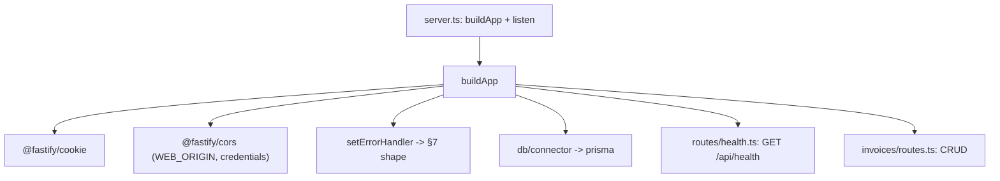

# feat: App Skeletons — Phase 1 (Execution Plan)

**Created:** 2026-06-20
**Origin:** `PROJECT_PLAN.md` §10 Phase 1; builds on `docs/plans/2026-06-20-001-feat-invoice-manager-monorepo-foundation-plan.md` (Phase 0, merged)
**Plan depth:** Standard
**Status:** Implementation-ready. Do not begin Phase 2 (no schema/auth/data-model work).

---

## Summary

Phase 0 left a working monorepo whose API still serves invoices but has no health endpoint, no CORS/cookie plugins, and no central error handling, and whose web app renders a single form with no router or server-state wiring. Phase 1 turns both into proper skeletons: a Fastify app with `/api/health`, CORS + cookie plugins, and a central error handler emitting the §7 error shape; a web app with a router, placeholder pages, a `fetch`-based API client, and a TanStack Query provider. The slice is proven when the web app fetches `/api/health` cross-origin and renders the result. It also resolves OQ-1 by consolidating to one invoice route implementation.

No database schema, auth, or data-model work — those are Phase 2/3.

---

## Problem Frame

`PROJECT_PLAN.md` §10 Phase 1 DoD: *both apps run with `npm run dev`; web can hit `/api/health`.* Current gaps:

- **API:** `apps/api/src/server.ts` registers only the DB connector + one invoice routes plugin. No `/api/health`, no `@fastify/cors`, no `@fastify/cookie`, no `setErrorHandler`. Errors surface ad hoc (the newer handlers return inconsistent `{ error: '...' }` bodies; §7 wants `{ error: { code, message, details? } }`).
- **Web:** `apps/web/src/main.tsx` renders `<App/>` (a form) directly. No React Router, no TanStack Query provider, no API client. The libraries are installed (`react-router`, `@tanstack/react-query`) but unused.
- **OQ-1 (carried from Phase 0):** two invoice route implementations coexist — `myRoutes.ts`/`myTypes.ts` (wired to the server) and `routes.ts`/`handlers.ts`/`types.ts` (newer, typed, cleaned up in Phase 0 but unwired).

---

## Decisions Made (this session)

- **D-1 — Consolidate to the newer `routes`/`handlers`/`types` implementation.** Wire `server.ts` to it; delete `myRoutes.ts` and `myTypes.ts`. It is the typed, complete, lint/typecheck-clean variant. Resolves OQ-1.
- **D-2 — API client is a thin `fetch` wrapper, no Axios.** Native `fetch` with `credentials: 'include'`, a base URL from `VITE_API_URL`, and JSON/error handling. No new dependency; pairs cleanly with TanStack Query. (Deviation from §3/§4's "Axios" wording — recorded in `docs/DECISIONS.md`.)
- **D-3 — Dev connection is cross-origin (CORS + `credentials`), not a Vite proxy.** Matches the plan's explicit CORS + `VITE_API_URL` design and prepares for the cross-origin production topology (Vercel web → Railway api).

---

## Requirements Traceability (Phase 1)

| Plan §10 Phase 1 item | Covered by |
|---|---|
| Fastify boots, `/api/health` returns 200 | U2 |
| CORS + cookie plugins | U3 |
| Error handler (§7 error shape) | U4 |
| Consolidate route implementations (OQ-1) | U1 |
| Vite app boots, router with placeholder pages | U6 |
| `apiClient` (credentials: include) + TanStack Query provider | U5 |
| shadcn + Tailwind initialized | already present (Phase 0) — no work |
| **DoD:** both apps run via `npm run dev`; web hits `/api/health` | U6 (end-to-end) |

---

## Key Technical Decisions

- **KTD-1 — Plugin registration order.** In `server.ts`: cookie → cors → `setErrorHandler` → DB connector → routes (health, invoices). CORS must wrap routes; the error handler must be set before routes register so thrown errors are caught.
- **KTD-2 — Fastify 5 plugin majors.** `@fastify/cors@^10` and `@fastify/cookie@^11` (the Fastify 5-compatible majors). Add to `apps/api` deps.
- **KTD-3 — Standard error shape lives in one place.** A single `errorHandler` maps thrown/uncaught errors to `{ error: { code, message, details? } }`, maps Prisma P2002→409 / P2025→404 (mirroring existing handler logic), and never leaks stack traces. Handlers throw or return; they stop hand-rolling `{ error: '...' }` bodies. (Refactoring the handler bodies to throw is in-scope for U4 only where it touches the error shape; deeper handler rework stays in Phase 3.)
- **KTD-4 — CORS origin is env-driven.** `WEB_ORIGIN` (default `http://localhost:5173`, Vite's dev port) with `credentials: true`, so cookies work in dev and the prod origin is a config change. Add `WEB_ORIGIN` to `.env.example`.
- **KTD-5 — Route tests use `fastify.inject`.** Health and error-shape tests build the app and inject requests — no real listen, no DB. Invoice-handler behavior tests (which need a DB) remain Phase 2/3.
- **KTD-6 — App factory for testability.** Extract app construction (register plugins + routes) into a `buildApp()` returning the Fastify instance; `server.ts` calls it then `listen()`. Lets tests `inject` without binding a port.

---

## High-Level Technical Design

### Request flow (dev)

```mermaid
sequenceDiagram
    participant Web as Web (Vite :5173)
    participant API as Fastify (:3000)
    Web->>API: GET /api/health (credentials: include)
    API->>API: cookie → cors → routes
    API-->>Web: 200 { status: "ok" } + CORS headers
    Note over Web: TanStack Query caches; page shows "API: ok"
    Web->>API: GET /api/unknown
    API->>API: errorHandler
    API-->>Web: 404 { error: { code, message } }
```

### Plugin/route composition (api)



---

## Implementation Units

### U1. Consolidate invoice routes (resolve OQ-1)

**Goal:** One invoice route implementation. Wire `server.ts` to `routes.ts`/`handlers.ts`/`types.ts`; remove the `myRoutes` variant.

**Requirements:** OQ-1; §10 Phase 1.

**Dependencies:** none.

**Files:**
- `apps/api/src/server.ts` — import `./invoices/routes` instead of `./invoices/myRoutes`.
- delete `apps/api/src/invoices/myRoutes.ts`, `apps/api/src/invoices/myTypes.ts`.
- `apps/api/prisma/seed.ts` — repoint `import type { Invoice } from '../src/invoices/myTypes'`. Use the Prisma generated model type (or a local type) instead; the `as Invoice` cast on the CSV row stays behavior-equivalent.
- `apps/api/src/invoices/types.ts` — already has `GetInvoiceParams` (dup of myTypes); no change needed.

**Approach:** Pure swap + delete. `routes.ts` registers the same five `/api/invoices` paths via typed handlers, so the external API is unchanged. Confirm nothing else imports `myRoutes`/`myTypes` (grep) before deleting.

**Patterns to follow:** existing `routes.ts` default-export plugin; `handlers.ts` typed handlers.

**Test scenarios:**
- After the swap, `GET /api/invoices` is registered and returns 200 (via inject; with DB available it returns rows — assert status + JSON shape, not specific data).
- Grep proves no remaining `myRoutes`/`myTypes` imports.

**Verification:** `npm run typecheck` + `npm run lint` clean; server boots; `GET /api/invoices` still works.

---

### U2. `/api/health` route + app factory

**Goal:** Add `GET /api/health` returning `200 { status: 'ok' }`, and extract `buildApp()` so the app is testable without listening.

**Requirements:** §10 Phase 1 (health 200); KTD-6.

**Dependencies:** U1.

**Files:**
- `apps/api/src/app.ts` (new) — `buildApp()` constructs the Fastify instance and registers plugins + routes.
- `apps/api/src/routes/health.ts` (new) — health route plugin.
- `apps/api/src/server.ts` — call `buildApp()` then `listen()`.
- `apps/api/test/health.test.ts` (new).

**Approach:** Liveness only — `{ status: 'ok' }`, no DB check (readiness/DB-ping deferred; see Open Questions). `buildApp()` returns the instance so tests can `inject`. Keep `server.ts` thin.

**Patterns to follow:** `db/connector.ts` fastify-plugin style; `routes.ts` plugin export.

**Test scenarios:**
- `GET /api/health` → 200, body `{ status: 'ok' }`.
- Response `content-type` is JSON.

**Verification:** `npm run test -w @mac-invoices/api` passes; `curl localhost:3000/api/health` → 200 after `npm run dev:api`.

---

### U3. CORS + cookie plugins

**Goal:** Register `@fastify/cookie` and `@fastify/cors` (origin = `WEB_ORIGIN`, `credentials: true`).

**Requirements:** §10 Phase 1 (CORS + cookie plugins); KTD-2, KTD-4.

**Dependencies:** U2.

**Files:**
- `apps/api/package.json` — add `@fastify/cors@^10`, `@fastify/cookie@^11`.
- `apps/api/src/app.ts` — register both in `buildApp()` (cookie, then cors) before routes.
- `.env.example` — add `WEB_ORIGIN=http://localhost:5173`.
- `apps/api/src/lib/loadEnv.ts` — no change (already loads root `.env`).
- `apps/api/test/cors.test.ts` (new).

**Approach:** `cors({ origin: process.env.WEB_ORIGIN ?? 'http://localhost:5173', credentials: true })`. Cookie plugin registered for later auth (Phase 3) but harmless now.

**Test scenarios:**
- Preflight/`GET` from the allowed origin yields `access-control-allow-origin` = `WEB_ORIGIN` and `access-control-allow-credentials: true` (via inject with an `origin` header).
- A request with no `origin` header still succeeds (same-origin/curl).

**Verification:** tests pass; from the running web app (U6) the cross-origin fetch succeeds with no CORS error in the browser console.

---

### U4. Central error handler (§7 error shape)

**Goal:** One `setErrorHandler` mapping errors to `{ error: { code, message, details? } }`; route handlers stop returning ad-hoc error bodies for the cases the handler now owns.

**Requirements:** §7 error shape; §10 Phase 1; CONV-005; KTD-3.

**Dependencies:** U2.

**Files:**
- `apps/api/src/middleware/errorHandler.ts` (new) — the handler + an `AppError` helper (code + status).
- `apps/api/src/app.ts` — `app.setErrorHandler(errorHandler)`.
- `apps/api/src/invoices/handlers.ts` — throw typed errors / let Prisma errors propagate to the handler instead of inline `reply.code(...).send({ error: '...' })`, so the shape is consistent. Keep validation (400) responses behavior-equivalent.
- `apps/api/test/error-handler.test.ts` (new).

**Approach:** Map Prisma `P2002`→409, `P2025`→404 (mirror existing logic), validation→400, unknown→500. Never include stack traces in the body; log server-side via `request.log.error`. Provide `AppError(code, message, statusCode, details?)` for handlers to throw. Refactor handlers only as far as the error shape requires — deeper handler rework is Phase 3.

**Technical design (directional):** error body shape — `{ error: { code: 'NOT_FOUND', message: 'Invoice not found' } }`; 500s use a generic message, real detail goes to logs.

**Test scenarios:**
- A route that throws `AppError('NOT_FOUND', ..., 404)` → 404 with `{ error: { code: 'NOT_FOUND', message } }`.
- A simulated Prisma `P2002` → 409 with code; `P2025` → 404.
- An unexpected throw → 500 with a generic message and **no** stack trace in the body.
- Unknown route → 404 in the standard shape (Fastify `setNotFoundHandler` or the error handler).

**Verification:** tests pass; hitting a non-existent invoice id returns the standard shape.

---

### U5. Web API client + TanStack Query provider

**Goal:** A `fetch`-based API client (`credentials: 'include'`, base URL, JSON + error handling) and a configured TanStack Query provider wrapping the app.

**Requirements:** §10 Phase 1 (apiClient + Query provider); CONV-003; D-2.

**Dependencies:** none (web-only).

**Files:**
- `apps/web/src/lib/apiClient.ts` (new) — `apiClient(path, init?)`: prefixes `VITE_API_URL`, sets `credentials: 'include'` + JSON headers, parses JSON, throws on non-2xx surfacing the §7 error shape.
- `apps/web/src/lib/queryClient.ts` (new) — a `QueryClient` instance.
- `apps/web/src/main.tsx` — wrap the app in `QueryClientProvider`.
- `apps/web/test/apiClient.test.ts` (new).

**Approach:** Read base URL from `import.meta.env.VITE_API_URL` (fallback `http://localhost:3000`). On non-2xx, parse the body and throw an `Error` carrying `code`/`message` so React Query surfaces it. Keep it ~40 lines.

**Patterns to follow:** existing `@/lib/utils.ts` location; `vite.config.ts` `@` alias.

**Test scenarios:**
- `apiClient('/api/health')` builds the URL from `VITE_API_URL` and sends `credentials: 'include'` (assert via a mocked `fetch`).
- 2xx JSON → parsed object returned.
- non-2xx with a `{ error: { code, message } }` body → throws an Error exposing `code`/`message`.
- network rejection → propagates.

**Verification:** `npm run test -w @mac-invoices/web` passes.

---

### U6. Web router + placeholder pages + health wiring (DoD)

**Goal:** A React Router setup with placeholder pages and a visible health check proving the web app reaches `/api/health`.

**Requirements:** §10 Phase 1 (router + placeholder pages; web hits /api/health); DoD.

**Dependencies:** U2, U3 (health endpoint + CORS), U5 (client + provider).

**Files:**
- `apps/web/src/main.tsx` — add `RouterProvider`/`BrowserRouter` (react-router 7).
- `apps/web/src/App.tsx` — becomes a layout with nav + `<Outlet/>` (preserve the existing invoice form as a route, e.g. `InvoiceNew`).
- `apps/web/src/pages/` (new) — placeholder pages: `InvoiceList.tsx`, `InvoiceNew.tsx` (the existing form), `InvoiceDetail.tsx`, `InvoiceEdit.tsx`, `Login.tsx`. Placeholders = heading + “coming soon”, except `InvoiceNew` which keeps the current form.
- `apps/web/src/hooks/useHealth.ts` (new) — `useQuery` calling `apiClient('/api/health')`.
- a small health indicator in the layout (e.g. “API: ok / unreachable”).
- `apps/web/test/useHealth.test.tsx` or a layout render test (new).

**Approach:** Minimal routes mapping to placeholder pages; the layout shows the health status from `useHealth` to satisfy the DoD visibly. Don’t build real CRUD pages — those are Phase 3. Keep the existing form working under its route.

**Patterns to follow:** CONV-003 (pages fetch via `hooks/use*.ts`, never call `apiClient` directly in components); existing `App.tsx` styling.

**Test scenarios:**
- `useHealth` (or the layout) renders the “ok” state when `apiClient` resolves `{ status: 'ok' }` (mock the client).
- renders an error/unreachable state when the client rejects.
- the router renders the placeholder route for a known path.

**Verification (Phase 1 DoD):** `npm run dev` runs both apps; the web app loads, calls `/api/health` cross-origin, and shows “API: ok”; `npm run lint && npm run typecheck && npm run test` all green.

---

## Scope Boundaries

**In scope:** health endpoint, CORS/cookie plugins, central error handler + standard shape, route consolidation, web router + placeholder pages, API client, Query provider, end-to-end health check.

### Deferred to later phases
- Real invoice CRUD pages, forms wired to mutations, optimistic updates — Phase 3.
- Auth (login page, `requireAuth`, session cookies) — Phase 3; the cookie plugin is registered now but unused.
- §5 schema migration, data-model changes, seed remap — Phase 2.
- DB readiness in health (`/api/health` DB ping) — see Open Questions OQ-2.
- Request logging config, rate limiting, security headers — Phase 6.

---

## Open Questions

- **OQ-2 — Liveness vs. readiness health.** Phase 1 ships liveness only (`{ status: 'ok' }`). A DB-ping readiness check is deferred; revisit at deploy (Phase 6) when load balancers need it.
- **OQ-3 — Placeholder page set.** Using the §4 page list (`Login`, `InvoiceList`, `InvoiceNew`, `InvoiceDetail`, `InvoiceEdit`). If the route shape changes in Phase 3 planning, these placeholders adjust then.

---

## Risks & Dependencies

- **R-1 — New deps (`@fastify/cors`, `@fastify/cookie`).** Low risk; pin the Fastify-5 majors (KTD-2). `npm ci` + the CI Postgres service already cover install.
- **R-2 — Deleting `myTypes` breaks `seed.ts`.** Captured in U1 (repoint the `Invoice` import). Typecheck will catch a miss.
- **R-3 — Handler error-shape refactor (U4) could alter response bodies.** Mitigation: keep status codes identical; only the error *body* shape changes to §7. Tests assert the new shape.
- **R-4 — CORS credentials misconfig** (wildcard origin + credentials is rejected by browsers). Mitigation: explicit `WEB_ORIGIN`, never `*`, with `credentials: true` (KTD-4).

---

## Sources & Research

- `PROJECT_PLAN.md` §7 (error shape), §10 Phase 1, §13 (env).
- Phase 0 plan + `docs/DECISIONS.md` / `docs/CONVENTIONS.md`.
- Current code: `apps/api/src/server.ts`, `apps/api/src/invoices/{routes,handlers,types,myRoutes,myTypes}.ts`, `apps/api/prisma/seed.ts`, `apps/web/src/main.tsx`, `apps/web/src/App.tsx`.
- No external research run — settled stack; Fastify official plugins (`@fastify/cors`, `@fastify/cookie`) are well-established. Versions to confirm at install (KTD-2).
