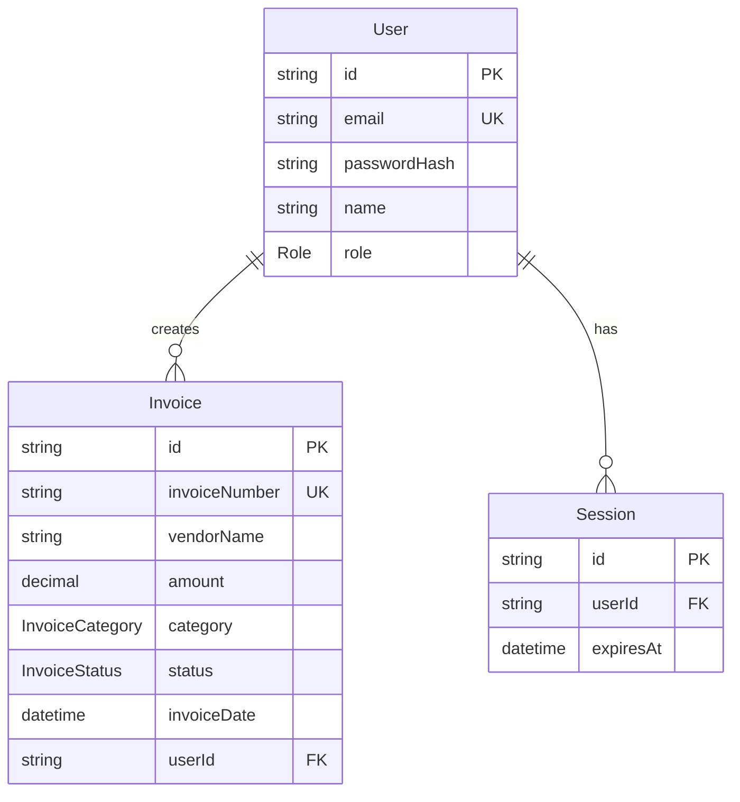
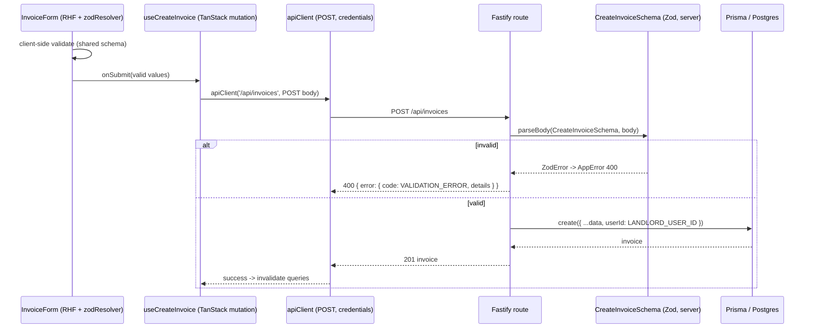

# feat: Data Layer + CREATE Vertical Slice — Phase 2 (Execution Plan)

**Created:** 2026-06-21
**Origin:** `PROJECT_PLAN.md` §10 Phase 2, §5 (data model), §6 (shared schemas), §7 (API); builds on merged Phase 0 + Phase 1.
**Plan depth:** Deep
**Status:** Implementation-ready. Do not begin Phase 3 (no auth/login, no remaining CRUD UI).

---

## Summary

Phase 2 replaces the placeholder data model with the real §5 schema and proves the full DB→API→UI stack on one feature: **creating an invoice**. It migrates Prisma to the §5 `User`/`Session`/`Invoice` model (cuid IDs, `Decimal` amount, `category`/`status` enums, plus the auth tables for Phase 3), reseeds the 2025 CSV data through a lossy mapping, adds the shared Zod schemas both apps import, and wires a validated `POST /api/invoices` to a React Hook Form + Zod form via a TanStack mutation. It also lands the two cheap Phase-1 deferrals that belong to the create/list path (list pagination clamp, Prisma P2003 mapping). The slice it produces is the **pattern** every later feature copies (§11).

**Not** in scope: auth/login (Phase 3) and the rest of the CRUD UI — list/detail/edit/delete (Phase 3). Both Create and Update shared schemas are *defined* (§6), but only Create is wired this phase.

---

## Problem Frame

The DB still holds the Phase-0 placeholder `Invoice` (Int id; `description`/`date`/`location`/`price`/`status:String`/`number`/`quantity`/`notes`/`parts`/`creatorId`) and a bare `User` (no `passwordHash`, no `Session`). `PROJECT_PLAN.md` requires the richer §5 model, a shared validation package (§6) used by both sides, and ownership-scoped writes (§7). Two structural gaps must be bridged this phase:

- **No auth yet, but §5 `Invoice.userId` is required and §7 says "never trust client-supplied userId."** Resolved by D-1 below.
- **`packages/shared` is an empty placeholder.** Phase 2 fills it with the §6 schemas, making it load-bearing for the first time.

DoD (§10 Phase 2): create an invoice end-to-end; the API create test passes; this slice is recorded as the §11 pattern.

---

## Decisions Made (this session)

- **D-1 — Interim creator association: seed the landlord, default `userId` server-side.** Seed the single landlord `User` (§9) with a fixed id from `LANDLORD_USER_ID`. The create handler sets `userId = process.env.LANDLORD_USER_ID` server-side and never reads a userId from the body — already honoring §7. Phase 3 swaps the constant for `req.user.id`.
- **D-2 — Migration by reset + reseed, not data-preserving.** The Int→cuid id change and wholesale field rename make a data-preserving migration not worth it for dev seed data (DEC-007). Reset the dev database, create one new baseline migration for the §5 schema, reseed from CSV through the mapping.
- **D-3 — `invoiceNumber` is user-supplied** (per the §6 `CreateInvoiceSchema`), not auto-generated.
- **D-4 — Phase 2 wires validation for CREATE only**, plus the two cheap Phase-1 deferrals (list `limit`/`offset` clamp+guard, errorHandler `P2003` mapping). Update/delete validation and their UI are Phase 3. Both Create and Update schemas are defined in `packages/shared` now.
- **D-5 — Zod validates in the handler, mapping `ZodError` → `AppError('VALIDATION_ERROR', …, 400, details)`.** Routes through the existing central error handler to the §7 shape. (Not Fastify JSON-schema, not a type-provider — the shared schemas are Zod.)

---

## Requirements Traceability

| Plan item | Covered by |
|---|---|
| §5 schema (User+Session+Invoice, enums, Decimal, cuid) + migration | U1 |
| Seed: 1 landlord + remapped 2025 invoices | U2 |
| §6 shared Zod schemas consumed by both apps | U3 |
| §7 `POST /api/invoices` with validation + ownership scoping + tests | U4 |
| Phase-1 deferrals: list clamp, P2003 mapping (validation→400 now reachable) | U5 |
| Web `InvoiceForm` + `InvoiceNew` via RHF + Zod resolver + mutation | U6 |
| Slice recorded as the §11 pattern; docs/decisions updated | U7 |
| **DoD:** create an invoice end-to-end; create test passes | U4 + U6 |
| **Money rule** (DEC-002/CONV-004): Decimal(10,2), Zod positive multipleOf 0.01, Intl format | U1, U3, U6 |

---

## Key Technical Decisions

- **KTD-1 — Landlord identity is shared by seed and API via `LANDLORD_USER_ID`.** The seed sets `User.id` to this env value (a User id is a plain string; a manual value is fine). The create handler reads the same env. Add `LANDLORD_USER_ID` and `LANDLORD_EMAIL` to `.env.example` and the CI env.
- **KTD-2 — `passwordHash` is required in §5 but auth is Phase 3.** Seed the landlord with a clearly-marked placeholder hash (e.g. `"PLACEHOLDER_SET_IN_PHASE_3"`); Phase 3 replaces it with a real argon2 hash + login. The `Session` table is created but unused this phase.
- **KTD-3 — `Decimal` amount serializes as a JSON string on responses.** Input is a Zod `number`; Prisma stores `Decimal(10,2)`; responses return `amount` as a string. The shared response type models `amount` as `string`; the UI formats with `Intl.NumberFormat`. No float math anywhere (CONV-004).
- **KTD-4 — CSV→§5 seed mapping** (lossy, dev data; DEC-007):
  `number`→`invoiceNumber` (stringified), `price`→`amount`, `date`→`invoiceDate`, `description`→`description`, `status`(string)→`status` enum (map known values, else `PENDING`); `location`+`parts`+`quantity` folded into `notes`; `vendorName` synthesized (default `"Unknown vendor"`), `category` defaulted (`OTHER`), `currency` `USD`, `userId`=landlord. Exact synthesis defaults are an implementation detail.
- **KTD-5 — Integration tests run against the real DB** (CI Postgres service / local container). Create rows with unique `invoiceNumber`s and clean them up (afterEach/afterAll delete, or per-test unique data). This establishes the DB-integration-test pattern (§11) since Phase 0/1 tests were inject-only with no DB.
- **KTD-6 — Validation helper.** A small `parseBody(schema, data)` that runs `schema.safeParse` and throws `AppError('VALIDATION_ERROR', msg, 400, flattenedIssues)` on failure, reused by the create route now and update later.

---

## High-Level Technical Design

### §5 data model (target)

### CREATE flow (the vertical slice)

---

## Implementation Units

> Execution posture: **U4 is test-first** — write the failing create integration test (request/response contract) before the handler. The schema migration (U1) and seed (U2) are not unit-tested directly; they're verified by U4's integration tests running against the migrated DB.

### U1. Migrate Prisma schema to the §5 model

**Goal:** Replace the placeholder schema with §5 (`User` + `Session` + `Invoice`, `Role`/`InvoiceStatus`/`InvoiceCategory` enums, cuid IDs, `Decimal(10,2)` amount), and create the baseline migration.

**Requirements:** §5; DEC-002; D-2.

**Dependencies:** none.

**Files:**
- `apps/api/prisma/schema.prisma` — full §5 model + enums + `@@map`/`@@index` per §5.
- `apps/api/prisma/migrations/` — one new migration (after a dev reset).
- regenerate the client (`apps/api/prisma/generated/`, gitignored).

**Approach:** Edit the schema to §5. Run a dev reset so the new migration is a clean baseline (dev data is disposable, D-2). Keep the generator/`prisma-client` + adapter-pg setup unchanged. Note `passwordHash` is required (KTD-2).

**Patterns to follow:** existing `schema.prisma` generator/datasource block; §5 verbatim for field/enum names and indexes.

**Test scenarios:** Test expectation: none — schema/migration. Verified transitively by U4 (create test runs against the migrated DB) and U2 (seed succeeds).

**Verification:** `npm run db:generate` succeeds; a dev migrate/reset applies cleanly; `npm run typecheck` passes against the regenerated client.

---

### U2. Seed: landlord user + remapped 2025 invoices

**Goal:** Rewrite the seed to create the landlord `User` (fixed `LANDLORD_USER_ID`, placeholder hash) and import the 2025 CSV into §5 invoices via the KTD-4 mapping.

**Requirements:** §9 (one landlord); D-1; DEC-007; KTD-1/2/4.

**Dependencies:** U1.

**Files:**
- `apps/api/prisma/seed.ts` — rewrite for the §5 model + mapping.
- `apps/api/prisma/seed-data.csv` — unchanged (source).
- `.env.example` — add `LANDLORD_USER_ID`, `LANDLORD_EMAIL`.

**Approach:** Upsert the landlord by email with `id = LANDLORD_USER_ID`, `role = LANDLORD`, placeholder `passwordHash`. For each CSV row, map per KTD-4 and upsert by `invoiceNumber`, setting `userId` to the landlord. Fix the pre-existing csv-path bug noticed in Phase 0 (`__dirname` relative path) if it still resolves wrong.

**Patterns to follow:** existing `seed.ts` csv-parse + upsert loop; KTD-4 mapping table.

**Test scenarios:** Test expectation: none — seed script. Verified by running it: landlord exists, invoices imported with valid enum values.

**Verification:** `npm run db:seed` completes; a quick query shows 1 landlord + the imported invoices with `status`/`category` as valid enums and `amount` populated.

---

### U3. Shared Zod schemas (`packages/shared`)

**Goal:** Implement §6 — `InvoiceStatus`, `InvoiceCategory`, `CreateInvoiceSchema`, `UpdateInvoiceSchema`, and inferred input types — exported from the package both apps already import.

**Requirements:** §6; CONV-004 (money validation).

**Dependencies:** none (can land in parallel with U1/U2).

**Files:**
- `packages/shared/src/schemas/invoice.ts` — the §6 schemas verbatim (enums, Create, Update, types).
- `packages/shared/src/index.ts` — re-export the schemas (replace the placeholder export).

**Approach:** Transcribe §6. `amount` uses `z.number().positive().multipleOf(0.01)`. Keep enum string unions aligned with the Prisma enums (same member names). Export inferred `CreateInvoiceInput`/`UpdateInvoiceInput`.

**Patterns to follow:** §6 verbatim; existing `packages/shared/tsconfig`/`package.json` (already builds + is imported).

**Test scenarios:**
- `CreateInvoiceSchema` accepts a valid invoice (all required fields, amount like `12.34`).
- Rejects: missing `invoiceNumber`; `amount` ≤ 0; `amount` with >2 decimals; bad `category`/`status` enum; bad `vendorEmail`/`attachmentUrl` format.
- `currency` defaults to `USD` when omitted.
- `UpdateInvoiceSchema` accepts a partial body (e.g. only `status`).
- **Files:** `packages/shared/test/invoice.test.ts` (add Vitest to the shared package if not present).

**Verification:** `npm run test -w @mac-invoices/shared` passes; both apps still typecheck importing the new exports.

---

### U4. Validated `POST /api/invoices` with server-set owner

**Goal:** Validate the create body with `CreateInvoiceSchema`, set `userId` server-side to the landlord, persist, return 201; invalid bodies return 400 `VALIDATION_ERROR`.

**Requirements:** §7; D-1; D-5; KTD-5/6; DoD.

**Dependencies:** U1, U2, U3.

**Files:**
- `apps/api/src/lib/validate.ts` — `parseBody(schema, data)` helper (KTD-6).
- `apps/api/src/invoices/handlers.ts` — rewrite `createInvoice` for the §5 model: parse with `CreateInvoiceSchema`, build the Prisma `create` data from validated input, set `userId = process.env.LANDLORD_USER_ID`. Remove the old field set.
- `apps/api/src/invoices/types.ts` — replace hand-written body types with the shared inferred types (or delete in favor of `@mac-invoices/shared`).
- `apps/api/test/invoices.create.test.ts` — integration test (real DB).

**Approach:** Handler reads body, `parseBody` throws `AppError` on invalid (→ central handler → 400 §7 shape). On success, map validated fields to the §5 `create` (coerce dates, `userId` from env, `currency` default already applied by Zod). Return 201 with the created invoice. `listInvoices`/`get`/etc. keep working against the new model (status/category are now enums; `creator`→`user` relation rename — update the `include`).

**Execution note:** Start with the failing create integration test for the 201 contract, then implement.

**Test scenarios:**
- *Happy path:* POST a valid body → 201; response has a cuid `id`, the posted `invoiceNumber`, `amount` echoed, and `userId` = landlord (not from body). *Covers DoD.*
- *Ownership:* a `userId` in the body is ignored; persisted `userId` is the landlord.
- *Validation:* missing required field / bad enum / negative amount → 400 with `code: VALIDATION_ERROR` and `details`.
- *Conflict:* duplicate `invoiceNumber` → 409 (P2002) in the §7 shape.
- *Cleanup:* test removes rows it created (KTD-5).
- **Files:** `apps/api/test/invoices.create.test.ts`.

**Verification:** `npm run test -w @mac-invoices/api` passes including the new DB test; manual `curl` POST creates an invoice and returns 201.

---

### U5. List clamp + P2003 mapping (Phase-1 deferrals)

**Goal:** Make the deferred validation items land where they belong: clamp/guard `limit`/`offset` in list, and map Prisma `P2003` (FK violation) to a client 4xx in the central handler.

**Requirements:** Phase-1 review deferrals; §7 consistency.

**Dependencies:** U1 (model), U4 (handlers touched).

**Files:**
- `apps/api/src/invoices/handlers.ts` — `listInvoices`: clamp `limit` to `[1,100]` default 50, floor `offset` to ≥0, guard `NaN`.
- `apps/api/src/middleware/errorHandler.ts` — add `P2003` → 400 (or 409) in the §7 shape.
- `apps/api/test/error-handler.test.ts` — add a P2003 case.
- `apps/api/test/invoices.create.test.ts` or a small list test — assert clamping.

**Approach:** Pure hardening; no behavior change for valid inputs. Choose 400 for P2003 (bad reference is a client error) with a clear code (e.g. `BAD_REFERENCE`).

**Test scenarios:**
- `?limit=1000000` → capped at 100; `?limit=abc` → default 50, not NaN; `?offset=-5` → 0.
- A thrown error with `code: 'P2003'` → mapped status + code (not 500).

**Verification:** `npm run test -w @mac-invoices/api` passes; list with an absurd limit returns a bounded page.

---

### U6. Web `InvoiceForm` + `InvoiceNew` (RHF + Zod resolver + mutation)

**Goal:** Replace the placeholder form with a §5-field form validated by the shared `CreateInvoiceSchema` (via `zodResolver`) that creates an invoice through a TanStack mutation and `apiClient`.

**Requirements:** §10 Phase 2 (web); CONV-003 (hook, not direct apiClient in component); CONV-004 (Intl money format); DoD.

**Dependencies:** U3 (schema), U4 (endpoint).

**Files:**
- `apps/web/package.json` — add `@hookform/resolvers` (not installed).
- `apps/web/src/components/InvoiceForm.tsx` — the §5 form (invoiceNumber, vendorName, vendorEmail?, description, amount, currency, category select, propertyId?, invoiceDate, dueDate?, notes?), `useForm` + `zodResolver(CreateInvoiceSchema)`.
- `apps/web/src/hooks/useCreateInvoice.ts` — TanStack `useMutation` calling `apiClient('/api/invoices', { method:'POST', body })`; invalidate the invoices query on success.
- `apps/web/src/pages/InvoiceNew.tsx` — render `InvoiceForm`, handle submit via the hook, show success + server validation errors.
- `apps/web/test/InvoiceForm.test.tsx` — component test.

**Approach:** Form fields map to `CreateInvoiceSchema`. `category`/`status` use selects with the enum members. `amount` is a number input. On submit, the mutation posts; on success show confirmation/reset; on `ApiError` with `VALIDATION_ERROR` surface messages. Never call `apiClient` directly in the component — go through `useCreateInvoice` (CONV-003).

**Patterns to follow:** existing `InvoiceNew` RHF usage; `useHealth` hook shape; `apiClient`/`ApiError` from Phase 1.

**Test scenarios:**
- *Happy path:* fill valid fields, submit → mutation called with parsed values; success state shown (mock `apiClient`/the hook).
- *Client validation:* submit empty/invalid (negative amount, bad email) → field errors shown; no network call.
- *Server error:* mocked `apiClient` rejects with `ApiError('VALIDATION_ERROR')` → error surfaced.
- **Files:** `apps/web/test/InvoiceForm.test.tsx`.

**Verification:** `npm run test -w @mac-invoices/web` passes; with both dev servers up, filling the form creates an invoice (201) end-to-end.

---

### U7. Record the pattern + update docs

**Goal:** Capture the vertical-slice pattern and decisions so later features replicate it.

**Requirements:** §10 Phase 2 DoD ("this slice becomes the pattern"); §11/§12.

**Dependencies:** U1–U6.

**Files:**
- `docs/CONVENTIONS.md` + `PROJECT_PLAN.md` §11 — add the create-slice pattern (shared schema → validated route → hook+mutation → form) and the DB-integration-test pattern (KTD-5).
- `docs/DECISIONS.md` + `PROJECT_PLAN.md` §12 — record D-1..D-5.
- `CLAUDE.md` — update the schema/data-model description to §5; note `LANDLORD_USER_ID`.
- `PROJECT_PLAN.md` §10 — mark Phase 2 complete.

**Approach:** Docs only; mirror the established living-doc style.

**Test scenarios:** Test expectation: none — docs.

**Verification:** Docs reflect the shipped slice; the four feedback loops stay green.

---

## Scope Boundaries

**In scope:** §5 migration + reseed; shared schemas (Create + Update defined); validated CREATE end-to-end; list clamp; P2003 mapping; pattern docs.

### Deferred to later phases
- Auth: real `passwordHash` (argon2), login/logout/me, `requireAuth`, session cookies, swapping the landlord constant for `req.user.id` — **Phase 3**.
- Remaining CRUD UI (list/detail/edit/delete) and PATCH/DELETE validation wiring — **Phase 3** (UpdateInvoiceSchema is defined now but only consumed then).
- Google Sheets export (`sheetsSyncedAt` exists in the model but is unused) — **Phase 5**.
- A typed Invoice **response** DTO in `packages/shared` (beyond the input schemas) — follow-up; KTD-3 notes amount-as-string for now.

---

## Risks & Dependencies

- **R-1 — Destructive dev migration (D-2).** Reset drops existing data. Acceptable: dev seed data, reseeded from CSV. Mitigation: the reset is dev-only; production has no data yet. Do not run reset against any non-dev DB.
- **R-2 — `passwordHash` required without auth (KTD-2).** A placeholder hash is stored for the landlord. Mitigation: clearly marked; Phase 3 replaces it. The landlord cannot actually log in until then (no login exists yet anyway).
- **R-3 — First DB-touching tests (KTD-5).** Needs Postgres in CI (already provisioned) and local. Mitigation: tests use unique `invoiceNumber`s and clean up; document the pattern so it doesn't leak state between runs.
- **R-4 — Decimal-as-string contract (KTD-3).** UI must not do float math on `amount`. Mitigation: shared response type as string + `Intl.NumberFormat`; CONV-004.
- **R-5 — Enum/relation rename ripples** (`creator`→`user`, `status:String`→enum). The existing `handlers.ts`/`routes.ts` reference the old fields. Mitigation: U4 updates all handler field/relation usage; typecheck catches misses.
- **Dependency to add:** `@hookform/resolvers` (web). `argon2`/auth deps are Phase 3.

---

## Open Questions

- **OQ-1 — `vendorName`/`category` synthesis for legacy CSV rows.** No source columns exist. Default `vendorName="Unknown vendor"`, `category=OTHER`; revisit if the imported data needs better fidelity. Resolved-by-default at implementation (KTD-4).
- **OQ-2 — Status string→enum mapping for CSV.** Map known values (e.g. `Paid`→`PAID`); anything unrecognized falls back to `PENDING`. Implementation detail.

---

## Sources & Research

- `PROJECT_PLAN.md` §5/§6/§7/§9/§10/§13; `docs/DECISIONS.md` (DEC-002 money, DEC-007 reseed); `docs/CONVENTIONS.md` (CONV-003/004/005).
- Current code: `apps/api/prisma/schema.prisma`, `apps/api/prisma/seed.ts`, `apps/api/src/invoices/{handlers,routes,types}.ts`, `apps/api/src/middleware/errorHandler.ts`, `apps/web/src/pages/InvoiceNew.tsx`, `apps/web/src/lib/apiClient.ts`, `packages/shared/src/index.ts`.
- Dep check: `@hookform/resolvers` not installed; Zod 4 present in all three workspaces.
- No external research — settled stack (Prisma migrations, Zod, RHF zodResolver are well-established and already in use).
