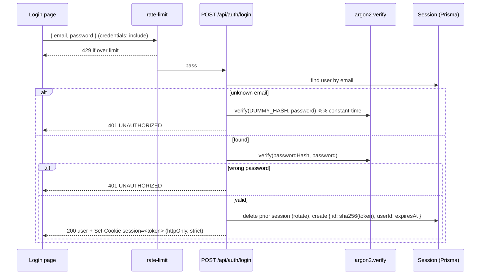
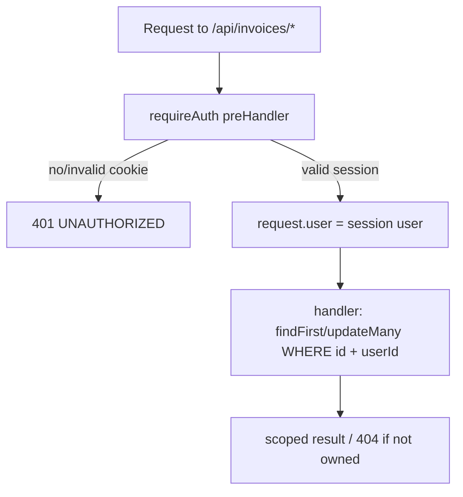
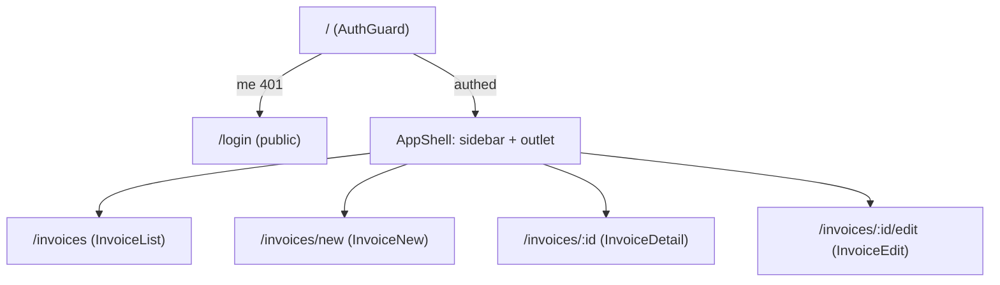

# feat: Auth + CRUD UI (Rent Ops) — Phase 3 (Execution Plan)

**Created:** 2026-06-22
**Origin:** `PROJECT_PLAN.md` §10 Phase 3, §9 (auth), §7 (API); design-driven by the imported Claude Design "Invoice System — Hi-Fi" (project `e6ecdcd1-5b4d-4cec-8b7a-802f77f97980`). Builds on merged Phases 0–2.
**Plan depth:** Deep (security-sensitive auth + full UI rebuild)
**Status:** Implementation-ready (hardened via a 6-persona doc review). Do not begin Phase 4 (dashboards) or Phase 5 (Sheets export).

---

## Summary

Phase 3 puts the app behind login and rebuilds the web UI in the design's "Rent Ops" visual language. It adds real session auth (argon2 + `@oslojs` opaque tokens in the existing `Session` table, httpOnly cookies, a `requireAuth` guard, login rate-limiting), completes the invoice CRUD API **scoped to the session user**, and replaces the placeholder web pages with the design's authenticated experience: login, an app shell + sidebar, the invoice **list** (status filter + pagination + status badges), **detail** (record + actions + status timeline), **edit**, and a create-form upgrade. The seeded landlord logs in and works every invoice through the UI; unauthenticated access returns 401.

**Deferred** (design shows them, out of this phase): public signup + Google OAuth, landing page, dashboards (Phase 4), date/vendor filtering + sort (Phase 4), report builder + Sheets/PDF/Excel export (Phase 5+), photo→invoice OCR, the contractor app, and structured line-items/"parts ordered" (needs a schema this phase avoids).

---

## Problem Frame

`PROJECT_PLAN.md` §10 Phase 3 DoD: *all CRUD works through the UI behind auth; integration tests cover each route; unauthorized access returns 401.* Current gaps:

- **No auth.** `User.passwordHash` holds a placeholder (Phase 2 KTD-2); the `Session` table exists but is unused; there is no login, no `requireAuth`, no `/auth/*` routes. Invoice writes use a server-default `LANDLORD_USER_ID` instead of a session user (Phase 2 DEC-012). `@fastify/cookie` is registered but unused.
- **CRUD incomplete / unscoped.** `GET /invoices` has status filter + pagination but no auth scoping; `GET/:id`, `PATCH/:id`, `DELETE/:id` exist but are unauthenticated and not ownership-scoped.
- **Web is placeholders.** `InvoiceList`/`InvoiceDetail`/`InvoiceEdit`/`Login` are stubs; only the create form is real. No auth guard, no `useAuth`, no app shell, no status badges. The theme is default shadcn neutral, not the design.

§9 anchors the auth design: argon2, secure httpOnly/sameSite cookies, `requireAuth` injecting `req.user`, all invoice queries filtered by `req.user.id`, **one seeded landlord, no public registration**, login **rate-limited**. The Lucia sunset (DEC-009) is resolved: hand-rolled sessions on `@oslojs`.

---

## Decisions Made (confirmed with the user)

- **D-1 — Auth scope: email/password login only**, for the seeded landlord. Build the design's auth screen but wire only email/password; the Google button + signup toggle render disabled "coming soon". No public registration (§9).
- **D-2 — Hand-rolled sessions on `@oslojs`** (Lucia is sunset). argon2 password hashing; a random opaque token in the cookie; its SHA-256 hash stored as the `Session.id`; `requireAuth` validates the cookie and injects `req.user`.
- **D-3 — Adopt the Hi-Fi "Rent Ops" theme** into Tailwind/shadcn: accent `#1d5fb0`, Public Sans, neutral surfaces (`#f2f5f9`/`#e8edf3`/`#eef2f7`), status colors (paid `#1f8a5b`, overdue `#b8442a`, pending neutral), sidebar app shell, branding.
- **D-4 — UI slice:** login, app shell + sidebar, list (status filter + pagination), detail (+ actions + timeline), edit, create-upgrade. Defer the rest (see Scope Boundaries).
- **D-5 — Design features beyond the data model are deferred.** Structured line-items + "parts ordered" per-part state → a later phase (no schema this phase); render existing fields (`description`, `amount`, `notes`, attachments) in the design layout. "Send reminder" → disabled stub (email is post-MVP); "Mark paid" / "Dispute" are real `PATCH status` actions. **"Overdue"** is a derived badge (unpaid + `dueDate` past), not a stored status.
- **D-6 — Login rate-limiting is in scope** (review finding; §7 contract). `@fastify/rate-limit` on `POST /api/auth/login`.
- **D-7 — List filtering is status-only this phase.** Date-range, vendor search, and sort defer to **Phase 4** (whose DoD owns "find by status/date/vendor"); Phase 3 keeps the status filter + pagination already present.

---

## Requirements Traceability

| Plan item | Covered by |
|---|---|
| §9 argon2 + `Session` + secure cookies + `requireAuth` injecting `req.user` + login rate-limit | U1, U2 |
| §7 `POST /api/auth/login`, `POST /api/auth/logout`, `GET /api/auth/me` | U2 |
| §7 invoice routes require auth, scoped to `req.user.id`; `GET/:id`,`PATCH/:id`,`DELETE/:id`; list status filter + pagination | U3 |
| Theme adoption (D-3) | U4 |
| Web auth guard + `useAuth` + login page | U5 |
| App shell + sidebar + `StatusBadge` | U6 |
| `InvoiceList` table + status filter + pagination | U7 |
| `InvoiceDetail` + actions + timeline | U8 |
| `InvoiceEdit` + create-form upgrade | U9 |
| **DoD:** all CRUD through the UI behind auth; per-route integration tests; 401 unauthorized | U2, U3 (API) + U5–U9 (UI) |

---

## Key Technical Decisions

- **KTD-1 — Session pattern, fixed 30-day lifetime.** Login generates a random token (≥20 bytes, base32 via `@oslojs/encoding`); store `Session.id = sha256(token)` (hex, via `@oslojs/crypto`), `userId`, `expiresAt = now + 30d`. The cookie carries the *token*, never the hash. `validateSessionToken(token)` hashes, looks up, and rejects past `expiresAt` (deleting the row). **No sliding renewal** — a token's max lifetime is a fixed 30 days, so a stolen token can't live indefinitely (no `createdAt`/migration needed). On login, **rotate**: delete any session bearing the incoming cookie token before issuing the new one (session-fixation prevention). The `Session` model already matches §5 — **no migration**.
- **KTD-2 — argon2 via `@node-rs/argon2`** (prebuilt binaries, no node-gyp) with argon2id defaults; fallback to `argon2` (node-argon2) if prebuilts are unavailable for the CI Node/arch. **Constant-time login:** on unknown email, run a verify against a module-level `DUMMY_HASH` (a real argon2id hash of a throwaway string) before returning 401, so unknown-email and wrong-password take the same time (no enumeration via timing).
- **KTD-3 — Cookie attributes.** `httpOnly`, **`sameSite=strict`** (the app is a single-origin SPA, never a third-party embed — strict fully blocks cross-site state-changing requests, the simplest CSRF defense), `secure` driven by a dedicated **`COOKIE_SECURE`** env (default true off localhost) rather than `NODE_ENV` so staging/preview don't accidentally send the cookie over HTTP, `path=/`, `maxAge` = session expiry. Set/cleared via `@fastify/cookie` (already registered, unsigned). CORS already sends `credentials` (Phase 1).
- **KTD-4 — `requireAuth` preHandler.** A shared `requireAuth` reads the session cookie, validates, sets `request.user` (a `declare module 'fastify' { interface FastifyRequest { user: { id; email; role } } }` augmentation lives in `apps/api/src/auth/requireAuth.ts`, in the tsconfig include), and replies 401 in the §7 shape (`UNAUTHORIZED`) when missing/invalid/expired. Applied to every `/api/invoices` route and `GET /api/auth/me`.
- **KTD-5 — Ownership scoping, mechanized.** `createInvoice` sets `userId = request.user.id` (remove `getLandlordId`/`LANDLORD_USER_ID`). For read: `findFirst({ where: { id, userId } })` → 404 if null. For write/delete: **Prisma `update`/`delete` require a unique `where`, and `{id, userId}` is not unique** — use `updateMany`/`deleteMany({ where: { id, userId } })` and treat `count === 0` as 404 (then re-fetch for the response), or `findFirst`-guard then act by id. A non-owned row reads as 404 (not 403, no existence leak). List filters by `where.userId`.
- **KTD-6 — Seed sets a real password, fails closed.** Landlord `passwordHash = await hashPassword(process.env.LANDLORD_PASSWORD)`. The seed **throws** if `LANDLORD_PASSWORD` is unset, or if it equals the documented dev default while `NODE_ENV=production` — so a known-weak credential can't reach a deploy. Add `LANDLORD_PASSWORD` to `.env.example` (with a "set a strong value in production" note), the **local root `.env`**, and the CI env.
- **KTD-7 — Theme via CSS variables (Tailwind v4).** Re-map `:root` tokens (`--primary`/`--background`/`--card`/`--border`/`--muted`…) in `apps/web/src/index.css` to the Hi-Fi values, and add `--status-paid`/`--status-overdue`/`--status-pending` **plus matching `--color-status-*` entries in the `@theme inline` block** so `StatusBadge` can use Tailwind utility classes. Public Sans via `@fontsource/public-sans`. Existing shadcn components inherit the look.
- **KTD-8 — Derived "overdue".** `StatusBadge` maps the stored `InvoiceStatus` to a pill and renders "Overdue" when `status ∈ {PENDING, APPROVED}` and `dueDate < now`. No enum change.
- **KTD-9 — DB integration tests authenticate via login.** A shared test helper logs in (`POST /api/auth/login`), captures the `Set-Cookie`, and replays it (CONV-012). A second-user helper (`prisma.user.create` + its own login, cleaned up in `afterAll`) backs the cross-user ownership test. Unauthenticated cases assert 401. **Local prerequisite:** the configured DB must be reseeded with `LANDLORD_PASSWORD` set before the auth tests pass (CI's seed step already covers this).
- **KTD-10 — Login rate-limit.** `@fastify/rate-limit` on `POST /api/auth/login` (≈10 attempts / 15 min per IP → 429), honoring the §7 "rate-limited" contract (D-6).
- **KTD-11 — Route prefix.** Auth routes mount under **`/api/auth/*`** (matching the existing `/api/invoices` convention + the single CORS origin), not `/auth/*`.

---

## High-Level Technical Design

### Login + session lifecycle



### Authenticated request + guard



### Web route structure (login OUTSIDE the guard)



---

## UX States & Accessibility (cross-cutting — applies to all UI units)

The design reference isn't pixel-pinned, so these conventions keep implementers consistent (from the design-lens review):

- **Loading:** route-level data shows a skeleton (list: 5 placeholder rows; detail: skeleton record), not a bare spinner. `AuthGuard` shows a full-screen Rent Ops splash until `me` resolves — no flash of login or app.
- **Empty:** list with no invoices → centered card ("No invoices yet" + "New invoice" CTA). Status-filtered empty → "No invoices match" + "Clear filter".
- **Error:** a failed query → "Failed to load…" + Retry. A `GET /auth/me` 5xx/network error (not 401) → stay on login with "Couldn't reach the server", do not enter the app.
- **Destructive confirm:** "Dispute/Reject" and "Delete" require one confirmation (inline confirm-replace for reject; a modal naming the invoice number for delete).
- **Post-action:** mark-paid/dispute stay on detail with the badge+timeline updating in place + a toast; delete → navigate to `/invoices` + toast; create/edit → navigate to the detail/list + toast.
- **Disabled affordances:** deferred items (sidebar Dashboard/Expenses/Properties/Contractors/Settings; login Google/signup; the create "scan/line-items" card) render as muted, `aria-disabled`, with a "Soon" label, **excluded from the tab order**; they keep their designed layout space.
- **Accessibility:** `StatusBadge` always shows a text label (never color-only) + `role="status"`/`aria-label`; verify `#b8442a`/`#1f8a5b` meet 4.5:1; login errors use `aria-live` and move focus to the first errored field (client) or the error region (server 401); inputs stay filled and the submit button re-enables on error.
- **Responsive:** sidebar collapses to a drawer below 768px; `InvoiceTable` horizontally scrolls (sticky first column) below 640px; the login card is full-width with padding below 480px.

---

## Output Structure (new/changed surface)

```
apps/api/src/
├── auth/
│   ├── routes.ts        # POST /api/auth/login|logout, GET /api/auth/me (+ rate-limit on login)
│   ├── session.ts       # create/validate/invalidate + rotate; token hashing
│   ├── password.ts      # argon2 hash/verify + DUMMY_HASH
│   └── requireAuth.ts   # preHandler + FastifyRequest.user augmentation
└── invoices/handlers.ts # scope to request.user.id; updateMany/deleteMany ownership

packages/shared/src/
├── schemas/auth.ts      # LoginSchema (+ exported from index.ts)
└── schemas/invoice.ts   # ListInvoicesQuery (status, limit, offset)

apps/web/src/
├── index.css            # Rent Ops theme tokens + @theme inline status colors + Public Sans
├── components/
│   ├── AppShell.tsx, Sidebar.tsx, StatusBadge.tsx
│   ├── InvoiceTable.tsx, InvoiceTimeline.tsx
│   ├── InvoiceForm.tsx  # restyled, reused for new + edit (exists)
│   └── ui/* (shadcn)
├── hooks/
│   ├── useAuth.ts, useInvoices.ts, useInvoice.ts
│   ├── useUpdateInvoice.ts, useDeleteInvoice.ts
│   └── useCreateInvoice.ts   # (exists — no change)
└── pages/
    ├── Login.tsx, InvoiceList.tsx, InvoiceDetail.tsx, InvoiceEdit.tsx, InvoiceNew.tsx
docs/design/rent-ops-reference.md   # concise palette + per-screen extract (not the full .dc.html)
```

---

## Implementation Units

> Grouped: **Backend (U1–U3)** then **Frontend (U4–U9)**. Auth units (U1–U3, U5) carry a test-first posture for the security-critical contracts.

### U1. Auth foundation: session + password libs, seed password

**Goal:** The cryptographic core — argon2 hashing (+ dummy hash), opaque-token sessions with rotation in the `Session` table — plus a seeded landlord with a real password (fail-closed) and the shared login schema.

**Requirements:** §9; D-2; KTD-1/2/6.

**Dependencies:** none.

**Files:**
- `apps/api/package.json` — add `@node-rs/argon2`, `@oslojs/crypto`, `@oslojs/encoding`. *(Install + commit the lockfile; confirm `@node-rs/argon2` resolves a prebuilt for linux-x64-gnu + darwin-arm64.)*
- `apps/api/src/auth/password.ts` — `hashPassword`, `verifyPassword`, `DUMMY_HASH`.
- `apps/api/src/auth/session.ts` — `createSession(userId)` (rotates), `validateSessionToken(token)`, `invalidateSession(id)`, token gen + `sha256`.
- `apps/api/prisma/seed.ts` — landlord `passwordHash = await hashPassword(LANDLORD_PASSWORD)`; throw if unset / default-in-prod.
- `.env.example` + local root `.env` — add `LANDLORD_PASSWORD`, `COOKIE_SECURE`.
- `packages/shared/src/schemas/auth.ts` + `packages/shared/src/index.ts` export — `LoginSchema` (email, password min length).
- `apps/api/test/auth.session.test.ts`, `packages/shared/test/auth.test.ts`.

**Execution note:** Implement the session/password contracts test-first.

**Test scenarios:**
- `hashPassword`/`verifyPassword`: a hash verifies its own password; a wrong password and the placeholder/`DUMMY_HASH` string both return false (no throw).
- `createSession` persists a row whose `id` is the token's sha256 (not the token) with `expiresAt ≈ now+30d`; calling it with a prior token rotates (old row gone).
- `validateSessionToken`: valid → the user; unknown → null; expired → null and the row is deleted.
- `LoginSchema` rejects a missing/empty password and a malformed email; accepts a valid pair.

**Verification:** `npm run test -w @mac-invoices/api` + `-w @mac-invoices/shared` pass; reseeding (with `LANDLORD_PASSWORD` set) yields a landlord whose hash verifies it.

---

### U2. Auth routes + `requireAuth` + login rate-limit

**Goal:** `POST /api/auth/login`, `POST /api/auth/logout`, `GET /api/auth/me`, a `requireAuth` preHandler injecting `request.user`, and rate-limiting on login.

**Requirements:** §7 auth routes; §9; D-6; KTD-3/4/10/11; DoD (401).

**Dependencies:** U1.

**Files:**
- `apps/api/package.json` — add `@fastify/rate-limit`.
- `apps/api/src/auth/requireAuth.ts` — preHandler + `FastifyRequest.user` augmentation.
- `apps/api/src/auth/routes.ts` — the three routes under `/api/auth/*`; login validates with `LoginSchema`, runs constant-time verify (KTD-2), rotates + sets the strict cookie (KTD-3); rate-limit on login.
- `apps/api/src/app.ts` — register the auth routes plugin **after** `cookie` + `dbConnector` (so `request.cookies`/`request.server.prisma` are available), beside the other route plugins.
- `apps/api/test/auth.routes.test.ts`.

**Approach:** Login returns the safe user (id/email/name/role — never the hash). Logout invalidates the session + clears the cookie (204). `/api/auth/me` → `requireAuth` → user. `requireAuth` replies 401 (§7 shape) on missing/invalid/expired cookie.

**Execution note:** Start with failing tests for login (200 + Set-Cookie), `requireAuth` (401), and rate-limit (429), then implement.

**Test scenarios:**
- Login: valid creds → 200, user body (no `passwordHash`), `Set-Cookie` httpOnly+strict session.
- Login: wrong password → 401; unknown email → 401 (same shape; constant-time); invalid body → 400 VALIDATION_ERROR.
- Login: exceeding the rate limit → 429.
- Login rotates: logging in with an existing session cookie invalidates the old session.
- `GET /api/auth/me`: with the cookie → 200 user; without → 401; garbage cookie → 401.
- Logout: a subsequent `/api/auth/me` with the old cookie → 401; returns 204.

**Verification:** API tests pass; a manual `curl` login returns a cookie that authorizes `/api/auth/me`.

---

### U3. Invoice CRUD behind auth, scoped to the session user

**Goal:** Every `/api/invoices` route requires auth and is scoped to `request.user.id`; create drops the landlord constant; list keeps status filter + pagination.

**Requirements:** §7; D-7; KTD-5; DoD (per-route tests, 401, ownership).

**Dependencies:** U2.

**Files:**
- `apps/api/src/invoices/routes.ts` — attach `requireAuth` to all five routes.
- `apps/api/src/invoices/handlers.ts` — `createInvoice` uses `request.user.id` (remove `getLandlordId`/`LANDLORD_USER_ID`); list scopes `where.userId` (status + pagination only — **no date/vendor/sort this phase, D-7**); `get` via `findFirst({ where: { id, userId } })` → 404; `patch`/`delete` via `updateMany`/`deleteMany({ where: { id, userId } })` with `count===0` → 404 (KTD-5); add a `paidDate` transition guard (only set `paidDate` when status is/becomes PAID; clear it when status leaves PAID).
- `packages/shared/src/schemas/invoice.ts` — `ListInvoicesQuery` (status, limit, offset).
- `apps/api/test/invoices.crud.test.ts` (auth + second-user helpers, KTD-9).
- `apps/api/test/invoices.create.test.ts` / `invoices.list.test.ts` — **rewrite, not annotate**: add login to every `inject`; the previously-unauthenticated cases now assert 401 *without* a cookie; **delete the `CONFIG_ERROR`-on-unset-`LANDLORD_USER_ID` test** (createInvoice no longer reads that env); change the userId assertion to `request.user.id`.

**Execution note:** Start with a failing "401 without auth" test per route, then the authed happy paths.

**Test scenarios:**
- Each route (POST / GET list / GET id / PATCH / DELETE) → 401 without a session cookie.
- Authed: create → 201 with `userId = request.user.id` (a body `userId` is still ignored); list returns only the user's invoices (status filter + pagination shape the result); `get/:id` of own → 200; of a non-existent or **other-user** id → 404; `patch/:id` own (e.g. status→PAID sets `paidDate`) → 200; `patch` setting `paidDate` with a non-PAID status → guarded; `delete/:id` own → 204; `patch`/`delete` of an **other-user** id → 404 (via the count===0 path, no mutation).
- Ownership: a second user's invoice (created via the helper) is invisible to the landlord's list and 404s on direct GET/PATCH/DELETE.

**Verification:** `npm run test -w @mac-invoices/api` passes; unauthorized 401; authed CRUD works; cross-user access 404s.

---

### U4. Adopt the Rent Ops theme

**Goal:** Re-map the Tailwind/shadcn tokens + status tokens to the design palette + Public Sans, and land a concise design reference in-repo.

**Requirements:** D-3; KTD-7.

**Dependencies:** none (web-only).

**Files:**
- `apps/web/src/index.css` — `:root` tokens → Hi-Fi values; add `--status-*` and the matching `--color-status-*` in `@theme inline`; Public Sans base.
- `apps/web/package.json` — add `@fontsource/public-sans`; `apps/web/src/main.tsx` imports it.
- `docs/design/rent-ops-reference.md` — a concise extract (palette + per-screen notes), not the full `.dc.html`.
- `docs/DECISIONS.md` — add DEC-017 (Rent Ops theme: design project id + palette).

**Test scenarios:** Test expectation: none — theming/CSS. Verified visually (U6/U7 screenshots) and by the build staying green.

**Verification:** `npm run build` passes; the app renders in the new palette/font; existing tests unaffected.

---

### U5. Auth UI: `useAuth`, login page, route guard

**Goal:** The design's login screen wired to `POST /api/auth/login`, a `useAuth` hook, and an `AuthGuard` that gates the app — with `/login` **outside** the guard.

**Requirements:** §10 Phase 3 (login + guard); D-1; UX States section; DoD.

**Dependencies:** U2 (API), U4 (theme).

**Files:**
- `apps/web/src/hooks/useAuth.ts` — `useMe` query (`GET /api/auth/me`), `useLogin`/`useLogout` mutations.
- `apps/web/src/pages/Login.tsx` — the design's centered auth card (email/password wired; Google + signup disabled per the UX-states rules).
- `apps/web/src/components/AuthGuard.tsx` — splash while loading; 401/no user → redirect `/login`; 5xx/network → stay on login with an error (not enter the app).
- `apps/web/src/main.tsx` — **hoist `/login` to a top-level sibling** of the guarded `/` subtree (not a child of the guard); wrap the authed routes in `AuthGuard`.
- `apps/web/test/Login.test.tsx`, `apps/web/test/AuthGuard.test.tsx`.

**Approach:** A 401 from `apiClient` (`ApiError` status 401) means "not logged in". Login success invalidates `['me']` and navigates to `/invoices`; logout clears the cache → `/login`.

**Test scenarios:**
- Login: valid submit calls login with the entered creds → navigates into the app (mock the client/hook).
- Invalid submit (bad email / empty password) → client errors, focus the errored field, no network call.
- Server 401 → inline error (`aria-live`), fields stay filled, button re-enables, stays on `/login`.
- `AuthGuard`: `me` 401 → renders/redirects to login; `me` resolves → app; `me` 5xx → stay on login with an error (does not enter app).
- Unauthenticated at `/login` → the form renders (no redirect loop).
- Logout → cache cleared, back to `/login`.

**Verification:** web tests pass; with both servers up the landlord logs in and lands in the app; logout returns to login.

---

### U6. App shell + sidebar + StatusBadge

**Goal:** The authenticated layout — sidebar (branding, nav, user chip + logout) and a `StatusBadge` + shared formatting.

**Requirements:** design layout (D-3/D-4); KTD-8; UX States section.

**Dependencies:** U4, U5.

**Files:**
- `apps/web/src/components/AppShell.tsx` — sidebar + top bar + `<Outlet/>`; responsive drawer below 768px.
- `apps/web/src/components/Sidebar.tsx` — Invoices active (left-accent bar `#1d5fb0` + row fill); Dashboard/Expenses/Properties/Contractors/Settings as disabled "Soon" `<span>`s (aria-disabled, out of tab order); user chip + logout.
- `apps/web/src/components/StatusBadge.tsx` — status → labeled pill (paid/overdue/pending/rejected/cancelled), derives "Overdue" (KTD-8), `aria-label`.
- `apps/web/src/lib/format.ts` — `formatMoney` (Intl, on the string `amount`, CONV-013) + `formatDate`.
- `apps/web/test/StatusBadge.test.tsx`, `apps/web/test/format.test.ts`.

**Test scenarios:**
- `StatusBadge`: PAID → "Paid" (green); PENDING + past `dueDate` → "Overdue" (red); PENDING + future/no `dueDate` → "Pending"; REJECTED/CANCELLED render their labels; each renders a text label + `aria-label`.
- `formatMoney('149.99')` → `$149.99`; `formatMoney('1253.25')` → `$1,253.25` (string input, no float math).
- Sidebar: logout invokes the logout hook; disabled items are not focusable.

**Verification:** tests pass; the shell renders with the sidebar and active Invoices item.

---

### U7. InvoiceList: table + status filter + pagination

**Goal:** The design's invoice list — a paginated, status-filterable table of the user's invoices with status pills, rows linking to detail.

**Requirements:** §10 Phase 3 (`InvoiceList` + `StatusBadge`); D-7; CONV-003; UX States section.

**Dependencies:** U3 (API), U6.

**Files:**
- `apps/web/src/hooks/useInvoices.ts` — `useQuery` reading `{ status, limit, offset }`; consumes the `{ data, pagination: { total, limit, offset } }` envelope (offset-based, matching the API — **not `page`**).
- `apps/web/src/components/InvoiceTable.tsx` — columns (#/invoiceNumber, Job/description, Vendor, Date, Price, Status); row → `/invoices/:id`.
- `apps/web/src/pages/InvoiceList.tsx` — status select + table + prev/next pagination (page size 20; hide pagination on a single page) + "New invoice"; loading/empty/error states per the UX section.
- `apps/web/test/InvoiceList.test.tsx`.

**Approach:** Status filter + offset pagination live in page state. Money/date via `lib/format`. (Date/vendor/sort UI defers to Phase 4.)

**Test scenarios:**
- Renders rows from a mocked list (invoiceNumber, formatted amount, `StatusBadge`).
- Changing the status filter issues a new query with the right param (assert the query key/URL).
- Next/prev advances `offset`; single page hides the control.
- Empty result → empty state; query error → error+retry; loading → skeleton.
- A row click navigates to the detail route.

**Verification:** web tests pass; the list loads the seeded invoices and filters by status / paginates against the live API.

---

### U8. InvoiceDetail: record + actions + timeline

**Goal:** The design's detail screen — the invoice record (left) and an action rail + a **data-backed** status timeline (right).

**Requirements:** §10 Phase 3 (`InvoiceDetail`); D-5; KTD-8; UX States section.

**Dependencies:** U3 (API), U6.

**Files:**
- `apps/web/src/hooks/useInvoice.ts` — `useQuery` `GET /api/invoices/:id`.
- `apps/web/src/hooks/useUpdateInvoice.ts`, `apps/web/src/hooks/useDeleteInvoice.ts` — PATCH/DELETE mutations invalidating `['invoices']` + the detail.
- `apps/web/src/components/InvoiceTimeline.tsx` — **only data-backed nodes**: Created (`createdAt`) → [Overdue if derived] → terminal (Paid `paidDate` | Rejected | Cancelled). No fabricated "Viewed". Past=filled, current=accent ring, future=gray outline.
- `apps/web/src/pages/InvoiceDetail.tsx` — record fields (invoiceNumber, status badge, dates, vendor, description, amount boxed, notes, attachments) + action rail (Mark paid; Dispute/reject with confirm; Delete with modal confirm; Send-reminder disabled).
- `apps/web/test/InvoiceDetail.test.tsx`.

**Approach:** "Mark paid" → PATCH `{ status:'PAID', paidDate: now }` (stays on detail, badge+timeline update, toast). "Dispute/reject" → confirm → PATCH `{ status:'REJECTED' }`. "Delete" → modal naming the invoice → DELETE → navigate to `/invoices`. "Send reminder" disabled.

**Test scenarios:**
- Renders the record from a mocked `useInvoice` (badge, formatted amount/date, notes).
- "Mark paid" calls update with `status:'PAID'` (+ `paidDate`); UI reflects PAID.
- "Dispute/reject" requires confirm, then calls update with `status:'REJECTED'`.
- "Delete" requires modal confirm, then calls delete and navigates to the list.
- "Send reminder" is disabled (no mutation).
- Timeline highlights the node matching the invoice's status; REJECTED/CANCELLED suppress the Paid node.
- A 404 from `useInvoice` → a not-found state.

**Verification:** tests pass; marking a seeded invoice paid through the UI persists and updates the badge/timeline.

---

### U9. InvoiceEdit + create-form upgrade

**Goal:** Edit an existing invoice (prefilled form, PATCH) and bring the create form to the design's visual + field layout.

**Requirements:** §10 Phase 3 (`InvoiceEdit`); §10 Phase 2 create (upgrade); CONV-011; UX States section.

**Dependencies:** U3 (API), U6, U8 (`useUpdateInvoice`).

**Files:**
- `apps/web/src/components/InvoiceForm.tsx` — restyle to the design; support create + edit (accept `defaultValues` + a submit handler); preserve the field-level error pattern (errors below each input, on submit, `--destructive`).
- `apps/web/src/pages/InvoiceEdit.tsx` — load via `useInvoice`, prefill, submit via `useUpdateInvoice` (`UpdateInvoiceSchema`), navigate to detail on success.
- `apps/web/src/pages/InvoiceNew.tsx` — use the upgraded form (create via `useCreateInvoice`).
- `apps/web/test/InvoiceForm.test.tsx` (extend), `apps/web/test/InvoiceEdit.test.tsx`.

**Approach:** One `InvoiceForm` drives both pages (create → `CreateInvoiceSchema`; edit → `UpdateInvoiceSchema` + prefilled values). The design's "Scan a note" + line-items render as a disabled "coming soon" card per the UX-states rules (D-5).

**Test scenarios:**
- Edit: form prefills from a mocked `useInvoice`; valid submit calls update with the changed fields → navigates to detail.
- Edit: invalid change (e.g. negative amount) → client error, no network call.
- Create (upgraded): a valid submit still calls create with parsed values (Phase-2 regression under the new styling).
- The "scan/line-items" affordance renders disabled and out of tab order.

**Verification:** web tests pass; editing a seeded invoice through the UI persists; create still works.

---

## Scope Boundaries

**In scope:** session auth (login/logout/me, `requireAuth`, rotation, rate-limit), ownership-scoped CRUD + status-filtered list, the Rent Ops theme, and the login/shell/list/detail/edit/create UI.

### Deferred to later phases
- **Date-range + vendor filtering and sort** — **Phase 4** (its DoD owns "find by status/date/vendor"); Phase 3 ships status filter + pagination (D-7).
- **Public signup + Google OAuth** — a later auth iteration (the screen renders them disabled now).
- **Landing page** — marketing, post-MVP.
- **Dashboards** (1A/1B/1C) — **Phase 4**.
- **Report builder + Sheets/PDF/Excel export** — **Phase 5+**.
- **Photo→invoice OCR**, **structured line-items / "parts ordered" state**, **contractor app + roles beyond landlord**, **email "send reminder"** (Resend), **password reset / account lockout** — post-MVP / needs schema or external infra.

---

## Risks & Dependencies

- **R-1 — Security-critical, solo-implemented auth.** Hand-rolling on `@oslojs` minimizes dependency/deprecation risk (Lucia is sunset) but puts the full correctness burden on an unreviewed solo build — an honest tradeoff vs a maintained lib (better-auth ships rotation/rate-limit upstream). Compensate with: the test-first contracts (U1–U3), session rotation (KTD-1), constant-time login (KTD-2), `sameSite=strict` + `COOKIE_SECURE` (KTD-3), login rate-limit (KTD-10), and the doc-review hardening. If the burden spikes mid-U1, better-auth remains a cheaper fallback than first assumed.
- **R-2 — Native dep (`@node-rs/argon2`).** Prebuilt binaries avoid node-gyp; install + **commit the lockfile** and confirm prebuilts for ubuntu (CI) + darwin before relying on CI. Fallback: `argon2` (node-argon2).
- **R-3 — Test auth coupling.** Every invoice integration test now logs in; `invoices.create/list` tests are a rewrite, not an annotation (the `CONFIG_ERROR` test is deleted, ownership assertions change). The local DB must be reseeded with `LANDLORD_PASSWORD` set before auth tests pass; CI's seed step covers it.
- **R-4 — Theme regression.** Token-level re-map could shift the Phase-2 create form; mitigation: behavior-not-pixel tests + a visual check.
- **R-5 — Design vs data-model gaps (D-5).** Line-items/parts/OCR and the timeline's richer states aren't backed by data; mitigation: clear disabled "Soon" affordances (UX-states rules) and a data-backed-only timeline.
- **Dependencies to add:** api `@node-rs/argon2`, `@oslojs/crypto`, `@oslojs/encoding`, `@fastify/rate-limit`; web `@fontsource/public-sans`. (`@fastify/cookie` already present.)

---

## Open Questions

- **OQ-1 — (resolved) Session lifetime.** Fixed 30-day expiry, no sliding renewal (a security parameter, not just UX) — caps a stolen token's life without a `createdAt` migration. Shorten later if desired.
- **OQ-2 — "Mark paid" optimistic vs awaited.** Default: awaited mutation with a pending state; optimistic is a nice-to-have. Implementation detail.
- **OQ-3 — Filter state in URL.** Default: component state; promoting filters to URL search params can come with the dashboards + richer filters in Phase 4.

---

## Sources & Research

- `PROJECT_PLAN.md` §7/§9/§10 Phase 3; `docs/DECISIONS.md` (DEC-003 session auth, DEC-009 Lucia-sunset/better-auth alt, DEC-012 interim owner); `docs/CONVENTIONS.md` (CONV-003/011/012/013).
- The imported design: project `e6ecdcd1-5b4d-4cec-8b7a-802f77f97980`, "Invoice System — Hi-Fi" + the handoff README (concise extract → `docs/design/rent-ops-reference.md` in U4).
- Current code: `apps/api/src/app.ts`, `apps/api/src/invoices/{routes,handlers}.ts`, `apps/api/src/middleware/errorHandler.ts`, `apps/api/prisma/{schema.prisma,seed.ts}`, `apps/api/test/invoices.{create,list}.test.ts`, `apps/web/src/{main.tsx,index.css,lib/apiClient.ts,pages/*}`.
- **Hardened by a 6-persona doc review** (coherence, feasibility, security-lens, design-lens, scope-guardian, adversarial). Key applied findings: Prisma ownership must use `updateMany`/`deleteMany`+count (not a `{id,userId}` `where`); session rotation; offset-not-page pagination; the `invoices.*` test rewrite; `sameSite=strict`; constant-time login; `COOKIE_SECURE`; login rate-limit; `/api/auth/*` prefix; `/login` outside the guard; Tailwind `@theme` status tokens; the UX/a11y section. No external research run — the auth pattern is settled; verify exact `@oslojs/*` APIs at implementation.
