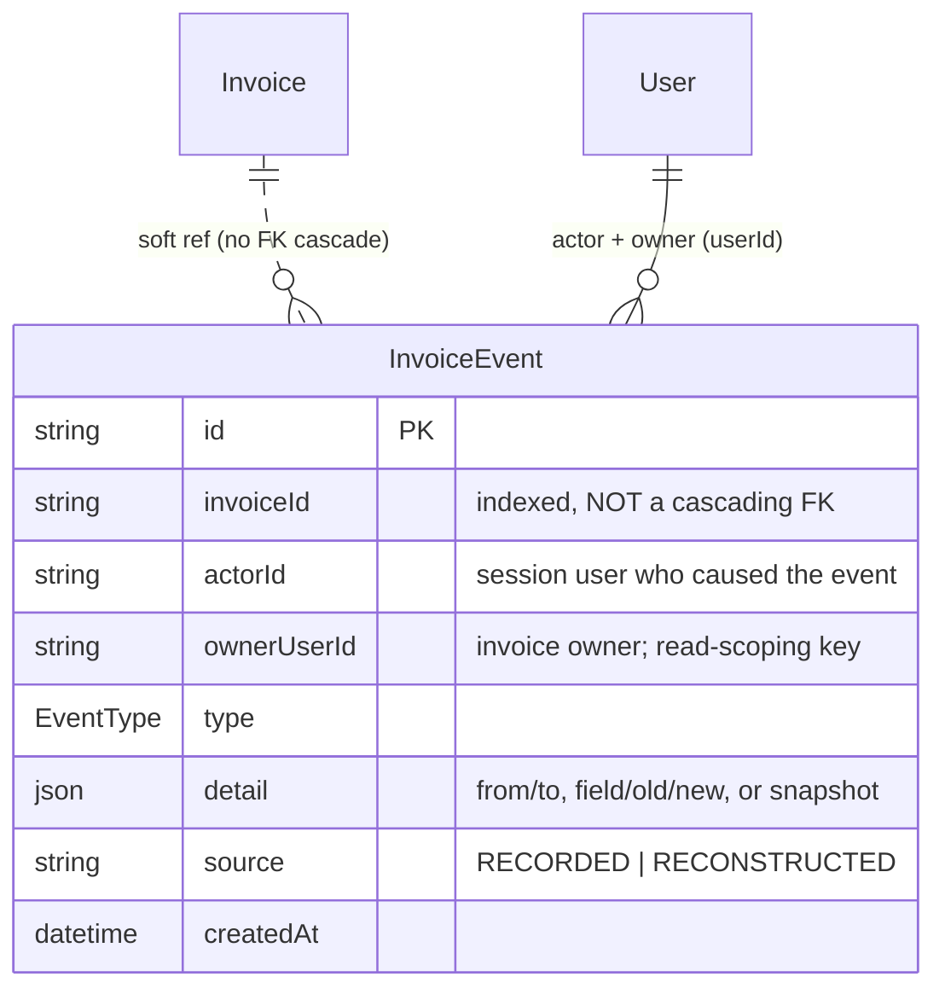
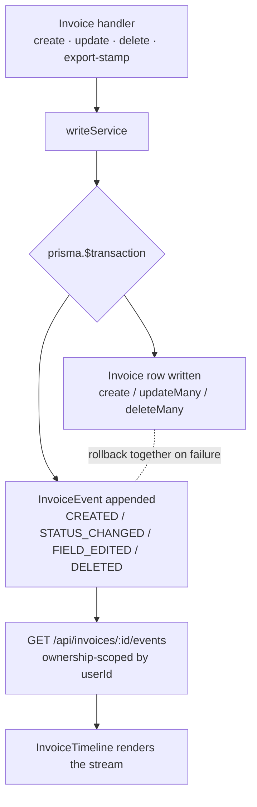

# feat: InvoiceEvent Ledger — Implementation Plan

## Summary

Add an append-only `InvoiceEvent` ledger that records creation, status transitions, money-field edits, and deletion (with a snapshot) for each invoice, captured atomically through one invoice write-service that wraps each mutation and its event in a single `prisma.$transaction`. Rewire the invoice timeline to render from these events, and backfill labeled reconstructed events for existing invoices. The materialized `Invoice` row stays the source of truth; the ledger is the history of how it got there.

---

## Problem Frame

The invoice detail timeline is reconstructed from current fields — `apps/web/src/components/InvoiceTimeline.tsx:7` derives nodes from `status`, `createdAt`, and `paidDate`, so an invoice that was disputed and later paid shows no dispute ever happened. The API compounds this: `updateInvoice` overwrites the row in place (`apps/api/src/invoices/handlers.ts:212`) and `deleteInvoice` hard-removes it (`handlers.ts:237`), and there are **zero** uses of `prisma.$transaction` in the codebase — so no write is paired with a durable record of who changed what, when. For a two-party approval workflow over money this absence bites during disputes and retention. Building the ledger now, before more status logic accretes and before the contractor portal multiplies the actors mutating rows, is far cheaper than reconstructing years of history later (see origin: `docs/brainstorms/2026-06-23-invoiceevent-ledger-requirements.md`).

---

## Requirements

Traced from the origin requirements doc. R-IDs below reference the origin.

**Capture**
- R1. Recorded events are creation, every status transition, edits to financially-material fields, and deletion; untracked field edits and reads are not recorded. Tracked fields are resolved in KTD-3.
- R2. Each mutation records its event in the same transaction as the mutation (rollback together; no orphan event, no unrecorded mutation).
- R3. All invoice mutations route through a single write-service choke-point. Routing through it does not itself emit an event — only the R1 set does (export-stamp handling in KTD-8).
- R4. Each event records the acting session user (`actorId`), a timestamp, the target invoice, the type, and — for edits — the field with old and new values. Read-scoping uses a separate `ownerUserId` (KTD-5).

**Integrity & retention**
- R5. Events are append-only; application code never updates or deletes a written event.
- R6. Deletion hard-removes the invoice row and the deletion event carries a full snapshot of the final state, so the record stays reconstructable (KTD-4, KTD-5).
- R7. Event reads are ownership-scoped to the invoice owner (`ownerUserId`), not the event author, with no existence leak — so a contractor-authored event stays visible to the landlord, and a deleted invoice's events remain retrievable by their owner.

**Timeline surface**
- R8. The detail timeline renders from recorded events — status transitions, money-field edits (old → new), creation, deletion — each with actor and timestamp.
- R9. For post-ledger invoices the timeline shows only recorded events; it never reconstructs status from current fields.

**Backfill**
- R10. A one-time migration generates reconstructed events for pre-ledger invoices from their fields (creation event, plus paid event where a paid date exists).
- R11. Reconstructed events are labeled inferred, distinguishable from live-recorded events (KTD-6).

---

## Key Technical Decisions

- **KTD-1: Service choke-point with explicit transactions.** Introduce `apps/api/src/invoices/writeService.ts` exposing the invoice write operations. Each wraps the mutation and its event insert(s) in one `prisma.$transaction`. This is the codebase's first transaction usage; it fits the explicit, testable handler style and lets events carry actor and business meaning (origin Key Decision: service choke-point). The create auto-number retry loop opens a **fresh** `prisma.$transaction` per attempt — a transaction that throws P2002 is already rolled back and cannot be reused — and `nextInvoiceNumber` runs on the transaction client so the max-scan and insert stay race-consistent.
- **KTD-2: One `InvoiceEvent` table, typed kind + structured detail.** A single table with a `type` enum and a `detail` Json payload, rather than per-kind tables — resolves the origin's open question on event shape. One uniform stream is exactly what the timeline reads, and `detail` flexibly holds `{from,to}`, `{field,old,new}`, or a snapshot.
- **KTD-3: Event taxonomy and tracked fields.** Types: `CREATED`, `STATUS_CHANGED`, `FIELD_EDITED` (one event per tracked field changed in a PATCH), `DELETED`. Financially-material tracked fields are `amount`, `vendorName`, `invoiceDate`, `dueDate`. `paidDate` is not tracked directly — it is an artifact of the status transition and is captured by `STATUS_CHANGED`.
- **KTD-4: Delete is hard-delete plus tombstone snapshot, in one transaction.** `deleteInvoice` appends a `DELETED` event whose `detail` carries a full snapshot of the final invoice, then hard-removes the row — both in one transaction. The ledger is the archive; list/stats/export queries stay clean (no `deletedAt` filter). The snapshot serializes every invoice column (`status`, `paidDate`, `sheetsSyncedAt`, `ownerUserId`, `createdAt`, …), with Decimal `amount` as a string and dates as ISO strings to preserve precision and round-trip exactly. Note: the snapshot (and field-edit details) persist potentially-sensitive fields — `vendorEmail`, `attachmentUrl`, `notes` — into the append-only ledger, so the event store inherits the invoice's retention/erasure obligations; an erasure path for ledger records is an open question (see Risks).
- **KTD-5: `InvoiceEvent` carries separate `actorId` and `ownerUserId`, plus a non-cascading `invoiceId`.** `actorId` is the session user who caused the event (R4); `ownerUserId` is the invoice's owner, copied server-side from the invoice at write time, and is what read-scoping filters on. Splitting them is load-bearing because the plan's own motivation — the contractor portal — guarantees a future event where `actorId != ownerUserId` (a contractor authors a `STATUS_CHANGED` on the landlord's invoice); a single conflated column would make that event either mis-attributed or invisible to the landlord. `ownerUserId` also lets a `DELETED` event outlive its invoice. `invoiceId` is a plain indexed string column with **no** relation/foreign key, so deleting an invoice never cascade-deletes its events (the existing schema sets FKs to `onDelete: Cascade`; the ledger must deliberately opt out — see Risks). Both `actorId` and `ownerUserId` are always derived server-side, never from client input.
- **KTD-6: Backfill writes persisted reconstructed rows.** The migration inserts real `InvoiceEvent` rows with `source = RECONSTRUCTED`, rather than computing synthetic events on read — resolves the origin open question. One persisted stream keeps the timeline single-path and avoids maintaining a second field-derived renderer.
- **KTD-7: Append-only is application-enforced.** No code path updates or deletes events; integrity is by discipline and a single writer module, not DB triggers or revoked grants — matching the audit-over-compliance priority (origin Key Decision).
- **KTD-8: Export-stamp routes through the service, emits no event.** `exportInvoices`' `sheetsSyncedAt` stamp goes through the write-service for consistency with R3 but records no timeline event; surfacing sync-as-event stays deferred. Because it emits no event, `stampSynced` is a plain `updateMany` (**not** wrapped in `$transaction`), so the existing append-then-stamp at-least-once export behavior is preserved byte-for-byte. (Scope note: a reviewer flagged this route-through as low-benefit until sync-as-event is built and the origin leaned toward deferring it — it is retained per the brainstorm confirmation, but is the cheapest unit to cut if desired.)

---

## High-Level Technical Design

Data model — the ledger references the invoice softly so it survives deletion:

Transactional write path — the choke-point pairs every mutation with its event:

---

## Implementation Units

### U1. InvoiceEvent schema and migration

- **Goal:** Add the `InvoiceEvent` model and `EventType` enum to the Prisma schema and generate the migration.
- **Requirements:** R1, R5, R6 (data shape); enables all others.
- **Dependencies:** none.
- **Files:** `apps/api/prisma/schema.prisma`, `apps/api/prisma/migrations/<generated>/migration.sql`.
- **Approach:** Add `model InvoiceEvent { id cuid; invoiceId String (indexed, no relation); actorId String; ownerUserId String (indexed); type EventType; detail Json; source String @default("RECORDED"); createdAt DateTime @default(now()); @@index([invoiceId]); @@index([ownerUserId, createdAt]); @@map("invoice_events") }` and `enum EventType { CREATED STATUS_CHANGED FIELD_EDITED DELETED }`. Critically, `invoiceId` is a plain column with **no** `@relation` — confirm the generated `migration.sql` adds no foreign key on it (so an invoice delete cannot cascade events away). Follow schema norms: cuid PK, `@@map`, uppercase enum members, composite index.
- **Patterns to follow:** existing `Invoice`/`InvoiceImage` model style and `@@index`/`@@map` conventions in `apps/api/prisma/schema.prisma`.
- **Test scenarios:** Test expectation: none — schema/migration only; behavior is covered by U3–U8. Verify by reviewing generated `migration.sql` for the absence of an `invoiceId` foreign key.
- **Verification:** `npm run db:generate` and the migration apply cleanly; the events table exists with the two indexes and no FK on `invoiceId`.

### U2. Shared InvoiceEvent schema and types

- **Goal:** Add Zod schemas and types for an event and the event-list response in the shared package.
- **Requirements:** R4, R8.
- **Dependencies:** U1.
- **Files:** `packages/shared/src/schemas/invoice.ts` (or a new `invoiceEvent.ts` in the same dir), `packages/shared/src/index.ts` (export).
- **Approach:** Define `EventType` (Zod enum mirroring Prisma) and a single flat `InvoiceEvent` output schema (`id, invoiceId, actorId, ownerUserId, type, detail, source, createdAt`, with `detail` typed loosely as a record). Keep the per-kind `detail` narrowing (status `{from,to}`, edit `{field,old,new}`, deleted `{snapshot}`) at the two real consumers — the API writer and the web renderer — rather than as a shared discriminated union with no third consumer. Mirror the existing `InvoiceStatus`/`InvoiceCategory` enum-as-value pattern.
- **Patterns to follow:** existing enum and schema declarations in `packages/shared/src/schemas/invoice.ts`.
- **Test scenarios:** valid event parses for each `type`; a `FIELD_EDITED` detail missing `field` fails; the list-response schema accepts an empty array.
- **Verification:** types import cleanly in both apps; `npm run typecheck` passes.

### U3. Write-service and event recording for create + update

- **Goal:** Introduce the write-service choke-point and route `createInvoice`/`updateInvoice` through it, emitting events atomically.
- **Requirements:** R1, R2, R3, R4.
- **Dependencies:** U1, U2.
- **Files:** `apps/api/src/invoices/writeService.ts` (new), `apps/api/src/invoices/handlers.ts`, `apps/api/test/invoices.events.test.ts` (new).
- **Approach:** Add `writeService` functions for create and update that take the prisma client, the actor id, and the input, each running inside `prisma.$transaction`. **Update path:** within the tx, `findFirst({id, ownerUserId: actor})` first — this replaces the old `count===0 → 404` guard *and* supplies the pre-image for diffing; then `update`; then append events — `STATUS_CHANGED {from,to}` when status changes, one `FIELD_EDITED {field,old,new}` per changed tracked field (`amount`, `vendorName`, `invoiceDate`, `dueDate`). The `paidDate` side-effect currently computed in the handler (`handlers.ts:209`) moves into the service so it stays inside the tx. **Create path:** the auto-number retry loop lives in the handler and wraps the entire `writeService.create` call (the `$transaction`), opening a fresh transaction per attempt; `nextInvoiceNumber` runs on the tx client; on success exactly one `CREATED` event commits with the row. Handlers keep parsing/validation and HTTP shaping; all mutation + event logic moves into the service. Every event is stamped with `actorId = request.user.id` and `ownerUserId` from the invoice.
- **Execution note:** Start with a failing integration test for the rollback guarantee (R2) against the real Postgres test database before refactoring the handlers.
- **Patterns to follow:** existing ownership-scoped `updateMany`/`count===0 → 404` idiom (`handlers.ts:212`); `request.user.id` as actor; the test harness in `apps/api/test/invoices.crud.test.ts`.
- **Test scenarios:**
  - Covers AE1. PENDING → APPROVED records one `STATUS_CHANGED {from:PENDING,to:APPROVED}` with actor and timestamp, in the same transaction as the status update.
  - Covers AE2. Editing `amount` 420 → 450 records a `FIELD_EDITED {field:'amount',old:'420.00',new:'450.00'}`; editing an untracked field (`notes`) records no event.
  - Covers AE4. When the event insert fails mid-transaction (inject a failure), the invoice mutation rolls back and the row is unchanged.
  - Creating an invoice records exactly one `CREATED` event owned by the actor.
  - A PATCH changing two tracked fields records two `FIELD_EDITED` events; a no-op PATCH records none.
  - A forced P2002 on the first create attempt: the second attempt commits the invoice and exactly one `CREATED` event — no leaked or duplicate events from the aborted attempt.
  - Ownership preserved: updating another user's invoice still 404s and writes no event.
- **Verification:** the events test suite passes against the CI Postgres service; existing CRUD tests stay green.

### U4. Delete-as-tombstone

- **Goal:** Route `deleteInvoice` through the service, appending a `DELETED` snapshot event in the same transaction as the hard delete.
- **Requirements:** R5, R6, R7.
- **Dependencies:** U3.
- **Files:** `apps/api/src/invoices/writeService.ts`, `apps/api/src/invoices/handlers.ts`, `apps/api/test/invoices.events.test.ts`.
- **Approach:** In one transaction (all reads/writes on the `tx` client), read the owned row (404 if absent/not owned), append a `DELETED` event whose `detail.snapshot` serializes every invoice column (`amount` as string, dates as ISO strings, incl. `status`, `paidDate`, `sheetsSyncedAt`, `ownerUserId`), then `deleteMany({id, ownerUserId})`. Order the append before the delete so the snapshot reads the live row; the non-cascading `invoiceId` (U1) ensures the event survives. Stamp `actorId` and `ownerUserId`.
- **Patterns to follow:** existing `deleteInvoice` ownership check (`handlers.ts:237`).
- **Test scenarios:**
  - Covers AE3. Deleting an invoice removes the row and leaves a `DELETED` event whose snapshot holds the final state; the event is still readable afterward.
  - Deleting another user's invoice 404s and writes no event.
  - The `DELETED` event's snapshot `amount` is a precise string, and the snapshot deserializes field-equal to the pre-delete row (round-trip).
- **Verification:** after delete, the invoice 404s from `GET /:id` but its events (incl. `DELETED`) remain via the events endpoint.

### U5. Export-stamp through the service (no event)

- **Goal:** Route the `sheetsSyncedAt` stamp in `exportInvoices` through the write-service without emitting a timeline event.
- **Requirements:** R3, KTD-8.
- **Dependencies:** U3.
- **Files:** `apps/api/src/invoices/writeService.ts`, `apps/api/src/invoices/handlers.ts`, `apps/api/test/invoices.export.test.ts`.
- **Approach:** Add a service `stampSynced(ids, userId)` used by the export loop. Preserve the existing append-then-stamp ordering and the at-least-once `exported`-count error behavior exactly; only the stamp's call path changes. Emit no event (sync-as-event deferred).
- **Patterns to follow:** the current per-chunk stamp at `handlers.ts:314`.
- **Test scenarios:** export still stamps `sheetsSyncedAt` per chunk; no `InvoiceEvent` rows are created by an export; the at-least-once interruption behavior (existing export tests) is unchanged.
- **Verification:** `apps/api/test/invoices.export.test.ts` passes unchanged in behavior; no events appear after export.

### U6. Event read endpoint

- **Goal:** Add `GET /api/invoices/:id/events`, ownership-scoped, returning the invoice's events oldest-first.
- **Requirements:** R7, R8, R9.
- **Dependencies:** U1, U2.
- **Files:** `apps/api/src/invoices/routes.ts`, `apps/api/src/invoices/handlers.ts`, `apps/api/test/invoices.events.test.ts`.
- **Approach:** New handler queries `invoice_events` `where: { invoiceId, ownerUserId: request.user.id }` ordered by `createdAt asc`, behind the existing `requireAuth` preHandler (the `:id` param validates as a cuid like other routes). Scope by `ownerUserId` so a deleted invoice's events stay retrievable by their owner and a non-owner gets an empty array (no existence leak). To satisfy R8's per-event actor display, resolve each event's `actorId` to a `{id, name}` (mirroring `userSelect` in `handlers.ts:16`) in the response. Events are returned unbounded for now — a single invoice's event count is small; a limit can be added later if needed.
- **Patterns to follow:** route registration and `requireAuth` in `apps/api/src/invoices/routes.ts:13`; ownership query style in `getInvoice` (`handlers.ts:169`).
- **Test scenarios:**
  - Returns events oldest-first for an owned invoice.
  - A second user requesting the same id gets no events (no leak).
  - Returns the `DELETED` event for an already-deleted invoice owned by the requester.
  - Includes reconstructed events (post-U7) interleaved correctly by `createdAt`.
- **Verification:** endpoint returns the shared list-response shape; ownership tests pass.

### U7. Backfill migration for existing invoices

- **Goal:** Generate persisted reconstructed events for pre-ledger invoices from their fields.
- **Requirements:** R10, R11.
- **Dependencies:** U1.
- **Files:** `apps/api/prisma/backfill-events.ts` (standalone idempotent data script, `seed.ts` style), `apps/api/package.json` (a `db:backfill-events` script entry), `apps/api/test/invoices.events.test.ts`.
- **Approach:** A standalone TypeScript script, **not** a Prisma migration — the plan reuses `seed.ts`'s mapping ergonomics (raw migration SQL can't), and the backfill is a one-time operator-run step, not deploy-time. For each existing invoice with no events, insert a reconstructed `CREATED` event dated `createdAt`, and — only where `paidDate` is set — a reconstructed `STATUS_CHANGED {to:'PAID'}` dated `paidDate`. This matches R10 exactly; `REJECTED`/`CANCELLED` have no date anchor on the model and are out of scope for backfill. All with `source = RECONSTRUCTED`, `actorId`/`ownerUserId` set to the invoice's owner, and `detail` holding the inferred values. Idempotent: skip invoices that already have events. It runs via `npm run db:backfill-events`, not on `prisma migrate deploy` — document that operator step.
- **Patterns to follow:** the existing data-mapping seed style in `apps/api/prisma/seed.ts` (sequential `createMany`, idempotent upsert-style guards).
- **Test scenarios:**
  - A pre-ledger PAID invoice yields a reconstructed `CREATED` and a reconstructed paid `STATUS_CHANGED`, both `source=RECONSTRUCTED`.
  - Re-running the backfill creates no duplicates (idempotent).
  - A post-ledger invoice (already has events) is untouched.
- **Verification:** after backfill, every existing invoice has at least a `CREATED` event flagged reconstructed; counts match the invoice population.

### U8. Timeline renders from events

- **Goal:** Fetch events and rewire `InvoiceTimeline` to render the real event stream, labeling reconstructed entries.
- **Requirements:** R8, R9, R11.
- **Dependencies:** U6, U7.
- **Files:** `apps/web/src/hooks/useInvoiceEvents.ts` (new), `apps/web/src/components/InvoiceTimeline.tsx`, `apps/web/src/pages/InvoiceDetail.tsx`.
- **Approach:** Add a TanStack Query hook mirroring `useInvoice.ts` that fetches `/api/invoices/:id/events`. Replace `nodesFor`'s field-derived logic with rendering over the event stream: status transitions, field edits (`old → new`), creation, deletion — each with actor name and timestamp; render `source=RECONSTRUCTED` events with a visible "inferred" affordance. The component prop changes from `invoice` to the event stream (keep `invoice` for the header), so update the `InvoiceDetail.tsx:139` call site. Render each event's actor by the `{id, name}` the endpoint resolves (U6).
- **Patterns to follow:** `apps/web/src/hooks/useInvoice.ts` query shape; `apiClient` usage; the existing `InvoiceTimeline` node/tone rendering.
- **Execution note:** `apps/web` has no test harness today (no existing `*.test.tsx`, no jsdom/RTL configured), so there is no co-located runner to assume. Verify U8 via `build`/`lint` plus the data-level guarantees from U6/U7; standing up a web harness is deferred follow-up.
- **Test scenarios (once a web harness exists):**
  - Covers AE5. A post-ledger invoice renders only recorded events; a pre-ledger invoice renders reconstructed events labeled inferred.
  - A status transition and a money edit both appear with actor and old → new where applicable.
  - Loading and empty states render without error.
- **Verification:** the detail page timeline reflects recorded history; reconstructed entries are visibly labeled; `npm run build` and `npm run lint` pass.

---

## Scope Boundaries

**Deferred for later** (from origin)
- Full event-sourcing (rebuilding state by replaying events) — the materialized row stays source of truth.
- Account-wide activity feed across all invoices.
- Downstream consumers the ledger enables — email reminders, contractor activity feed, surfacing Sheets sync status as an event.
- DB-level tamper-proofing (Postgres triggers, revoked UPDATE/DELETE grants).
- Read/view event tracking.

**Deferred to Follow-Up Work** (plan-local)
- Concurrency hardening — replacing the full-table-scan `nextInvoiceNumber` with a sequence and adding optimistic-concurrency to edits. This plan introduces the first transactions but deliberately does not bundle these; they are a separate ideation direction.
- A web test harness (`vitest + jsdom + @testing-library/react`) for `apps/web` — absent today; U8 leans on `build`/`lint` until it exists.
- A scoped erasure/redaction path for ledger records holding PII (see Risks) — the append-only store has no deletion path today.

---

## Risks & Dependencies

- **Cascade trap (high).** The existing schema sets FKs to `onDelete: Cascade`. If `InvoiceEvent.invoiceId` were a real relation, deleting an invoice would delete its events — destroying the tombstone the feature exists to keep. Mitigation: `invoiceId` is a plain non-FK column (U1); a U4 test asserts events survive deletion; review the generated `migration.sql` for any FK on `invoiceId`.
- **Forgotten write path (medium).** Capture is discipline-dependent (origin trade-off). Mitigation: all invoice mutations live in `handlers.ts` and route through the single `writeService`; a future writer that bypasses it loses events — call this out in review.
- **Actor ≠ owner (medium).** Events split `actorId` from `ownerUserId` precisely because the contractor portal will produce events authored by a non-owner; read-scoping filters on `ownerUserId` so those stay visible to the landlord. Mitigation: `ownerUserId` is always copied server-side from the invoice, never from input; a test asserts a non-owner-authored event is owner-visible and never cross-owner-visible.
- **Ledger holds PII with no erasure path (medium).** The `DELETED` snapshot and field-edit details persist `vendorEmail`, `attachmentUrl`, and `notes` into an append-only store, so the ledger inherits the invoice's retention/erasure obligations with no deletion path today. Mitigation: acknowledged as an open question — a scoped erasure/redaction path for ledger records is deferred follow-up, consistent with the audit-over-compliance priority.
- **Transaction semantics are new (medium).** This is the first `prisma.$transaction` usage. Mitigation: keep transactions narrow (one row write + its events), cover rollback with an integration test (AE4), and verify the create retry-on-P2002 loop still works around the transactional create.
- **Decimal precision (low).** `amount` is `Decimal(10,2)`; JSON details and snapshots must store it as a string to avoid float drift. Mitigation: covered in U3/U4 test scenarios.
- **Backfill correctness (low).** ~158 existing invoices get reconstructed events. Mitigation: idempotent and labeled; U7 tests assert no duplicates and correct flags.
- **Dependency:** integration tests for atomicity require the CI Postgres service (already configured per `.github/workflows/ci.yml`).

---

## Sources & Research

- Origin requirements: `docs/brainstorms/2026-06-23-invoiceevent-ledger-requirements.md`.
- Verified grounding (write-path inventory, transaction absence, actor model, timeline derivation, schema/migration norms): captured this session at `apps/api/src/invoices/handlers.ts`, `apps/web/src/components/InvoiceTimeline.tsx`, `apps/api/prisma/schema.prisma`, `apps/api/src/auth/requireAuth.ts`.
- Append-only-archive-over-soft-delete-flag rationale and the commit-log/journal framing were established during ideation/brainstorm (Brandur, accounting journal, medical tombstone analogies); no further external research was load-bearing for this plan.
