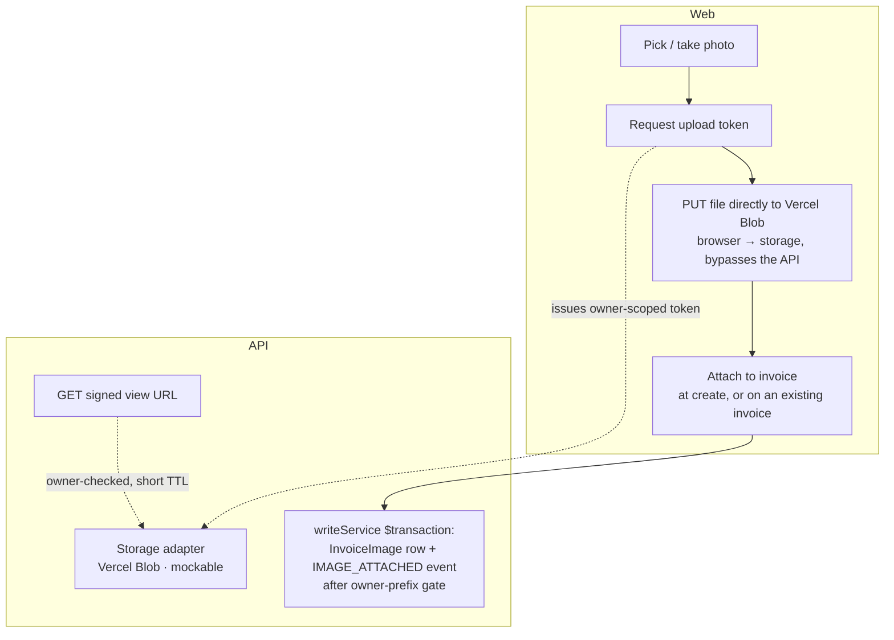

# feat: Photo Invoice Capture — Implementation Plan (v1: attach + view; OCR deferred)

## Summary

Let the landlord keep the photo of a contractor's handwritten invoice on the record: attach a photo while creating an invoice or on any existing invoice, view it full-size as proof, and replace or remove it — all recorded in the event ledger. **This v1 deliberately defers the OCR auto-fill** (the "snap → fields fill themselves" half) to a Phase 2 so the feature ships at **zero recurring cost** — there are no external model calls, only object storage that stays within a free tier. Storage sits behind a thin, mockable adapter so the whole feature is built and tested with no live account; the file uploads browser→storage directly, never through the 60s-limited API function.

---

## Problem Frame

Contractors hand-write invoices and send the landlord a photo; that photo is exactly the proof a landlord wants on record for a payment, yet today it is discarded and the `InvoiceImage` model + the dead "Scan a receipt" tile sit unwired (see origin: `docs/brainstorms/2026-06-23-photo-invoice-capture-requirements.md`). The origin envisions OCR turning the photo into pre-filled fields, but that requires a paid vision-LLM per call and sends financial PII to a third party — so v1 ships the **record-keeping** value (attach + view) at $0 and leaves extraction for Phase 2 (the provider research is preserved in Scope Boundaries). Two facts still shape the design: Vercel's API function has a 60-second timeout (files must not stream through it), and there is no upload/storage infrastructure in the repo today.

---

## Requirements

Traced from the origin requirements doc. OCR-specific requirements (R4, R5, R7, R8) are deferred to Phase 2 (Scope Boundaries).

**Photo attachment**
- R1. An invoice holds at most one photo, attachable at creation or later, on any invoice.
- R2. Attaching a photo when one exists replaces it.
- R3. The landlord supplies a photo from a phone camera or a file.

**Create flow**
- R9. Attaching a photo at create time persists no draft — the invoice (and its image) exists only after submit; a photo is optional, never blocking creation (the manual-entry path is unchanged).

**Viewing and integrity**
- R10. An invoice's photo is viewable on its detail page as proof.
- R11. Attaching, replacing, and removing a photo are recorded in the invoice event ledger.
- R12. Photos are ownership-scoped with no existence leak.

---

## Key Technical Decisions

- **KTD-1: Storage = Vercel Blob, with direct browser→Blob uploads.** The client uploads straight to Blob (via a short-lived token the API issues); the file never passes through the Fastify function, sidestepping the 60s limit. Blobs are private (`access: 'private'`), served to the owner via short-TTL signed read URLs. Vercel-native: `BLOB_READ_WRITE_TOKEN` is auto-injected. **Cost:** within the free Hobby Blob allowance at this volume — $0 recurring. The alternative is Cloudflare R2 (permanent 10 GB free tier, S3-compatible presigned PUTs) — also $0, but manual wiring and no Vercel-native integration; chosen against unless Blob's allowance is ever exceeded.
- **KTD-2: Storage lives behind a thin, mockable adapter.** One narrow module (issue-upload-token / signed-read / delete / owner-of) mirrors the `apps/api/src/integrations/sheets.ts` seam: own retry/backoff, sanitize provider errors into `AppError`, load creds from env, `vi.mock`-ed in tests (no live calls). This is the binding integration convention (CONV-016 / DEC-022) and is what lets the feature ship without a provisioned account.
- **KTD-3: The photo is an `InvoiceImage` row (one per invoice).** Reuse the existing model rather than the legacy `attachmentUrl` field — it carries `type`/`caption` and is forward-compatible with the deferred multi-photo feature. "At most one" is enforced in the write path (attach replaces the existing row). On invoice delete the delete path is made **image-aware**: the pre-read includes the image, the image url is folded into the `DELETED` snapshot, and the blob is best-effort deleted — otherwise the `onDelete: Cascade` silently drops the image row (losing the url from the archive) and leaves the blob orphaned with PII. (The current `deleteInvoice` reads only scalar `Invoice` columns, so without this change the snapshot would not contain the url.) The schema changes are two new event types in **both** the Prisma enum and the shared Zod `EventType`.
- **KTD-4: Image mutations go through the ledger writeService.** Attaching, replacing, and removing a photo emit `IMAGE_ATTACHED` / `IMAGE_REMOVED` events inside the same `prisma.$transaction` as the row write, consistent with the shipped ledger; image attach at create time happens in the create transaction.
- **KTD-5: A blob ref is trusted only after a server-side owner check.** Upload tokens are minted scoped to an owner-prefixed pathname (`owners/<userId>/…`). Because the file is uploaded before the invoice exists, every consumer of a client-supplied blob ref — the attach endpoint and create-with-image — must parse the owner segment and reject (403) any ref whose prefix is not the session user's. Without this, a caller could attach another user's blob. This is the load-bearing access control (pairs with DEC-019's no-leak rule).

---

## High-Level Technical Design

The attach path — where bytes flow and where the mockable adapter sits:

---

## Implementation Units

### U1. Schema: image-event types

- **Goal:** Add `IMAGE_ATTACHED` / `IMAGE_REMOVED` to the Prisma `EventType` enum and the shared Zod `EventType`, plus a migration.
- **Requirements:** R11 (data shape); enables U3–U6.
- **Dependencies:** none.
- **Files:** `apps/api/prisma/schema.prisma`, `apps/api/prisma/migrations/<generated>/migration.sql`, `packages/shared/src/schemas/invoice.ts` (the shared `EventType` Zod enum the web `TimelineEvent` type derives from).
- **Approach:** Extend the Prisma `EventType` and the shared Zod `EventType` with the two values (both, or the web timeline type won't accept them). `InvoiceImage` already exists and needs no change. "One photo per invoice" is enforced in the write path (U3), not a DB constraint, to keep replace-on-attach simple.
- **Patterns to follow:** the InvoiceEvent enum migration shipped in the ledger feature.
- **Test scenarios:** Test expectation: none — enum/migration only; behavior covered by U3–U6. Verify the migration applies and `db:generate` regenerates the client with the new enum values.
- **Verification:** migration applies cleanly; `EventType` (Prisma + shared) includes the two image events.

### U2. Storage adapter (Vercel Blob), mockable

- **Goal:** A thin storage module that issues an owner-scoped upload token, produces short-TTL signed read URLs, deletes a blob, and parses the owner of a pathname — behind the mockable seam.
- **Requirements:** R1, R3, R10, R12 (storage substrate).
- **Dependencies:** none.
- **Files:** `apps/api/src/integrations/storage.ts` (new), `apps/api/test/integrations/storage.test.ts` (new), `.env.example`, `apps/api/src/app.ts` (redaction), `package.json` (add `@vercel/blob`).
- **Approach:** Wrap `@vercel/blob` server helpers. Expose `issueUploadToken(ownerId, contentType)` (pathname scoped to `owners/<ownerId>/…`, short TTL, single content-type), `signedReadUrl(pathname)` (TTL ~15 min — bearer-capable, keep short), `deleteBlob(pathname)`, and `ownerOf(pathname)` (parse the owner segment, for KTD-5 checks). Load `BLOB_READ_WRITE_TOKEN` via the env pattern; unset → `AppError('STORAGE_NOT_CONFIGURED', …, 503)`. Sanitize provider errors. Store blobs private. Never log a signed URL or the token; add `BLOB_READ_WRITE_TOKEN` to the pino redaction paths in `app.ts`.
- **Execution note:** Start with a failing test that the module throws a sanitized 503 when `BLOB_READ_WRITE_TOKEN` is unset.
- **Patterns to follow:** `apps/api/src/integrations/sheets.ts` (cred loading, retry/backoff, `sanitize()` → `AppError`).
- **Test scenarios:**
  - Unset token → `STORAGE_NOT_CONFIGURED` 503; malformed distinguished from unset.
  - `issueUploadToken` returns a token scoped to the owner's pathname prefix.
  - A provider 5xx is retried then surfaces a sanitized `AppError` (no raw error / no token leakage).
  - `ownerOf` extracts the owner segment; a path without the expected prefix yields no owner (→ reject downstream).
- **Verification:** fully exercised with the provider mocked; no network in tests.

### U3. Image attach / replace / remove, upload token, signed view, create-with-image, delete cleanup

- **Goal:** The server side of photos: issue owner-scoped upload tokens, attach/replace/remove an invoice's photo (ledger-recorded), serve owner-scoped signed view URLs, attach an image at invoice-create time, and clean up the image + blob on invoice delete — all ownership-scoped, with every client-supplied blob ref validated by owner prefix (KTD-5).
- **Requirements:** R1, R2, R9, R10, R11, R12.
- **Dependencies:** U1, U2.
- **Files:** `apps/api/src/invoices/writeService.ts`, `apps/api/src/invoices/handlers.ts`, `apps/api/src/invoices/routes.ts`, `apps/api/test/invoices.images.test.ts` (new), `packages/shared/src/schemas/invoice.ts` (an `image` field on the create payload + an attach payload).
- **Approach:**
  - **Blob-ref gate (KTD-5):** a helper asserts a client-supplied ref's pathname begins with `owners/<session-user>/`; attach and create-with-image call it and reject 403 otherwise.
  - **Upload token:** `POST /api/invoices/image-upload-token` returns a token scoped to the session user's prefix (U2) — the upload precedes the invoice, so it scopes by user, not invoice.
  - **Attach/replace/remove:** `attachImage(actorId, invoiceId, blobRef)` — gate the ref, verify invoice ownership (scoped pre-read), then in one `$transaction` upsert the single `InvoiceImage` row (replacing any existing) and emit `IMAGE_ATTACHED` (prior url in `detail` on replace); best-effort delete the replaced blob. `removeImage(...)` deletes the row + blob and emits `IMAGE_REMOVED`. Endpoints: `POST` / `DELETE /api/invoices/:id/image`, and `GET /api/invoices/:id/image-url` (owner-scoped signed read URL).
  - **Create-with-image:** extend `createInvoice` to accept an optional gated `image` (blob url + type/caption); when present, create the `InvoiceImage` row and emit `IMAGE_ATTACHED` inside the same create transaction. The handler's P2002 auto-number retry re-passes the image each attempt (idempotent — no row exists until commit). Add the `image` field to `CreateInvoiceSchema` in shared.
  - **Delete cleanup (KTD-3):** make `deleteInvoice` image-aware — include the image in the pre-read, fold its url into the `DELETED` snapshot, and best-effort `deleteBlob` so neither the archive url nor the blob is lost when the cascade drops the row.
- **Patterns to follow:** the ledger writeService `$transaction` pattern; ownership-scoped `findFirst({id, userId})` → 404; the events endpoint's ownership scoping.
- **Test scenarios:**
  - Covers AE4. Attaching to an invoice that has an image replaces the row, records an attach event, and requests deletion of the prior blob.
  - A blob ref whose owner segment ≠ the session user → 403, no row, no event (KTD-5) — asserted on attach and create-with-image.
  - Attaching/removing another user's invoice → 404, no change, no event.
  - Covers AE5. The signed view URL for another user's invoice → 404 (no existence leak).
  - Remove emits `IMAGE_REMOVED` and deletes the blob.
  - Create-with-image writes the invoice + `InvoiceImage` + `IMAGE_ATTACHED` in one transaction; a forced P2002 retry still yields exactly one image row + event.
  - Deleting an invoice that has a photo deletes the blob and the `DELETED` snapshot carries the image url.
- **Verification:** attach/remove/create-with-image/delete round-trip against the DB with storage mocked; ledger rows present; ownership + blob-ref gating hold.

### U4. Web: direct-upload helper + attach-photo control

- **Goal:** A reusable upload path (token → direct browser→Blob PUT → blob url) and a file/camera control for attaching a photo.
- **Requirements:** R3 (capture), R1.
- **Dependencies:** U2, U3.
- **Files:** `apps/web/src/hooks/useImageUpload.ts` (new), `apps/web/src/components/PhotoAttach.tsx` (new), `apps/web/src/hooks/useInvoiceImage.ts` (new), `apps/web/test/PhotoAttach.test.tsx` (new), `package.json` (`@vercel/blob` client).
- **Approach:** `useImageUpload` requests a token from the upload-token endpoint (JSON via `apiClient`), then uploads the file directly with the Blob client `upload()` and returns the url — the file never goes through `apiClient` (JSON-only), so no multipart variant is needed.
  - **Constraints:** accept `image/jpeg`, `png`, `heic`/`heif`, `webp`; reject other types and files over ~10 MB client-side with a clear message. No client downscaling in v1 (accept originals).
  - **Mobile capture:** offer two affordances — "Take photo" (`capture="environment"`) and "Choose file" (plain `accept="image/*"`) — rather than a single `capture` input (on iOS `capture` forces camera-only and hides the library).
  - **Progress + states:** surface upload progress (Blob client `onUploadProgress`) as a bar or a disabled "Uploading…" control; on failure show an inline "Upload failed — try again" with the selection retained.
  - `useInvoiceImage` wraps attach/remove/get-signed-url and invalidates the invoice + events queries on change.
- **Patterns to follow:** existing hooks (`useInvoice`, `useExportInvoices`) for query/mutation + invalidation; `apiClient` for the JSON token call only.
- **Test scenarios:**
  - An accepted image triggers the upload path; a non-image type and an over-max-size file are rejected client-side with a message (no upload attempted).
  - Upload failure shows an inline error, retains the selection, does not crash the form.
- **Verification:** uploading a file yields a blob url via the direct path; `npm run build` + `lint` pass.

### U5. Web: attach a photo during create

- **Goal:** Replace the dead "Scan a receipt" tile with a real "Add a photo" option on the create form; on submit the invoice is created with the photo attached.
- **Requirements:** R9, R1.
- **Dependencies:** U3, U4.
- **Files:** `apps/web/src/pages/InvoiceNew.tsx`, `apps/web/src/components/InvoiceForm.tsx`, `apps/web/src/hooks/useCreateInvoice.ts` (pass the blob url on submit), `apps/web/test/InvoiceNew.test.tsx`.
- **Approach:** Replace the dead tile with a `PhotoAttach` (U4) on the create form; the photo is optional. On submit, `useCreateInvoice` passes the uploaded blob url so the invoice + `InvoiceImage` + `IMAGE_ATTACHED` are written in one transaction (U3). No draft exists until submit; abandoning leaves only an orphaned blob (see Risks). Fields stay fully manual — no OCR pre-fill in v1. (When OCR lands in Phase 2, this same entry gains the auto-extract step; the seam is ready.)
- **Patterns to follow:** the existing `useCreateInvoice` + `InvoiceForm` (RHF) flow; the ledger create transaction.
- **Test scenarios:**
  - Creating an invoice with a photo writes the `InvoiceImage` row + attach event; the photo shows on the new invoice.
  - Creating without a photo works exactly as today (photo is optional, never blocks).
  - Abandoning before submit creates no invoice (and no draft).
- **Verification:** create-with-photo and create-without-photo both work; build/lint pass.

### U6. Web: detail viewing + attach/replace/remove

- **Goal:** Show the photo on the detail page, open it full-size, and allow attach/replace/remove there.
- **Requirements:** R2, R10.
- **Dependencies:** U3, U4.
- **Files:** `apps/web/src/pages/InvoiceDetail.tsx`, `apps/web/src/components/PhotoAttach.tsx`, `apps/web/src/components/InvoiceTimeline.tsx` (label the image events), `apps/web/test/InvoiceDetail.test.tsx`.
- **Approach:** Render the invoice's photo on detail (signed URL via `GET /:id/image-url`) as a thumbnail that opens a **lightbox / full-size view** so a handwritten invoice is legible (a thumbnail alone defeats the proof purpose). On an image **load error (expired signed URL)**, re-fetch a fresh URL once before showing a permanent failure. A `PhotoAttach` control attaches/replaces/removes the photo (each recorded in the ledger). Add explicit `IMAGE_ATTACHED` / `IMAGE_REMOVED` cases to `InvoiceTimeline`'s `describe()` so they read as "Photo attached" / "Photo removed" rather than raw enum strings (the `default` case would otherwise show the raw value).
- **Patterns to follow:** detail page layout; the timeline `describe()` switch; the just-shipped sync/status badges for the detail header area.
- **Test scenarios:**
  - Covers AE4. Attaching a new photo where one exists replaces it and the timeline shows a "Photo attached" entry.
  - The signed image URL renders in a thumbnail that opens full-size; an expired URL triggers a one-time refresh.
  - Removing the photo shows the empty/attach state and a "Photo removed" timeline entry.
- **Verification:** detail shows the photo as legible proof; attach/replace/remove behave; image events read as friendly labels; build/lint pass.

---

## Scope Boundaries

**Deferred for later**
- **OCR auto-fill (Phase 2) — the headline deferral.** The "snap → vendor/amount/date/description pre-fill" flow (origin R4, R5, R7, R8), the OCR adapter + extract endpoint, the per-field suggest-not-overwrite UI, and the amount-confirmation guard. Deferred to keep v1 at **$0 recurring cost** (OCR is per-call paid, and sends financial PII to a third party). The provider research is preserved for when it's picked up: vision LLMs hit ~1.3% CER on handwriting vs ~70–75% for traditional document-AI; the leading options are Claude/Gemini via the Vercel AI Gateway (paid, zero-retention) or the Gemini API free tier (free, but not zero-retention) — a privacy/cost trade to decide at that time. The adapter seam and the create entry are built so Phase 2 is an addition, not a rebuild.
- Categorized multi-photo proof (`ImageType` cash/parts/check).
- Contractor self-submission — gated on the contractor portal.

**Deferred to Follow-Up Work** (plan-local)
- Orphaned-blob cleanup (required follow-up, not optional) — a TTL on unattached uploads or a sweep deleting blobs referenced by no `InvoiceImage.url`. v1 ships without it but must not stay that way (indefinite PII retention — see Risks).
- A hard DB one-photo constraint (unique index on `invoiceId`) — app-level replace is used for v1.
- Client-side image downscaling before upload.

---

## Risks & Dependencies

- **Storage provisioning to go live (low).** The live feature needs a Vercel Blob store (`BLOB_READ_WRITE_TOKEN` auto-injected) — within the free Hobby allowance at this volume. Mitigation: behind a mockable adapter (KTD-2), so all of U2–U6 is built and tested against mocks; only going live needs the store.
- **Orphaned blobs are indefinitely-retained PII (medium).** A photo can be uploaded before an invoice exists (create flow) or abandoned; abandoning leaves a blob holding a financial document with no expiry. Mitigation: a TTL on unattached uploads or a sweep job — a required follow-up (Scope Boundaries), not "accept and forget." Owner-scoped pathnames bound exposure meanwhile.
- **Blob-ref forgery (medium, security).** A client supplies the blob ref at attach/create before any invoice row exists. Mitigation: KTD-5 — every consumer rejects (403) a ref whose `owners/<id>/` prefix isn't the session user's; tests assert this on attach and create.
- **Private-image access / no leak (medium, security).** Photos are sensitive. Mitigation: private blobs; signed read URLs minted only after an ownership check, short TTL (~15 min), never logged (added to pino redaction); pathnames scoped per owner; a U3 test asserts no cross-owner access (AE5).
- **Invoice-delete must not drop the record or orphan the blob.** Mitigation: U3 makes `deleteInvoice` image-aware (snapshot the url + delete the blob); a test asserts both.
- **`onUploadCompleted` dev friction (low).** Vercel Blob's completion callback needs a public URL. Mitigation: not used — the client holds the returned blob url and passes it to attach/create.
- **Dependencies:** `@vercel/blob` (server + client) only; env `BLOB_READ_WRITE_TOKEN` (in `.env.example` and the pino redaction paths). No external LLM and no AI Gateway in v1 — so no per-call cost and no third-party PII egress. Tests mock the storage provider (no network).

---

## Sources & Research

- Origin requirements: `docs/brainstorms/2026-06-23-photo-invoice-capture-requirements.md` (the full vision incl. OCR; this plan implements the attach+view subset).
- Verified repo grounding (InvoiceImage unused, dead scan tile, sheets.ts seam, no upload infra, Vercel 60s timeout, apiClient JSON-only, ledger writeService): `apps/api/prisma/schema.prisma`, `apps/web/src/pages/InvoiceNew.tsx`, `apps/api/src/integrations/sheets.ts`, `vercel.json`, `apps/web/src/lib/apiClient.ts`, `apps/api/src/invoices/writeService.ts`.
- Storage landscape (load-bearing for KTD-1): Vercel Blob client uploads + free Hobby allowance (official docs, 2026); Cloudflare R2 permanent free tier. The OCR provider research (vision-LLM vs document-AI handwriting accuracy, Vercel AI Gateway vs Gemini free tier) is retained for the Phase 2 OCR deferral above.
