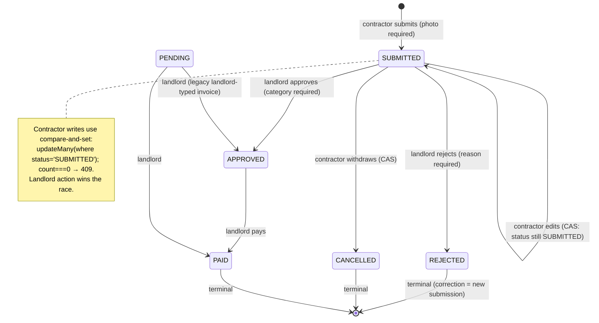
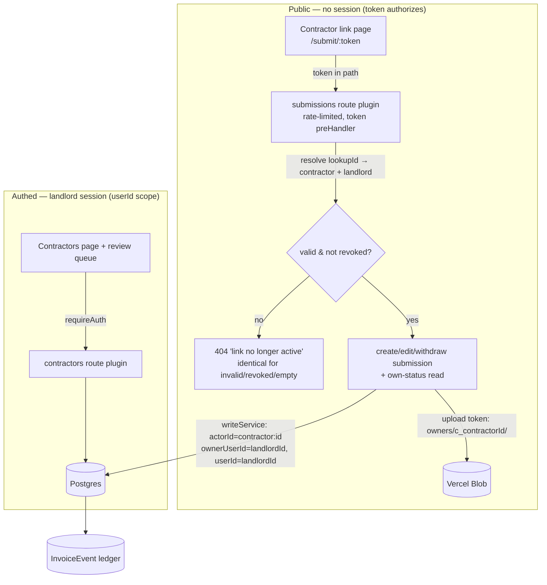

# feat: Contractor Submission Links

## Summary

Let the landlord collect invoices from contractors through a no-login, tokenized link instead of re-typing texted photos. The landlord adds a lightweight **Contractor** record (name + contact) and shares a permanent, revocable link. The contractor opens it on their phone — no account, no password — submits an invoice (amount, date, description, photo), and can check their own submissions' statuses. Each submission creates an invoice **owned by the landlord** in a new **SUBMITTED** status, with the contractor recorded as the submitter, and lands in the landlord's review queue: approve (finally wiring the dead `APPROVED` transition), reject with a reason, then pay. The single-owner ownership model and the no-existence-leak rule are preserved on a second axis (contractor-scoped reads); the link is a token-scoped channel, not a session.

This is a **Deep, phased** plan. The work splits into four phases: (A) schema + lifecycle foundation, (B) link-token module + public submission API, (C) landlord review (API + web) + `APPROVED` wiring, (D) contractor link page + Contractors management page.

---

## Problem Frame

The product's premise is "contractor submits → landlord reviews → approves/rejects → pays," but only one actor has ever existed: the landlord, who re-types every figure off a texted photo. The obvious build — contractor accounts — is the wrong shape: non-technical tradespeople resist passwords, and a second logged-in actor would force re-architecting the `userId`-scoped ownership model. The contractors' real behavior is fire-and-forget (snap, text). A no-login link mirrors that and, because the invoice stays landlord-owned, leaves ownership intact. The `CONTRACTOR` role and the ledger's `actorId`/`ownerUserId` split already exist for exactly this; only `APPROVED` sits unwired.

The codebase is largely **ready but not aligned**. Research confirmed four facts that shape the whole plan:

1. **The `InvoiceEvent` ledger was built for this** — `actorId` (who acted) and `ownerUserId` (read-scoping key) are split plain-string columns, with a schema comment explicitly anticipating "a future contractor can author an event the landlord still owns/reads" (`apps/api/prisma/schema.prisma:82-85`).
2. **Two schema facts block the design as-written.** `Invoice.category` is **NOT NULL with no default**, contradicting "no category until the landlord sets one on review." And there is **no submitter dimension** on `Invoice` — without one, contractor-scoped reads (their own submissions only) are unimplementable.
3. **There is no status-transition guard.** `writeService.updateInvoice` accepts any status → any status today; the brainstorm's lifecycle is currently unenforceable.
4. **Spend/export silently include everything.** Dashboard "Total spend" sums all statuses with no filter, and the Sheets export selects every un-synced invoice regardless of status — so a raw SUBMITTED invoice would inflate the headline number and leak into the landlord's accounting sheet unless explicitly excluded.

---

## Requirements Trace

Origin requirements (`docs/brainstorms/2026-06-24-contractor-submission-links-requirements.md`) mapped to implementation units (U-IDs assigned below):

| Origin | Summary | Units |
|---|---|---|
| R1 | Landlord adds a contractor (name + contact); managed list | U3, U11 |
| R2 | Permanent copyable link; revoke/regenerate invalidates old | U4, U5, U11 |
| R3 | A contractor belongs to exactly one landlord | U1 |
| R4 | Valid link → submit amount/date/description/photo, no login | U6, U7, U10 |
| R5 | Vendor defaults to contractor name; contractor sets no category | U1, U6, U9, U12 |
| R6 | On-submit confirmation + own-submissions status list (scoped) | U7, U10 |
| R7 | Edit/withdraw while SUBMITTED; locks once landlord acts | U7, U8 |
| R8 | Revoked/invalid link can neither submit nor read; clear dead state | U4, U6, U10 |
| R9 | Submission lands as new SUBMITTED status (review queue) | U1, U2, U6 |
| R10 | Landlord approve → APPROVED, reject w/ reason → REJECTED, pay → PAID | U2, U9, U12 |
| R11 | Landlord sees which invoices were contractor-submitted + awaiting count | U9, U2, U12 |
| R12 | Every invoice landlord-owned; existing reads/writes stay scoped | U1, U6 |
| R13 | Submission/edit/withdraw/status changes recorded in ledger by actor | U2, U6, U7 |
| R14 | A link can only ever act on its own submissions (no existence leak) | U7, U8, U10 |
| R15 | Token is a bearer credential: rate-limited, never logged, invalidated on revoke | U4, U5 |

All six Acceptance Examples (AE1–AE6) are carried as test scenarios in the units noted in **Acceptance Examples → Tests** below.

---

## Key Technical Decisions

### KTD-1 — Contractor is a lightweight entity; the invoice stays landlord-owned

A new `Contractor` model (`id` cuid, `landlordId` FK → User, `name`, `contact`, link-token fields, timestamps). It is **not** a `User` — no `passwordHash`, no `Session`, no auth rework. A submission creates a normal `Invoice` with `userId = landlordId` (unchanged ownership) plus a new nullable `submittedByContractorId` FK recording the submitter. The contractor's read/write scope is `submittedByContractorId == &lt;this token's contractor&gt;`, a second scoping axis layered beside (never replacing) the landlord's `userId` scope. (see origin: Key Decisions — "The contractor is a lightweight entity, not a User"; "Ownership is unchanged".)

### KTD-2 — SUBMITTED is an enum value, threaded through every status surface

Add `SUBMITTED` to the `InvoiceStatus` enum (Prisma + the shared Zod enum, which is the de-facto source the UI derives from). Per CONV-002's field/enum checklist and the learnings finding that status is duplicated across ~6 surfaces, the same change must touch: the Prisma enum (one-value `ALTER TYPE` migration), `packages/shared/src/schemas/invoice.ts`, `apps/web/src/lib/format.ts` (`STATUS_LABEL` + `isOverdue` exclusion), `StatusBadge.tsx` (a distinct tone), `StatusCounts.tsx` (dot color), and the summary test's `byStatus` length assertion (5 → 6). The API stats/summary zero-fills auto-extend (they iterate `InvoiceStatus.options`). (see origin: Key Decisions — "A new SUBMITTED entry status".)

### KTD-3 — Explicit, server-enforced transition guard with per-actor legal sets

There is no transition guard today. Add one in `writeService.updateInvoice`, keyed on the actor kind (landlord vs contractor), returning a 409/422 on an illegal jump. Legal transitions:

| Actor | From → To | Notes |
|---|---|---|
| Contractor | `(create)` → SUBMITTED | via submission |
| Contractor | SUBMITTED → SUBMITTED | edit while unreviewed |
| Contractor | SUBMITTED → CANCELLED | withdraw |
| Landlord | SUBMITTED → APPROVED | requires `category` set (KTD-6) |
| Landlord | SUBMITTED → REJECTED | requires `rejectionReason` |
| Landlord | APPROVED → PAID | existing paidDate side-effect |
| Landlord | PENDING → APPROVED / PAID / REJECTED / CANCELLED | preserves legacy landlord-typed invoices |

**The matrix is default-DENY:** any (from, to) pair not listed is rejected with `AppError('INVALID_TRANSITION', …, 422)`. Notable exclusions made explicit: a landlord **cannot** go SUBMITTED → PAID directly (must APPROVE first), and the contractor set is exactly the three rows above — nothing else. **Field-only edits with no status change bypass the matrix** (the guard only runs when `input.status !== before.status`), so existing landlord field edits and the contractor SUBMITTED-edit path are unaffected by the transition check itself.

**Deriving the actor kind without a signature change.** Rather than thread a new `actorKind` parameter through the shared `updateInvoice(prisma, actorId, id, input)` signature and every caller, the guard derives landlord-vs-contractor from the `actorId` namespace: an `actorId` beginning `contractor:` is the contractor actor, anything else is the landlord. This keeps the existing authed PATCH call site untouched. **The contractor edit/withdraw path is a NEW writeService function, not a parameterization of `updateInvoice`** — see U7 (the existing `updateInvoice` pre-reads with `findFirst({ where: { id, userId: actorId } })`, which is owner-scoped and would 404 for a contractor actor).

**Phase-A safety:** because the guard activates the first time it ships (Phase A/B, before the review UI in Phase C), U2 must assert every transition the *current* landlord UI performs today (PENDING → PAID, PENDING → REJECTED/CANCELLED, field-only edits) still passes — the default-deny must not regress existing flows.

**Forward-only in v1.** REJECTED, CANCELLED, PAID are terminal; the landlord cannot un-reject or un-approve, and a contractor correction after rejection is a brand-new submission (new invoice row). This guard reuses, and must preserve, the existing paidDate-on-genuine-transition gating (learnings finding 1: side-effects fire only when `input.status !== before.status`).

### KTD-4 — Link token: prefixed lookup-id + secret, SHA-256 hashed at rest

Mirror the existing session-token pattern (DEC-018: random opaque token, SHA-256 stored, never plaintext), adapted for a URL link:

- **Format:** `inv_&lt;lookupId&gt;_&lt;secret&gt;` — `lookupId` is a short non-secret indexed column; `secret` is a **160-bit** value from `crypto.getRandomValues`, base64url-encoded (`@oslojs/encoding`). The `inv_` prefix makes the token identifiable for log redaction and secret scanning.
- **Storage:** store `lookupId` (indexed, unique) + **SHA-256 of the secret** (`tokenHash`). Never store the plaintext secret. Validation = parse `lookupId` → single `findUnique` point lookup (no table scan) → `timingSafeEqual` of the candidate secret's hash against `tokenHash`. Always run the hash+compare even on a `lookupId` miss (against a dummy hash) so failures aren't measurably faster.
- **Display-once + rotate:** the landlord UI shows the full link once on create/regenerate, then a masked form + a "Regenerate" button. No re-display of the plaintext — rotation is the answer to "I lost the link" (the Stripe/GitHub UX). This avoids storing a recoverable high-value secret.
- **Revoke/rotate:** `revokedAt` row flag for revoke (idempotent, mirrors `invalidateSession`); regenerate = overwrite the contractor row's `tokenLookupId` + `tokenHash` and clear `revokedAt` in one transaction (the link lives on the `Contractor` row, so there is exactly one active link per contractor — no second row to leave dangling under the `tokenLookupId @unique` constraint). On the rare `tokenLookupId` unique collision at generation (P2002), regenerate the lookupId and retry.

(see origin: Key Decisions — "Tokenized links, not accounts"; R15.) Sources: OWASP Session Management / Authentication Cheat Sheets; GitHub token-format engineering post.

### KTD-5 — Rate limiting: in-memory `@fastify/rate-limit` at $0; Redis deferred

`@fastify/rate-limit@10` is already a dependency, registered per-plugin (auth, invoices), not globally. Register it on the new **public submission plugin** with tight low-volume thresholds — submit `POST` ~5–10/min and ~30–60/hr per token; read `GET` ~30/min; a per-IP ceiling (~60/min) on the unauthenticated path as brute-force defense-in-depth. Key by parsed `lookupId` + `request.ip` (set `trustProxy` so `request.ip` is the real client behind Vercel's proxy), falling back to IP when the token is absent/malformed.

**Cost decision (confirmed with user):** the textbook-correct serverless choice is a store-backed limiter (Upstash Redis), because in-memory counters don't persist across stateless Vercel invocations. Given the user's cost-aversion ([[cost-averse-defer-paid-deps]]), v1 uses the **in-memory store ($0)** as best-effort, relying on the **160-bit token entropy** as the actual brute-force barrier (guessing is infeasible; the limiter is defense-in-depth, not the primary control). Store-backed Redis is recorded as deferred hardening, not built now. This is a documented availability-vs-cost trade-off (see Risks R-2).

### KTD-6 — `category` becomes nullable; "categorize on review" enforced at APPROVED

`Invoice.category` is currently NOT NULL. Make it **nullable** so a contractor submission persists without a category (honoring "no category until the landlord sets one on review"). Enforce the product rule with a transition guard: **APPROVED is blocked (422) until `category` is set**.

This ripples wider than the row type — treat it like KTD-2's status checklist and **grep every `category` reference**. The closed ripple set:
- **Shared Zod (`CreateInvoiceSchema.category`)** stays `InvoiceCategory` **required on the landlord create path** (the landlord still types a category); only the contractor `SubmissionSchema` omits it and only the DB column + response type go nullable. Keeping create-required while the row type is nullable is the deliberate split — call it out so the implementer doesn't relax the landlord form.
- **`invoiceSummary` byCategory:** a nullable column makes `groupBy(['category'])` emit a `null`-key bucket. **Exclude null-category (SUBMITTED) rows from the byCategory `groupBy` `where`** so byCategory reconciles with the SUBMITTED-excluded total (KTD-9); add a reconciliation test (sum of byCategory amounts === total for the non-SUBMITTED set).
- **Sheets export cell** (`handlers.ts`): the cell map is typed `string | number`; write `inv.category ?? ''` to avoid a null in the column (defense-in-depth even though the export `where` already drops SUBMITTED/REJECTED/CANCELLED).
- **Web reads that assume non-null:** `InvoiceDetail.tsx` (render null as "Uncategorized"), `InvoiceEdit.tsx` (the `invoice.category as InvoiceCategory` cast becomes unsound — guard the form default against null). These land in U12's file list.

(see origin: AE6, R5.)

### KTD-7 — Contractor-uploaded photos reuse the storage adapter, scoped by contractor prefix

The storage adapter (`apps/api/src/integrations/storage.ts`) is already owner-agnostic: `issueUploadToken(ownerId, contentType)` writes to `owners/&lt;ownerId&gt;/&lt;uuid&gt;`, with `gateImageRef(url, ownerId)` enforcing the prefix via `isOwnedBy(url, ownerId)`.

**Critical: the contractor has two distinct identifier strings, and they must not be conflated** (the existing `createInvoice` reuses one `actorId` for both the blob gate and the ledger event — that single-string assumption breaks here):
- **Blob-owner string `c_&lt;contractorId&gt;`** — the upload token mints under `owners/c_&lt;contractorId&gt;/&lt;uuid&gt;`, and `gateImageRef` must be called with **`c_&lt;contractorId&gt;`** so `isOwnedBy` matches.
- **Ledger actor string `contractor:&lt;contractorId&gt;`** (KTD-8) — written to the event `actorId` column.

So the submission write path takes the two strings as **separate inputs** (see U6's `createSubmission` signature): owner = landlordId (`user.connect`), `actorId` = `contractor:&lt;id&gt;` (event), `blobOwnerId` = `c_&lt;id&gt;` (gate). A contractor can only ever reference a blob they themselves uploaded — never the landlord's or another contractor's. A test must assert `isOwnedBy(imageUrl, 'c_&lt;contractorId&gt;')` is true for the submitted photo. Content-type allowlist (jpeg/png/heic/heif/webp) and 10 MB cap are already enforced in the Blob client token; the browser uploads direct-to-Blob, so the public function never buffers attacker bytes. **Photo is required on submit** (it is the proof artifact). (see origin: Dependencies — "photo upload reuses the just-shipped storage upload, scoped to the contractor's link token".)

### KTD-8 — Contractor as ledger actor; submitter surfaced to the landlord

Record contractor-authored events with `actorId = "contractor:&lt;contractorId&gt;"` (a namespaced string the plain-string `actorId` column already accepts) and `ownerUserId = landlordId` (server-derived from the invoice, never client-supplied) so the event stays landlord-readable. The events endpoint currently resolves actor display names from `users` only — extend it to resolve a `contractor:` actorId to the contractor's name (without leaking contractor data cross-scope). The landlord's invoice detail/timeline shows "Submitted by &lt;contractor&gt;." (see origin: R13, R11; Outstanding Questions — ledger-actor representation.)

### KTD-9 — SUBMITTED is not "spend": excluded from Total-spend and Sheets export

Confirmed with the user. Three aggregations, three different treatments — keep them straight or the queue signal disappears:
- **`total.amount` (Total spend) and `byCategory`: exclude SUBMITTED** (`status: { notIn: ['SUBMITTED'] }`). byCategory additionally excludes the null-category rows per KTD-6.
- **`byStatus`: KEEP SUBMITTED.** Its per-status row is exactly the "to review" count the landlord needs (R11) — do not filter it out. The Dashboard's "By status" chart shows it distinctly; the "Total spend" card reads the filtered `total`.
- **Dashboard "Outstanding" (PENDING/APPROVED, computed client-side)** deliberately excludes SUBMITTED. Net effect: a SUBMITTED invoice contributes to no dollar figure (neither spend nor outstanding) and appears only as a count — the intended landlord experience (un-vetted submissions don't move money totals).

Restrict the Sheets export `where` so SUBMITTED (and, by the same correctness argument, REJECTED/CANCELLED) never sync to the accounting sheet — export stays APPROVED/PAID. Because the export filter is `sheetsSyncedAt: null`, a later approval naturally re-qualifies the row (it was never stamped). (see origin: Outstanding Questions — dashboard/Sheets inclusion.)

### KTD-10 — Rejection reason and contact field

Add a nullable `rejectionReason String?` column on `Invoice`, set on the SUBMITTED → REJECTED transition and surfaced to the contractor in their status view (read directly off the row — simpler and correctly-scoped than reading the landlord-owned ledger event). Bound it `max(500)` to match the description column; note for the implementer that **this field is contractor-visible**, so the review UI should label it as such (it is not a private internal note). The contractor `name` is bounded `min(1).max(100)` to match `Invoice.vendorName` (it is defaulted into `vendorName` server-side — an unbounded name would otherwise fail submission with an opaque 422). The `contact` field is **free-text, display-only** in v1 (no SMS/email), validated as non-empty `max(200)`. (see origin: Outstanding Questions — contact field; R6.)

### KTD-11 — Invoice numbers are assigned on APPROVED, not on submission

`invoiceNumber` is auto-assigned (max+1) at create time today. If a contractor submission claimed a sequential number on creation, then SUBMITTED rows that are later REJECTED or withdrawn (CANCELLED) would burn numbers, leaving permanent gaps in the landlord's invoice ledger (e.g., 14, 17, 18 with 15/16 dead) — exactly the discontinuity a numbered scheme exists to avoid, made worse by KTD-3's "correction = a new row." So **`invoiceNumber` becomes nullable; a contractor submission is created with `invoiceNumber = null`, and the number is assigned (max+1, reusing the existing retry-on-collision logic) on the first transition into APPROVED**. The contractor never sees the number (their status view shows status, not number), so this is invisible to them; landlord-typed invoices are unaffected (they are still numbered at create). The existing unique constraint tolerates multiple nulls in Postgres. (see origin: Outstanding Questions — contractor-submitted invoices and the ledger.)

---

## High-Level Technical Design

### Lifecycle state machine (server-enforced — KTD-3)



### Trust boundaries and request paths



### Token validation (KTD-4)

```text
parse "inv_<lookupId>_<secret>"  →  reject pre-DB if shape/prefix wrong
findUnique(where: { tokenLookupId: lookupId })   // indexed point lookup
candidateHash = sha256(secret)
ok = row && row.revokedAt == null && timingSafeEqual(candidateHash, row.tokenHash)
// always compute candidateHash even on a row miss (dummy compare) — uniform latency
ok ? attach { contractorId, landlordId } to request : 404 (identical body for all failures)
```

Directional guidance, not implementation specification.

---

## Output Structure

New files (existing files modified in-place are listed per unit, not here):

```text
apps/api/src/
  contractors/
    token.ts            # generate / hash / parse / validate link tokens (KTD-4)
    routes.ts           # authed landlord plugin: contractor CRUD + revoke/regenerate
    handlers.ts         # validated handlers, userId-scoped
  submissions/
    routes.ts           # PUBLIC plugin: token preHandler + rate-limit
    handlers.ts         # submit / edit / withdraw / own-status / upload-token
packages/shared/src/schemas/
  contractor.ts         # Contractor + submission Zod schemas
apps/web/src/
  pages/
    ContractorSubmit.tsx # public link page (outside AuthGuard)
    Contractors.tsx      # authed management page (fills nav stub)
  hooks/
    useContractors.ts    # landlord-side TanStack Query hooks
    useSubmission.ts      # contractor-side hooks (public token endpoints)
  components/
    ContractorLinkCard.tsx # copy / masked link / regenerate / revoke
    ReviewQueue.tsx        # SUBMITTED queue + approve/reject actions
```

---

## Implementation Units

Units are grouped into four phases. U-IDs are stable and dependency-ordered.

### Phase A — Schema & lifecycle foundation

#### U1. Contractor model + Invoice submitter/rejection columns + category nullable

**Goal:** Add the `Contractor` model, the `Invoice.submittedByContractorId` + `rejectionReason` columns, make `Invoice.category` and `Invoice.invoiceNumber` nullable — the schema spine the rest of the feature hangs on.
**Requirements:** R3, R9, R12; KTD-1, KTD-6, KTD-10, KTD-11.
**Dependencies:** none.
**Files:**
- `apps/api/prisma/schema.prisma` (new `Contractor` model; `Invoice.submittedByContractorId String?` + relation; `Invoice.rejectionReason String?`; `category InvoiceCategory?` nullable; `invoiceNumber String?` nullable (KTD-11); `Contractor[]` back-relation on `User`)
- `apps/api/prisma/migrations/&lt;ts&gt;_contractor_submissions/migration.sql` (generated via `db:migrate`)
- `apps/api/prisma/seed.ts` (optional idempotent `seedContractor()` upsert keyed on a fixed id, for local dev)
- Test: `apps/api/test/contractors.schema.test.ts`

**Approach:** `Contractor`: `id @default(cuid)`, `landlordId` + `@relation(... onDelete: Cascade)`, `name`, `contact`, `tokenLookupId String @unique`, `tokenHash String`, `revokedAt DateTime?`, `lastUsedAt DateTime?`, `createdAt`/`updatedAt`, `@@map("contractors")`. `Invoice.submittedByContractorId` is a nullable FK with `onDelete: SetNull` (a deleted contractor must not cascade-delete the landlord's owned invoice). Making `category` nullable is a non-destructive column alter; the `submittedByContractorId`/`rejectionReason` adds are additive. Keep the token columns on `Contractor` (one active link per contractor, KTD-4) rather than a separate table — v1 has one link per contractor.
**Patterns to follow:** existing model conventions (cuid ids, `@@map`, explicit `@relation`) at `apps/api/prisma/schema.prisma:10-99`; the `InvoiceEvent` no-FK/actor split comment (`:82-85`) as precedent for submitter≠owner; migration workflow `npm run db:migrate` (`apps/api/package.json`).
**Test scenarios:**
- Migration applies cleanly and `prisma generate` produces a client with the new fields (smoke: a row with `category: null` + `submittedByContractorId` set persists and reads back).
- A `Contractor` requires `landlordId`; deleting the landlord cascades the contractor; deleting a contractor sets `submittedByContractorId` to null on their invoices (invoice survives — R12).
- `tokenLookupId` uniqueness is enforced (duplicate insert rejected).
**Verification:** `npm run db:migrate` succeeds; `npm run typecheck` green with the regenerated client; the schema test passes.

#### U2. SUBMITTED enum value + transition guard + spend/export exclusion (API)

**Goal:** Add `SUBMITTED` to the status enum end-to-end on the API side, introduce the server-enforced transition guard, and exclude SUBMITTED from Total-spend and Sheets export.
**Requirements:** R9, R10, R11; KTD-2, KTD-3, KTD-9.
**Dependencies:** U1.
**Files:**
- `apps/api/prisma/schema.prisma` (`enum InvoiceStatus` + `SUBMITTED`; one-value `ALTER TYPE` migration)
- `packages/shared/src/schemas/invoice.ts` (`InvoiceStatus` z.enum + `SUBMITTED`)
- `apps/api/src/invoices/writeService.ts` (default-deny transition guard table per KTD-3, actor kind derived from the `contractor:` actorId namespace — no new parameter; preserve paidDate-on-genuine-transition gating; category-required-for-APPROVED check; set `rejectionReason` on REJECTED)
- `apps/api/src/invoices/handlers.ts` (`invoiceSummary`: `total` + `byCategory` exclude SUBMITTED, `byCategory` `groupBy` `where` excludes null-category rows, `byStatus` KEEPS SUBMITTED per KTD-9; export cell `inv.category ?? ''`; `exportInvoices` `where` excludes SUBMITTED/REJECTED/CANCELLED)
- Tests: `apps/api/test/invoices.transitions.test.ts`, additions to `apps/api/test/invoices.summary.test.ts` and the Sheets export test

**Approach:** Define the default-DENY transition matrix (KTD-3) consulted in `updateInvoice` only when `input.status` is a genuine change; reject unlisted transitions with `AppError('INVALID_TRANSITION', …, 422)`. Gate APPROVED on a non-null `category` (422 `CATEGORY_REQUIRED` otherwise). Actor kind is **derived inside writeService** from whether `actorId` starts with `contractor:` — the existing authed PATCH call site is unchanged. `byCategory` excludes the null-category (SUBMITTED) rows so it reconciles with the SUBMITTED-excluded `total`; `byStatus` keeps SUBMITTED as the queue signal (KTD-9). The web status-surface threading (StatusBadge tone, `STATUS_LABEL`, StatusCounts dot, Dashboard filters) lands in **U12**, not here.
**Patterns to follow:** the genuine-transition gate at `writeService.ts:177-182`; `AppError` shape + per-route error builder (`apps/api/src/invoices/routes.ts:17-21`); the summary zero-fill loop over `InvoiceStatus.options` (`handlers.ts:120-156`).
**Test scenarios:**
- Covers AE3. SUBMITTED → APPROVED succeeds when category set; SUBMITTED → APPROVED returns 422 when category null; SUBMITTED → REJECTED requires a reason and stores it.
- Illegal transitions rejected (default-deny): PAID → SUBMITTED, REJECTED → APPROVED, CANCELLED → SUBMITTED, and landlord SUBMITTED → PAID (must approve first) all 422.
- **Regression guard (Phase-A safety):** every transition the current landlord UI performs still passes — PENDING → APPROVED, PENDING → PAID, PENDING → REJECTED/CANCELLED, and a field-only edit with no status change (the guard must not fire when `input.status` is unchanged).
- paidDate side-effect unchanged: entering PAID stamps paidDate, a no-op re-PATCH of the same status writes no event and no paidDate (regression guard from learnings finding 1).
- A SUBMITTED invoice is excluded from `summary.total.amount`, from `byCategory`, and from any export batch, but **present in `byStatus`**; once APPROVED it joins total/byCategory/export (run as a throwaway `createSecondUser` to isolate from the landlord's seeded rows).
- Reconciliation: the sum of `byCategory` amounts equals `total.amount` for the non-SUBMITTED set (proves the null bucket is handled).
- `byStatus` length assertion updated 5 → 6.
**Verification:** `npm run lint && npm run typecheck && npm run test` green; transition + summary/export tests pass.

### Phase B — Link-token module & public submission API

#### U3. Contractor CRUD (landlord, authed)

**Goal:** Authenticated landlord endpoints to create/list/update contractors, all `userId`-scoped.
**Requirements:** R1; KTD-1.
**Dependencies:** U1.
**Files:**
- `apps/api/src/contractors/routes.ts` (new authed plugin, `preHandler: requireAuth`)
- `apps/api/src/contractors/handlers.ts`
- `packages/shared/src/schemas/contractor.ts` (`CreateContractorSchema`, `ContractorSchema`; re-export from `packages/shared/src/index.ts`)
- `apps/api/src/app.ts` (register the plugin after `dbConnector`)
- Tests: `apps/api/test/contractors.crud.test.ts`, `packages/shared/test/contractor.test.ts`

**Approach:** Mirror the invoice routes plugin: every query scoped `where: { landlordId: request.user.id }`; non-owned/absent → 404 (no existence leak, DEC-019). Create returns the contractor without the token secret (the token is minted/displayed by U4/U5). Schema bounds (KTD-10): `name` `min(1).max(100)` (matches `Invoice.vendorName`, into which it is defaulted), `contact` non-empty `max(200)` free text.
**Patterns to follow:** `apps/api/src/invoices/routes.ts` + `handlers.ts` (auth preHandler, `findFirst` ownership 404); shared schema convention `packages/shared/src/schemas/invoice.ts` + `index.ts`.
**Test scenarios:**
- Create a contractor → appears in the landlord's list; a second user's `GET /contractors` never sees it (scoping).
- Get/patch a non-owned contractor id → 404 (no existence leak).
- Create rejects empty name/contact and a name over 100 chars (schema validation — the bound prevents an opaque downstream submission failure on `vendorName`).
**Verification:** CRUD tests pass; second-user isolation asserted; lint/typecheck green.

#### U4. Link-token module (generate / hash / parse / validate)

**Goal:** The bearer-token primitive — generation, SHA-256 hashing at rest, prefixed lookup-id/secret parsing, constant-time validation, uniform-latency failure.
**Requirements:** R2, R8, R15; KTD-4.
**Dependencies:** U1.
**Files:**
- `apps/api/src/contractors/token.ts`
- Test: `apps/api/test/contractors.token.test.ts`

**Approach:** `generateLinkToken()` → `{ plaintext: "inv_<lookupId>_<secret>", lookupId, tokenHash }` using `crypto.getRandomValues` (160-bit secret) + `@oslojs/encoding` base64url; `tokenHash = sha256(secret)` hex. `parseLinkToken(raw)` validates the `inv_` shape and splits lookupId/secret (rejects malformed pre-DB). `validateLinkToken(prisma, raw)` → resolve by `tokenLookupId`, compute candidate hash unconditionally (dummy compare on miss), `timingSafeEqual`, check `revokedAt == null`; returns `{ contractorId, landlordId }` or null. Never returns *why* it failed.
**Patterns to follow:** `apps/api/src/auth/session.ts` (random token → SHA-256 at rest → validate; swap base32→base64url, add lookupId split); `apps/api/src/auth/password.ts` for the crypto-import style.
**Execution note:** Implement test-first — the security-sensitive contract (uniform failure, constant-time compare, revoke invalidation) is exactly what a failing test should pin first.
**Test scenarios:**
- Covers AE5. A freshly generated token validates; after `revokedAt` is set, the same token fails identically to a never-existing token (same null result, no thrown distinction).
- A malformed token (wrong prefix, missing segment) is rejected pre-DB (no query issued).
- Tampering the secret (right lookupId, wrong secret) fails the hash compare.
- The stored `tokenHash` is never equal to the plaintext secret (hashed-at-rest assertion).
**Verification:** token tests pass; no plaintext secret persisted; lint/typecheck green.

#### U5. Revoke / regenerate link (landlord, authed)

**Goal:** Landlord endpoints to mint the initial link, revoke it, and regenerate (rotate) it.
**Requirements:** R2, R8, R15; KTD-4.
**Dependencies:** U3, U4.
**Files:**
- `apps/api/src/contractors/handlers.ts` (add `issueLink`, `revokeLink`, `regenerateLink`)
- `apps/api/src/contractors/routes.ts` (routes)
- Test: additions to `apps/api/test/contractors.crud.test.ts`

**Approach:** Issue/regenerate run in one transaction (set new `tokenLookupId`+`tokenHash`, clear `revokedAt`) and return the **plaintext link once**. Revoke sets `revokedAt` (idempotent). All routes `userId`-scoped. The plaintext is returned only in the create/regenerate response body — never stored, never re-fetchable.
**Patterns to follow:** `invalidateSession` idempotent-delete shape; the writeService transaction style.
**Test scenarios:**
- Covers AE5. Regenerate invalidates the old token (old plaintext now validates as dead) and the new one works.
- Revoke makes the link dead; revoking twice is idempotent (no error).
- Regenerate/revoke on a non-owned contractor → 404.
**Verification:** rotation/revocation tests pass; old-token-dead asserted; lint/typecheck green.

#### U6. Public submission endpoint — create (token-authorized, rate-limited)

**Goal:** The public, unauthenticated `POST` that creates a SUBMITTED invoice from a valid link, owned by the landlord, attributed to the contractor in the ledger.
**Requirements:** R4, R5, R8, R9, R12, R13, R15; KTD-1, KTD-7, KTD-8, KTD-5.
**Dependencies:** U2, U4.
**Files:**
- `apps/api/src/submissions/routes.ts` (new **public** plugin — no `requireAuth`; registers its own `@fastify/rate-limit`; a token-resolving preHandler; a **public upload-token route** for contractor photos)
- `apps/api/src/submissions/handlers.ts` (submit + the public upload-token mint)
- `apps/api/src/invoices/writeService.ts` (a new `createSubmission(prisma, { ownerUserId, actorId, blobOwnerId }, input)` path with **three decoupled identities**: `user.connect` = `ownerUserId` (landlordId), CREATED event `actorId` = `contractor:<id>`, and `gateImageRef(input.image.url, blobOwnerId)` with `blobOwnerId = c_<id>`; the event `ownerUserId` = landlordId. Do **not** reuse the single-`actorId` `createInvoice`, which conflates all three strings.)
- `packages/shared/src/schemas/contractor.ts` (`SubmissionSchema`: amount/invoiceDate/description/image; vendor defaulted server-side; no category; contractor-path date bounds)
- `apps/api/src/app.ts` (register the public plugin; **add `trustProxy: true` to the `Fastify({…})` constructor** so `request.ip` is the real client behind Vercel's proxy — without it the per-IP rate-limit collapses to one shared bucket; **add `referrerPolicy: { policy: 'no-referrer' }` to the helmet registration** so the URL link token never leaks to the Blob CDN via `Referer` — see R-3)
- Tests: `apps/api/test/submissions.create.test.ts`

**Approach:** A `preHandler` resolves the path token via `validateLinkToken`; on failure returns the uniform 404 "link no longer active." On success it attaches `{ contractorId, landlordId }`. The handler builds the invoice via `createSubmission`: `userId = landlordId`, `submittedByContractorId = contractorId`, `status = 'SUBMITTED'`, `category = null`, `invoiceNumber = null` (assigned on APPROVED — KTD-11), `vendorName = contractor.name`, photo gated against `blobOwnerId = c_<contractorId>` (KTD-7). Runs through the writeService choke-point so the CREATED ledger event is emitted atomically. **Public upload-token route:** resolves the same token, then calls `issueUploadToken('c_<contractorId>', contentType)` under its own tight per-route limit (~10–20/15 min per token+IP), separate from the submit ceiling, so a stolen link can't flood Blob storage. Rate-limit keyed by lookupId+IP (KTD-5), `skipOnError: false`. Submission-path Zod adds date bounds (not future, not &gt;12 months old) and keeps the amount cap.
**Patterns to follow:** `writeService.createInvoice` (`apps/api/src/invoices/writeService.ts`, esp. the `$transaction` + CREATED event); the per-plugin rate-limit block + `AppError` builder (`apps/api/src/invoices/routes.ts:17-21`); `issueUploadToken`/`gateImageRef`/`isOwnedBy` (`storage.ts`, `writeService.ts:64-68`).
**Execution note:** Start with a failing integration test for the submit request/response contract (valid token → SUBMITTED invoice, landlord-owned, contractor-attributed event).
**Test scenarios:**
- Covers AE1. Valid token + amount/date/description/photo → a new invoice in SUBMITTED, `userId == landlordId`, `submittedByContractorId == contractor`, `invoiceNumber == null`, a CREATED event with `actorId == "contractor:<id>"` and `ownerUserId == landlordId`, and a confirmation payload.
- Covers AE6. Vendor defaults to the contractor name; `category` is null on the created row.
- The submitted photo passes the gate: `isOwnedBy(imageUrl, 'c_<contractorId>')` is true; a URL under a landlord or other-contractor prefix is rejected (proves the `blobOwnerId` and `actorId` strings are not conflated).
- Revoked/invalid token → uniform 404; no invoice created; the upload-token route likewise 404s for a dead token.
- Photo required: submit without an image → 422.
- Date bound: a future-dated or &gt;12-month-old `invoiceDate` is rejected on the contractor path.
- Rate limit: exceeding the per-token submit threshold returns 429 with the `AppError` shape; the upload-token route enforces its own separate limit.
**Verification:** submission tests pass; ledger attribution + ownership + blob-gate asserted; lint/typecheck/test green.

#### U7. Public submission — edit & own-status read (compare-and-set, scoped)

**Goal:** Let a valid link edit a still-SUBMITTED submission and read its own submissions' statuses — scoped strictly to that contractor, with the race-safe lock boundary.
**Requirements:** R6, R7, R13, R14; KTD-3, KTD-8.
**Dependencies:** U6.
**Files:**
- `apps/api/src/submissions/handlers.ts` (own-list, edit)
- `apps/api/src/invoices/writeService.ts` (a **new** `contractorUpdateSubmission` function — see Approach; do not extend `updateInvoice`)
- Tests: `apps/api/test/submissions.edit.test.ts`, `apps/api/test/submissions.scope.test.ts`

**Approach:** This is a **distinct write path, not a parameterization of `updateInvoice`** — the existing `updateInvoice` pre-reads with `findFirst({ where: { id, userId: actorId } })`, which is owner-scoped and would 404 for a contractor (the actor is the contractor, the owner is the landlord). The new `contractorUpdateSubmission` derives `ownerUserId`/`actorId` server-side from the resolved token (`ownerUserId = landlordId`, `actorId = contractor:<id>`, per KTD-8). Own-list: `findMany({ where: { submittedByContractorId: contractorId } })` returning only safe fields (status, amount, date, description, `rejectionReason`) — never another contractor's or the landlord's invoices, never `invoiceNumber`-based enumeration. Edit: a **compare-and-set** `updateMany({ where: { id, submittedByContractorId: contractorId, status: 'SUBMITTED' } })`; `count === 0` → 409 "already reviewed / not found" (uniform). Edits emit a `FIELD_EDITED` event attributed to the contractor.
**Patterns to follow:** the no-existence-leak idiom (learnings finding 3: `updateMany`/`findFirst` scoped, 404/uniform on miss); the FIELD_EDITED event-emission shape in `writeService.ts` (but the ownership predicate is `submittedByContractorId`, not `userId`).
**Test scenarios:**
- Covers AE2. Editing the amount of a SUBMITTED submission succeeds; after the landlord has APPROVED it, the same edit returns 409 (locked).
- Covers AE4. Contractor A's token reading/editing B's invoice id, the landlord's invoice id, and sequential id guesses all return identical 404/empty — no body, status, or timing difference, no `invoiceNumber` exposure.
- Own-status list returns only this contractor's submissions with `rejectionReason` present when REJECTED.
- Edit emits a contractor-attributed FIELD_EDITED event.
- Two concurrent contractor edits of the same SUBMITTED row both pass the CAS (last-write-wins on fields) — confirm this is the accepted v1 behavior (no field-level conflict detection), with a coherent single FIELD_EDITED-per-edit ledger.
**Verification:** edit + scope tests pass; the leak test is a required acceptance gate; lint/typecheck/test green.

#### U8. Public submission — withdraw (compare-and-set → CANCELLED)

**Goal:** Let a valid link withdraw a still-SUBMITTED submission to CANCELLED, race-safe.
**Requirements:** R7, R13, R14; KTD-3.
**Dependencies:** U7.
**Files:**
- `apps/api/src/submissions/handlers.ts` (withdraw)
- Test: additions to `apps/api/test/submissions.edit.test.ts`

**Approach:** Compare-and-set `updateMany({ where: { id, submittedByContractorId, status: 'SUBMITTED' } }, { status: 'CANCELLED' })`; `count === 0` → 409. Emits a contractor-attributed STATUS_CHANGED event. The invoice row (and its photo) survives — withdraw never deletes the landlord-owned row.
**Test scenarios:**
- Withdraw a SUBMITTED submission → CANCELLED + a contractor STATUS_CHANGED event; the row and blob persist.
- Concurrency: a withdraw racing a landlord approve resolves to exactly one terminal state (landlord wins via CAS; the losing write returns 409) with a coherent single-winner ledger.
- Withdraw on an already-reviewed submission → 409.
**Verification:** withdraw + concurrency tests pass; single-terminal-state asserted; green.

### Phase C — Landlord review (API + web) & APPROVED wiring

#### U9. Review queue API + Approve/Reject/Pay wiring + submitter display

**Goal:** The landlord-facing review API: a SUBMITTED queue with awaiting count, the Approve transition wired (with category enforcement + invoice-number assignment), reject-with-reason, pay, and contractor-name resolution in the timeline + invoice detail.
**Requirements:** R10, R11, R5, R13; KTD-2, KTD-3, KTD-8, KTD-11.
**Dependencies:** U2, U6.
**Files:**
- `apps/api/src/invoices/handlers.ts` (events endpoint resolves `contractor:` actorIds to names; ensure `status=SUBMITTED` filter + the existing stats `counts.SUBMITTED` serve the queue/badge; `getInvoice` detail payload includes `submittedByContractorId` + resolved submitter name)
- `apps/api/src/invoices/writeService.ts` (assign `invoiceNumber` = max+1 with retry-on-collision on the first SUBMITTED → APPROVED transition, per KTD-11 — a status side-effect alongside paidDate)
- Tests: additions to `apps/api/test/invoices.events.test.ts` and a queue/count test

**Approach:** The queue is the existing list endpoint filtered `?status=SUBMITTED` (works for free once the enum grows); the awaiting count comes from the existing `invoiceStats` zero-fill (`counts.SUBMITTED`). Approve/Reject/Pay are the generic `updateInvoice` transitions now guarded by KTD-3 (category-required for APPROVED, reason-required for REJECTED). On the first APPROVED, assign the `invoiceNumber` (KTD-11). Extend the events name-resolution to map `contractor:<id>` → contractor name (scoped to the landlord's contractors); the same resolver feeds `getInvoice`'s submitter-name field — adding `getInvoice` to this unit's surface explicitly so R11's "by whom" is delivered on the detail row, not only the timeline.
**Patterns to follow:** `listInvoiceEvents` actor-name resolution (`handlers.ts:197`); the stats zero-fill (`handlers.ts:112-129`); the existing status filter on list (`packages/shared/src/schemas/invoice.ts:69`); the paidDate status side-effect (`writeService.ts:177-182`) as the model for the invoice-number side-effect.
**Test scenarios:**
- Covers AE3. Landlord approves a SUBMITTED invoice (category set) → APPROVED + STATUS_CHANGED; reject with reason → REJECTED with `rejectionReason` stored and visible.
- On APPROVED, a previously null `invoiceNumber` is assigned a sequential number; a withdrawn/rejected submission never consumes a number (no ledger gap).
- The SUBMITTED count reflects open submissions; `?status=SUBMITTED` returns exactly the queue.
- A contractor-authored event resolves to the contractor's name in the landlord's timeline (not "null"); `getInvoice` returns the submitter name.
- Approve without a category → 422.
**Verification:** queue/approve/reject tests pass; contractor name + number assignment asserted; green.

#### U12. Landlord review UI + web status-surface threading

**Goal:** The web side of landlord review — the SUBMITTED review queue with approve (category-picker) / reject (reason) actions, the awaiting-count badge, the submitter on the detail — plus threading SUBMITTED through every web status surface and the null-category web ripple.
**Requirements:** R10, R11, R5; KTD-2, KTD-6, KTD-9.
**Dependencies:** U9.
**Files:**
- `apps/web/src/components/ReviewQueue.tsx` (SUBMITTED queue; per-row **Approve opens a required category picker** then fires `{ category, status: 'APPROVED' }` in one call; **Reject expands a required reason textarea** then fires `{ status: 'REJECTED', rejectionReason }` — extends the existing `InvoiceDetail` two-step confirm pattern; empty state "No submissions awaiting review.")
- `apps/web/src/lib/format.ts` (`STATUS_LABEL` → add `SUBMITTED: 'Submitted'`; exclude SUBMITTED from `isOverdue`)
- `apps/web/src/components/StatusBadge.tsx` (convert the 3-branch tone ternary to a status-keyed tone map; add a distinct `bg-status-submitted` token so SUBMITTED is not visually identical to PENDING)
- `apps/web/src/components/StatusCounts.tsx` (add a `SUBMITTED` dot color to the `DOT` map)
- `apps/web/src/pages/Dashboard.tsx` (keep "Outstanding" = PENDING/APPROVED; SUBMITTED shows as a count, not a money figure — KTD-9)
- `apps/web/src/pages/InvoiceDetail.tsx` (render null category as "Uncategorized"; show submitter when contractor-submitted; add an Approve affordance that routes through ReviewQueue's category-picker flow)
- `apps/web/src/pages/InvoiceEdit.tsx` (guard the `invoice.category as InvoiceCategory` form default against null — KTD-6)
- `apps/web/src/components/NavLinks.tsx` or the review entry point (awaiting-count badge sourced from `counts.SUBMITTED`)
- Tests: `apps/web/test/ReviewQueue.test.tsx`, additions to `apps/web/test/StatusCounts.test.tsx`
**Approach:** Wire the dead Approve action through a category picker so APPROVED never fires without a category (defeating the KTD-6 422 by construction); Reject requires a reason textarea before the confirm. The status-surface edits are the KTD-2 checklist applied on the web; the badge tone must become enum-keyed (it is a hardcoded ternary today, so SUBMITTED would otherwise render as PENDING). Render null category as "Uncategorized" everywhere a landlord sees a SUBMITTED row.
**Patterns to follow:** `InvoiceDetail.tsx` confirm-reject two-step toggle (extend to carry a reason); `StatusCounts.tsx` `DOT` map; `InvoiceForm` category select for the picker; Dashboard empty-state pattern.
**Test scenarios:**
- Approve on a SUBMITTED row requires a category selection before the mutation fires; the mutation sends `{ category, status: 'APPROVED' }` together.
- Reject requires a non-empty reason; the reason renders back to the contractor (asserted via the payload).
- SUBMITTED renders a distinct badge tone and label "Submitted" (not raw enum / not PENDING styling); the status filter chip shows a dot color.
- A null-category SUBMITTED row renders "Uncategorized" in detail and does not crash the edit form.
- The awaiting-count badge reflects `counts.SUBMITTED`; empty queue shows the named empty state.
**Verification:** review-UI + status-threading tests pass; lint/typecheck/test green.

### Phase D — Contractor link page & Contractors management page

#### U10. Contractor link page (public web) + submission status view

**Goal:** The phone-facing page at `/submit/:token` — submit form (reusing PhotoAttach + the form pattern) and the own-submissions status list — rendered entirely outside the AuthGuard.
**Requirements:** R4, R6, R7, R8, R14; KTD-7.
**Dependencies:** U6, U7, U8.
**Files:**
- `apps/web/src/pages/ContractorSubmit.tsx`
- `apps/web/src/hooks/useSubmission.ts` (public token endpoints; a token-scoped upload hook variant)
- `apps/web/src/main.tsx` (top-level route `/submit/:token`, sibling of `/login`, NOT under AuthGuard)
- Tests: `apps/web/test/ContractorSubmit.test.tsx`

**Approach:** A standalone, phone-first layout (no AppShell/sidebar). The form mirrors `InvoiceForm` + `InvoiceNew` (RHF + zodResolver against `SubmissionSchema`, PhotoAttach lifting `photoUrl`), minus category. A token-scoped upload hook hits the public upload-token endpoint. TanStack Query invalidates the status list on submit/edit/withdraw. The page has **four explicit states** an implementer must not have to invent:
- **Loading** while the token validates (brief on every mobile open) — a simple "Loading…" consistent with `InvoiceDetail`'s pending pattern; form and dead-link render only after the query resolves.
- **Dead-link** (revoked/invalid token) — "This link is no longer active." (no form).
- **Submit success** — replace the form with a confirmation view ("Your invoice has been submitted — we'll let you know when it's reviewed.") plus the status list, so a double-tap can't re-submit; the Submit button is disabled while a submit is in flight.
- **Rate-limited (429)** — a distinct "You've submitted too many times — please wait a few minutes." message (not the generic error), handled in `useSubmission` alongside the dead-link 404.

The status list shows each submission's status + rejection reason. **On a REJECTED row, show a next-step affordance** ("Rejected: <reason>. Submit a new invoice to resubmit.") with a button that opens a fresh submission form — because REJECTED is terminal (KTD-3) and editing a rejected row 409s, the contractor needs to be told to submit anew. Empty state: "No submissions yet — submit your first invoice."
**Patterns to follow:** `apps/web/src/pages/InvoiceNew.tsx` (PhotoAttach + form + mutate); `apps/web/src/hooks/useImageUpload.ts` (parallel hook to the public token endpoint); router public-vs-authed split (`apps/web/src/main.tsx:20-39`); the AuthGuard sibling pattern for `/login`.
**Test scenarios:**
- Renders the submit form for a valid token; a successful submit replaces the form with the confirmation view and disables re-submit.
- A dead-link response renders "link no longer active" (no form); a 429 renders the distinct rate-limit message.
- The status list renders Submitted/Approved/Paid/Rejected with the rejection reason when present; a REJECTED row shows the "submit a new invoice" affordance; empty state when none.
- Photo-required validation surfaces an error when no photo is attached.
**Verification:** RTL tests pass (hooks mocked per the Dashboard.test pattern); page is unreachable from the authed shell and reachable unauthenticated; green.

#### U11. Contractors management page (authed web) — fills the nav stub

**Goal:** The landlord's Contractors page: add a contractor, see the list, copy/regenerate/revoke each link.
**Requirements:** R1, R2; KTD-1, KTD-4.
**Dependencies:** U3, U5.
**Files:**
- `apps/web/src/pages/Contractors.tsx`
- `apps/web/src/components/ContractorLinkCard.tsx` (copy / masked link / regenerate / revoke; show full link once on create/regenerate)
- `apps/web/src/hooks/useContractors.ts`
- `apps/web/src/components/NavLinks.tsx` (turn the `Contractors` "Soon" stub into a live `to: '/contractors'` link)
- `apps/web/src/main.tsx` (authed child route `contractors`)
- Tests: `apps/web/test/Contractors.test.tsx`, update `apps/web/test/Sidebar.test.tsx`

**Approach:** Standard authed page under AppShell. Add form (name + contact). Empty state when there are no contractors yet: "No contractors yet. Add one to get started." (the add form stays visible so the empty state doubles as onboarding). Each row is a `ContractorLinkCard` showing a masked link + Copy, with Regenerate and Revoke. **Show-once reveal:** create/regenerate displays the full plaintext link with a Copy button and an explicit **"Done — I copied it"** button (the Stripe/GitHub model from KTD-4); clicking either transitions to the masked state, and navigating away without copying loses the plaintext (rotation is the recovery). **Copy feedback:** the Copy button shows a transient "Copied!" for ~2s on success. Mutations invalidate the contractors query. The full plaintext link is only present in the create/regenerate response — the card never re-fetches it.
**Patterns to follow:** `apps/web/src/pages/Dashboard.tsx`/`InvoiceList.tsx` page shape + empty-state pattern; mutation-hook invalidation convention (`apps/web/src/hooks/useInvoice.ts:26-51`); NavLinks live-item shape (`apps/web/src/components/NavLinks.tsx:5-12`).
**Test scenarios:**
- Add a contractor → appears in the list; the create response surfaces a copyable link once; the zero-contractors empty state renders before any add.
- The show-once reveal hides after "Done — I copied it"; Copy shows transient "Copied!" feedback.
- Regenerate replaces the displayed link; Revoke marks it revoked in the UI.
- `Sidebar.test.tsx` updated: Contractors is now a real link (no longer a "Soon" stub); Properties remains the disabled stub.
**Verification:** Contractors page tests pass; Sidebar regression updated; lint/typecheck/test green.

---

## Acceptance Examples → Tests

| AE | Asserted in |
|---|---|
| AE1 — valid link → SUBMITTED invoice, landlord-owned, contractor-submitter, confirmation | U6 |
| AE2 — edit while SUBMITTED works; locked after approval | U7 |
| AE3 — approve → APPROVED + link shows Approved; reject w/ reason visible | U2, U9, U12 |
| AE4 — contractor A's link can only see/act on A's submissions (no existence leak) | U7 |
| AE5 — revoked link can neither submit nor read; "link no longer active" | U4, U5, U10 |
| AE6 — vendor defaults to contractor name; no category until landlord sets it | U1, U6 |

---

## Scope Boundaries

### Deferred to Follow-Up Work (plan-local sequencing)
- **Store-backed rate limiting (Upstash Redis).** v1 ships in-memory `@fastify/rate-limit` ($0) with 160-bit token entropy as the primary brute-force defense (KTD-5). Adopting Redis is a clean follow-up if abuse appears.
- **Orphaned-blob cleanup.** An in-flight upload (token minted, file uploaded, invoice not yet created) when a link is revoked leaves an orphan blob; the 5-min upload-token TTL bounds the window but does not reclaim it. A TTL/sweep job is deferred (also tracked from the photo-capture plan).
- **Back-porting decisions to `docs/DECISIONS.md`/`docs/CONVENTIONS.md`.** Capture the new token-link decision (and reconcile DEC-022) via `/ce-compound` after this lands — there is no prior token-link learning recorded.

### Deferred for later (from origin)
- Email/SMS notifications — v1 is the in-app review queue + on-submit confirmation + status view.
- A contractor working with more than one landlord.
- Contractors choosing a category or entering line items.
- Bulk review actions on the landlord's queue.

### Outside this product's identity (from origin)
- Contractor accounts, logins, or passwords — the no-login link is the whole point; accounts would re-introduce the adoption barrier and the ownership-model rework this design avoids.
- A full vendor / accounts-payable / accounting system — this is a focused submission inbox, not that.

---

## Risks & Dependencies

- **R-1 — Read-scope leak on the new contractor axis (highest correctness risk).** A bug that scopes a contractor read by invoice id alone (instead of `submittedByContractorId`) would expose the landlord's or another contractor's invoices. *Mitigation:* every contractor-facing read/write filters by the token's contractor id and returns a uniform 404/empty; the AE4 leak test (U7) is a required acceptance gate, not optional.
- **R-2 — In-memory rate limiting is best-effort on serverless (accepted trade-off).** Vercel's stateless functions mean in-memory counters don't persist across invocations, so the limiter is weaker than a store-backed one. *Mitigation/acceptance:* 160-bit token entropy makes brute-force infeasible regardless; the limiter is defense-in-depth. Fail-closed (`skipOnError: false`) on the submission path. Redis is the documented upgrade if needed (KTD-5).
- **R-3 — URL-embedded token in logs/referrers.** The link token rides in the URL path and can leak via access logs, the `Referer` header (notably to the Vercel Blob CDN when the contractor page loads signed photo URLs — a third party outside the app's log control), browser history, and chat clients. *Mitigation:* token in path (not query); **`referrerPolicy: { policy: 'no-referrer' }` on helmet** so the token is never sent as a `Referer` (U6); `inv_` prefix added to the redacting logger's scrub list; HTTPS-only; log the non-secret `lookupId` for traceability; one-click revoke/rotate.
- **R-4 — The lock-boundary race (edit/withdraw vs approve/reject).** Concurrent read-then-write could double-commit. *Mitigation:* contractor mutations are compare-and-set (`updateMany where status='SUBMITTED'`, `count===0 → 409`); landlord action wins; concurrency test in U8. (Two concurrent *contractor* edits both pass the CAS and last-write-wins on fields — accepted v1 behavior, asserted in U7.)
- **R-5 — `category` nullability ripple.** Making `category` nullable touches every read that assumed non-null (summary `groupBy`/null-bucket, export cell, shared Zod, web detail/edit). *Mitigation:* the KTD-6 closed ripple set + grep every `category` literal; byCategory excludes null rows and a reconciliation test proves it; render null as "Uncategorized"; APPROVED gated on category set; web ripple owned by U12.
- **R-6 — Enum-threading misses a surface.** Status is duplicated across ~6 sites; a missed one breaks a badge/filter/count silently. *Mitigation:* KTD-2 checklist + grep every status literal; the `byStatus` length test (5→6) catches the API side; StatusBadge tone must be converted from a hardcoded ternary to an enum-keyed map (U12) or SUBMITTED renders as PENDING.
- **R-7 — Blob-gate vs ledger-actor string conflation.** The contractor has two strings — `c_<id>` (blob prefix) and `contractor:<id>` (ledger actor). Passing the wrong one to `gateImageRef` rejects every legitimate photo (or, worse, bypasses the gate). *Mitigation:* the `createSubmission` signature takes `blobOwnerId` and `actorId` as separate inputs (KTD-7); a test asserts `isOwnedBy(url, 'c_<id>')` is true for the submitted photo (U6).
- **R-8 — The transition guard ships before the review UI (Phase-A activation).** The default-deny guard goes live in Phase A/B, ahead of the Phase-C/D UI. A too-strict matrix would reject landlord transitions the current UI performs. *Mitigation:* U2's regression test asserts every existing landlord transition (and field-only edits) still passes; actor kind is derived from the `contractor:` namespace so the authed PATCH path is unchanged.
- **R-9 — Invoice-number gaps (resolved by deferral).** Numbering at submit time would leave permanent ledger gaps from rejected/withdrawn submissions. *Mitigation:* KTD-11 assigns `invoiceNumber` only on APPROVED; SUBMITTED/REJECTED/CANCELLED rows carry null and never consume a number (U9 test).
- **Dependency — Vercel Blob** (existing, mocked in tests via the integration seam) and **`@fastify/rate-limit`** (existing dependency). No new paid dependency is introduced in v1.

---

## System-Wide Impact

- **Affects the landlord (primary user):** a new Contractors page, a review queue with an awaiting-count badge, a wired Approve action, contractor-attributed timeline entries, and a Total-spend number that now deliberately excludes un-reviewed submissions.
- **Adds a new external-facing surface:** the public `/submit/:token` page and its API — the app's first unauthenticated write path and first non-session trust boundary. Security posture (token, rate limit, leak safety) is concentrated in U4–U8.
- **Touches shared contracts:** the `InvoiceStatus` enum gains a value (shared Zod + Prisma); `Invoice.category` and `Invoice.invoiceNumber` become nullable — all ripple to web rendering and the Sheets export consumed by the landlord's accounting workflow (the category ripple is a closed set audited in KTD-6/U12).
- **Preserves the invariants:** single-owner `userId` scoping (DEC-019), Postgres source of truth (DEC-001), the integration seam (DEC-022/CONV-016), and the ledger choke-point are all upheld; the contractor is a token-scoped channel, not a session.

---

## Deferred to Implementation

- Exact `@fastify/rate-limit` thresholds (start at the KTD-5 ranges; tune against real submission volume).
- The precise masked-link display format on the Contractors card.
- Whether the demo `seedContractor()` is included in the committed seed or kept local-only.
- Whether the REJECTED-row "submit a new invoice" affordance pre-fills the new form from the rejected entry (amount/date/description) or opens a blank form — U10 specifies the affordance; pre-fill is a build-time call.

---

## Sources & Research

- **Origin requirements:** `docs/brainstorms/2026-06-24-contractor-submission-links-requirements.md`.
- **Repo grounding:** session/ownership/ledger/status surfaces mapped to `apps/api/src/auth/session.ts`, `apps/api/src/invoices/writeService.ts`, `handlers.ts`, `apps/api/prisma/schema.prisma`, `apps/api/src/integrations/storage.ts`, `apps/web/src/main.tsx`, `NavLinks.tsx`, and the shared schema/test conventions.
- **Institutional learnings:** DEC-018 (session token SHA-256 hashed at rest — the template for KTD-4), the paidDate-genuine-transition gate (KTD-3), the `actorId`/`ownerUserId` ledger split (KTD-8), DEC-019 no-existence-leak (R-1), CONV-002 enum-threading checklist (KTD-2), and the throwaway-user summary-test isolation (U2 tests) — from `docs/DECISIONS.md`, `docs/CONVENTIONS.md`, and prior phase plans.
- **External (token security, load-bearing on KTD-4/KTD-5/R-2/R-3):** OWASP Session Management & Authentication Cheat Sheets (≥128-bit tokens, uniform failure, constant-time compare); GitHub token-format engineering post (prefixed lookup-id/secret split); `@fastify/rate-limit` docs + Upstash/Vercel serverless rate-limiting guidance (in-memory is unenforceable on stateless functions → store-backed recommended, deferred for cost).
