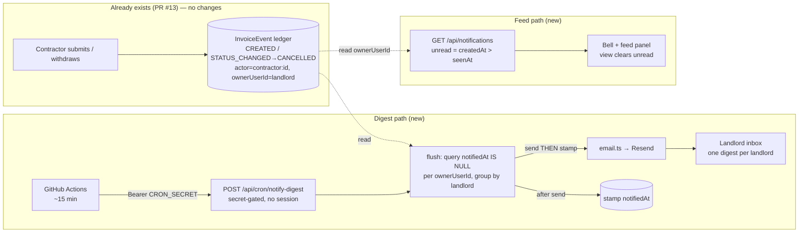

# feat: Contractor Notifications

## Summary

Notify the landlord when a contractor acts, instead of making them watch the review queue. v1 is **landlord-facing only**: a scheduled flush sweeps un-notified contractor events out of the existing InvoiceEvent ledger and sends the landlord **one digest email** (new submissions + withdrawals), and an **in-app notification feed** surfaces all recent contractor activity (including edits) with an unread count that clears on view. Because the events are already in the ledger (written by PR #13), this is a **read + a "notified" marker + a flush** — no new write-path instrumentation. The trigger is a **free external scheduler** (a GitHub Actions scheduled workflow) hitting a `CRON_SECRET`-secured endpoint every ~15 min, so the app stays on Vercel's free Hobby plan. Email goes through **Resend** behind the established mockable integration seam.

---

## Problem Frame

The contractor portal is in-app only: the landlord learns of a submission by happening to look at the SUBMITTED queue, and a withdrawal silently mutates the queue. Nothing pulls the landlord in when they're away. The asymmetry that scopes v1: the landlord is a logged-in `User` with a verified email (trivially reachable); the contractor has no session and only an unvalidated free-text `contact` (so contractor-facing notifications are deferred). Two facts from research reshape the brainstorm's assumptions:

1. **Vercel's free Cron is daily-only.** A 15-min `vercel.json` cron fails deployment on Hobby; 15-min needs Vercel Pro ($20/mo). Resolved (confirmed with user): a **free external scheduler** pings a secured endpoint instead — no `vercel.json` crons, Vercel stays free.
2. **Scheduled work is new ground for this repo.** There is no cron, background-job, or email precedent. Every existing route sits behind `requireAuth`; the flush endpoint needs a different gate (`CRON_SECRET`).

The load-bearing reuse: the Sheets export already implements the exact **send-then-stamp, at-least-once** shape this flush needs (`exportInvoices` + `stampSynced`), and the InvoiceEvent ledger already records every event with the `ownerUserId` read-scoping key and an index built for it.

---

## Requirements Trace

| Origin (req) | Summary | Units |
|---|---|---|
| R1 | Submit/withdraw events become notification-eligible | U1, U3 |
| R2 | Scheduled flush sends ONE digest per landlord with a queue link | U3, U4 |
| R3 | Each event emailed at most once (at-least-once acceptable) | U1, U3 |
| R4 | Edits do NOT email | U3 |
| R5 | Email isolated behind a mockable seam; provider failure never crashes/leaks, leaves events for retry | U2, U3 |
| R6 | In-app feed of recent contractor activity, newest first, links to invoice | U5, U6 |
| R7 | Unread count in the chrome; viewing clears it | U5, U6 |
| R8 | Per-landlord scoping (ownerUserId), no cross-owner leak | U3, U5 |
| R9 | No new event-capture — read the existing ledger | U1, U3 |

Acceptance examples AE1–AE5 are carried as test scenarios in the units noted under **Acceptance Examples → Tests**.

---

## Key Technical Decisions

### KTD-1 — The "notified" marker is a nullable column on InvoiceEvent

Add `notifiedAt DateTime?` to `InvoiceEvent` — null = un-notified, set = digested. This mirrors `Invoice.sheetsSyncedAt` (DEC-021), reuses the existing `@@index([ownerUserId, createdAt])` access path, and keeps the marker out of the `detail` JSON. **Not** a new `EventType` and **not** a new table (v1 is single-recipient — the landlord — so a table earns nothing), and **not** a ledger event on send (R9: no new event-capture; the stamp is a quiet `updateMany`, exactly like `stampSynced`). The `invoiceId` column stays non-FK — do not add a relation (preserves the no-cascade ledger invariant). (see origin: R9; Outstanding Questions — notified marker.)

### KTD-2 — In-app read-state is a separate per-landlord timestamp

The feed's unread state is distinct from email-notified (an event can be emailed-but-unread, or unread-but-never-email-eligible). Use a single `User.notificationsSeenAt DateTime?`: unread = the landlord's contractor events with `createdAt > notificationsSeenAt`; viewing the feed sets it to now. Lightest model, mirrors the single-timestamp `sheetsSyncedAt` style. (see origin: Outstanding Questions — feed read-state.)

### KTD-3 — Email via Resend, behind a new mockable integration module

A new `apps/api/src/integrations/email.ts` following CONV-016 to the letter (copy `sheets.ts` as the skeleton): a narrow exported `sendEmail({ to, subject, html })`; a `sanitize(err)` step mapping every provider error to a safe `AppError` (the module carries an API key — a raw SDK error must never reach the central `errorHandler`'s log); env config that throws `EMAIL_NOT_CONFIGURED` (503) when `RESEND_API_KEY` is unset; in-module retry/backoff for 429/5xx (mirror `sheets.ts`); `vi.mock`'d in tests (no live calls = DoD). **Resend** chosen: permanent free tier (3k/mo, 100/day), and `onboarding@resend.dev` sends real email with **zero DNS** for dev/staging — production adds 3 DNS records (SPF + 2 DKIM CNAME). Cost stays $0 within free-tier volume. (see origin: Key Decisions — email behind the integration seam; Dependencies — free-tier provider.) Sources: Resend pricing/quotas docs.

### KTD-4 — The flush is send-then-stamp, per-landlord, at-least-once

Lift the `exportInvoices` structure (DEC-021): query the un-notified eligible events scoped by `ownerUserId`, group by landlord, build each landlord's digest, **send the email, then stamp those events `notifiedAt`** — a death between the two re-sends next run (R3/R5 accept a duplicate digest over a dropped one). **Each landlord's send is its own commit boundary**; one landlord's provider failure leaves their events un-notified and does **not** crash the job or block other landlords (AE4). Skip landlords with zero eligible events (no empty digests). (see origin: R2, R3, R5; AE1, AE4.)

### KTD-5 — Eligible events: contractor-authored CREATED + withdrawal only

Email triggers are read from the ledger as: `type = CREATED` with a `contractor:`-prefixed `actorId` (a submission), and `type = STATUS_CHANGED` with `detail.to === 'CANCELLED'` **and** a `contractor:` actor (a withdrawal — there is no dedicated withdrawal event type, so both conditions are required to distinguish it from a landlord cancel). Landlord-authored events (approve/reject/pay) are **excluded** — the landlord is never notified about their own actions. `FIELD_EDITED` is excluded from email (R4) but included in the in-app feed (R6). Reuse the `contractor:<id>` → name resolution from `listInvoiceEvents`, scoped `where: { id: { in }, landlordId }` so a contractor name never leaks across owners. (see origin: R4, R8.)

### KTD-6 — The flush endpoint is gated by CRON_SECRET, not a session

A new public route (e.g. `POST /api/cron/notify-digest`) that is **not** behind `requireAuth`. It verifies `Authorization === "Bearer ${CRON_SECRET}"` and 401s otherwise; if `CRON_SECRET` is unset it fails closed (does not run open). The flush is idempotent — a double-fire (the scheduler/Vercel may invoke twice) finds fewer/no un-notified events, and the send-then-stamp marker prevents re-sending already-stamped events. (see origin: Outstanding Questions — securing the cron endpoint.) Source: Vercel cron-secret docs (same Bearer pattern an external scheduler uses).

### KTD-7 — Trigger via a free external scheduler (GitHub Actions), not Vercel Cron

Confirmed with user. A GitHub Actions scheduled workflow (`schedule: cron '*/15 * * * *'`) curls the production endpoint with the `CRON_SECRET` (stored as a GitHub Actions secret). $0 and ~15-min responsive, and keeps Vercel on the free Hobby plan (no `vercel.json` crons). Trade-offs to document: GitHub scheduled workflows are best-effort (can be delayed under load) and are auto-disabled after ~60 days of repo inactivity; cron-job.org is a viable alternative if those bite. The endpoint is scheduler-agnostic, so swapping the trigger later changes no app code. (see origin: Dependencies — Vercel Cron.)

---

## High-Level Technical Design

### Notification flow



### At-least-once boundary (per landlord)

```text
for each landlord with un-notified eligible events:
  digest = build(events)              # contractor names resolved, scoped to landlord
  sendEmail(landlord.email, digest)   # may throw → events stay un-notified, continue to next landlord
  stamp notifiedAt on those events    # only after a successful send (death here → re-send next run)
# never email a landlord about their own (non-contractor) events; never cross-scope
```

Directional guidance, not implementation specification.

---

## Implementation Units

### U1. Schema markers + migration + env

**Goal:** Add the `InvoiceEvent.notifiedAt` and `User.notificationsSeenAt` nullable columns, the migration, and the new env vars.
**Requirements:** R1, R3, R9; KTD-1, KTD-2.
**Dependencies:** none.
**Files:**
- `apps/api/prisma/schema.prisma` (`InvoiceEvent.notifiedAt DateTime?` — no FK/relation change; `User.notificationsSeenAt DateTime?`)
- `apps/api/prisma/migrations/<ts>_notification_markers/migration.sql` (generated via `db:migrate`)
- `.env.example` (`RESEND_API_KEY`, `EMAIL_FROM`, `CRON_SECRET` — CONV-010)
- Test: `apps/api/test/notifications.schema.test.ts`

**Approach:** Both columns are additive + nullable (backward-compatible — the currently-deployed code keeps working during the deploy window). Keep `InvoiceEvent.invoiceId` non-FK (no `@relation`) so the no-cascade ledger invariant holds. Follow the CONV-002 field-add checklist. Per `docs/DEPLOYMENT.md`, the migration runs via `db:deploy` against the direct (non-pooled) connection **before** merging dependent code — it must not run in the Vercel build.
**Patterns to follow:** `Invoice.sheetsSyncedAt` (the marker precedent); existing migration workflow (`apps/api/package.json` `db:migrate`/`db:deploy`).
**Test scenarios:**
- An `InvoiceEvent` row persists with `notifiedAt = null` and can be stamped to a timestamp; a `User` reads back `notificationsSeenAt = null` by default.
- Smoke: `prisma generate` produces a client with both fields; `npm run typecheck` green.
**Verification:** migration applies; typecheck green; schema test passes.

### U2. Email integration module (Resend, mockable seam)

**Goal:** A thin, mockable, error-sanitizing email sender mirroring the storage/Sheets seam.
**Requirements:** R5; KTD-3.
**Dependencies:** U1.
**Files:**
- `apps/api/src/integrations/email.ts` (new)
- `apps/api/package.json` (`resend` dependency)
- Test: `apps/api/test/integrations/email.test.ts`

**Approach:** Export a narrow `sendEmail({ to, subject, html })`. Read `RESEND_API_KEY` (+ `EMAIL_FROM`) from env, throwing `AppError('EMAIL_NOT_CONFIGURED', …, 503)` when unset (distinguish unset from malformed, like `readWriteToken`/`loadCredentials`). Wrap the Resend call; `sanitize(err)` maps any provider error to `AppError('EMAIL_ERROR', …, 502)` — never let a raw SDK error (which may embed the API key) propagate. In-module retry/backoff for 429/5xx with jitter, base delay read from env so tests shrink it. The module makes the only live call; everything above it is mocked in tests.
**Patterns to follow:** `apps/api/src/integrations/sheets.ts` (retry/backoff, `sanitize`, `*_NOT_CONFIGURED` 503, env config) — copy as the skeleton; `apps/api/test/integrations/sheets.test.ts` for the mock shape.
**Execution note:** Start with a failing test for the not-configured (503) and provider-error-sanitized (502, no key leak) contracts.
**Test scenarios:**
- Covers AE4. `RESEND_API_KEY` unset → `sendEmail` throws `EMAIL_NOT_CONFIGURED` (503), no network attempt.
- A provider error is mapped to a safe `AppError` — the thrown error/message contains no API key or raw provider payload.
- A 429/5xx is retried per the backoff policy; a permanent failure surfaces the sanitized error.
- Happy path: a well-formed send resolves (Resend SDK mocked).
**Verification:** email tests pass with the SDK mocked (no live calls); lint/typecheck green.

### U3. Digest flush service (query + group + send-then-stamp)

**Goal:** The core landlord-digest logic: read un-notified eligible events, group per landlord, send, then stamp.
**Requirements:** R1, R2, R3, R4, R5, R8, R9; KTD-4, KTD-5.
**Dependencies:** U1, U2.
**Files:**
- `apps/api/src/notifications/digest.ts` (new — the flush service)
- Test: `apps/api/test/notifications.digest.test.ts`

**Approach:** Query `InvoiceEvent` where `notifiedAt IS NULL` AND eligible (KTD-5: `CREATED` with contractor actor, or `STATUS_CHANGED` with `detail.to === 'CANCELLED'` and contractor actor), ordered by `ownerUserId, createdAt`. Group by `ownerUserId` (the landlord). For each landlord: resolve contractor names (reuse the `listInvoiceEvents` resolver, scoped by `landlordId`), build a digest (counts + per-event lines + a link to `/invoices?status=SUBMITTED`), look up the landlord's email, `sendEmail(...)`, then `updateMany({ where: { id: { in }, notifiedAt: null }, data: { notifiedAt: now } })`. Wrap each landlord in try/catch so one failure leaves that landlord's events un-notified and continues. Return a summary `{ landlords, events, sent, failed }`. No transaction/ledger event on stamp (R9 — a plain `updateMany`, like `stampSynced`).
**Patterns to follow:** `exportInvoices` (`apps/api/src/invoices/handlers.ts`) + `stampSynced` (`writeService.ts`) — the send-then-stamp, per-chunk-commit, at-least-once shape; `listInvoiceEvents` actor-name resolution (the `contractor:` scoped lookup).
**Execution note:** Start with a failing integration test for the send-then-stamp contract (events stamped only after a successful send).
**Test scenarios:**
- Covers AE1. Given 2 contractor submissions + 1 withdrawal un-notified for a landlord, the flush sends exactly one digest naming 3 events, then those events are `notifiedAt`-stamped; a second flush with no new events sends nothing.
- Covers AE2 / R4. A `FIELD_EDITED` (edit) event is NOT included in the digest and is NOT stamped (it was never email-eligible).
- Landlord-authored events (a landlord approve/reject `STATUS_CHANGED`) are excluded — the landlord is not emailed about their own action.
- Covers AE4. The email send throws for one landlord → that landlord's events stay `notifiedAt = null` (re-eligible next run), the job does not crash, and a second landlord's digest still sends (per-landlord boundary).
- At-least-once: send succeeds but the stamp is simulated to fail → the next run re-sends (events still un-notified). [mirror the export test's "stamp fails after append" case]
- Covers AE5 / R8. Two landlords each with their own contractor events → each digest contains only that landlord's events (scoped by `ownerUserId`); run as throwaway `createSecondUser`s.
**Verification:** digest tests pass with `email.ts` mocked; per-landlord isolation + at-least-once asserted; green.

### U4. Secured cron endpoint + external scheduler config

**Goal:** A `CRON_SECRET`-gated public endpoint that runs the flush, plus the GitHub Actions schedule that calls it.
**Requirements:** R2; KTD-6, KTD-7.
**Dependencies:** U3.
**Files:**
- `apps/api/src/notifications/routes.ts` (new public plugin — `POST /api/cron/notify-digest`, NO `requireAuth`)
- `apps/api/src/app.ts` (register the plugin)
- `.github/workflows/notify-digest.yml` (new — scheduled `*/15` curl of the prod endpoint with the secret)
- `docs/DEPLOYMENT.md` (document the `CRON_SECRET` + `RESEND_API_KEY`/`EMAIL_FROM` env vars and the GitHub secret)
- Test: `apps/api/test/notifications.cron.test.ts`

**Approach:** The route handler verifies `request.headers.authorization === "Bearer " + process.env.CRON_SECRET` and `CRON_SECRET` is set, else 401 (fail closed). On success it calls the U3 flush and returns the summary. It is **not** behind `requireAuth` and is the only public-but-secret-gated route. The GitHub Actions workflow runs on `schedule` and `workflow_dispatch` (manual test), curling `https://<prod>/api/cron/notify-digest` with `Authorization: Bearer ${{ secrets.CRON_SECRET }}`; note the best-effort timing + 60-day-inactivity caveat and the cron-job.org alternative in the workflow comments + DEPLOYMENT.md.
**Patterns to follow:** the public-plugin registration shape from `apps/api/src/submissions/routes.ts` (a route plugin with no `requireAuth`); `AppError` for the 401.
**Test scenarios:**
- Covers AE4-adjacent. No/empty `Authorization` → 401, flush not invoked.
- Wrong bearer value → 401.
- `CRON_SECRET` unset in env → 401 (fail closed, never runs open).
- Correct `Bearer ${CRON_SECRET}` → 200 with the flush summary; the flush ran (events stamped) — assert with the email module mocked.
- Idempotency: two sequential authorized calls → the second finds no un-notified events and sends nothing.
**Verification:** cron-auth + idempotency tests pass; the workflow yml is valid; lint/typecheck green.

### U5. In-app feed API + unread count + mark-seen

**Goal:** Authenticated landlord endpoints for the notification feed and unread state.
**Requirements:** R6, R7, R8; KTD-2, KTD-5.
**Dependencies:** U1.
**Files:**
- `apps/api/src/notifications/feed.ts` (handlers) + add routes to `apps/api/src/notifications/routes.ts` (authed sub-routes)
- `packages/shared/src/schemas/notification.ts` (feed item + response Zod) + re-export from `index.ts`
- Test: `apps/api/test/notifications.feed.test.ts`, `packages/shared/test/notification.test.ts`

**Approach:** `GET /api/notifications` (authed): the landlord's contractor-authored events (`CREATED`, withdrawal `STATUS_CHANGED`, `FIELD_EDITED`) scoped `where: { ownerUserId: request.user.id, actorId: { startsWith: 'contractor:' } }`, newest first, resolved to `{ id, type, contractorName, invoiceId, summary, createdAt, unread }` where `unread = createdAt > notificationsSeenAt`. The response also carries an `unreadCount`. `POST /api/notifications/seen` sets `User.notificationsSeenAt = now` (clears unread). These are behind `requireAuth`, scoped per DEC-019.
**Patterns to follow:** `listInvoiceEvents` (the `ownerUserId` scope + `contractor:` name resolution); the shared-schema + `index.ts` re-export convention.
**Test scenarios:**
- Covers AE5 / R8. Landlord A's feed returns only A's contractor events; a second landlord's events never appear (throwaway `createSecondUser`).
- The feed includes edits (`FIELD_EDITED`) — which the email path excludes — confirming the two surfaces diverge correctly.
- Unread count reflects events newer than `notificationsSeenAt`; after `POST /seen`, the unread count is 0 and `unread` is false on all items.
- A landlord-authored event (approve) does NOT appear in the feed (contractor-actor filter).
**Verification:** feed + unread + scoping tests pass; shared schema test passes; green.

### U6. In-app feed UI (bell + panel)

**Goal:** A notifications panel in the app chrome with an unread badge that clears on view.
**Requirements:** R6, R7; KTD-2.
**Dependencies:** U5.
**Files:**
- `apps/web/src/components/NotificationsBell.tsx` (new — bell icon + unread badge + dropdown/panel)
- `apps/web/src/hooks/useNotifications.ts` (new — feed query + mark-seen mutation)
- `apps/web/src/components/AppShell.tsx` (mount the bell in the chrome) and/or `Sidebar.tsx`
- Test: `apps/web/test/NotificationsBell.test.tsx`

**Approach:** A bell in the top chrome shows the unread count (from `GET /api/notifications`). Opening the panel lists recent contractor activity (newest first, each linking to the invoice) and fires `POST /api/notifications/seen` to clear unread; the badge updates via query invalidation. Empty state: "No contractor activity yet." Lightweight — a dropdown panel, not a full page. Poll/refetch on navigation (TanStack Query), no push needed.
**Patterns to follow:** the existing query/mutation hook shape (`useInvoice.ts` invalidation); `StatusCounts`/chrome components for the badge styling; the Dashboard empty-state pattern.
**Test scenarios:**
- Renders the unread count from the feed; opening the panel lists items and calls mark-seen (badge clears).
- Empty state renders when there's no activity.
- A REJECTED/edit/submit item renders its summary + links to the invoice.
**Verification:** RTL tests pass (hooks mocked per the Dashboard.test pattern); lint/typecheck/test green.

---

## Acceptance Examples → Tests

| AE | Asserted in |
|---|---|
| AE1 — one digest summarizing N events; empty second run sends nothing | U3 |
| AE2 — an edit sends no email (but shows in-app) | U3, U5 |
| AE3 — opening the feed clears unread | U5, U6 |
| AE4 — provider error: job survives, no leak, events stay eligible | U2, U3 |
| AE5 — per-landlord isolation (each sees only their own) | U3, U5 |

---

## Scope Boundaries

### Deferred to Follow-Up Work
- Back-port the email/cron decisions and reconcile **DEC-022** (the integration-seam decision, referenced but never written into `docs/DECISIONS.md`) via `/ce-compound` after this ships.
- A CI gate enforcing `db:deploy`-before-promotion (noted as a recommended-but-unbuilt follow-up in `DEPLOYMENT.md`).

### Deferred for later (from origin)
- Contractor-facing notifications (email/SMS to the contractor on approve/reject/pay) — blocked on upgrading the `contact` field to a validated channel.
- A landlord email on/off preference + the broader Settings surface.
- Per-event immediate email and configurable digest cadence.
- Emailing on contractor edits.

### Outside this product's identity (from origin)
- SMS notifications — recurring per-message cost, no free tier; conflicts with the cost-averse stance.
- A general notification/subscription framework — this is a focused landlord digest, not a platform.

---

## Risks & Dependencies

- **R-1 — Cron endpoint is a new unauthenticated surface.** It runs the flush for *all* landlords with no session. *Mitigation:* `CRON_SECRET` bearer check that fails closed when the secret is unset (KTD-6); it performs no destructive action (sends email + stamps `notifiedAt`); a test asserts 401 on missing/wrong/unset secret.
- **R-2 — Provider/env not configured in production.** Without `RESEND_API_KEY`/`EMAIL_FROM`/`CRON_SECRET` set in Vercel, the flush 503s/401s. *Mitigation:* the env vars are documented in `.env.example` + `DEPLOYMENT.md`; the email module distinguishes unset (503) cleanly; the digest is non-critical (the in-app feed still works).
- **R-3 — At-least-once means a rare duplicate digest.** A death between send and stamp, or two concurrent scheduler fires, can re-send. *Mitigation:* accepted by design (R3 — a duplicate beats a drop); the `updateMany where notifiedAt IS NULL` stamp narrows the window; concurrency is unlikely at ~15-min cadence on a fast job. Noted, not engineered around in v1.
- **R-4 — GitHub Actions schedule is best-effort.** Runs can be delayed under load and are auto-disabled after ~60 days of repo inactivity. *Mitigation:* the endpoint is scheduler-agnostic (KTD-7); cron-job.org is a documented drop-in alternative; the digest is non-urgent.
- **R-5 — Migration/deploy ordering.** The new columns must exist in the hosted DB before the code that reads them deploys. *Mitigation:* run `db:deploy` (direct connection) before merging, with backward-compatible nullable columns (U1), per `DEPLOYMENT.md`.
- **Dependency — `resend`** (new, free tier) behind the mockable seam; **GitHub Actions** (free) as the scheduler. No paid dependency in v1 (within free-tier limits); production email needs a verified sending domain (3 DNS records) — config, not cost.

---

## System-Wide Impact

- **The landlord** gains a digest email + an in-app bell/feed; no change to the contractor experience (contractor-facing notifications are deferred).
- **New surfaces:** the first scheduled/background work in the repo (the cron endpoint + an external scheduler) and the first outbound-email integration. Both are isolated (a secret-gated route; a mockable module).
- **Shared contracts:** two additive nullable columns (`InvoiceEvent.notifiedAt`, `User.notificationsSeenAt`) — backward-compatible. A new notification feed shape in `packages/shared`.
- **Preserved invariants:** ownership scoping on `ownerUserId` (DEC-019), the no-cascade ledger (`invoiceId` stays non-FK), the integration seam (CONV-016), Postgres source of truth (DEC-001), and "no new event-capture" (the marker is a quiet stamp, not a ledger event).

---

## Deferred to Implementation

- The exact digest email copy/layout and the precise link target (`/invoices?status=SUBMITTED` vs per-invoice deep links).
- The Resend retry/backoff constants (start from the `sheets.ts` values; tune to Resend's documented rate limits).
- Where exactly the bell mounts in the chrome (AppShell header vs Sidebar) and the panel's exact interaction (dropdown vs slide-over).
- Whether the feed query returns a fixed recent window (e.g., last 50) or paginates — start with a capped recent window.

---

## Sources & Research

- **Origin requirements:** `docs/brainstorms/2026-06-25-contractor-notifications-requirements.md`.
- **Local patterns (first-hand + learnings):** the Sheets export send-then-stamp/at-least-once shape (`apps/api/src/invoices/handlers.ts` `exportInvoices`, `writeService.ts` `stampSynced`, DEC-021); the integration seam (CONV-016, `integrations/sheets.ts`/`storage.ts`); the InvoiceEvent ledger + `[ownerUserId, createdAt]` index + `contractor:` actor resolution (`listInvoiceEvents`); the `sheetsSyncedAt` marker precedent; ownership no-leak (DEC-019); the migration/deploy workflow (`docs/DEPLOYMENT.md`); `createSecondUser` test isolation.
- **External (load-bearing on KTD-3/KTD-6/KTD-7 + Risks):** Resend free tier (3k/mo, 100/day, `onboarding@resend.dev` zero-DNS sending, SPF+DKIM for production) — Resend pricing/quotas docs; Vercel Cron is **daily-only on the free Hobby plan** (15-min fails deploy; Pro = 1-min) and the `CRON_SECRET` `Authorization: Bearer` verification pattern — Vercel cron-jobs docs; the free external-scheduler alternative (GitHub Actions `schedule`, cron-job.org) and its best-effort/inactivity caveats.
