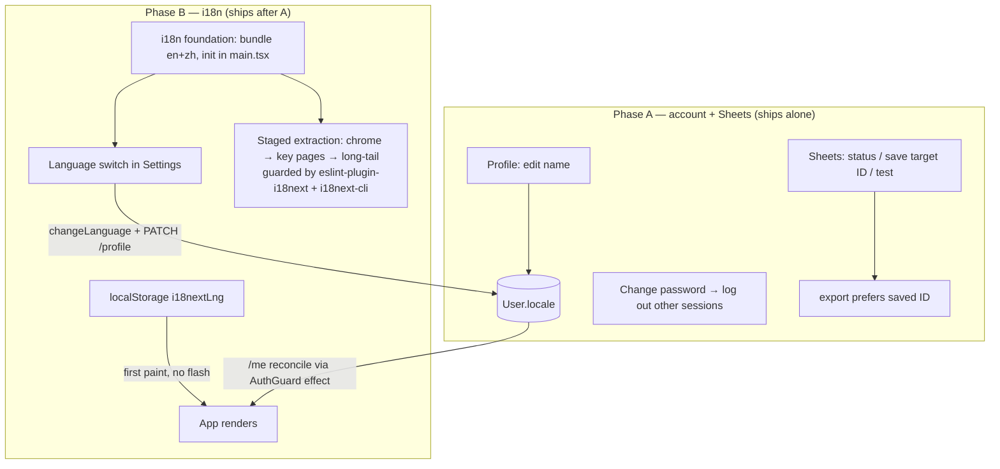

# feat: Settings Page

## Summary

Fill the disabled "Settings" nav stub with a real landlord settings page, in two independently-shippable phases. **Phase A (account + Sheets)** is bounded: edit display name (email read-only), change password (verify current → set new, logging out all other sessions), and a Sheets-connection panel that surfaces what is env-only today — connection status, a settable/persisted target spreadsheet ID (the export prefers it over the env default), the service-account email to share with, and a "test connection" action. **Phase B (i18n)** is cross-cutting: an English/Chinese language switch backed by `react-i18next` with both locales bundled, a server-persisted `User.locale` (mirrored to localStorage so first paint never flashes), and a **staged** page-by-page string extraction across the landlord app. The public contractor page and emails stay English. No new paid dependencies — the Sheets panel reuses the shared service account (not per-user OAuth) and i18n uses free MIT libraries.

---

## Problem Frame

The single landlord has no self-serve account management: there is no change-password or profile endpoint (only login/logout/me), the Google Sheets target + credentials are entirely server-env and invisible (the export even accepts a `spreadsheetId` override that is never surfaced), and the UI is English-only with hardcoded strings. The four areas differ sharply in weight, which is why the plan **phases** them: profile/password/Sheets are standard additions over the existing auth + integration-seam patterns (and over the just-shipped nav-stub→live-route pattern from the Contractors page); **i18n touches every component that renders text**, so it ships as its own phase and its string extraction is staged so it never gates the quick account wins. Cost-aversion shaped two choices: the Sheets panel surfaces the existing **shared service account** rather than building per-user OAuth, and i18n uses free libraries, not a paid translation service.

---

## Requirements Trace

| Origin (req) | Summary | Units |
|---|---|---|
| R1 | View account; edit display name; email read-only | U1, U4 |
| R2 | Change password (verify current, strength rule, reject wrong current) | U2, U4 |
| R3 | A successful password change logs out other sessions | U2 |
| R4 | Sheets connection status (configured? can the SA reach the sheet?) | U3, U4 |
| R5 | Set/persist a target spreadsheet ID; export prefers it over env | U3 |
| R6 | Display the service-account email to share with | U3, U4 |
| R7 | "Test connection" action with a clear, non-leaking result | U3, U4 |
| R8 | Switch app language EN/ZH; persisted preference | U5, U6 |
| R9 | Language covers landlord app surfaces; contractor page + emails stay English | U6, U7 |
| R10 | Settings scoped to session user; no secret (SA key, pw hash) returned | U1, U2, U3 |

Acceptance examples AE1–AE5 are carried as test scenarios in the units noted under **Acceptance Examples → Tests**.

---

## Key Technical Decisions

### KTD-1 — A `/api/settings/*` module, mirroring the contractors module

New `apps/api/src/settings/` route plugin (authed, `requireAuth`), with `PATCH /profile` (name; later locale), `POST /password`, `GET /sheets` (status), `PATCH /sheets` (save spreadsheetId), `POST /sheets/test`. `GET /api/auth/me` is extended to also return the fields the settings UI needs (it already returns id/email/name/role). All routes are session-scoped; no response ever includes the service-account key or a password hash (R10, DEC-019). (see origin: R10.)

### KTD-2 — Change password: verify current, then invalidate other sessions

Require the current password and verify it with `verifyPassword` (argon2id) before hashing the new one with `hashPassword`; reject a wrong current password (401) without leaking whether the account exists (the session already identifies the user, so this is not an enumeration surface, but keep the error generic). Enforce the **existing** password strength rule from the shared auth schema. On success, delete **all of the user's sessions except the current one** (`deleteMany where userId AND id != currentSessionId`) — a password change means "secure my account." Rate-limit the endpoint (mirror the login limiter). (see origin: R2, R3; AE1.)

### KTD-3 — Sheets panel surfaces the shared service account; persisted target ID; dry-run test

Add `User.sheetSpreadsheetId String?`. The export's target resolution becomes `body.spreadsheetId ?? user.sheetSpreadsheetId ?? process.env.GOOGLE_SHEET_ID` (saved ID preferred over the env default; R5). Two new thin functions in the integration seam (`integrations/sheets.ts`, CONV-016): `serviceAccountEmail()` returns `loadCredentials().client_email` (a **non-secret** address — safe to surface; the `private_key` is never returned), and `checkAccess(spreadsheetId)` does a **metadata read** (`spreadsheets.get`, not an append) and maps a permission failure to the existing "share the sheet with `<email>` as Editor" `AppError` — never a raw provider error (R7). The status endpoint reports `{ configured, serviceAccountEmail, targetSpreadsheetId, reachable }`. **No per-user OAuth.** (see origin: R4–R7; Key Decisions — surface the existing config.)

### KTD-4 — i18n: react-i18next, both locales bundled, single namespace

Use `i18next` + `react-i18next` (MIT, $0) — the de-facto 2026 choice with the tooling this plan needs; lighter libs (Lingui/Paraglide) optimize for things a 2-language SPA doesn't need. **Bundle both `en` and `zh`** (no http-backend) so react-i18next bypasses Suspense entirely — no first-paint flash — with a single `translation` namespace per locale. Locale code **`'zh'`** (Simplified) with `load: 'languageOnly'` (collapses `zh-CN`/`zh-Hans`). Init module imported once at the top of `main.tsx`; `useTranslation()`/`<Trans>` work globally (no provider-placement concern with the React Router 7 data router). (see origin: R8, R9.) Sources: react-i18next / i18next docs (2026).

### KTD-5 — `User.locale` is the source of truth, mirrored to localStorage

Add `User.locale String @default("en")`, returned on `/api/auth/me` and settable via `PATCH /api/settings/profile`. The flash-free reconcile: `i18next-browser-languagedetector` reads `localStorage['i18nextLng']` synchronously for first paint (bundled resources → no async wait); after `useMe()` resolves, an effect near `AuthGuard` calls `i18n.changeLanguage(me.locale)` if it differs (the detector caches back to localStorage); a user toggle calls `changeLanguage` **and** `PATCH /profile { locale }` so the server stays authoritative across devices. (see origin: Outstanding Questions — locale persistence + first-paint flash.)

### KTD-6 — Localize `Intl` by active locale, keep currency USD; add a CJK font fallback

`apps/web/src/lib/format.ts` currently builds `Intl.NumberFormat('en-US', …)` at module load and hardcodes `'en-US'` dates. Change both to read `i18n.language` at call time: money uses `Intl.NumberFormat(i18n.language, { style: 'currency', currency: 'USD' })` (USD stays USD; `zh` renders `US$1,234.56`), dates use `toLocaleDateString(i18n.language, …)` (keep `timeZone: 'UTC'`). `STATUS_LABEL`/`SYNC_LABEL` become `t()` lookups. The bundled `@fontsource/public-sans` has **no CJK glyphs**, so add a system CJK fallback to the font stack (`"PingFang SC", "Microsoft YaHei", "Noto Sans SC", sans-serif`) and drive `<html lang>` from the active locale. (see origin: R8.)

### KTD-7 — Staged string extraction, gated by lint + type-gen

The extraction is **breadth, not depth** — mechanical per-file `Hardcoded` → `{t('key')}` with the key added to `en`/`zh` JSON; translated and untranslated strings coexist, so it migrates page-by-page (shared chrome first — Sidebar/AppShell/AuthGuard — then high-traffic pages, then long-tail). Two free guardrails make "missed a string" and "typo'd a key" into build failures: **`eslint-plugin-i18next`** (flat-recommended, enabled per-directory so it doesn't fail the whole repo on day one) flags literal JSX text not wrapped in `t()`; **`i18next-cli`** (the maintained successor to the deprecated `i18next-parser`) extracts keys + generates TS types so a bad key is a compile error. Full coverage may land across more than one pass — the foundation (U5/U6) is what makes the switch *work*; U7 is the staged coverage. (see origin: Key Decisions — language is phased.)

---

## High-Level Technical Design

### Phasing + the i18n locale resolution



### First-paint reconcile (flash-free)

```text
1. main.tsx imports ./lib/i18n  → detector reads localStorage['i18nextLng'] synchronously
2. resources bundled            → no async load, no Suspense, first paint in last-known language
3. useMe() resolves             → effect: if me.locale !== i18n.language → changeLanguage(me.locale)
4. user toggles language        → changeLanguage(next)  AND  PATCH /api/settings/profile { locale }
```

Directional guidance, not implementation specification.

---

## Implementation Units

### Phase A — Account + Sheets

#### U1. Profile API + extend /me

**Goal:** A session-scoped profile read/update — edit display name; email read-only — and extend `/me` for the settings UI.
**Requirements:** R1, R10; KTD-1.
**Dependencies:** none.
**Files:**
- `apps/api/src/settings/routes.ts` (new authed plugin) + `apps/api/src/settings/handlers.ts`
- `apps/api/src/app.ts` (register the plugin)
- `apps/api/src/auth/routes.ts` (extend the `/me` response if needed — it already returns id/email/name/role)
- `packages/shared/src/schemas/settings.ts` (`UpdateProfileSchema { name }`) + re-export from `index.ts`
- Test: `apps/api/test/settings.profile.test.ts`, `packages/shared/test/settings.test.ts`

**Approach:** `PATCH /api/settings/profile` accepts `{ name }` (trimmed, bounded), updates the session user, returns the updated account (name, email, role) — never the password hash. Email is not accepted (read-only). All scoped to `request.user.id`.
**Patterns to follow:** the contractors route plugin (`apps/api/src/contractors/routes.ts`) for the authed-plugin shape; the `/me` handler; shared-schema + `index.ts` convention.
**Test scenarios:**
- Covers AE2. Editing the name persists and the response reflects it; a second user's name is untouched (scoping).
- The email field is ignored/rejected if sent; the response never contains `passwordHash`.
- Empty/over-long name → 400.
**Verification:** profile tests pass; no secret in the response; lint/typecheck green.

#### U2. Change-password API

**Goal:** Verify current password, set a new one, and log out all other sessions.
**Requirements:** R2, R3, R10; KTD-2.
**Dependencies:** U1.
**Files:**
- `apps/api/src/settings/handlers.ts` (add `changePassword`) + `routes.ts` (`POST /api/settings/password`, rate-limited)
- `packages/shared/src/schemas/settings.ts` (`ChangePasswordSchema { currentPassword, newPassword }` reusing the existing password rule)
- Test: `apps/api/test/settings.password.test.ts`

**Approach:** Verify `currentPassword` with `verifyPassword` against the session user's hash; on mismatch → 401 (generic message). Hash `newPassword` (enforce the existing min-length) and update. Then `deleteMany` the user's sessions where `id != <current session id>` (keep the current cookie valid). Rate-limit like the login route.
**Patterns to follow:** `apps/api/src/auth/password.ts` (verify/hash); `apps/api/src/auth/session.ts` (`invalidateSession`/session rows); the login rate-limit block (`apps/api/src/auth/routes.ts`).
**Execution note:** Start with a failing test for the verify-current-password and other-sessions-invalidated contracts.
**Test scenarios:**
- Covers AE1. Correct current password → 200; a second session for the same user is invalidated (its cookie no longer authenticates) while the current one still works.
- Wrong current password → 401, password unchanged, no session touched.
- A new password failing the strength rule → 400.
- Rate limit: exceeding the threshold → 429.
**Verification:** password tests pass; other-session invalidation asserted (the current session survives); green.

#### U3. Sheets settings API (status / save target ID / test) + export prefers saved ID

**Goal:** Surface the Sheets connection, persist a per-landlord target spreadsheet ID, and a dry-run test — all without leaking the key.
**Requirements:** R4, R5, R6, R7, R10; KTD-3.
**Dependencies:** U1.
**Files:**
- `apps/api/prisma/schema.prisma` (`User.sheetSpreadsheetId String?`) + `apps/api/prisma/migrations/<ts>_user_sheet_id/migration.sql`
- `apps/api/src/integrations/sheets.ts` (`serviceAccountEmail()`, `checkAccess(spreadsheetId)`)
- `apps/api/src/settings/handlers.ts` (sheets status/save/test) + `routes.ts`
- `apps/api/src/invoices/handlers.ts` (`exportInvoices`: prefer `user.sheetSpreadsheetId` over the env default)
- `packages/shared/src/schemas/settings.ts` (`SaveSheetSchema { spreadsheetId }`)
- Test: `apps/api/test/settings.sheets.test.ts`, additions to the export test

**Approach:** `serviceAccountEmail()` returns `loadCredentials().client_email` (non-secret). `checkAccess(id)` does `spreadsheets.get` (metadata only, no append) and reuses the existing share-as-Editor `AppError` on a permission failure. `GET /api/settings/sheets` → `{ configured, serviceAccountEmail, targetSpreadsheetId, reachable }` (reachable computed via `checkAccess` on the effective target). `PATCH /api/settings/sheets` saves `sheetSpreadsheetId`. `POST /api/settings/sheets/test` runs `checkAccess` and returns success or the clear error. Export resolution: `body.spreadsheetId ?? user.sheetSpreadsheetId ?? GOOGLE_SHEET_ID`. Mock the sheets module in tests (no live calls).
**Patterns to follow:** `integrations/sheets.ts` (`loadCredentials`, `sanitize`, the share-as-Editor error); `integrations/sheets.test.ts` mock shape; the export resolution line in `exportInvoices`.
**Test scenarios:**
- Covers AE3. A saved target the SA can't reach → `test` returns the "share with `<serviceAccountEmail>` as Editor" message, not a raw provider error.
- Covers AE5. No status/test/save response ever includes the `private_key` / raw credentials.
- Saving a spreadsheet ID makes the export target it (over the env default); unset falls back to env.
- Status reports `configured: false` cleanly when `GOOGLE_SERVICE_ACCOUNT_KEY` is unset (503-style, not a crash).
**Verification:** sheets-settings + export-resolution tests pass with the module mocked; no key leak; green.

#### U4. Settings page UI (shell + nav live + the three panels)

**Goal:** The landlord-facing Settings page with Profile, Security (password), and Sheets panels; the nav stub goes live.
**Requirements:** R1, R2, R4, R6, R7; KTD-1, KTD-3.
**Dependencies:** U1, U2, U3.
**Files:**
- `apps/web/src/pages/Settings.tsx` (new — sectioned page)
- `apps/web/src/hooks/useSettings.ts` (new — profile/password/sheets queries + mutations)
- `apps/web/src/components/NavLinks.tsx` (Settings stub → live `/settings`); `apps/web/src/main.tsx` (authed child route)
- Test: `apps/web/test/Settings.test.tsx`, update `apps/web/test/Sidebar.test.tsx`

**Approach:** A sectioned page: Profile (editable name, read-only email), Security (current + new password, with a success/error state and a note that other sessions were logged out), Sheets (status badge, the service-account email with a copy affordance, a target-spreadsheet-ID input + save, and a "Test connection" button surfacing success or the share-as-Editor hint). Standard authed page under AppShell; mutations invalidate the relevant queries. Mirror the Contractors page (the nav-stub→live pattern shipped in PR #13).
**Patterns to follow:** `apps/web/src/pages/Contractors.tsx` (page + nav-stub→live); the mutation-hook invalidation convention (`useInvoice.ts`); `NavLinks` live-item shape.
**Test scenarios:**
- Profile: editing the name calls the profile mutation; email renders read-only.
- Password: submitting calls the change-password mutation; a wrong-current-password error renders inline; a success note mentions other sessions logged out.
- Sheets: status + service-account email render; saving an ID calls the save mutation; "Test connection" surfaces success or the share hint.
- `Sidebar.test.tsx` updated: Settings is now a live link (not a "Soon" stub).
**Verification:** Settings UI tests pass; Sidebar regression updated; lint/typecheck/test green.

### Phase B — Internationalization (EN/ZH)

#### U5. i18n foundation (deps, init, format localization, test default)

**Goal:** Wire react-i18next with both locales bundled, localize `Intl`, add the CJK fallback, and keep existing tests green.
**Requirements:** R8; KTD-4, KTD-6.
**Dependencies:** none (independent of Phase A; sequenced after it).
**Files:**
- `apps/web/package.json` (`i18next`, `react-i18next`, `i18next-browser-languagedetector`; dev `i18next-cli`, `eslint-plugin-i18next`)
- `apps/web/src/lib/i18n.ts` (new init module) + `apps/web/src/main.tsx` (import once before render)
- `apps/web/src/locales/en/translation.json`, `apps/web/src/locales/zh/translation.json` (new; seed with the chrome + a few keys)
- `apps/web/src/lib/format.ts` (locale-drive `Intl`; `STATUS_LABEL`/`SYNC_LABEL` → `t()`)
- `apps/web/src/index.css` (CJK font fallback in the stack)
- `apps/web/test/setup.ts` (force `i18n.changeLanguage('en')` so existing English assertions hold) + optional `apps/web/test/renderWithProviders.tsx`
- Test: `apps/web/test/i18n.test.tsx` (switching changes `t()` output + a localized date)

**Approach:** Init per KTD-4 (resources bundled, `fallbackLng: 'en'`, `supportedLngs: ['en','zh']`, `load: 'languageOnly'`, detector order `['localStorage','navigator']` caching to localStorage). `format.ts` reads `i18n.language` at call time (move the module-level `NumberFormat` into the function). Tests default to `en`. The CJK fallback prevents inconsistent system-font rendering of Chinese.
**Patterns to follow:** the i18n research's init shape; existing `format.ts`; the existing test provider pattern (`QueryClientProvider` + `MemoryRouter`).
**Test scenarios:**
- Switching to `zh` makes a translated key render its Chinese value; switching back renders English.
- `formatMoney` keeps USD but localizes grouping under `zh`; `formatDate` renders the `zh` date format; both keep prior behavior under `en`.
- Existing web suite stays green (tests run in `en`).
**Verification:** i18n foundation test passes; the full web suite stays green at `en`; lint/typecheck green.

#### U6. User.locale persistence + language switch + /me reconcile

**Goal:** Persist the language preference server-side, switch it from Settings, and reconcile on login without a flash.
**Requirements:** R8, R9; KTD-5.
**Dependencies:** U5, U1 (the profile PATCH).
**Files:**
- `apps/api/prisma/schema.prisma` (`User.locale String @default("en")`) + migration
- `apps/api/src/settings/handlers.ts` (profile PATCH also accepts `locale`) + `packages/shared` UpdateProfileSchema (+ `locale`)
- `apps/api/src/auth/routes.ts` (or the `/me` handler) — return `locale`
- `apps/web/src/hooks/useAuth.ts` (`AuthUser.locale`) + `apps/web/src/components/AuthGuard.tsx` (the reconcile effect)
- `apps/web/src/pages/Settings.tsx` (a Language section/switcher) + optionally a chrome switcher in `AppShell`/`Sidebar`
- Test: `apps/web/test/LanguageSwitch.test.tsx`, additions to `apps/api/test/settings.profile.test.ts`

**Approach:** The switcher calls `i18n.changeLanguage(next)` and the profile mutation with `{ locale }`. `/me` returns `locale`; the `AuthGuard` effect reconciles `i18n.language` to `me.locale` when they differ. The migration adds `User.locale` default `'en'` (backward-compatible).
**Patterns to follow:** the i18n research reconcile snippet; the profile mutation from U4; `useMe`.
**Test scenarios:**
- Covers AE4. Toggling to Chinese persists (`PATCH /profile { locale: 'zh' }`) and re-renders the app in Chinese; the public contractor page (a separate route) is unaffected.
- On load, if `me.locale` differs from localStorage, the app reconciles to the server value.
- The profile API accepts a valid `locale` and rejects an unsupported one.
**Verification:** language-switch + locale-persistence tests pass; reconcile asserted; green.

#### U7. Staged string extraction (chrome + key screens) + lint/type guardrails

**Goal:** Migrate the landlord app's hardcoded strings to `t()` keys, starting with the shared chrome and high-traffic pages, with guardrails that make misses build failures.
**Requirements:** R9; KTD-7.
**Dependencies:** U5, U6.
**Files:**
- `apps/web/src/components/*` + `apps/web/src/pages/*` (incremental `t()` migration — chrome first: Sidebar/AppShell/AuthGuard/NavLinks, then InvoiceList/Dashboard/InvoiceDetail/Settings, then long-tail)
- `apps/web/src/locales/en/translation.json` + `zh/translation.json` (grow the catalogs)
- `eslint.config.js` (`eslint-plugin-i18next` flat-recommended, per-directory override, staged)
- `apps/web/package.json` (an `i18n:extract`/`i18n:types` script via `i18next-cli`)
- Test: existing web suite stays green at `en`; add a "no untranslated literal in migrated dirs" lint check

**Approach:** Per file: import `useTranslation`, replace literals with `t('namespace.key')`, add EN + ZH values. Stage by user impact. Turn on `eslint-plugin-i18next` for migrated directories only (so the repo doesn't fail wholesale), and wire `i18next-cli` extract + type-gen so typo'd keys fail the build. Full coverage may span more than one pass; the foundation already makes the switch functional, so partial coverage degrades gracefully (untranslated strings render English).
**Execution note:** Characterization-safe — existing tests assert English; keep the test language `en` so they keep passing as strings move to keys.
**Test scenarios:**
- Migrated chrome renders the correct EN and ZH strings (a representative assertion per migrated area).
- `eslint-plugin-i18next` flags a deliberately-unwrapped literal in a migrated directory (guardrail proof).
- The existing suite stays green (English) after each migration batch.
**Verification:** migrated areas render both languages; the lint guardrail catches an unwrapped literal; full suite green at `en`.

---

## Acceptance Examples → Tests

| AE | Asserted in |
|---|---|
| AE1 — change password logs out other sessions; wrong current rejected | U2 |
| AE2 — edit name saves; email read-only | U1, U4 |
| AE3 — test connection shows the share-as-Editor hint, not a raw error | U3, U4 |
| AE4 — pick Chinese → app in Chinese; contractor page stays English | U6 |
| AE5 — no settings response includes the SA key or a password hash | U1, U2, U3 |

---

## Scope Boundaries

### Deferred to Follow-Up Work
- Full landlord-app string coverage beyond the staged first pass (U7 stages chrome + key screens; the long tail may follow).
- An app-chrome language switcher (beyond the Settings page) if not done in U6.
- Back-porting the new decisions (settings module, i18n) to `docs/DECISIONS.md` via `/ce-compound`.

### Deferred for later (from origin)
- Email change (needs a verify-email flow first).
- Per-user Google OAuth ("connect your own Google account") — v1 surfaces the shared service account.
- Translating the public contractor page + notification emails (contractor-facing i18n).
- Additional languages beyond English + Chinese.

### Outside this product's identity (from origin)
- A general localization/translation-management platform — v1 ships static EN/ZH resource files.
- Multi-tenant account administration — single landlord; this is a personal settings page.

---

## Risks & Dependencies

- **R-1 — Change-password is security-sensitive.** *Mitigation:* current-password required + argon2id verify (KTD-2); rate-limited; other-session invalidation keeps the current session; a test asserts wrong-current → 401 with no change; no hash ever returned (R10).
- **R-2 — Sheets key leakage.** Surfacing connection info must never expose the `private_key`. *Mitigation:* only `client_email` is returned (KTD-3); `checkAccess` reuses the sanitizing `AppError`; a test asserts no raw credentials in any response.
- **R-3 — i18n string extraction is broad.** Touching every text-rendering component is the long pole. *Mitigation:* staged page-by-page (KTD-7); `eslint-plugin-i18next` (missed strings = lint fail) + `i18next-cli` type-gen (bad keys = build fail); untranslated strings degrade gracefully to English, so partial coverage ships safely.
- **R-4 — First-paint language flash.** *Mitigation:* both locales bundled (no async load) + localStorage-first detection; `/me` reconciles after (KTD-5). A test covers the reconcile.
- **R-5 — CJK rendering.** `public-sans` lacks CJK glyphs → inconsistent system fallback. *Mitigation:* a system CJK font stack + dynamic `<html lang>` (KTD-6).
- **R-6 — Migration/deploy ordering.** New `User.sheetSpreadsheetId` (Phase A) and `User.locale` (Phase B) columns must exist in the hosted DB before the reading code deploys. *Mitigation:* additive nullable/defaulted columns; run `db:deploy` (direct connection) before merging, per `docs/DEPLOYMENT.md`.
- **Dependency — i18next + react-i18next + i18next-browser-languagedetector (runtime); i18next-cli + eslint-plugin-i18next (dev)** — all MIT, $0. The Sheets panel adds **no** new dependency (reuses the shared service account). No paid services.

---

## System-Wide Impact

- **The landlord** gains self-serve account management (name, password), control over the Sheets target, and a Chinese UI. No change to the contractor experience (the public page stays English).
- **New surfaces:** the first `/api/settings` module and the first i18n layer (a cross-cutting concern touching every text component, introduced via a staged migration).
- **Shared contracts:** two additive User columns (`sheetSpreadsheetId`, `locale`); `/me` gains `locale`; the export's target-resolution gains a saved-ID tier.
- **Preserved invariants:** session-scoped reads/writes + no secret exposure (DEC-019/R10), the integration seam (CONV-016), the argon2id + @oslojs session pattern, Postgres source of truth (DEC-001), and cost-aversion (shared SA not OAuth; free i18n libs).

---

## Deferred to Implementation

- Whether `User.locale` + `User.sheetSpreadsheetId` ship in one migration or one per phase (phase-independence vs fewer migrations).
- The exact namespace split for translations (start single `translation`; split only if unwieldy).
- Whether a shared `renderWithProviders` test helper is introduced now (i18n provider wrap) or tests keep inlining providers.
- The precise Settings page layout (sections vs tabs) and where a chrome language switcher lives, if any.
- The `i18next-cli` config + which directories enable `eslint-plugin-i18next` first.

---

## Sources & Research

- **Origin requirements:** `docs/brainstorms/2026-06-25-settings-page-requirements.md`.
- **Local patterns (first-hand):** the authed route-plugin + nav-stub→live pattern (`apps/api/src/contractors/`, `apps/web/src/pages/Contractors.tsx`, PR #13); the auth/session/password utilities (`apps/api/src/auth/`); the integration seam (`apps/api/src/integrations/sheets.ts`, CONV-016) incl. the share-as-Editor error + `loadCredentials.client_email`; the export target-resolution line (`exportInvoices`); `apps/web/src/lib/format.ts` (the `Intl` localization target); the migration/deploy workflow (`docs/DEPLOYMENT.md`).
- **External (load-bearing on KTD-4/5/6/7 + Risks):** react-i18next/i18next 2026 docs — react-i18next remains the de-facto choice; bundle-both-locales bypasses Suspense (no flash); `'zh'` + `load:'languageOnly'`; localStorage-mirror + `/me` reconcile; localize `Intl` by `i18n.language` while keeping USD; `public-sans` lacks CJK glyphs (system fallback); `i18next-cli` is the maintained successor to the deprecated `i18next-parser`; `eslint-plugin-i18next` catches unwrapped literals.
