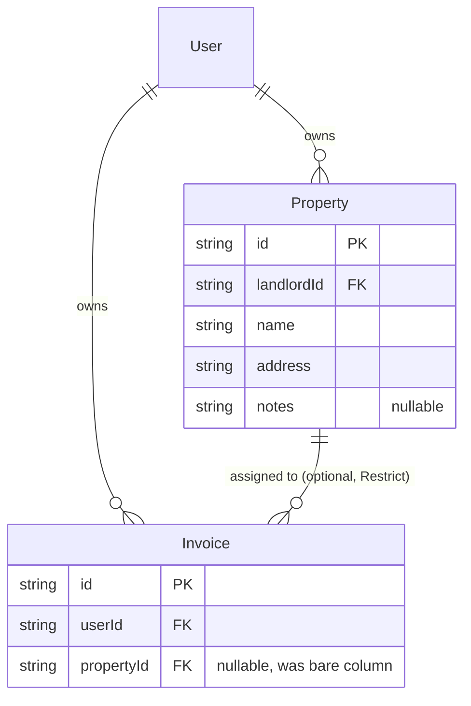

# feat: Properties — per-landlord entity with invoice assignment, filtering, and spend rollup

## Summary

Make a landlord's rental properties a first-class, per-landlord entity. The "Properties" nav stub becomes a live CRUD page; invoices gain an optional property selector that becomes required to approve; the invoice list gains a property filter (with an "Unassigned" option); and each property gets a detail page showing its invoices and a total-spend rollup. The work mirrors the existing Contractor vertical slice end-to-end.

## Problem Frame

`Invoice.propertyId` already exists as a bare nullable column with no model or foreign key behind it, so every invoice is effectively unassigned and spend can't be grouped by property. The landlord can total spend by status and category but cannot answer "how much have I spent on this property?" This plan adds the `Property` entity and wires the existing column to it.

---

## Requirements

Carried from the origin requirements doc (see origin: `docs/brainstorms/2026-06-25-properties-requirements.md`).

**Property entity & management**

- R1. A Property is a per-landlord entity with a name/label, a free-text address, and optional notes; every read and write is landlord-scoped (no cross-landlord access).
- R2. The landlord can create, edit, list, and delete properties from a Properties page, and the "Properties" nav item becomes a live route.
- R3. Deleting a property is blocked while any invoice references it; the landlord reassigns those invoices first.

**Invoice ↔ Property**

- R4. An invoice references at most one property; both belong to the same landlord. The nullable `propertyId` becomes a real foreign key.
- R5. A property is optional at create and on contractor submission, and required to move an invoice to `APPROVED`.
- R6. The invoice create/edit form offers an optional property selector listing the landlord's properties; contractor submissions carry none.
- R7. Existing invoices stay unassigned; no backfill.

**Filtering & spend**

- R8. The invoice list can be filtered by property, including an "Unassigned" option returning only property-less invoices.
- R9. Each property has a detail page listing its invoices and a total-spend rollup — the sum of its invoices' amounts excluding `REJECTED` and `CANCELLED`.

---

## Key Technical Decisions

- KTD1. **Mirror the Contractor vertical slice.** Reuse the per-landlord pattern end-to-end (Prisma model with `landlordId` + `@@index` + `onDelete: Cascade` from `User` → ownership-scoped routes/handlers using a `findFirst({ id, landlordId })` helper → `packages/shared` Zod schemas → web hook + page → nav-stub-to-live-route). Consistency with `apps/api/src/contractors/` and `apps/web/src/pages/Contractors.tsx`; proven shape.
- KTD2. **Promote `propertyId` to an optional FK with `onDelete: Restrict`, plus a friendly app-level pre-check.** The relation refuses deletion at the database as defense-in-depth, but the delete handler first counts referencing invoices — landlord-scoped: `count({ where: { propertyId: id, userId: landlordId } })` — and returns a 422 naming that count, so the landlord gets a clear "reassign N invoices first" message instead of a raw constraint error (R3). The DB `Restrict` is a backstop for the assign-vs-delete race; confirm the central Prisma error handler maps `P2003` to a clean response.
- KTD3. **Enforce property-required-on-approval at BOTH `APPROVED` checkpoints in the transition guard.** `assertTransitionAllowed` in `apps/api/src/invoices/writeService.ts` checks `CATEGORY_REQUIRED` in *two* places — inside the `from === 'SUBMITTED' → APPROVED` branch and again in the catch-all `to === 'APPROVED'` check. Add a `PROPERTY_REQUIRED` (422) check beside `CATEGORY_REQUIRED` in **both**, fed by a `propertyIdAfter` value computed the way `categoryAfter` is and threaded through the guard's `ctx` type (now `{ categoryAfter, propertyIdAfter, rejectionReason? }`). Guard order is category-then-property. Contractor submissions and drafts stay property-less (R5).
- KTD4. **Validate assigned property ownership on invoice create AND update.** When an invoice carries a non-null `propertyId`, look it up landlord-scoped — `findFirst({ where: { id, landlordId: actorId } })` — and throw a 404 `AppError` (never `FORBIDDEN`, to avoid leaking another landlord's property existence) when it returns null. This guard is net-new: `createInvoice` currently writes `propertyId` straight through, so the check must be added to *both* `createInvoice` and `updateInvoice`. A shared `ownProperty`-style helper is preferred over duplicating the lookup (DEC-019).
- KTD5. **Spend rollup via Prisma aggregate.** Total = `_sum(amount)` where `{ propertyId: id, userId: landlordId, status: { notIn: ['REJECTED', 'CANCELLED'] } }` (the `userId` scope is defense-in-depth on top of the landlord-scoped property lookup), returned as a Decimal-safe string. The `money()` formatter in `apps/api/src/invoices/handlers.ts` is a function-local closure, not exported — extract it to a small shared module (e.g. `apps/api/src/lib/money.ts`) and import it in both handlers, or inline the same one-liner (R9).
- KTD6. **"Unassigned" filter via a null sentinel.** The list query accepts a `propertyId` value plus a reserved sentinel (`none`) that maps to `where.propertyId = null`; the web filter dropdown surfaces it as "Unassigned". The filter is *appended* to the existing `userId`-anchored `where` object — it never replaces it — so the landlord scope is preserved. A non-`none`, non-matching id yields an empty result set, not an error (R8).
- KTD7. **The approve flow needs a property field, or the guard dead-ends.** With required-on-approval enforced server-side, the existing approval UI (`ReviewActions`, which today collects only a category) must also let the landlord set a property before approving — otherwise Approve returns 422 with no recovery path. The approve action carries both `category` and `propertyId` (R5, R6).

---

## High-Level Technical Design

The only structural change is one new table and one foreign key on an existing nullable column:

---

## Implementation Units

### U1. Property model + foreign-key migration

- **Goal:** Add the `Property` Prisma model and promote `Invoice.propertyId` to a real foreign key.
- **Requirements:** R1, R4, R7
- **Dependencies:** none
- **Files:** `apps/api/prisma/schema.prisma`; `apps/api/prisma/migrations/<timestamp>_add_property/migration.sql` (generated)
- **Approach:** Add `model Property` mirroring `Contractor`: `id` (cuid), `landlordId` + `landlord User @relation(onDelete: Cascade)`, `name`, `address`, `notes String?`, `createdAt`/`updatedAt`, `@@index([landlordId])`, `@@map("properties")`, and an `invoices Invoice[]` back-relation. On `Invoice`, replace the bare `propertyId String?` with a relation to `Property` using `onDelete: Restrict` (an optional relation defaults to `SetNull`, which we explicitly override to block deletion). No data backfill — existing rows keep `propertyId = null`. Generate the migration against the **local docker Postgres on port 5433** (back up `.env`, repoint `DATABASE_URL`, recreate the gitignored `docker-compose.override.yml`), never the hosted DB in `.env`; `db:deploy` to hosted is the manual ship step.
- **Patterns to follow:** the `Contractor` model and its `User` relation in `apps/api/prisma/schema.prisma`.
- **Risk to verify:** `Property` cascades from `User` (`onDelete: Cascade`) while `Invoice.propertyId` is `Restrict`. Deleting a landlord cascades to both their invoices and properties; confirm on the local DB that this does not raise a foreign-key violation (Postgres evaluates `RESTRICT` against post-cascade state, but verify). The `createSecondUser` cleanup in `apps/api/test/helpers/auth.ts` deletes invoices then the user but never properties — see U3/U4 test notes for the cleanup-ordering fix.
- **Test scenarios:** `Test expectation: none — schema + migration only; behavior is covered by U3/U4 tests`, except one DB-level check: deleting a landlord that has property-bearing invoices succeeds (guards the cascade-vs-`Restrict` interaction). Verify the generated SQL creates `properties` and adds the FK constraint with `ON DELETE RESTRICT`.
- **Verification:** `npm run db:migrate` applies cleanly to the local DB; `npm run db:generate` and `npm run typecheck` pass with the new relation.

### U2. Shared Property Zod schemas

- **Goal:** Define and export the Property schemas shared by API and web.
- **Requirements:** R1
- **Dependencies:** none (can land alongside U1)
- **Files:** `packages/shared/src/schemas/property.ts`; `packages/shared/src/index.ts`; `packages/shared/test/property.test.ts`
- **Approach:** Mirror `packages/shared/src/schemas/contractor.ts`: `CreatePropertySchema` (`name` trimmed 1–100, `address` trimmed 1–200, `notes` trimmed max 1000 optional), `UpdatePropertySchema = CreatePropertySchema.partial()`, `PropertySchema` (response: `id`, `name`, `address`, `notes`, `createdAt` via `z.coerce.date()`), and `PropertyDetailSchema` extending `PropertySchema` with `totalSpend: z.string()` for the rollup. Re-export from the index.
- **Patterns to follow:** `packages/shared/src/schemas/contractor.ts`; the re-export line in `packages/shared/src/index.ts`.
- **Test scenarios:** parse a valid create payload; reject empty `name`; reject `name`/`address` over max length; accept missing `notes`; `PropertySchema` coerces `createdAt` to a `Date`; `PropertyDetailSchema` accepts a string `totalSpend`. Mirror `packages/shared/test/contractor.test.ts`.
- **Verification:** `npm run test -w @mac-invoices/shared` green; types resolve in both apps.

### U3. Property CRUD + detail API

- **Goal:** Ship the landlord-scoped Properties API: create, list, get-with-spend, update, delete-with-guard.
- **Requirements:** R1, R2, R3, R9
- **Dependencies:** U1, U2
- **Files:** `apps/api/src/properties/routes.ts`, `apps/api/src/properties/handlers.ts`, `apps/api/src/properties/types.ts`; `apps/api/src/app.ts`; `apps/api/test/properties.test.ts`
- **Approach:** Mirror `apps/api/src/contractors/` for the create/list/get/update structure and the `ownProperty()` `findFirst({ id, landlordId })` no-leak-404 helper. Routes behind `requireAuth`: `POST /api/properties`, `GET /api/properties`, `GET /api/properties/:id`, `PATCH /api/properties/:id`, `DELETE /api/properties/:id`. Note the Contractor module has **no DELETE route and no `_sum` aggregate to copy** — these two pieces are net-new:
  - `GET /:id` returns `PropertyDetail` — the property plus `totalSpend` from the KTD5 aggregate (`_sum(amount)` scoped `{ propertyId: id, userId: landlordId, status: { notIn: ['REJECTED','CANCELLED'] } }`), formatted with the extracted `money()` helper (KTD5).
  - `DELETE` first runs the landlord-scoped count from KTD2 (`count({ where: { propertyId: id, userId: landlordId } })`); if > 0, throw `AppError('PROPERTY_HAS_INVOICES', '…N invoice(s); reassign them first', 422)`; otherwise delete.
  Build the response with a hand-written `toProperty()` shaper (the Contractor slice hand-builds `toContractor` rather than parsing through the schema) matching `PropertySchema`/`PropertyDetailSchema` exactly. Register the plugin in `apps/api/src/app.ts` next to `contractorRoutes`.
- **Patterns to follow:** `apps/api/src/contractors/{routes,handlers,types}.ts` (CRUD shape, `ownContractor` scoping, `toContractor` shaper); the `groupBy`/`_sum` usage in `apps/api/src/invoices/handlers.ts`; plugin registration in `apps/api/src/app.ts`.
- **Test scenarios:**
  - Happy path: create → appears in list; `GET /:id` returns it with `totalSpend: "0.00"` when it has no invoices.
  - Ownership: a second landlord's `GET`/`PATCH`/`DELETE` on this property → 404; list returns only the caller's properties. `Covers R1.`
  - Update: `PATCH` changes `name`/`address`/`notes`; partial update leaves other fields intact.
  - Delete guard: deleting a property with two attached invoices → 422 naming the count (2); after both are reassigned away, delete succeeds. `Covers AE2.`
  - Spend rollup: a property with a `PAID` $100 invoice and an `APPROVED` $50 invoice (plus a `REJECTED` $30 invoice that is *not* counted) → `totalSpend: "150.00"`. `Covers AE3.`
  - Auth: unauthenticated request → 401.
- **Verification:** `npm run test -w @mac-invoices/api` green for the new file; routes return the documented shapes and status codes.

### U4. Invoice ↔ Property wiring (assign, require-on-approval, filter)

- **Goal:** Accept and validate a property on invoices, require it to approve, and filter the invoice list by property.
- **Requirements:** R4, R5, R6 (API side), R8
- **Dependencies:** U1, U2
- **Files:** `packages/shared/src/schemas/invoice.ts`; `apps/api/src/invoices/writeService.ts`; `apps/api/src/invoices/handlers.ts`; `apps/api/test/invoices.property.test.ts` (new); plus updates to existing `apps/api/test/invoices.transitions.test.ts` and `apps/api/test/invoices.crud.test.ts`
- **Approach:**
  - **Schema:** `CreateInvoiceSchema` already carries `propertyId` optional and `UpdateInvoiceSchema` inherits it via `.partial()` — no change there. The only schema edit is adding `propertyId: z.string().optional()` to `ListInvoicesQuerySchema`; the `none` sentinel is handled in the where-builder, not the schema.
  - **Ownership (KTD4):** add the landlord-scoped `findFirst({ id, landlordId: actorId })` → 404 check in **both** `createInvoice` (which today writes `propertyId` straight through with no guard) and `updateInvoice`. The contractor submission path carries no `propertyId` and is untouched.
  - **Required-on-approval (KTD3):** add `propertyIdAfter` to the `assertTransitionAllowed` `ctx` (a signature change touching the existing call site) and add the `PROPERTY_REQUIRED` (422) check at **both** `APPROVED` checkpoints, after the category check.
  - **List filter:** append to the existing `userId`-anchored `where`: `q.propertyId === 'none'` → `where.propertyId = null`; a real id → `where.propertyId = id`; absent → unchanged.
  - **Existing tests cascade:** every current `→ APPROVED` case in `invoices.transitions.test.ts` and `invoices.crud.test.ts` approves without a property and will now hit `PROPERTY_REQUIRED`; update each to set a property first (or assert the new 422 where that's the intent).
- **Patterns to follow:** the `CATEGORY_REQUIRED` guard and `categoryAfter` computation in `apps/api/src/invoices/writeService.ts`; `ownContractor` scoping in `apps/api/src/contractors/handlers.ts` for the ownership lookup; the conditional `where`-building in `apps/api/src/invoices/handlers.ts`.
- **Test scenarios:**
  - Approval guard, submission path: approving a `SUBMITTED` invoice with no property → 422 `PROPERTY_REQUIRED`; after a property is set, approval succeeds. `Covers AE1.`
  - Approval guard, direct path: a `PENDING` invoice moved straight to `APPROVED` with no property → 422 (guards the catch-all checkpoint, not just the submission branch).
  - Guard order: an invoice missing both category and property → category checked first (`CATEGORY_REQUIRED`), then property.
  - Ownership: assigning another landlord's `propertyId` → 404 (not 403, to avoid leaking existence); assigning own property → persists; applies on both create and update.
  - Already-approved invoices: an invoice approved before this change (null property) is unaffected until its next transition.
  - List filter: `propertyId=<id>` returns only that property's invoices; `propertyId=none` returns only null-property invoices; absent → unchanged behavior. `Covers AE4.`
- **Verification:** `npm run test -w @mac-invoices/api` green; the approval guard and filter behave per the scenarios; existing invoice tests still pass.

### U5. Web Properties page + hook + live route

- **Goal:** Turn the nav stub into a live Properties CRUD page.
- **Requirements:** R2
- **Dependencies:** U2, U3
- **Files:** `apps/web/src/hooks/useProperties.ts`; `apps/web/src/pages/Properties.tsx`; `apps/web/src/components/NavLinks.tsx`; `apps/web/src/main.tsx`; `apps/web/test/Properties.test.tsx`; `apps/web/test/Sidebar.test.tsx`
- **Approach:** Mirror `useContractors.ts` for the query/mutation shape (`['properties']` query, mutations invalidating it), but note `useContractors.ts` exposes only create + revoke/regenerate — the `useUpdateProperty`/`useDeleteProperty` mutations are **net-new** (no contractor analog). Likewise `Contractors.tsx` has **no edit or delete UI to copy**; design the edit affordance explicitly — use a dedicated `/properties/:id/edit` route consistent with the invoice edit pattern (`InvoiceDetail` → `InvoiceEdit`), reusing the create form. Give the `Properties` nav item a `to: '/properties'` (drop the "Soon" stub) and add the route in `main.tsx`. For delete: surface the 422 guard error inline below the affected property's row/card (e.g. "Can't delete — 3 invoices assigned; reassign them first") with a link to `/invoices?propertyId=<id>` so the landlord can find and reassign them (F2). Update the `Sidebar.test.tsx` assertion that Properties is a "Soon" stub.
- **Patterns to follow:** `apps/web/src/hooks/useContractors.ts` (query/mutation shape) and `apps/web/src/pages/Contractors.tsx` (list + create form) for structure; `apps/web/src/pages/InvoiceEdit.tsx` + its route for the edit-route pattern; the live `Contractors` nav entry in `apps/web/src/components/NavLinks.tsx`; the route block in `apps/web/src/main.tsx`.
- **Test scenarios:** empty state before any property; submitting the form calls create with `{name, address, notes}`; the list renders properties; deleting a property with invoices shows the guard message (mock the 422); the nav renders Properties as an active link (update `apps/web/test/Sidebar.test.tsx` expectation that it is a "Soon" stub). Mirror `apps/web/test/Contractors.test.tsx`.
- **Verification:** `npm run test -w @mac-invoices/web` green; `/properties` renders and the nav link is live.

### U6. Invoice web integration: form selector, approve picker, list filter

- **Goal:** Let the landlord pick a property on the invoice form, set one when approving, and filter the invoice list by property.
- **Requirements:** R6, R8 (and the UI half of R5)
- **Dependencies:** U4, U5
- **Files:** `apps/web/src/components/InvoiceForm.tsx`; `apps/web/src/components/ReviewActions.tsx`; `apps/web/src/components/FilterBar.tsx`; `apps/web/src/lib/listParams.ts`; `apps/web/test/InvoiceForm.test.tsx`, `apps/web/test/ReviewActions.test.tsx` (or `InvoiceDetail.test.tsx`), `apps/web/test/FilterBar.test.tsx` (or `InvoiceList.test.tsx`)
- **Approach:**
  - **Form selector:** add an optional property `<select>` to `InvoiceForm.tsx` populated from `useProperties()`. Because the options are fetched (unlike the static category enum), handle the async states: disabled while pending; an "Add a property first" affordance linking to `/properties` when the list is empty; disabled with a hint on error. An empty value submits no `propertyId`. The selector is editable on already-`APPROVED`/`PAID` invoices (no extra lock — consistent with how other fields stay editable), so a wrong assignment can be corrected.
  - **Approve picker (KTD7):** in `ReviewActions.tsx`, the Approve action must also collect a property (today it collects only category) and send `propertyId` alongside `category`, so the landlord can satisfy the server guard in one step instead of hitting a 422. When the landlord has zero properties, surface the same "Add a property first" path.
  - **List filter:** add a `propertyId` field to `ListFilters` and a FilterBar dropdown (the landlord's properties plus an "Unassigned" entry → the `none` sentinel). Thread it through **every** param helper in `lib/listParams.ts` — `parseListParams` (accept any id or the literal `none`; don't sanitize `none` away), `toQueryParams`, `toSearchParams`, `hasActiveFilters` — and the FilterBar change-signature `sig` string, or the Clear-filters affordance and debounce sync will miss a property-only filter.
- **Patterns to follow:** the category `<select>` in `InvoiceForm.tsx`; the category picker in `ReviewActions.tsx`; the `status` filter wiring across `FilterBar.tsx` and `lib/listParams.ts`.
- **Test scenarios:** the form renders property options and submits the chosen `propertyId` (omits when blank); the form shows the empty/loading/error states of the selector; the approve action sends `propertyId` with `category`; selecting a property in the FilterBar updates the query/URL and shows the Clear-filters control; "Unassigned" sends `propertyId=none`; clearing removes it.
- **Verification:** `npm run test -w @mac-invoices/web` green; form, approve flow, and filter drive the documented params; approving from the UI no longer dead-ends on the server guard.

### U7. Property detail page (web)

- **Goal:** Show a property's invoices and total spend on a detail page.
- **Requirements:** R9
- **Dependencies:** U3, U4, U5
- **Files:** `apps/web/src/pages/PropertyDetail.tsx`; `apps/web/src/hooks/useProperties.ts` (add a `useProperty(id)` export — co-locate like `useContractors.ts`, don't create a separate file); `apps/web/src/main.tsx`; `apps/web/test/PropertyDetail.test.tsx`
- **Approach:** A `/properties/:id` route. The page fetches the property detail (`GET /api/properties/:id`, includes `totalSpend`) for the header + rollup, and renders the property's invoices via the U4 filter (`GET /api/invoices?propertyId=:id`) — no new endpoint. This page is already property-scoped, so render the invoices as a simple read-only table reusing the existing `InvoiceTable` (no `FilterBar`, no property dropdown, no extra pagination beyond the list default); the `propertyId` is fixed by the route. The invoice rendering depends entirely on U4's where-builder branch — without it the page would show all invoices. Link to this page from the Properties list rows.
- **Patterns to follow:** `apps/web/src/pages/InvoiceDetail.tsx` and `apps/web/src/hooks/useInvoice.ts` for a single-resource detail page; the invoice table/list rendering already used in `InvoiceList`.
- **Test scenarios:** renders the property name/address and `totalSpend`; lists the property's invoices (mock the filtered list); empty state when the property has no invoices; a not-found property surfaces cleanly.
- **Verification:** `npm run test -w @mac-invoices/web` green; `/properties/:id` renders header, spend, and invoices.

---

## Scope Boundaries

In scope: the seven units above — the Property entity, CRUD, invoice assignment with required-on-approval, the list filter, and a detail page with a spend rollup.

Out of scope (from origin):

- Dashboard per-property spend bars (extending `SpendBars`/stats).
- Contractor ↔ property association.
- Structured address fields, property type, multi-unit support.
- Active/archived property status.
- i18n of the Properties UI.

### Deferred to Follow-Up Work

- Adding a property column to the Google Sheets / CSV export (`apps/api/src/invoices/handlers.ts` export path) — held out of this plan.

---

## System-Wide Impact

- **Invoice approval flow:** approving an invoice now requires both a `category` (existing) and a `property` (new), enforced at both `APPROVED` checkpoints server-side (KTD3). The approve UI must collect a property (KTD7 / U6) or the landlord hits a 422 with no recovery path. Existing `→ APPROVED` API tests must be updated to set a property (U4).
- **Contractor submissions:** unchanged at submission time — they still carry no property; the landlord assigns one on review.

---

## Risks & Dependencies

- **Migration must run against the local docker Postgres on 5433, never the hosted DB** in `.env` (see memory `local-db-setup`): back up `.env`, repoint `DATABASE_URL`, recreate the gitignored `docker-compose.override.yml`, then restore before shipping. `db:deploy` to hosted is the manual ship step; the app is not yet deployed to production, so there is no production backfill concern.
- **Grandfathered invoices:** invoices already in `APPROVED`/`PAID` with a null property are valid and untouched; required-on-approval only fires on a transition into `APPROVED`.
- **`onDelete: Restrict` + app pre-check** must agree: the pre-check is the user-facing path, the DB constraint is the backstop. A delete that races a concurrent invoice-assignment is still caught by the constraint.

---

## Definition of Done

`npm run lint && npm run typecheck && npm run test` all green across workspaces. Test coverage mirrors the Contractor slice (API route tests + shared schema tests + web page/hook tests) plus the approval-guard, delete-guard, spend-rollup, and filter scenarios above. Per-unit conventional commits; squash-merge PR. The hosted migration (`db:deploy`) is the landlord's manual ship step.
