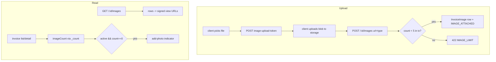

# feat: Multi-photo invoices

## Summary

Let an invoice hold up to five typed photos (cash / parts / check / other) instead of one. Replace today's single-image API/UI with a real image collection: a landlord gallery to add, view full-size, remove, and re-type photos; contractor multi-upload (≥1 required, ≤5); landlord-created invoices may have none. `images[]` becomes the single source of truth — the legacy `attachmentUrl` is backfilled into it and no longer written. Active invoices (PENDING/APPROVED/PAID) with zero photos show an actionable "add a photo" indicator on the invoice list and detail page.

## Problem Frame

The `InvoiceImage` model + `ImageType` enum already exist, but the running system is single-image: `writeService.attachImage` deletes any existing row before inserting one, the API exposes a single `/:id/image` + `/:id/image-url`, the web shows one photo via `InvoicePhoto`, and invoices still carry a legacy `attachmentUrl` column written on create. So real invoices (a cash receipt + a parts slip + the check) can't be captured, there's no way to record an invoice now and photograph it later, and nothing flags an image-less invoice as needing attention.

---

## Requirements

Carried from the origin (see origin: `docs/brainstorms/2026-06-25-multi-photo-invoices-requirements.md`).

**Photos on an invoice**
- R1. An invoice holds 0–5 photos; each has a type cash/parts/check/other (default other).
- R2. `images[]` is the single source of truth; a legacy `attachmentUrl` is folded in (counts as one photo; no data stranded).
- R3. The landlord can add, view full-size, remove, and change the type of any photo on their own invoices, in a gallery.
- R4. Multiple photos of the same type are allowed.

**Creation & requirement rules**
- R5. A landlord can create an invoice with zero photos and add them later.
- R6. A contractor submission requires ≥1 photo and accepts up to the cap.
- R7. At most 5 photos per invoice — enforced server-side; the UI prevents exceeding it.

**Indicator**
- R8. An active invoice (PENDING/APPROVED/PAID) with zero photos shows an "add a photo" indicator on the list and detail; terminal (REJECTED/CANCELLED) and ≥1-photo invoices show nothing.
- R9. The indicator leads to adding a photo (actionable, not a passive label).

**Cross-cutting**
- R10. Photo actions are ownership-scoped; reads use signed URLs via the storage seam; new UI strings are bilingual (EN/ZH).

---

## Key Technical Decisions

- KTD-1. **`images[]` is the single source of truth; backfill + stop writing `attachmentUrl`.** A one-time backfill inserts an `InvoiceImage` (type `OTHER`) for every invoice that has an `attachmentUrl` but no image rows; **all three write paths — `createInvoice`, `updateInvoice`, and `createSubmission` — stop writing `attachmentUrl`**, and the field is removed from the create/update input schemas (U1). The DB column is *retained but unused* (no destructive drop pre-deploy; tracked as follow-up). "Has photos?" and the gallery read image rows only. Confirm the Sheets export (`apps/api/src/invoices/handlers.ts` export path) does not depend on `attachmentUrl` (it reads invoice scalar fields; images aren't exported).
- KTD-2. **Replace the single-image API with an `/images` collection.** `GET /api/invoices/:id/images` (ownership-scoped list; each item carries a signed view URL), `POST /:id/images` (append a photo), `DELETE /:id/images/:imageId` (remove by id), `PATCH /:id/images/:imageId` (set type) — all **landlord-only** (a contractor hitting these gets 404). Retire `POST/DELETE /:id/image` and `GET /:id/image-url` and update their web consumers. `writeService` gains append/remove-by-id/set-type helpers (each in a transaction with the existing `IMAGE_ATTACHED`/`IMAGE_REMOVED` events); the old delete-then-create `attachImage` is removed.
- KTD-2a. **No IDOR on by-id mutations.** `removeImage` and `setImageType` must resolve the image with a **single** ownership-joined query — `invoiceImage.findFirst({ where: { id: imageId, invoiceId, invoice: { userId: actorId } } })` → 404 if null — never "look up by imageId, then check the invoice separately." This stops a landlord deleting/retyping another invoice's image by guessing an `imageId` (the existing single-image `removeImage` deletes by `invoiceId` alone, which does not generalize).
- KTD-2b. **Gate every attached URL against the caller's blob prefix.** The attach URL is client-supplied, so each one passes through the existing `gateImageRef` seam before any row is written: `gateImageRef(url, actorId)` on the landlord `addImage`, and `gateImageRef(url, contractorBlobOwner(contractorId))` for **each** URL in a contractor `images[]` submission. Without this a caller could attach an arbitrary or another user's blob URL (it would later be served back as a signed read). This mirrors the gate the current single-image create/submit path already applies.
- KTD-3. **Cap enforced server-side in-transaction.** Appending counts existing rows inside the write transaction and throws `AppError('IMAGE_LIMIT', …, 422)` at 5, so concurrent uploads can't exceed the cap. The UI also disables upload at 5 (defense, not the enforcement).
- KTD-4. **Expose `imageCount` on invoice list + detail.** Add a Prisma `_count: { images }`-derived `imageCount` to the list item and detail responses, so the indicator and the "has photos?" check read one cheap field without N+1. The detail page fetches the full image list (with signed URLs) separately for the gallery.
- KTD-5. **Type is optional at attach (default OTHER), editable via PATCH; multiple per type.** Contractor submit requires ≥1 and ≤5; landlord create allows 0. Contractors may set a type at upload but don't curate after submit.
- KTD-6. **Removing an image — and deleting an invoice — reclaims every blob (best-effort).** The per-image remove handler calls `deleteBlob` after the row delete. `deleteInvoice` today snapshots and reclaims only `images[0]`; it must iterate **all** image URLs (reclaim each best-effort) and record the full `imageUrls[]` in the `DELETED` tombstone detail (not a single `imageUrl`), or multi-photo deletes orphan up to 4 blobs and lose them from the archive. Blob-delete failures are logged, not surfaced (the rows are already gone).
- KTD-7. **The indicator is derived, not stored.** `active && imageCount === 0` where active = PENDING/APPROVED/PAID. Rendered on `InvoiceTable` rows and `InvoiceDetail` as an actionable affordance that routes to the add-photo flow. (Contractor `SUBMITTED` invoices always have ≥1, so they never qualify.)

---

## High-Level Technical Design

Image data flow after this change:

The Upload subgraph is the **landlord** append flow (`POST /:id/images`, one photo at a time). The **contractor** path is different: the contractor uploads each blob, then embeds the whole `images[]` array **inside the submission payload** (U8) — they never call `POST /:id/images` (those endpoints are landlord-only and 404 for contractors, KTD-2). Both paths gate every URL via `gateImageRef` before any row is written.

---

## Implementation Units

### U1. Shared schemas: image collection, cap, submission array

- **Goal:** Define the canonical image-list shape, the attach/set-type inputs, the cap constant, and widen the contractor submission + landlord create to multiple images.
- **Requirements:** R1, R6, R7
- **Dependencies:** none
- **Files:** `packages/shared/src/schemas/invoice.ts`, `packages/shared/src/schemas/contractor.ts`, `packages/shared/src/index.ts`, `packages/shared/test/invoice.test.ts`, `packages/shared/test/contractor.test.ts`
- **Approach:** Add `MAX_INVOICE_IMAGES = 5`. Add `InvoiceImageSchema` (response: `id`, `type` (ImageType), `createdAt`; the signed `url` is added by the API at read time — include it in the response schema as a string). Add `AttachImageInput` (`url`, `type` optional default OTHER — reuse/extend `InvoiceImageInputSchema`) and `SetImageTypeInput` (`type`). Change `SubmissionSchema.image` → `images: z.array(InvoiceImageInputSchema).min(1).max(5)`. Change `CreateInvoiceSchema` to accept `images` (array, max 5, optional, 0 valid) and **remove** its `image` and `attachmentUrl` input fields (the `attachmentUrl` DB column is retained per KTD-1, but it is no longer a create/update *input* — also remove it from `UpdateInvoiceSchema`, which inherits it via `.partial()`). Re-export new schemas. NOTE: changing `SubmissionSchema` breaks the server submission path (`createSubmission`, the submission handler, and four submission API tests) — those move in U8; the contractor web page moves in U5.
- **Patterns to follow:** existing `InvoiceImageInputSchema` and the contractor/invoice schema style in `packages/shared/src/schemas/`.
- **Test scenarios:** `Covers AE2.` submission rejects an empty `images` array and accepts 1–5; rejects 6. Create invoice parses with 0 images and with up to 5; rejects 6. `InvoiceImageSchema` coerces `createdAt` to a Date; type defaults to OTHER when omitted on attach.
- **Verification:** `npm run test -w @mac-invoices/shared` green; both apps typecheck against the new shapes.

### U2. API: image collection endpoints + cap + type-edit

- **Goal:** Replace single-image semantics with list/attach/remove-by-id/set-type, ownership-scoped, cap-enforced, blob-cleaning.
- **Requirements:** R3, R4, R7, R10
- **Dependencies:** U1
- **Files:** `apps/api/src/invoices/routes.ts`, `apps/api/src/invoices/handlers.ts`, `apps/api/src/invoices/writeService.ts`, `apps/api/test/invoices.images.test.ts` (**rewrite** — this file already exists and tests the single-image routes/semantics being retired; replace its assertions wholesale, don't append)
- **Approach:** Routes (all `requireAuth`, landlord-only own-invoice scoped): `GET /:id/images` → rows mapped to `{ id, type, createdAt, url: signedReadUrl(row.url) }`; `POST /:id/images` (AttachImageInput) → `writeService.addImage`; `DELETE /:id/images/:imageId` → `writeService.removeImage`; `PATCH /:id/images/:imageId` (SetImageTypeInput) → `writeService.setImageType`. Keep `POST /image-upload-token`. Remove `POST/DELETE /:id/image` and `GET /:id/image-url`. In `writeService`: `addImage` runs `gateImageRef(url, actorId)` (KTD-2b), counts rows in-tx and throws `IMAGE_LIMIT` (422) at the cap, else inserts + `IMAGE_ATTACHED`; `removeImage` and `setImageType` resolve the image with the single ownership-joined query from KTD-2a (404 if not the caller's) — remove deletes the row + `IMAGE_REMOVED` then best-effort `deleteBlob`; set-type updates `type`. Delete the old delete-then-create `attachImage`. **Also update `deleteInvoice`** (KTD-6) to reclaim *all* image blobs and record `imageUrls[]` in the `DELETED` tombstone (it currently handles only `images[0]`).
- **Patterns to follow:** existing `attachInvoiceImage`/`removeInvoiceImage`/`getInvoiceImageUrl` handlers and `writeService.attachImage` (extend, don't keep), the own-invoice 404 scoping, `issueUploadToken`/`signedReadUrl`/`deleteBlob` in `apps/api/src/integrations/storage.ts`, the `IMAGE_ATTACHED`/`IMAGE_REMOVED` event types.
- **Test scenarios:**
  - Happy: attach 3 photos → `GET /:id/images` returns 3 with signed urls + types; PATCH one OTHER→CASH persists (`Covers AE5.`); DELETE one by id removes it.
  - Cap: attaching a 6th → 422 `IMAGE_LIMIT` (`Covers AE1.`).
  - Ownership / IDOR: a second landlord attaching/listing/removing/patching on this invoice → 404; **remove AND set-type of an `imageId` belonging to another invoice → 404** (the single ownership-joined query, KTD-2a).
  - URL gate: attaching a URL outside the caller's blob prefix (another user's blob, or an arbitrary URL) → rejected (KTD-2b).
  - Blob cleanup: remove calls `deleteBlob` (mocked); a `deleteBlob` failure still returns success and leaves the row deleted.
  - Invoice delete: deleting an invoice with 3 photos reclaims all 3 blobs (mocked `deleteBlob` called 3×) and the `DELETED` event detail carries all 3 URLs.
- **Verification:** `npm run test -w @mac-invoices/api` green for the new file; old single-image routes are gone and nothing references them.

### U3. `attachmentUrl` single-source: backfill + stop writing

- **Goal:** Make image rows the only image source; migrate any legacy attachment; stop writing the column.
- **Requirements:** R2, R5
- **Dependencies:** U1
- **Files:** `apps/api/prisma/backfill-invoice-images.ts` (new one-off script), `apps/api/package.json` (a `db:backfill-images` script), `apps/api/src/invoices/writeService.ts`, `apps/api/test/invoices.images.test.ts`
- **Approach:** The image `id` is a **Prisma app-level `@default(cuid())`** — Postgres has no cuid generator — so the backfill is a one-off **Prisma script** (mirror the existing `apps/api/prisma/backfill-events.ts` + its `db:backfill-events` script), not raw SQL: for each invoice with a non-null `attachmentUrl` and no image rows, `invoiceImage.create` (the client fills the cuid) a row `{ url: attachmentUrl, type: OTHER }`; idempotent (skip invoices that already have rows). No new migration (the column + `invoice_images` table already exist). `createInvoice` and `updateInvoice` stop writing `attachmentUrl` (its input field is removed in U1); `createInvoice` instead creates the supplied `images[]` rows (0 allowed). (Contractor `createSubmission`'s images move in U8.) Confirmed via research: the Sheets export reads only invoice scalar columns, not `attachmentUrl` — no read path depends on it.
- **Patterns to follow:** the hand-authored-migration + `db:deploy` workflow used for the property and user-locale migrations; `createSubmission`/`createInvoice` in `writeService.ts`.
- **Test scenarios:** `Covers AE4.` an invoice created with a legacy `attachmentUrl` (seeded directly) is represented as one image after backfill and reports `imageCount` 1 (no indicator). Creating an invoice with 0 images persists none and is valid; with 2 images persists 2. No create path writes `attachmentUrl`.
- **Verification:** migration applies cleanly to local DB; backfill is idempotent (re-running inserts nothing); `db:generate` + typecheck pass.

### U4. Expose `imageCount` on invoice list + detail

- **Goal:** Give the indicator and "has photos?" check a cheap field without N+1.
- **Requirements:** R8 (data), R2
- **Dependencies:** U1, U3
- **Files:** `apps/api/src/invoices/handlers.ts`, `packages/shared/src/schemas/invoice.ts` (list item + detail response shapes), `apps/web/src/hooks/useInvoices.ts` + `apps/web/src/hooks/useInvoice.ts` (types), `apps/api/test/invoices.list.test.ts`
- **Approach:** Add `imageCount` to the list query (`_count: { select: { images: true } }`) and the detail handler; expose it in the list-item + detail response schemas and the web types. Do not embed full image rows in the list (the gallery fetches them on detail).
- **Patterns to follow:** the existing list/detail handlers' `include`/select and response mapping.
- **Test scenarios:** the list returns `imageCount` reflecting attached photos (0, 1, many); the detail returns it too.
- **Verification:** API tests green; web types compile against `imageCount`.

### U5. Contractor multi-upload (public page)

- **Goal:** Let a contractor attach 1–5 photos (optional type) on the bilingual public submission page.
- **Requirements:** R6
- **Dependencies:** U1, U8
- **Files:** `apps/web/src/pages/ContractorSubmit.tsx`, `apps/web/src/hooks/useSubmission.ts`, `apps/web/src/components/PhotoAttach.tsx` (reuse), `apps/web/src/locales/en/translation.json`, `apps/web/src/locales/zh/translation.json`, `apps/web/test/ContractorSubmit.test.tsx`
- **Approach:** Replace the single `photoUrl` with a small list (≥1 to enable submit, ≤5; disable add at 5), each entry optionally typed; submit sends `images[]`. Reuse `PhotoAttach` per add, or a thin multi-wrapper. New i18n keys (en+zh) for the multi-photo copy; keep the page bilingual.
- **Patterns to follow:** current `ContractorSubmit` upload flow + `uploadSubmissionPhoto`; the i18n `t()` conventions and the catalog-parity test.
- **Test scenarios:** submit disabled with 0 photos, enabled with 1; adding past 5 is prevented; submit payload carries the `images` array; (en) copy renders.
- **Verification:** `npm run test -w @mac-invoices/web` green; catalog-parity test green.

### U6. Landlord photo gallery (invoice detail)

- **Goal:** A gallery to view full-size, add (≤5), remove, and re-type photos on the landlord's invoice detail.
- **Requirements:** R3, R4, R7
- **Dependencies:** U2, U4
- **Files:** `apps/web/src/components/InvoiceImageGallery.tsx` (new), `apps/web/src/hooks/useInvoiceImages.ts` (new), `apps/web/src/pages/InvoiceDetail.tsx`, `apps/web/src/pages/InvoiceNew.tsx` (post-create redirect), `apps/web/src/components/InvoicePhoto.tsx` (retire/replace), `apps/web/src/hooks/useInvoiceImage.ts` (retire/replace — and its consumers, below), `apps/web/src/hooks/useInvoice.ts` (drop the `attachmentUrl` field), `apps/web/src/locales/{en,zh}/translation.json`, `apps/web/test/InvoiceImageGallery.test.tsx`
- **Consumer inventory (must all move in this change set, or the build breaks):** every importer of `useInvoiceImage`/`InvoicePhoto` (the detail page's single-photo block, the attach/remove mutation hooks they wrap) and any reference to the `attachmentUrl` field on the web `Invoice`/detail types in `useInvoice.ts`. Grep `useInvoiceImage`, `InvoicePhoto`, `image-url`, `attachmentUrl` across `apps/web/src` before deleting.
- **Approach:** `useInvoiceImages(id)` lists images (signed urls); mutations for add (upload-token → POST), remove (DELETE by id), set-type (PATCH), each invalidating the list + the invoice (for `imageCount`). Gallery: thumbnail grid → full-size view; per-photo type `<select>` (cash/parts/check/other) + remove; an add control disabled at 5. Replace `InvoicePhoto`/`useInvoiceImageUrl` usage on `InvoiceDetail`.
  - **UX states to render (don't leave implicit):** per-photo upload **progress + error** (a failed upload doesn't wedge the others); gallery **loading skeleton** and **thumbnail load-error** fallback; the add control shows **at-cap disabled copy** ("5 of 5 photos") at the limit; **remove uses an inline confirm** because deletion is permanent + reclaims the blob (no silent destructive click); a cap **422 surfaces a friendly message** (belt-and-suspenders with the disabled control); the type `<select>` option labels (Cash/Parts/Check/Other) are **bilingual** keys, not raw enum values.
  - **Post-create redirect:** after a landlord creates an invoice (`InvoiceNew`), redirect to its detail page so the just-created (likely image-less) invoice immediately presents the gallery + add-photo affordance — this is the "create now, photograph later" loop (F1).
- **Patterns to follow:** `InvoicePhoto` (signed-url refresh-once), `PhotoAttach` (upload), the category `<select>` pattern, the mutation/invalidate pattern in existing hooks, the existing form→redirect navigation in `InvoiceNew`/`InvoiceForm`.
- **Test scenarios:** renders thumbnails for N images; gallery loading + thumbnail-error states render; the add control is disabled with at-cap copy at 5; changing a photo's type calls PATCH; removing prompts an inline confirm then calls DELETE by id; a cap-422 surfaces a message; the type-select labels render bilingually (en). (Mock the hooks/mutations.)
- **Verification:** web suite green; the detail page shows the gallery; post-create lands on detail; no references to the retired single-image hook/component or `attachmentUrl` remain in `apps/web/src`.

### U7. "Add a photo" indicator (list + detail)

- **Goal:** Surface an actionable add-photo affordance on active image-less invoices.
- **Requirements:** R8, R9
- **Dependencies:** U4
- **Files:** `apps/web/src/components/InvoiceTable.tsx`, `apps/web/src/pages/InvoiceDetail.tsx`, `apps/web/src/locales/{en,zh}/translation.json`, `apps/web/test/InvoiceTable.test.tsx`, `apps/web/test/InvoiceDetail.test.tsx`
- **Approach:** A small shared helper `needsPhoto(status, imageCount)` = `imageCount === 0 && (PENDING|APPROVED|PAID)`. On `InvoiceTable` rows, render the indicator as a **trailing pill/icon after the existing status badge** (the row already renders `StatusBadge`/`SyncBadge` in that cell — slot the add-photo pill alongside them so it reads as row metadata, and make it a link to the invoice detail where the gallery's add control lives). On `InvoiceDetail`, render a prominent "add a photo" affordance **near the gallery** (the gallery's own empty/add control can double as it) when it applies. Bilingual keys. (Exact visual is implementer's call within that placement — a small pill/icon on rows, a CTA on detail.)
- **Patterns to follow:** `StatusBadge`/`SyncBadge` pill style; the row-rendering in `InvoiceTable`.
- **Test scenarios:** `Covers AE3.` a PAID invoice with `imageCount 0` shows the indicator; a CANCELLED invoice with 0 does not; an invoice with `imageCount ≥ 1` does not. The indicator is a link/affordance, not inert text.
- **Verification:** web suite green; indicator appears only for the documented cases.

### U8. Contractor submission API: `image` → `images[]` (server)

- **Goal:** Make the server submission path accept and persist 1–5 photos, gating each URL, so the U1 `SubmissionSchema` change has a server owner. **This unit is a prerequisite for U5** (the web page can't send `images[]` until the server accepts it).
- **Requirements:** R6, R10
- **Dependencies:** U1
- **Files:** `apps/api/src/submissions/handlers.ts`, `apps/api/src/invoices/writeService.ts` (`createSubmission`), `apps/api/test/submissions.create.test.ts`, `apps/api/test/submissions.edit.test.ts`, `apps/api/test/submissions.scope.test.ts`, `apps/api/test/submissions.review.test.ts`
- **Approach:** `createSubmission` today consumes a single `image` and gates it via `gateImageRef(url, contractorBlobOwner(contractorId))`, then writes one `InvoiceImage` (and was the last writer of `attachmentUrl` — drop that per KTD-1). Change it to iterate the validated `images[]`: gate **each** URL with `gateImageRef(url, contractorBlobOwner(contractorId))` (KTD-2b), reject the whole submission if any fails, then create all rows in the submission transaction (the ≥1/≤5 bound is already enforced by the U1 schema; no separate cap query needed on the create-all path since the array is pre-bounded). The submission handler passes the array through unchanged. Audit the four existing submission tests: each constructs a submission with a single `image` — update their fixtures/builders to `images: [...]` and add coverage for the multi-image and per-URL-gate-rejection cases. The submission **review/approve** path (which materializes the invoice) must carry all images, not just the first.
- **Patterns to follow:** the current single-image `createSubmission` gate + write in `writeService.ts`; the submission test fixtures/builders in `apps/api/test/submissions.*.test.ts`.
- **Test scenarios:** `Covers AE2.` a submission with 0 images is rejected (schema) and with 1–5 succeeds, persisting that many image rows; a 6th is rejected. A submission carrying a URL outside the contractor's blob prefix is rejected (KTD-2b). Approving a multi-image submission materializes an invoice with all images. The existing submission create/edit/scope/review assertions still pass against the `images[]` shape.
- **Verification:** `npm run test -w @mac-invoices/api` green across all four submission test files; no submission path writes `attachmentUrl`.

---

## Scope Boundaries

In scope: the seven units above — multi-typed photos, the collection API + cap, the attachmentUrl single-source backfill, `imageCount`, contractor multi-upload, the landlord gallery, and the add-photo indicator.

Out of scope (from origin): captions, photo reordering / "primary" photo, in-app image editing/cropping, OCR, per-type required rules, contractor-side gallery curation after submit.

### Deferred to Follow-Up Work
- Dropping the now-unused `attachmentUrl` column (a later destructive migration once confirmed safe).

---

## System-Wide Impact

- **Contractor submission flow:** the payload changes from a single `image` to an `images[]` (≥1) — the shared schema (U1), the server submission path + its four tests (U8), and the public page (U5) move together. The contractor page stays English-or-Chinese (bilingual).
- **Invoice events ledger:** add/remove emit the existing `IMAGE_ATTACHED`/`IMAGE_REMOVED` events; the timeline already renders these.
- **Image-less invoices** become a first-class, surfaced state (the indicator) rather than an invisible gap.

---

## Risks & Dependencies

- **Migration runs against the local docker Postgres on 5433, never the hosted DB** (memory `local-db-setup`): back up `.env`, repoint, recreate the gitignored override, apply with `db:deploy`, restore before shipping. `prisma migrate dev` hangs in this env — hand-author the SQL. Hosted `db:deploy` is the manual ship step. The app is not yet deployed, so the backfill effectively touches only seed/test data.
- **Retiring the single-image routes** must update every consumer (`InvoicePhoto`, `useInvoiceImage`, contractor page) in the same change set, or the web build breaks.
- **Cap enforcement** must live in the write transaction (count-then-insert), not just the UI, to be correct under concurrent uploads.
- **SEC-004 — signed-read access model.** Multi-photo multiplies the number of blob URLs served back. Confirm during U2 that the storage seam's read URLs are genuinely access-controlled — the blobs are **private** with short-TTL signed URLs (not public-by-obscurity) — so a leaked/expired URL can't be replayed indefinitely. This is the same `signedReadUrl` seam the single-image path uses; the change widens its blast radius, so re-verify rather than assume.
- **SEC-005 — orphan upload-token blobs.** A client can request an upload token and upload a blob but never complete the attach (landlord cancels, contractor abandons the submission, the 6th upload hits the cap). Those blobs are never row-referenced and never reclaimed. Acceptable for v1 (no production traffic, cost is negligible), but **note it explicitly** rather than letting it look handled — a periodic orphan-sweep is deferred follow-up, not in scope here.

---

## Open Questions (deferred to implementation)

- The exact indicator visual (pill vs icon + CTA) within the placement fixed in U7 (trailing pill after the status badge on rows; CTA near the gallery on detail) — a design detail to settle in U7.
- Whether the landlord removing the last photo of a contractor submission is allowed post-review (origin leaves this open; default: allowed, after which the indicator shows if the invoice is active). The image-collection endpoints are landlord-only regardless; a contractor hitting them gets 404.

> Resolved during planning (no longer open): the backfill uses a Prisma one-off script, not SQL, because the image `id` is an app-level cuid (U3).

---

## Definition of Done

`npm run lint && typecheck && test` green across workspaces. Coverage mirrors existing image/invoice tests plus the new scenarios: API cap (422) + ownership/IDOR-404 + URL-gate-reject + type-edit + remove-by-id + blob cleanup (incl. delete-invoice reclaims all blobs); shared schema array/cap; the contractor submission API moved to `images[]` with per-URL gating across all four submission test files; web gallery (add/remove/retype/cap-disable + loading/error states), contractor multi-upload, and the indicator's active/terminal/has-photo cases; the i18n catalog-parity test stays green. Per-unit conventional commits; squash-merge PR. The hosted migration (`db:deploy`) is the landlord's manual ship step.
