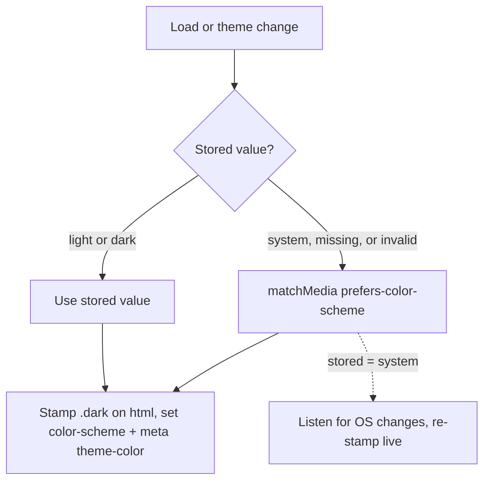

# feat: Dark mode via the zero-FOUC delivery ladder

## Summary

Ship dark mode in two independently landable rungs. v0: a complete dark token block in `apps/web/src/index.css` activated by the OS color-scheme preference — no JavaScript, no first-paint flash — plus fixes for the five verified hardcoded-color hazards, including a print stylesheet. v1: a tri-state light/dark/system toggle in both chrome preference slots, persisted in localStorage, with an inline boot script that keeps first paint flash-free once a manual choice exists.

---

## Problem Frame

The theme infrastructure is half-wired: `index.css:4` declares `@custom-variant dark (&:is(.dark *))` and 31 light-only `:root` variables mapped through `@theme inline`, but no dark values exist, so the variant is inert (see origin: docs/brainstorms/2026-08-04-dark-mode-requirements.md). The standard shadcn build path assumes a class toggle from day one, which creates a first-paint flash the reference guide doesn't solve. Shipping dark also exposes latent bugs immediately — two near-black scrims, `text-white` destructive text, a light-only `::selection`, and no print styles — so those fixes belong to v0, when OS-dark users first see the theme.

---

## Requirements

Carried from origin; IDs preserved.

**v0 — OS-following dark mode**

- R1. Every color token defined for light mode has a dark counterpart; no token silently falls back to its light value in dark mode.
- R2. Dark mode activates from the OS color-scheme preference with no JavaScript, and the first paint is in the correct theme.
- R3. The four status pairs keep their hue semantics in dark and meet WCAG contrast: 4.5:1 normal text, 3:1 large text and badges.
- R4. The known hardcoded-color hazards are fixed: scrims visible in dark, destructive-button text meets contrast in both themes, selection themed, printing always renders light.
- R5. Native browser UI (scrollbars, form controls, dropdowns) matches the active theme.

**v1 — manual control**

- R6. A tri-state control offers light, dark, and system; system is the default when no choice exists.
- R7. The control appears in both chrome preference slots and is keyboard- and screen-reader-operable, announcing its state.
- R8. The choice persists on the device across reloads and sessions; no server involvement.
- R9. First paint honors the stored choice — including mobile browser chrome color — with no flash, on every route.
- R10. An explicit choice overrides the OS preference in both directions; system follows OS changes live without reload.

---

## Key Technical Decisions

- **v0 activates via media query; v1 reverts activation to class-only.** At v0 the dark variant is widened to match `prefers-color-scheme: dark` as well as `.dark`, so both token overrides and existing `dark:` utilities (already present in `button.tsx`) fire with zero JS. At v1 the media branch is removed and the inline boot script becomes the sole resolver, stamping `.dark` from the stored choice (resolving `system` itself via `matchMedia`). Keeping both active would break R10 — an explicit light choice can't unset a media match. The ~5-line v0 widening is deliberately disposable; that is the ladder's design.
- **Theme state is device-local.** localStorage key with values `light` | `dark` | `system`; no `User.theme` column, no PATCH plumbing, no post-login reconcile (see origin, Key Decisions). Tri-state from the first commit — a boolean would need a stored-value migration later.
- **Extract a generic segmented control rather than copy LanguageSwitcher.** `LanguageSwitcher.tsx` is already a generic segmented control (`role="group"`, per-segment `aria-pressed`, `persist` hook). A shared `SegmentedSwitcher` makes LanguageSwitcher and ThemeSwitcher thin wrappers at roughly negative net LOC and fixes the pattern for future preference controls.
- **Status pairs are designed, chrome tokens may be derived.** The four status pairs keep hue and swap luminance roles (luminous foreground on a low-luminance tinted well); a mechanical lightness inversion is not acceptable for them (R3). The other chrome tokens can be first-drafted mechanically and reviewed. Two new tokens are minted: `--overlay` (scrims) and `--destructive-foreground` (replaces hardcoded `text-white`).
- **The dark palette is recorded as a DECISIONS.md entry** alongside `docs/design/rent-ops-reference.md`, mirroring DEC-017 — the repo's convention for durable design decisions.
- **The lightbox backdrop stays `bg-black/70` in both themes.** It is a deliberate theme-invariant "cinema surface" behind full-size photos; a code comment records this so a future cleanup doesn't tokenize it.

---

## High-Level Technical Design

Directional guidance, not implementation specification.

**Activation by rung:**

| Rung | Token activation | `dark:` utility variant | JS involved |
|---|---|---|---|
| v0 | `prefers-color-scheme: dark` media query | widened: class OR media | none |
| v1 | `.dark` class on `<html>` | class-only (v0 widening reverted) | inline boot script + theme module |

**v1 theme resolution (boot and on change):**

The inline script in `index.html` runs this once before first paint; the theme module re-runs it on toggle changes and owns the `matchMedia` listener for R10's live-follow.

---

## Implementation Units

### U1. Dark token block and v0 activation

- **Goal:** Complete dark palette live via OS preference — the v0 ship.
- **Requirements:** R1, R2, R3, R5.
- **Dependencies:** none.
- **Files:** `apps/web/src/index.css`, `docs/design/rent-ops-reference.md`, `docs/DECISIONS.md`.
- **Approach:** Add a dark counterpart for every `:root` color variable (`index.css:48-82`), including the eight status values and the two new tokens `--overlay` and `--destructive-foreground` (mint their light values too). Widen the dark variant so token overrides and `dark:` utilities activate on `prefers-color-scheme: dark` with no class present. Set `color-scheme` so native controls follow (R5). Replace the hardcoded `::selection` (`index.css:84-86`) with a themed pair. Status pairs: keep hue, swap luminance roles — directional starting values from the design pass, e.g. paid `#4cc38a` on `#122b1f`; overdue foreground brightest of the set. Record the final palette in `docs/design/rent-ops-reference.md` and a new DECISIONS entry.
- **Patterns to follow:** Existing `:root` block structure and `@theme inline` mapping (`index.css:6-45`); DEC-017's entry shape in `docs/DECISIONS.md`.
- **Test scenarios:** Test expectation: none — CSS-only unit; behavior covered by verification below.
- **Verification:** With OS dark: every screen renders dark with no light flash on reload (Covers AE1); no token renders its light value (spot-check status badges, sidebar, popovers, inputs). One-off contrast check of every fg/bg token pair in the dark block against R3 thresholds (script or tooling, not committed CI). Native scrollbars and the gallery `<select>` render dark.

### U2. Component hazard fixes

- **Goal:** The hardcoded-color sites render correctly in both themes.
- **Requirements:** R4.
- **Dependencies:** U1.
- **Files:** `apps/web/src/components/AppShell.tsx`, `apps/web/src/pages/InvoiceDetail.tsx`, `apps/web/src/components/ui/button.tsx`, `apps/web/src/components/InvoiceImageGallery.tsx`.
- **Approach:** Swap the drawer scrim (`AppShell.tsx:54`, `bg-black/40`) and delete-confirm scrim (`InvoiceDetail.tsx:160`, `bg-black/30`) to the `--overlay` token. Replace the destructive variant's `text-white` (`button.tsx:14`) with the `--destructive-foreground` token and reconcile the stray `dark:bg-destructive/60` against the new dark `--destructive` value so the pair meets contrast. Add the comment on the lightbox backdrop (`InvoiceImageGallery.tsx:154`) recording that `bg-black/70` is intentionally theme-invariant.
- **Patterns to follow:** Token-class usage everywhere else in the components (`bg-card`, `text-foreground`).
- **Test scenarios:** Test expectation: none — class swaps with no behavior change; covered by verification.
- **Verification:** In dark mode, opening the mobile drawer and the delete-confirm modal shows a visibly distinct scrim (Covers AE6); destructive buttons are readable in both themes; the lightbox backdrop is unchanged in both themes.

### U3. Print stylesheet

- **Goal:** Printing always produces light-on-white output regardless of active theme.
- **Requirements:** R4.
- **Dependencies:** U1.
- **Files:** `apps/web/src/index.css`.
- **Approach:** A `@media print` block re-pins the color tokens to light values and hides app chrome (sidebar, mobile header, toggle controls). Must win over both activation paths (media-query dark at v0, `.dark` class at v1).
- **Patterns to follow:** Token indirection — override the variables, not per-component rules.
- **Test scenarios:** Test expectation: none — print styling; covered by verification.
- **Verification:** Print preview of the invoice list and an invoice detail from dark mode renders light content on a white page with chrome hidden (Covers AE4); repeat from light mode for parity.

### U4. Theme module and first-paint boot script

- **Goal:** Tri-state theme state with flash-free first paint — the v1 foundation.
- **Requirements:** R8, R9, R10.
- **Dependencies:** U1.
- **Files:** `apps/web/index.html`, `apps/web/src/lib/theme.ts` (new), `apps/web/src/index.css`, `apps/web/test/theme.test.ts` (new).
- **Approach:** An inline blocking script in the `index.html` head reads the localStorage theme key, resolves `system` via `matchMedia`, and stamps `.dark`, `color-scheme`, and a `<meta name="theme-color">` before first paint. A theme module owns the same resolution for runtime: get/set the stored value, apply theme (class + color-scheme + meta), and hold the `matchMedia` listener that re-applies live while `system` is selected. Revert U1's variant widening to class-only in the same change (see KTD). Treat missing or invalid stored values as `system`.
- **Execution note:** Write the resolution tests first — the precedence rules are the whole unit.
- **Technical design:** Directional — the boot script and module share the resolution rules in the HTD flowchart; the inline script duplicates the few lines rather than importing (it must run before the bundle).
- **Patterns to follow:** `apps/web/src/lib/i18n.ts` module-load initialization; mock `matchMedia` in tests as jsdom lacks it.
- **Test scenarios:**
  - Stored `dark` on an OS-light environment resolves dark (Covers AE5).
  - Stored `light` on an OS-dark environment resolves light (Covers AE2).
  - Stored `system`, missing key, and an invalid stored value each resolve from `matchMedia`.
  - With `system` selected, a simulated OS change event re-applies the theme without reload (Covers AE3).
  - With `light` selected, a simulated OS change event does nothing.
  - Applying a theme updates the root class, `color-scheme`, and the theme-color meta together.
  - Setting a theme writes the stored value; setting `system` still writes `system` (not a resolved value).
- **Verification:** Cold load with each stored value paints the correct theme with no flash on desktop and mobile viewports; meta theme-color matches the active background.

### U5. ThemeSwitcher control and mounts

- **Goal:** The user-facing tri-state toggle in both chrome slots.
- **Requirements:** R6, R7, R10.
- **Dependencies:** U4.
- **Files:** `apps/web/src/components/SegmentedSwitcher.tsx` (new), `apps/web/src/components/LanguageSwitcher.tsx`, `apps/web/src/components/ThemeSwitcher.tsx` (new), `apps/web/src/components/AppShell.tsx`, `apps/web/src/components/Sidebar.tsx`, `apps/web/src/locales/en/translation.json`, `apps/web/src/locales/zh/translation.json`, `apps/web/test/ThemeSwitcher.test.tsx` (new), `apps/web/test/LanguageSwitch.test.tsx`.
- **Approach:** Extract the generic segmented control from `LanguageSwitcher.tsx:14-47` (container, `role="group"`, per-segment `aria-pressed`, active/inactive classes); LanguageSwitcher becomes a thin wrapper with unchanged behavior. ThemeSwitcher renders three icon segments — sun, moon, monitor — as 20×20 inline SVGs per the `NotificationsBell.tsx:37-40` convention, each with an `aria-label` from new `settings.theme.*` i18n keys, calling the U4 module on select. Mount in the AppShell mobile header control cluster (`AppShell.tsx:24-50`) and the Sidebar footer (`Sidebar.tsx:26-38`) beside LanguageSwitcher.
- **Patterns to follow:** `LanguageSwitcher` structure and its test (`apps/web/test/LanguageSwitch.test.tsx` mock/assert shape); `settings.<section>.<field>` i18n key pattern.
- **Test scenarios:**
  - Renders three segments with the current theme's segment `aria-pressed=true`.
  - Clicking a segment applies the theme (module called) and updates pressed state.
  - Clicking the already-active segment is a no-op.
  - Default state with no stored value shows system as active (Covers R6).
  - Keyboard activation (Enter/Space on a focused segment) selects it.
  - Existing LanguageSwitcher tests stay green after the extraction.
- **Verification:** Toggle visible and usable in mobile header and desktop sidebar; screen reader announces group label and per-segment state; explicit choices override OS preference both directions in a live browser (Covers AE2).

---

## Scope Boundaries

Carried from origin — deferred for later:

- View Transitions theme-switch animation (circular wipe).
- Server-synced theme preference.
- Theme-invariant photo mat for photo wells and lightbox.
- Contrast-test and raw-color lint CI gates (the "theme integrity suite") — the U1 contrast check is a one-off dev-time verification, not CI.
- Role-aware theme defaults.

### Deferred to Follow-Up Work

- Auditing the remaining `dark:` utility classes in `apps/web/src/components/ui/` beyond `button.tsx` once the dark palette exists — shadcn scaffold components may carry stale opacity-based dark variants worth reconciling with real token values.

---

## Acceptance Examples

Carried from origin; enforced by unit test scenarios and verification steps as linked above.

- AE1. OS-dark device, v0 deployed: cold load's first rendered frame is dark — no light flash.
- AE2. OS-dark device: selecting light renders light immediately and on every subsequent load.
- AE3. System selected: an OS theme switch while the app is open is followed without reload.
- AE4. Dark mode active: printing an invoice renders light values on a white page.
- AE5. Stored dark on an OS-light device: cold load's first frame is dark — no flash.
- AE6. Dark mode active: modal and drawer scrims are visibly distinct from the page behind them.

---

## Sources / Research

- `docs/brainstorms/2026-08-04-dark-mode-requirements.md` — origin requirements; carries the rejected alternatives and decision rationale.
- `docs/ideation/2026-08-04-dark-mode-toggle-ideation.html` — upstream ideation with verified evidence for every hazard site.
- `apps/web/src/index.css:4,6-45,48-82,84-86` — variant declaration, `@theme inline` mapping, the full light token inventory, hardcoded selection.
- `apps/web/src/components/LanguageSwitcher.tsx:14-47`, `apps/web/src/components/AppShell.tsx:24-50`, `apps/web/src/components/Sidebar.tsx:26-38` — the segmented-control precedent and both mount sites.
- `apps/web/index.html:1-13` — bare head the boot script lands in; `apps/web/src/main.tsx:10` — module-load init precedent.
- `docs/design/rent-ops-reference.md`, `docs/DECISIONS.md` (DEC-017, DEC-020) — palette source of truth and conventions.
- External: shadcn Vite dark-mode guide (ThemeProvider shape; omits the boot script), notanumber.in on SPA theme flash, web.dev theme-switch component (accessible toggle pattern), WCAG 1.4.3 thresholds.
