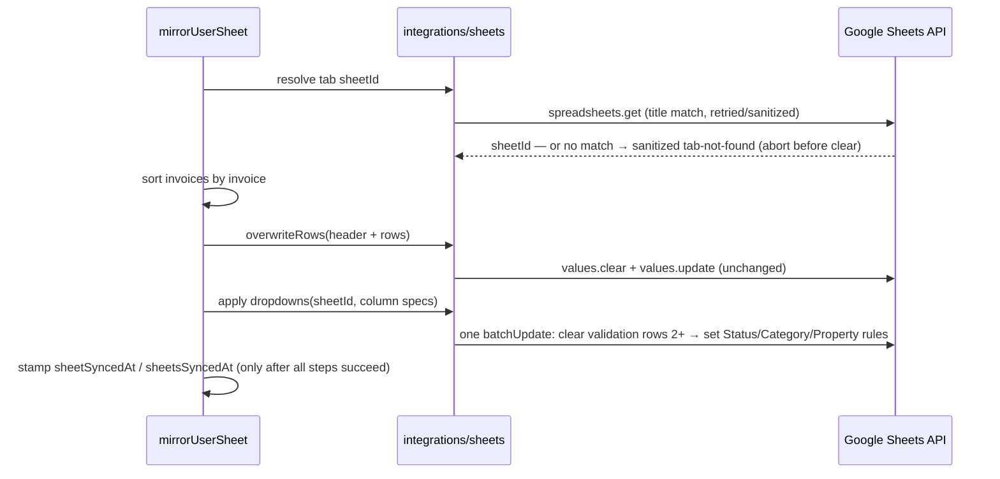

# feat: Sheets mirror — new column order, invoice-number sort, dropdowns

## Summary

Reshape the Google Sheets invoice mirror: reorder the exported columns to the operator's layout (adding Notes, dropping ID and Vendor), sort rows ascending by invoice number instead of invoice date, and add in-sheet dropdowns (Sheets data validation) for the Status, Category, and Property columns, refreshed on every sync. All Sheets changes ride the existing full clear+rewrite mirror (DEC-024); no app-UI or schema changes.

---

## Problem Frame

The sheet is the landlord's accounting surface, and its current layout is developer-shaped: an internal `id` column first, rows ordered by date rather than ledger number, and free-text cells where a fixed vocabulary exists. The operator wants the sheet to read like a ledger — invoice number first and ascending — with dropdowns keeping Status/Category/Property values consistent for filtering.

The sheet remains a one-way mirror (DEC-001): dropdown edits made in the sheet do not flow back and are overwritten on the next sync. Dropdowns are a convenience/consistency aid, accepted as such.

---

## Requirements

**Column layout**

- R1. Exported columns, in order: Invoice #, Date, Description, Property, Amount, Category, Status, Notes, Parts Ordered, Invoice Link — with Invoice Link still last.
- R2. `id` and `vendorName` are no longer exported; `notes` is exported (empty string when null).

**Row ordering**

- R3. Rows sort ascending by invoice number, numerically aware ("9" before "10"); non-numeric or mixed values ("A-102") sort deterministically via a natural-order comparator.
- R4. Rows with no invoice number (numbers are stamped on first APPROVED — exportable PENDING rows routinely have none) sort last, tiebroken by invoice date then id, stably.

**Dropdowns**

- R5. The Status column offers a dropdown of the exportable statuses only: PENDING, APPROVED, PAID (derived from the shared enum minus `NON_EXPORTABLE_STATUSES`).
- R6. The Category column offers a dropdown of the six `InvoiceCategory` values.
- R7. The Property column offers a dropdown of the landlord's property addresses — deduped, trimmed, empty strings dropped, sorted — rebuilt on every sync. With zero properties the rule is skipped (an empty `ONE_OF_LIST` is a Google 400) while any prior rule on the column is still cleared.
- R8. Validation applies from row 2 downward, unbounded, and is re-applied idempotently each sync; each pass first clears all validation on the data grid so rules from a prior column layout never linger on shifted columns (`values.clear` does not remove validation).
- R9. All new Google calls (`spreadsheets.get` tab lookup, `batchUpdate`) go through the existing retry/sanitize wrapper (CONV-016). A tab-title miss fails with a distinct sanitized error before any destructive write — never a silent fallback to grid 0.

**Mirror semantics and docs**

- R10. Existing mirror semantics are preserved: full clear+rewrite, per-user error isolation, overwrite-then-stamp to `flushStart`, change gating. A validation failure fails that user's sync — no stamp, user stays dirty, next pass re-mirrors (at-least-once).
- R11. `docs/specs/continuous-sheets-sync.md` and `docs/SHEETS_EXPORT.md` reflect the new column order, sort, and dropdown behavior; `docs/DECISIONS.md` gains an entry recording the layout change and dropdown design.

---

## Key Technical Decisions

- **Dropdowns as `ONE_OF_LIST` re-applied each sync, not `ONE_OF_RANGE` + hidden options tab.** Re-issuing `setDataValidation` over the same range replaces the prior rule, so refresh is idempotent with no hidden-tab lifecycle (create/hide/repair). Option lists are tiny against the ~500-item `ONE_OF_LIST` limit.
- **One `batchUpdate` per sync: clear validation on rows 2+ across the grid, then set the three rules.** Atomic ("if any request is invalid, none apply"), and the leading clear removes stale rules from shifted columns (R8).
- **Tab `sheetId` resolved every sync via `spreadsheets.get` title match; no caching.** Validation requires a numeric `GridRange.sheetId` (no A1 form). An exact-title miss throws a new sanitized `SHEET_TAB_NOT_FOUND`-style error; an omitted/undefined sheetId would silently target the first tab. A deleted-and-recreated tab changes gid, so per-sync lookup self-heals; cost is one read per sync — negligible against quota.
- **Lookup ordering: resolve gid → overwrite values → apply validation.** The lookup fails fast before the clear can wipe data; validation lands after values so ordering ambiguity never arises (API writes bypass `strict` anyway).
- **Mixed addressing is deliberate — don't unify it.** Values calls stay title-addressed (A1 via the tab name) while validation is gid-addressed. A tab rename between lookup and the values write makes the title-based clear fail before damage; a rename after the values write leaves the gid still pointing at the same renamed tab, so the batchUpdate lands correctly. No unsafe window.
- **Validation failure fails the sync.** Matches the existing non-atomic clear/update posture and DEC-024's at-least-once model. Trade-off: a persistent failure (renamed tab) re-burns quota each cron pass, but surfaces loudly in "Sync now" instead of rotting silently.
- **`strict: true` + `showCustomUi: true`.** Manual edits are overwritten by the next mirror either way; strict stops the landlord typing values the mirror would erase, reducing confusion. Blank cells (nullable category, unassigned property) are valid regardless of strict.
- **Sort as an in-memory natural-order comparator (`Intl.Collator` numeric), not Prisma `orderBy`.** `invoiceNumber` is a nullable string by decision (DEC-023); SQL string sort puts "10" before "9". Determinism comes from the comparator itself — non-null numbers are unique by schema, and the null group tiebreaks by invoice date then id (R4). The existing `invoiceDate asc` Prisma order stays as harmless belt-and-suspenders, not a correctness dependency.
- **`withRetry` becomes generic (returns a value).** It currently discards results; the gid lookup needs the `spreadsheets.get` response through the same retry/sanitize policy.
- **Vendor is dropped from the sheet entirely** — column and dropdown — per the operator's stated layout. Vendor data stays app-side only.

---

## High-Level Technical Design

New per-user mirror sequence (directional — function boundaries are the implementer's call, ordering is not):

Dropdown column specs (which column index gets which value list) are derived from `EXPORT_COLUMNS` positions in `sheetRows.ts`, so layout and validation cannot drift apart. Manual "Sync now" and the cron share `mirrorUserSheet`, so parity is automatic.

---

## Implementation Units

### U1. Sheets integration: generic retry, tab lookup, dropdown batchUpdate

**Goal:** `integrations/sheets.ts` can resolve a tab's numeric sheetId and apply/clear column dropdown validation, with the same retry/sanitize/timeout policy as existing calls.

**Requirements:** R7 (the skip-on-empty guard lives at the integration seam — defense against any future caller producing the empty-`ONE_OF_LIST` 400), R8, R9.

**Dependencies:** none.

**Files:** `apps/api/src/integrations/sheets.ts`, `apps/api/src/integrations/sheetCells.ts` (shared dropdown-spec type), `apps/api/test/integrations/sheets.test.ts`.

**Approach:** Make `withRetry` generic so wrapped calls can return values; keep its sanitize-on-final-attempt behavior byte-identical (existing tests needing zero edits is the canary). Add a tab-resolution call: only the raw `spreadsheets.get` (fields mask `sheets.properties(sheetId,title)`) runs inside `withRetry`; the exact case-sensitive title match happens on the returned data *outside* the wrapper, throwing the new AppError code on a miss — `sanitize` flattens everything it catches to generic codes, so a distinct error thrown inside the wrapper would be eaten. The error message names the expected tab (from `GOOGLE_SHEET_TAB`, non-secret) so "Sync now" failures self-diagnose. Handle a `null` sheetId from the API. Add a validation call that issues one `batchUpdate`: a leading clear-validation request over the data grid (row 2+, unbounded), then one `setDataValidation` per supplied column spec (`ONE_OF_LIST`, `showCustomUi: true`, `strict: true`, `GridRange` row 2+ unbounded on the given column index). Column specs with empty value lists are omitted from the set requests (the clear still covers them). The `{columnIndex, values}` spec type lives in `sheetCells.ts` — the established home for shapes shared between the pure row-builder side and the googleapis side — so `sheetRows.ts` never imports from `integrations/sheets.ts`. Both calls carry the 30s timeout and never leak raw Google errors.

**Patterns to follow:** existing `overwriteRows`/`checkAccess` structure, `withRetry` + `sanitize` policy, `vi.mock('googleapis')` payload-assertion style in `apps/api/test/integrations/sheets.test.ts`.

**Test scenarios:**
- Tab lookup returns the matching tab's sheetId when several tabs exist; match is exact and case-sensitive.
- Tab lookup with no matching title throws the new error code — asserted end-to-end through the wrapper, proving the distinct code survives (is not flattened to the generic sheet error); message names the expected tab; raw Google payload absent.
- Lookup retries on 429 then succeeds (using the `SHEETS_RETRY_BASE_MS` knob); a 400 is not retried.
- Validation call sends one `batchUpdate` whose first request clears validation from row 2 down across the grid and whose subsequent requests set ONE_OF_LIST rules with the expected values, column indices, `showCustomUi`/`strict` flags, and 30s timeout.
- A column spec with an empty values list produces no set request for that column while the clear request still fires.
- A Google error from `batchUpdate` surfaces as a sanitized AppError.

**Verification:** integration test file green with the extended googleapis mock; no live network calls.

### U2. Row shape: new column order, Notes, natural-order comparator, dropdown specs

**Goal:** `sheetRows.ts` emits the new layout and owns everything derived from it: header labels, row mapping, the invoice-number comparator, and the dropdown column specs.

**Requirements:** R1, R2, R3, R4, R5, R6.

**Dependencies:** none (parallel with U1).

**Files:** `apps/api/src/invoices/sheetRows.ts`, `apps/api/test/sheetRows.test.ts`, `apps/api/test/sheets.sync.test.ts` and `apps/api/test/invoices.export.test.ts` (positional assertions only — they read cells at old-layout indices and break the moment `EXPORT_COLUMNS` changes; behavioral changes to those files stay in U3, keeping each unit green on its own).

**Approach:** Reorder `EXPORT_COLUMNS` to `invoiceNumber, invoiceDate, description, propertyAddress, amount, category, status, notes, partsOrdered, invoiceLink`; drop `id`/`vendorName` from columns, labels, `InvoiceRowInput`, and `invoiceToRow`; map `notes` (null → empty string; existing `safeCell` guard already neutralizes leading formula characters in note text). Add a natural-order invoice comparator (`Intl.Collator` numeric): nulls last, null-group tiebreak by invoice date then id. Add dropdown spec builders: status options from the shared enum minus `NON_EXPORTABLE_STATUSES`, category options from the shared enum, property options built from a supplied address list (trim, drop empties, dedupe, sort) — each paired with its column index derived from `EXPORT_COLUMNS.indexOf` so specs track the layout (spec type imported from `sheetCells.ts`, never from `integrations/sheets.ts`). Landing U2 alone ships the new layout live without the sort/dropdowns — an acceptable half-state noted here so it isn't mistaken for a defect.

**Patterns to follow:** `sheetRows.ts` stays pure (no DB, no googleapis) — the module's stated contract; enums from `packages/shared/src/schemas/invoice.ts`.

**Test scenarios:**
- Header equals the new ten labels in order; Invoice Link is last.
- `invoiceToRow` places each field at its new index; notes null → `''`; a note starting with `-` or `=` survives the formula guard (neutralized downstream), embedded newlines pass through.
- Comparator: "9" < "10"; "2" < "9" < "10" ordering of a shuffled list; "A-102" vs numeric values is deterministic; all-null list falls back to date-then-id order; sort is stable.
- Status spec contains exactly PENDING/APPROVED/PAID; category spec the six enum values; property spec trims, drops empty, dedupes, sorts; each spec's column index matches its column's position in `EXPORT_COLUMNS`.

**Verification:** `sheetRows.test.ts` green; module still imports no DB/google code.

### U3. Mirror wiring: sort, property fetch, validation step, failure semantics

**Goal:** `mirrorUserSheet` produces the new sheet end-to-end: gid lookup first, rows sorted by invoice number, dropdowns applied after the values write, stamps only on full success.

**Requirements:** R3, R4, R7, R9 (ordering), R10.

**Dependencies:** U1, U2.

**Files:** `apps/api/src/invoices/sheetSync.ts`, `apps/api/test/sheets.sync.test.ts`, `apps/api/test/invoices.export.test.ts`.

**Approach:** In `mirrorUserSheet`: resolve the tab sheetId before any write (fail fast pre-clear); fetch the landlord's property addresses (`landlordId: userId`); sort the fetched invoices with the U2 comparator (keep the Prisma `invoiceDate asc` pre-sort); write values; apply the U2-built dropdown specs via the U1 call; stamp `sheetSyncedAt`/`sheetsSyncedAt` only after all Google steps succeed. Per-user try/catch in `runSheetsSyncFlush` is untouched — a validation throw counts that user as failed and leaves them dirty. Update positional assertions in the seam-mocked tests.

**Execution note:** run API tests only against the local docker Postgres on port 5433 — these exact sync tests once stamped real rows in the hosted prod DB (2026-08-03 incident); check `DATABASE_URL` before the first test run.

**Test scenarios:**
- Mirror payload rows arrive sorted by invoice number (e.g., numbers "2", "10", "9" → "2", "9", "10"), with a null-numbered PENDING row last.
- Dropdown call receives the landlord's property addresses deduped/trimmed/sorted, and the status/category lists; a landlord with zero properties yields a property spec that sets no rule.
- Tab-lookup failure aborts before `overwriteRows` is called; no stamps written.
- Validation-step failure after a successful values write: `sheetSyncedAt` not stamped, flush summary counts the user as failed, other users unaffected.
- Successful mirror stamps to `flushStart` as before (existing assertions keep passing).
- Manual export route (`POST /api/invoices/export`) returns the new header/positions; second-user isolation assertions still hold.
- Cron parity: `runSheetsSyncFlush` drives the same mirror (existing coverage; adjust mocks only).

**Verification:** `sheets.sync.test.ts`, `invoices.export.test.ts`, `cron.sync-sheets.test.ts` green against the local DB; full DoD (`npm run lint && npm run typecheck && npm run test`) green.

### U4. Documentation

**Goal:** the governing docs match the shipped behavior.

**Requirements:** R11.

**Dependencies:** U2, U3 (final shapes).

**Files:** `docs/specs/continuous-sheets-sync.md`, `docs/SHEETS_EXPORT.md`, `docs/DECISIONS.md`.

**Approach:** Update the spec's column table and flush-algorithm sort (it still lists the pre-`invoiceLink` layout — treat `sheetRows.ts` as truth), refresh the operator doc, and append a DEC entry covering: new column order (ID/Vendor dropped, Notes added), invoice-number natural sort, ONE_OF_LIST dropdowns refreshed per sync, validation-failure-keeps-dirty semantics.

**Test expectation:** none — documentation only.

**Verification:** spec/operator doc no longer mention `id`/`vendorName` columns or date ordering; DEC entry appended in log order.

---

## Scope Boundaries

- No read-back from the sheet — dropdown edits in the sheet are still overwritten by the next mirror (DEC-001 stands).
- No Vendor column or Vendor dropdown (operator's layout is authoritative); vendor stays app-side.
- No app-UI, schema, or shared-package changes; no new env vars.
- Header labels stay the existing human-friendly forms ("Property", "Amount") rather than the slash-forms from the request ("Property/Location", "Price/Amount").
- No forced global re-mirror on deploy: change gating means a user's sheet updates on their next data change or a manual "Sync now" (see Operational Notes).

### Deferred to Follow-Up Work

- Settings "Test connection" could also verify the pinned tab exists (today it checks spreadsheet access only); the new hard-fail on tab mismatch makes that check more valuable.

---

## Risks & Dependencies

- **`strict` enforcement for API writes is not officially documented.** Observed behavior across the ecosystem: `values.update` bypasses validation, so the mirror can't reject its own writes. The design doesn't depend on it (mirror values come from the same enums), but if Google ever enforces strict on API writes, property values written before a property is renamed could fail — the clear-then-set ordering in one batchUpdate keeps rules and values from the same sync.
- **Quota/cost:** sync cost rises from 2 writes to 3 writes + 1 read per dirty user — far under the 60/min/user and 300/min/project limits. Google has signaled charging for quota *overages* later in 2026; staying change-gated keeps unchanged landlords at zero calls.
- **Positional consumers:** no runtime code reads the sheet; only tests and the operator's own in-sheet formulas address positions. The operator should expect any personal formulas referencing old column letters to need a one-time fix after the first re-mirror.
- **Shared env-default sheet:** the manual export path falls back to the shared `GOOGLE_SHEET_ID` sheet, where a second user's "Sync now" replaces the property-dropdown options (and rows) with their own — inherent to the existing clear+rewrite on a shared target, already accepted for cron via the per-user-only filter. No design change; noted for awareness.
- **Test-connection divergence:** Settings "Test connection" checks spreadsheet access only, so it can report green while every sync fails on a missing/renamed tab. Mitigated now by the tab-not-found error naming the expected tab; the full tab check is deferred (see Scope Boundaries).

---

## Documentation / Operational Notes

- After deploy, the new layout appears per landlord on their next data change or immediately via "Sync now" (the manual path is not change-gated). Suggest a "Sync now" click to cut over.
- Old validation rules from any earlier layout are cleared by the first post-deploy mirror (the leading clear request), so no manual sheet cleanup is needed.

---

## Sources & Research

- Current mirror: `apps/api/src/invoices/sheetRows.ts`, `apps/api/src/invoices/sheetSync.ts`, `apps/api/src/integrations/sheets.ts`, `apps/api/src/integrations/sheetCells.ts`.
- Governing decisions/conventions: `docs/DECISIONS.md` DEC-001, DEC-021, DEC-023 (invoiceNumber stays a nullable string), DEC-024 (full-mirror sync); `docs/CONVENTIONS.md` CONV-012 (real-DB integration tests), CONV-016 (integrations behind thin mockable modules, sanitized errors).
- Sheets API: [batchUpdate request types — SetDataValidationRequest](https://developers.google.com/workspace/sheets/api/reference/rest/v4/spreadsheets/request), [DataValidationRule](https://developers.google.com/workspace/sheets/api/reference/rest/v4/spreadsheets/cells), [values.clear keeps validation](https://developers.google.com/workspace/sheets/api/reference/rest/v4/spreadsheets.values/clear), [usage limits](https://developers.google.com/workspace/sheets/api/limits). ONE_OF_LIST ~500-item ceiling is community-documented, not official.
- `googleapis@^173` installed types confirm `SetDataValidationRequest.range` is `GridRange`-only (no A1 form) and `rule` is optional (omit to clear).
