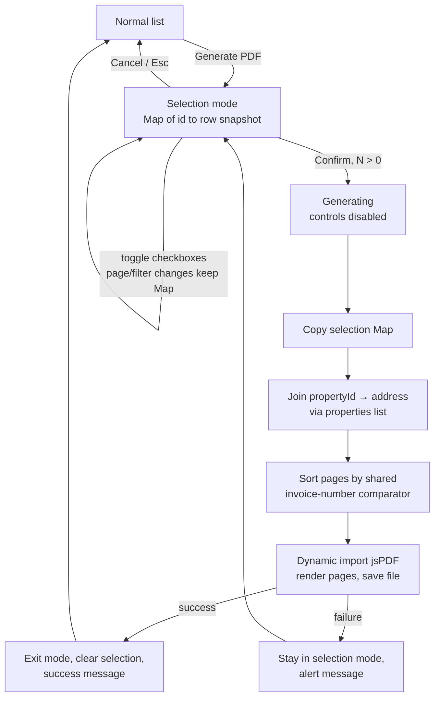

# feat: Multi-invoice PDF export on the Invoices page

## Summary

Add a "Generate PDF" button to the Invoices page that enters a selection mode; a "Confirm" button exports the selected invoices to a single client-side-generated PDF, one invoice per page, each page showing a Location / Description / Amount table with a Balance due line beneath. No API changes; jsPDF + jspdf-autotable behind a dynamic import.

---

## Problem Frame

The landlord needs a hand-to-someone paper artifact for a chosen set of invoices (e.g., for an accountant or tenant). The app's only export today is the Google Sheets mirror, which is a background sync, not a user-curated document. The user asked for explicit invoice selection and a per-invoice-page PDF layout, with the layout extensible for future sender/recipient (contractor/landlord) sections.

Implementation work happens in a dedicated git worktree created off `main` (user request); the branch merges back to `main` when done.

---

## Requirements

**Selection mode**

- R1. A "Generate PDF" button in the Invoices page header (alongside "Export to Sheets" / "New invoice") enters selection mode; checkboxes appear on the invoice table rows.
- R2. Selection mode shows a selected-count indicator and Confirm / Cancel controls; Cancel (or Esc) exits and restores the normal list; Confirm is disabled while zero invoices are selected.
- R3. Selection persists across page and filter changes; the count indicator keeps off-screen selections visible.

**PDF output**

- R4. Confirm generates one PDF in the browser containing all selected invoices, one invoice per page, pages ordered by natural invoice-number order (numeric-aware, un-numbered invoices last by date then id — same ordering as the Sheets export).
- R5. Each page shows: an identifying header (invoice number and date), a table with Location (property address), Description, and Amount columns, the invoice status, and a "Balance due" line below the table.
- R6. Balance due equals the invoice amount for PENDING, APPROVED, and SUBMITTED invoices, and $0.00 for PAID, REJECTED, and CANCELLED invoices.
- R7. The PDF is a fixed-English artifact: labels and number/date formatting use `en-US` regardless of the UI locale.
- R8. The file downloads as `invoices-YYYY-MM-DD.pdf` (generation date in the user's local timezone, not UTC).

**Feedback and quality**

- R9. Confirm is single-flight (disabled while generating); success and failure feedback use the page's existing inline `aria-live` status region. Failure keeps selection mode and the selection intact.
- R10. Successful export exits selection mode, clears the selection, and shows a success message.
- R11. All new UI strings have entries in both `en` and `zh` catalogs (the PDF content itself is English per R7).
- R12. The PDF library loads via dynamic `import()` so it stays out of the initial bundle.

---

## Key Technical Decisions

- **Client-side generation with jsPDF + jspdf-autotable; no API changes.** Text-only content needs no server rendering. jsPDF is the smallest option (~137 KB gzip combined vs 342 KB pdfmake, 471 KB @react-pdf/renderer), MIT, actively maintained (v4 line, Jan 2026 security release), and framework-agnostic — @react-pdf/renderer has known Vite/yoga-layout bundling friction, and pdf-lib has no table primitives and stalled maintenance. Programmatic generation is also theme-independent by construction, satisfying the settled "exports are always light" rule (DEC-025e). Use the standalone `autoTable(doc, opts)` function to avoid the jsPDF TS module-augmentation step. A print-stylesheet `window.print()` route (zero dependencies, native CJK) was also rejected: it cannot produce a dialog-free download with a controlled filename (R8), per-invoice page breaks are fragile across browsers, and the page model would not be unit-testable.
- **Data source: snapshot list rows at selection time; resolve Location with one `useProperties()` join.** Everything a page needs (description, amount string, status, invoice number, date) is already on `InvoiceListItem`; the property address is resolved by joining the row's `propertyId` against the properties list (one request total). This avoids N per-invoice detail fetches and their partial-failure handling — the detail endpoint doesn't return the address today anyway. Selection stores `Map<id, row>` so rows selected on other pages don't depend on query-cache retention.
- **Page ordering reuses the Sheets export comparator, moved to `packages/shared`.** `compareForExport` in `apps/api/src/invoices/sheetRows.ts` is pure (numeric `Intl.Collator`, un-numbered last by date then id). The web workspace can't import from the api workspace, so the comparator moves to shared (accepting `Date | string` dates) and the api re-exports it — one ordering rule, no drift.
- **Fixed-English artifact.** The Sheets export's headers are English; a document handed to third parties shouldn't flip languages with the landlord's UI setting; and jsPDF's built-in fonts can't render CJK — embedding a CJK font costs multiple MB. PDF labels and formatting are `en-US`. CJK glyphs in user-entered data (descriptions, addresses) will not render correctly; font embedding is deferred (see Risks, Scope Boundaries).
- **Balance-due rule extends the confirmed paid/unpaid baseline with the "not real spend" precedent.** The user confirmed amount-when-unpaid / $0-when-paid. The Sheets export excludes REJECTED, CANCELLED, and SUBMITTED as "not real spend"; the PDF shows $0.00 for REJECTED and CANCELLED (a claim that money is due on a rejected invoice would be factually wrong) but keeps the full amount for SUBMITTED — an un-vetted but live claim the user explicitly selected — and every page prints the status so the reader sees why.
- **Selection is ephemeral local state, not URL state.** DEC-020 scopes URL state to shareable filter/sort/page navigation; selected IDs are transient. Confirm operates on a copy of the selection taken at click time so mid-generation changes can't mutate an in-flight export.
- **One PDF column definition constant.** Mirroring `EXPORT_COLUMNS` in the Sheets export, the PDF's table columns and page sections live in one exported definition so the future sender/recipient blocks extend a single place.
- **Long text spills to continuation pages.** autotable paginates a row whose wrapped text exceeds the page; allowing spill loses no data. Truncation is rejected.
- **No new UI primitives beyond a styled native checkbox.** The repo has no checkbox component and only shadcn `Button`; a styled native `<input type="checkbox">` avoids a new Radix dependency for one use.

---

## High-Level Technical Design

Selection-mode lifecycle and the confirm-time data flow:

The PDF module splits into a pure page-model builder (rows in, ordered page descriptions out — unit-testable without jsPDF) and a thin render wrapper that feeds the model to jsPDF/autoTable behind the dynamic import.

---

## Scope Boundaries

**Non-goals**

- No images in the PDF (user-excluded).
- No changes to invoice data, other pages, or the API.

### Deferred to Follow-Up Work

- Sender/recipient sections (landlord `User` name/email, contractor `Contractor` name/contact) — the column/section definition constant is the extension point; the data needs a fetch beyond list rows when it lands.
- CJK font embedding for localized or Chinese-content PDFs.
- "Select all matching filter" across server pagination (needs a server-side ids endpoint; DEC-020(b) precedent rejects client-side page crawling).
- A totals/summary page across selected invoices.
- Server-side or emailed PDFs.
- An interactive selected-invoices list (view/remove off-screen selections from the counter); v1 relies on visible-row unchecking and Cancel-to-clear.

---

## Implementation Units

### U1. Shared natural-order invoice comparator

- **Goal:** One invoice-ordering rule usable from both workspaces.
- **Requirements:** R4
- **Dependencies:** none
- **Files:** `packages/shared/src/lib/invoiceOrder.ts` (new; exact placement per shared package conventions), `packages/shared/src/index.ts`, `apps/api/src/invoices/sheetRows.ts`, `apps/api/test/sheetRows.test.ts` (or existing equivalent), `packages/shared/test/invoiceOrder.test.ts`
- **Approach:** Move the `compareForExport` logic (numeric `Intl.Collator`, un-numbered invoices last, tiebreak by date then id) into shared, generalized to accept `invoiceDate: Date | string`. The api's `sheetRows.ts` delegates to it so Sheets ordering behavior is unchanged.
- **Patterns to follow:** `packages/shared` existing exports/structure; `apps/api/src/invoices/sheetRows.ts` for the current comparator semantics.
- **Test scenarios:**
  - "9" sorts before "10" and "INV-9" before "INV-10" (numeric-aware, not lexicographic).
  - Un-numbered (null invoice number) invoices sort after all numbered ones, ordered by date then id.
  - Date inputs as ISO strings and as `Date` objects produce the same order.
  - Existing Sheets export ordering tests still pass unchanged (behavior pin).
- **Verification:** Shared and api tests green; Sheets export row order identical to before.

### U2. PDF document module

- **Goal:** A `lib/`-level module that turns invoice rows plus property addresses into the downloaded PDF.
- **Requirements:** R4, R5, R6, R7, R8, R12
- **Dependencies:** U1
- **Files:** `apps/web/src/lib/invoicePdf.ts` (new), `apps/web/test/invoicePdf.test.ts` (new), `apps/web/package.json` (add `jspdf`, `jspdf-autotable`)
- **Approach:** Two layers. (1) A pure page-model builder: takes selected rows and a `propertyId → address` map, returns ordered page descriptions (header fields, table rows, status label, balance-due value) using the shared comparator and the balance-due rule; missing property or null invoice number render as `—` (the table's existing convention). Money and dates format with explicit `en-US` `Intl` formatters (the app's `formatMoney`/`formatDate` are UI-locale-bound; the PDF is fixed-English — extract or parallel them as needed). Balance due is per-page display of a single amount; no cross-invoice arithmetic. (2) A render wrapper that dynamically imports `jspdf` and `jspdf-autotable` (standalone `autoTable` function form), renders each page description (one `addPage` per invoice, autotable spill allowed), and saves as `invoices-YYYY-MM-DD.pdf`. Column/section layout lives in one exported definition constant.
- **Patterns to follow:** `apps/api/src/invoices/sheetRows.ts` (`EXPORT_COLUMNS` single-source shape); `apps/web/src/lib/format.ts` (formatter shape); `apps/web/test/format.test.ts` (pure-helper test shape).
- **Test scenarios (page-model builder; render wrapper mocked or smoke-tested only):**
  - Happy path: two invoices with properties produce two pages with address, description, formatted amount, status, and correct balance due.
  - Balance due: PENDING/APPROVED/SUBMITTED → amount; PAID/REJECTED/CANCELLED → $0.00.
  - Null property (`propertyId` null or unmatched) → Location renders `—`.
  - Null invoice number → header fallback `—`, page sorts last per comparator.
  - Page order follows natural invoice-number order regardless of selection order.
  - Amount strings format as USD currency (e.g., `"1234.50"` → `$1,234.50`); invalid amount falls back to `—` (matching `formatMoney`).
  - Render wrapper: dynamic import invoked only when called (not at module load).
- **Verification:** Unit tests green; importing the invoices page does not pull jsPDF into the eager module graph (verifiable via the dynamic-import test and build output).

### U3. Selection mode on the Invoices page

- **Goal:** Selection UX: enter/exit selection mode, per-row checkboxes, count indicator, Confirm/Cancel controls.
- **Requirements:** R1, R2, R3, R11
- **Dependencies:** none
- **Files:** `apps/web/src/pages/InvoiceList.tsx`, `apps/web/src/components/InvoiceTable.tsx`, `apps/web/src/locales/en/translation.json`, `apps/web/src/locales/zh/translation.json`, `apps/web/test/InvoiceList.test.tsx`, `apps/web/test/InvoiceTable.test.tsx`
- **Approach:** `InvoiceList` owns selection state as `Map<invoiceId, InvoiceListItem>` plus a mode flag; `InvoiceTable` gains an optional selection prop rendering a leading checkbox column (styled native inputs, accessible names like "Select invoice #123 — Ace Plumbing" with `—` fallback for null numbers). The invoice-number link stays active; the rest of the row becomes a checkbox hit target in selection mode. "Generate PDF" toggles the mode; Confirm and Cancel plus an "N selected" counter replace/join the header controls; Esc cancels; the `aria-live` region announces mode entry. "Export to Sheets" is disabled during selection mode, "Generate PDF" is disabled while the Sheets export is in flight, and entering selection mode clears any lingering Sheets export message (one status region, one export at a time, in both directions). Entering selection mode moves focus to the first row's checkbox; exiting (Cancel, Esc, or successful export) returns focus to the "Generate PDF" button so keyboard and screen-reader users keep their place. Checkbox toggles update the Map; page/filter navigation leaves it untouched.
- **Test scenarios:**
  - Clicking "Generate PDF" shows checkboxes, Confirm (disabled at 0 selected), Cancel, and the counter; Cancel and Esc both restore the normal list and clear the selection.
  - Checking two rows shows "2 selected" and enables Confirm; unchecking updates both.
  - Selection survives a page change (mock two pages; select on page 1, navigate, counter still shows the selection).
  - Row click in selection mode toggles the checkbox; the invoice-number link still navigates.
  - Checkboxes have accessible names including the invoice number or the `—` fallback.
  - "Export to Sheets" is disabled while in selection mode; "Generate PDF" is disabled while the Sheets export mutation is pending; entering selection mode clears a lingering Sheets success message.
  - Focus moves to the first row checkbox on mode entry and returns to "Generate PDF" on exit.
  - i18n: new keys exist in both catalogs (`test/i18n-catalog.test.ts` enforces; add keys for mode announce, confirm, cancel, counter, generating, success, failure).
- **Verification:** Component tests green; i18n catalog test green.

### U4. Confirm flow wiring

- **Goal:** Confirm produces the download end-to-end with correct feedback and state transitions.
- **Requirements:** R4, R9, R10
- **Dependencies:** U2, U3
- **Files:** `apps/web/src/pages/InvoiceList.tsx`, `apps/web/src/hooks/useInvoices.ts` (declare `propertyId` on `InvoiceListItem`), `apps/web/test/InvoiceList.test.tsx`
- **Approach:** Add `propertyId` to the declared `InvoiceListItem` type — the list handler returns all invoice scalars, so it's already in the payload (verify at implementation; if the handler turns out to select fields explicitly, extend it and the shared type). Confirm handler: copy the selection Map, read the properties list from the page-level `useProperties()` query (already mounted on this page via `FilterBar`) — if its data is absent or errored, await its `refetch()` and treat a rejected result as the properties-failure path; do not introduce a second fetch path via the query client — build the `propertyId → address` map, call the U2 module, then exit selection mode, clear the selection, and post the success message to the status region. On any failure (properties fetch or generation), post a `role="alert"` message and keep selection mode and the Map intact. Confirm, Cancel, the Esc handler, and checkboxes are all inert while generating (single-flight, matching the Sheets export button pattern) — the keyboard path must not bypass the disabled Cancel button.
- **Patterns to follow:** the Sheets export mutation block in `InvoiceList.tsx` (single-flight button, `aria-live` success/error spans); `apps/web/test/InvoiceList.test.tsx` export-mutation tests (per-endpoint fetch mocks) as the test template.
- **Test scenarios:**
  - Integration: select two invoices, Confirm → PDF module receives the snapshotted rows with joined addresses (jsPDF module mocked), mode exits, selection clears, success message appears.
  - Properties fetch failure → alert message shown, selection mode and checked rows intact, no download attempted.
  - Generation failure (mocked module throws) → alert message, selection intact.
  - While generating: Confirm, Cancel, and checkboxes disabled, and pressing Esc neither exits selection mode nor clears the selection; unchecking is impossible mid-flight (snapshot semantics also covered by asserting the module received the click-time selection).
  - Confirm with rows selected from a page no longer displayed still exports them (Map snapshot, not visible rows).
- **Verification:** `npm run lint && npm run typecheck && npm run test` green (DoD); manual smoke: multi-page selection downloads a PDF with correctly ordered, correctly formatted pages in both light and dark UI themes (output identical).

### U5. Decision log entry

- **Goal:** Record the load-bearing choices in the project's append-only decision log.
- **Requirements:** —
- **Dependencies:** U1–U4 landed
- **Files:** `docs/DECISIONS.md`
- **Approach:** Append one DEC entry (next free number — check the log tail; DEC-025 was once double-assigned) covering: jsPDF choice and bundle mitigation via dynamic import, shared comparator relocation, fixed-English artifact rule, and the balance-due status rule.
- **Test scenarios:** Test expectation: none — documentation-only unit.
- **Verification:** Entry present, numbered correctly.

---

## Risks & Dependencies

- **CJK/user-entered non-ASCII data renders as garbage glyphs** with jsPDF's built-in fonts. Accepted for v1 (fixed-English artifact, US-landlord data); font embedding is the deferred fix. The DEC entry documents the limitation.
- **`propertyId` presence on the list payload is assumed** (handler returns all scalars per repo research). Verified at implementation start; fallback is a one-line handler/type extension (noted in U4).
- **Snapshot staleness:** an invoice edited or deleted between selection and Confirm exports the data the user saw when selecting. Accepted — the artifact matches the user's visible intent; no mid-flight refetch. The address join runs at confirm time, so a property edited mid-selection pairs the current address with the snapshotted invoice fields — accepted likewise.
- **First heavy client-side dependency** (~137 KB gzip). Mitigated by dynamic import (R12); if bundle checks ever land, this is the precedent case.
- **jspdf-autotable TS integration** historically needs module augmentation; the standalone `autoTable(doc, opts)` function form avoids it (pinned in KTDs).

---

## Sources & Research

- Prior art in-repo: `apps/api/src/invoices/sheetRows.ts` (column curation, `compareForExport`, non-exportable statuses), `apps/web/src/pages/InvoiceList.tsx` (Sheets export button + status region), `apps/web/src/lib/format.ts`, `apps/web/test/InvoiceList.test.tsx`.
- Decisions/conventions honored: DEC-020 (URL state scope), DEC-021(f) (single-flight export button), DEC-023/026 (invoice-number ordering), DEC-025(e) (exports always light), CONV-003 (data via hooks), CONV-004/013 (no float math; amounts are strings), CONV-008 (web tests in `apps/web/test/`), i18n catalog parity test.
- Library landscape (researched 2026-08): jsPDF v4.2.1 + jspdf-autotable ≈ 137 KB gzip, MIT, active (Jan 2026 CVE patch release); pdfmake 342 KB (runner-up, declarative but heavy from bundled fonts); @react-pdf/renderer 471 KB with Vite/yoga-layout `__dirname` friction (react-pdf issues #2543/#2627/#2684, vite#3405); pdf-lib maintenance stalled, no table primitives. Unicode limitation of built-in fonts: parallax/jsPDF#2934.
