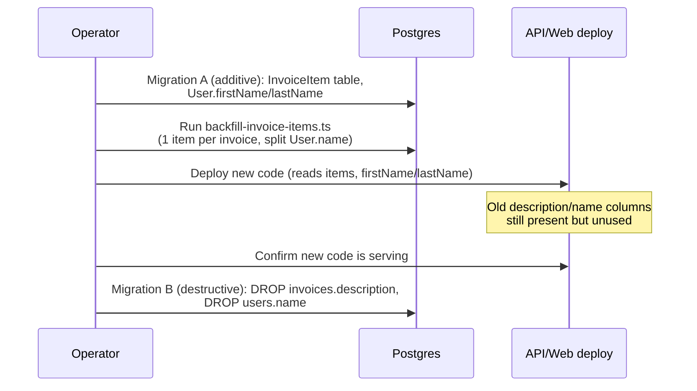

# feat: Itemized invoices, editable landlord profile, and a redesigned PDF

## Summary

Replace each invoice's single `description` with an itemized line list (description/quantity/total per line, one line backfilled per existing invoice), make the landlord's name (split into first/last) and email editable in Settings, and rework the generated PDF to add Sender/Bill-To sections, the invoice number, a right-aligned green balance due, and an items table.

---

## Problem Frame

Invoices today carry a single free-text `description` and a manually-entered `amount`. The landlord wants to break a job down into its constituent charges (e.g. "Ceiling drywall — 1 — $200", "Paint — 1 — $50") the way a real invoice does, with the invoice total derived from the lines rather than typed separately. Separately, the landlord's own identity (name, email) is mostly frozen — email is explicitly read-only today — and the generated PDF (added in `docs/plans/2026-08-05-001-feat-invoice-pdf-export-plan.md`, which explicitly deferred sender/recipient sections as its extension point) needs to look like a real invoice: who it's from, who it's billed to, the invoice number, a highlighted balance, and the line items in a table.

This plan touches the data model (a new child table, a landlord name-column split), every layer of the invoice write/read path (create, edit, list/search, contractor submission, Sheets export), the landlord's Settings page, and the PDF module.

---

## Requirements

**Itemized invoices**

- R1. An invoice has one or more line items, each with `description`, `quantity`, and `total`.
- R2. The invoice's `amount` is the sum of its items' totals — the landlord no longer types a top-level amount directly.
- R3. Existing invoices are backfilled with exactly one item: the current `description`, quantity `1`, total equal to the current `amount`.
- R4. The invoice create/edit form lets the landlord add, edit, and remove line items, with the invoice total updating live as items change.
- R5. Search, the invoices table, and the Sheets export continue to work once `description` is no longer a column — they read from items instead.
- R6. The public, no-login contractor submission form is unchanged (single amount + description); the backend stores that submission as a single line item, matching the existing-invoice backfill shape.

**Landlord profile**

- R7. The landlord can change their name and email from Settings.
- R8. The landlord's name is stored as separate first and last name fields (the PDF's Bill-To section needs them independently).

**PDF**

- R9. Each PDF page adds a Sender section (the contractor's name/contact when the invoice has one, otherwise the invoice's vendor name/email) and a Bill-To section (the landlord's first name, last name, and email).
- R10. Each page shows the invoice number.
- R11. The balance due moves to the right side of the page and is highlighted (green background), per the reference layout.
- R12. The line items render as a table (Description / Qty / Total columns), per the reference layout.

---

## Key Technical Decisions

- **Items live in a new `InvoiceItem` child table, not a JSON column.** Mirrors the existing `InvoiceImage` precedent (a per-invoice child table with a cascading FK) rather than introducing the repo's first JSON-blob-as-structured-data field. Keeps items independently indexable/queryable (needed for the search-by-item-description requirement) and consistent with how the codebase already models one-to-many invoice detail.
- **`amount` stays a stored, server-computed column — the API, not the client, is the source of truth for the sum.** `amount` already drives status logic, sorting, filters, the Sheets export, and the dashboard aggregates (`invoiceSummary`, `invoiceStats`) via SQL `groupBy`/`aggregate`. Keeping it as a real column means none of those read paths change; `createInvoice`/`updateInvoice`/`createSubmission`/`contractorUpdateSubmission` recompute it from the item totals inside the same transaction that writes the items, so it can never drift. The create/update schemas drop the `amount` input field entirely — an invoice's total is a derived fact, not user input.
- **`description` is dropped from `Invoice` once items land; items are the only description surface.** Per the confirmed scope, nothing keeps a parallel top-level summary. `ListInvoicesQuerySchema.search` moves from `description: { contains }` to `items: { some: { description: { contains } } } }`; the invoices table's "Job" column and the Sheets export's "Description" column render a joined summary of item descriptions (`shared` helper `summarizeItems`) instead of a single field.
- **Two-migration split for both drops (`invoices.description`, `users.name`), following the repo's own destructive-migration rule** (`docs/DEPLOYMENT.md` §3, precedent: `20260626000000_drop_invoice_attachment_url`). Migration A is purely additive (`InvoiceItem` table, `User.firstName`/`lastName` columns) plus a one-time backfill; the API/web code that stops reading `description`/`name` ships in the same deploy as migration A (additive changes are backward-compatible, so old-code/new-schema during the deploy window is fine per the same doc). Migration B (the actual `DROP COLUMN`s) is a separate migration file, run manually after confirming the new code is serving — exactly the documented drop procedure, applied to two columns instead of one.
- **Item backfill is a standalone idempotent script (`prisma/backfill-invoice-items.ts`), not raw SQL inside the migration** — mirrors the existing `prisma/backfill-events.ts` precedent (also a one-time, idempotent, `npm run db:backfill-*` script) rather than the newer pattern. The reason or `description) is a real driver: Prisma's `cuid()` id generation happens in application code (the `@prisma/client` runtime), not the database, so a plain SQL `INSERT ... SELECT` cannot mint ids in the same format as every other row. Also backfills `User.firstName`/`lastName` by splitting the existing `name` on the first space (idempotent: skips users that already have both set).
- **Item fields match the explicit spec (description, quantity, total) — no unit price.** The written requirement lists exactly three item fields; quantity does not drive `total` (it is informational, matching the "quantity of 1" backfill instruction, which is a direct copy of the existing amount, not a per-unit price times one). The reference table image shows a "Price" column, which the plan treats as generic table styling reference (borders, header color, row banding), not a fourth stored field — **flagged as an assumption for review**, since it's a literal conflict between the written field list and the visual reference.
- **PDF Sender falls back to vendor info when an invoice has no linked contractor.** Many invoices are landlord-entered directly (no `submittedByContractor`); those already carry `vendorName`/`vendorEmail`, the closest existing "who this expense is from" data. This is the plan's own inference (not explicitly specified) and is called out for review, not silently assumed.
- **Email becomes editable without adding a verification flow.** The current code comment ("email is the unique login id with no verification flow, so it is read-only") is superseded by explicit user request. The unique constraint stays (a duplicate returns 409, matching the existing `isUniqueViolation`/P2002 pattern used elsewhere); there is still no confirm-new-email loop, so a landlord could mistype their new email and lock themselves out on next login. Documented as a risk, not blocked on.
- **Full-replace semantics for items on `PATCH`.** When an update includes `items`, `updateInvoice` deletes the invoice's existing item rows and recreates them from the payload in the same transaction, then recomputes `amount` — simpler than diffing item-by-item and matches how the edit form always submits the complete current list (not incremental add/remove like `InvoiceImage`, which the UI treats as a live gallery).
- **No new ledger event type for item-level edits.** `amount`'s existing `FIELD_EDITED` tracking (via `TRACKED_FIELDS`) still fires when the computed sum changes, so a financially-material item edit is still visible in the timeline. A per-item diff event is deferred (Scope Boundaries) — it would need its own detail shape and UI, and the amount event already captures the financial signal.

---

## High-Level Technical Design

Data flow from item edits to the four things that read `amount`/`description` today:

```mermaid
flowchart LR
  subgraph Write path
    A[Create/Update payload<br/>items: description, qty, total] --> B[writeService<br/>recompute amount = sum items.total]
    B --> C[(Invoice.amount)]
    B --> D[(InvoiceItem rows<br/>full-replace on update)]
  end
  subgraph Read paths, unchanged shape
    C --> E[Status logic, sort,<br/>filters, dashboard aggregates]
    D --> F[Search: items.some.description contains]
    D --> G[Table job column,<br/>Sheets Description column<br/>via summarizeItems]
    D --> H[PDF items table]
  end
```

Migration sequencing (destructive drop is a separate, later step per `docs/DEPLOYMENT.md` §3):



---

## Scope Boundaries

**Non-goals**

- No unit-price field on items (see KTD on item fields).
- No email-change verification/confirmation flow.
- No per-item ledger events (only the aggregate `amount` change is tracked).

### Deferred to Follow-Up Work

- Itemized entry on the public contractor submission form (R6 keeps it single-line; confirmed with the user).
- CJK font embedding for the PDF (pre-existing deferral from DEC-027, unaffected by this plan).
- Reconciling the PDF's "Price" column ambiguity if the assumption above turns out wrong — revisit after landlord review of the first generated PDF.

---

## Implementation Units

### U1. Shared schemas — invoice items and profile fields

- **Goal:** Zod schemas and types for `InvoiceItem`, the updated `Create`/`UpdateInvoiceSchema` (items replace description/amount), the updated `UpdateProfileSchema` (firstName/lastName/email), and `AccountSchema`.
- **Requirements:** R1, R2, R7, R8
- **Dependencies:** none
- **Files:** `packages/shared/src/schemas/invoice.ts`, `packages/shared/src/schemas/settings.ts`, `packages/shared/src/lib/summarizeItems.ts` (new), `packages/shared/src/index.ts`, `packages/shared/test/invoice.test.ts` (or equivalent), `packages/shared/test/summarizeItems.test.ts` (new)
- **Approach:** `InvoiceItemInputSchema = { description: z.string().min(1).max(300), quantity: z.number().int().positive().max(9999), total: z.number().positive().multipleOf(0.01).lte(99_999_999.99) }`. `CreateInvoiceSchema` drops `description` and `amount`, adds `items: z.array(InvoiceItemInputSchema).min(1).max(50)`. `UpdateInvoiceSchema` stays `CreateInvoiceSchema.partial().extend({...})` (unchanged extension fields), so `items` is optional on PATCH (full-replace when present, per KTD). `UpdateProfileSchema` adds `firstName: z.string().trim().min(1).max(50).optional()`, `lastName: z.string().trim().min(1).max(50).optional()`, `email: z.string().trim().email().optional()`. `AccountSchema` replaces `name` with `firstName`/`lastName` (both `string | null`) and keeps `email`. `summarizeItems(items, {max})` — a pure helper (`"Ceiling drywall, Paint"` / `"Ceiling drywall +2 more"`) shared by the web table and the API's Sheets export so the two summaries can't drift.
- **Patterns to follow:** existing schema shapes in `packages/shared/src/schemas/invoice.ts` (bounds mirror `amount`'s `Decimal(10,2)` cap); `compareInvoiceOrder` in `packages/shared/src/lib/invoiceOrder.ts` as the shape for a shared pure helper + its own test file.
- **Test scenarios:**
  - `InvoiceItemInputSchema` rejects a zero/negative quantity, a non-multiple-of-0.01 total, and an over-cap total.
  - `CreateInvoiceSchema` rejects an empty `items` array and accepts one with 1–50 valid items; rejects a payload that still includes `description` or `amount` as unknown-but-ignored vs. required — confirm the schema no longer requires them (stripped, not merely optional, if `zod`'s object mode matters here).
  - `UpdateProfileSchema` accepts a partial `{ email }`-only or `{ firstName, lastName }`-only body (existing "PATCH just one field" contract preserved).
  - `summarizeItems`: one item → the description as-is; N items → "first +N-1 more"; empty array → `Test expectation: none` is not valid here since it's feature-bearing — cover the empty-array edge explicitly (should not occur post-R1, but the helper must not throw).
- **Verification:** Shared package tests green; `packages/shared` build/typecheck green.

### U2. Database schema, additive migration, and backfill script

- **Goal:** Add `InvoiceItem` and the `User` name-split columns without breaking anything currently deployed; backfill existing data.
- **Requirements:** R1, R3, R8
- **Dependencies:** U1
- **Files:** `apps/api/prisma/schema.prisma`, a new additive migration under `apps/api/prisma/migrations/` (name: `add_invoice_items_and_user_names`), `apps/api/prisma/backfill-invoice-items.ts` (new), `apps/api/package.json` (`db:backfill-invoice-items` script), `package.json` (root passthrough script), `apps/api/test/backfill-invoice-items.test.ts` (new)
- **Approach:** `model InvoiceItem { id, invoiceId, invoice Invoice @relation(onDelete: Cascade), description String, quantity Int, total Decimal(10,2), sortOrder Int, createdAt }` with an `@@index([invoiceId])`, mirroring `InvoiceImage`'s shape (cascading FK, indexed). `sortOrder` preserves the landlord's entry order (items have no natural sort key otherwise). `User` gains `firstName String?` and `lastName String?` (nullable so the migration is additive — the destructive migration in U4 drops `name` once every user has both). The migration keeps `invoices.description` and `users.name` untouched (drop is U4). The backfill script: for every invoice with zero items, create one `InvoiceItem` (description = current `description`, quantity 1, total = current `amount`, sortOrder 0); for every user with `firstName`/`lastName` both null, split `name` on the first space (`name` null/empty → leave both null, landlord fills in via Settings). Idempotent (re-running skips invoices/users already backfilled), following the `backfillEvents` precedent exactly.
- **Patterns to follow:** `apps/api/prisma/backfill-events.ts` (idempotent, `npm run db:backfill-*`, not a migration); `apps/api/test/invoices.backfill.test.ts` (test shape: seed pre-migration-style rows, run the backfill, assert the result, clean up).
- **Test scenarios:**
  - An invoice with no items gets exactly one item matching its description/amount after the backfill; an invoice that already has items (re-run) is untouched.
  - A user with `name: "Jane Doe"` backfills to `firstName: "Jane"`, `lastName: "Doe"`; a user with `name: "Cher"` (no space) backfills to `firstName: "Cher"`, `lastName: null` (or an equivalent documented single-word rule — pick one and assert it).
  - A user with `name: null` backfills to both fields null (landlord must fill in later).
  - Re-running the whole script twice produces no duplicate items and no changed names (idempotency).
- **Verification:** `npm run db:migrate` applies cleanly on a fresh DB; `npm run db:backfill-invoice-items` test suite green; manual: run against a copy of real data and spot-check a handful of invoices/users.

### U3. API: item-aware create/update/list/search and Sheets export

- **Goal:** Every invoice write path writes items and computes `amount` from them; every read path that touched `description` reads items instead.
- **Requirements:** R2, R5, R6
- **Dependencies:** U1, U2
- **Files:** `apps/api/src/invoices/writeService.ts`, `apps/api/src/invoices/handlers.ts`, `apps/api/src/invoices/sheetRows.ts`, `apps/api/test/invoices.create.test.ts`, `apps/api/test/invoices.crud.test.ts`, `apps/api/test/invoices.list.test.ts`, `apps/api/test/sheetRows.test.ts`
- **Approach:** `createInvoice`/`updateInvoice` compute `amount = items.reduce((s, i) => s + i.total, 0)` (Decimal-safe — sum as integer cents or via the Prisma `Decimal` type, not floats, per the codebase's existing "no float math" convention for money) inside the transaction, write the `InvoiceItem` rows (`createMany`), and (on update, when `items` is present) delete the invoice's existing items first — full-replace, per KTD. `createSubmission` (contractor path) wraps its single `description`/`amount` input into one `InvoiceItem` the same way the backfill does, and sets `amount` from that item's total (currently just the input `amount` — unchanged value, now also mirrored into one item row). `contractorUpdateSubmission`: when `description` or `amount` is edited, update the invoice's single item row's `description`/`total` to match (keeps items and `amount` consistent for a submission, which always has exactly one item) and recompute `amount` from the item. `listInvoices`: `q.search` filter becomes `where.items = { some: { description: { contains: q.search, mode: 'insensitive' } } }`; the response includes each invoice's `items` (small arrays, no pagination needed) instead of `description`. `sheetRows.ts`: `EXPORT_COLUMNS`' `description` cell becomes `summarizeItems(inv.items)`; `InvoiceRowInput` gains `items` and drops `description`.
- **Patterns to follow:** `writeService.ts`'s existing transaction shape (`createInvoice`, `updateInvoice`) and `writeImageAttachment` as the shape for a small "write child rows in the same transaction" helper; `TRACKED_FIELDS`/`normalize` for keeping `amount`'s ledger tracking working unchanged.
- **Test scenarios:**
  - Create with 3 items → invoice `amount` equals the sum of the 3 totals; all 3 `InvoiceItem` rows exist with the right `sortOrder`.
  - Create with an `items` sum that would exceed the `Decimal(10,2)` bound → 400 `VALIDATION_ERROR` (not a DB overflow error).
  - Update replacing `items` (2 → 1 item) → old items gone, one new item, `amount` recomputed; a `FIELD_EDITED` event fires for `amount` iff the sum actually changed.
  - Update that omits `items` entirely → existing items and `amount` untouched (partial-update contract preserved).
  - Contractor submission create → exactly one `InvoiceItem` with quantity 1, total = submitted amount.
  - Contractor edits a SUBMITTED invoice's `description`/`amount` → the invoice's single item row is updated to match (description and total both reflect the edit).
  - `search=paint` matches an invoice whose item list contains "Paint" but whose (deprecated) top-level description does not (pins the new query shape).
  - `sheetRows.invoiceToRow` renders `"Paint, Ceiling drywall"` for a 2-item invoice and the single description for a 1-item invoice (existing Sheets ordering/columns tests still pass unchanged otherwise).
- **Verification:** `npm run test` (api workspace) green; manual: create an invoice with 3 items via the API, confirm the list/detail/Sheets export all agree on the total.

### U4. Destructive migration — drop `invoices.description` and `users.name`

- **Goal:** Remove the now-unused legacy columns, following the repo's documented drop procedure.
- **Requirements:** R5, R8 (cleanup)
- **Dependencies:** U3, U6 (web must no longer read the old fields), U7 landed and deployed
- **Files:** a new migration under `apps/api/prisma/migrations/` (name: `drop_invoice_description_and_user_name`), `apps/api/prisma/schema.prisma` (remove the two fields)
- **Approach:** Mirror `20260626000000_drop_invoice_attachment_url` exactly: a comment block stating the deploy-order inversion (deploy code first, confirm serving, then run `db:deploy`), a pre-drop verification query pattern (`SELECT COUNT(*) FROM invoices WHERE description IS NOT NULL AND description != ''` is not meaningful here since description stays populated but unread — instead verify every invoice has ≥1 item and every user has firstName/lastName set, or accept null), then `ALTER TABLE invoices DROP COLUMN description; ALTER TABLE users DROP COLUMN name;`.
- **Patterns to follow:** `apps/api/prisma/migrations/20260626000000_drop_invoice_attachment_url/migration.sql`; `docs/DEPLOYMENT.md` §3 destructive-migration callout.
- **Test scenarios:** Test expectation: none — schema-only unit; correctness is covered by U1–U3's tests no longer referencing the dropped columns, and by not running this migration until the rest of the plan is deployed and confirmed.
- **Verification:** `npm run db:deploy` applies cleanly against a DB where U2's backfill has already run; app continues to serve reads/writes with no `column does not exist` errors.

### U5. Web: itemized invoice form, table, detail, and contractor-submit adapter

- **Goal:** The landlord can add/edit/remove line items when creating or editing an invoice; the invoices table, detail page, and public contractor form reflect the new shape.
- **Requirements:** R4, R5, R6
- **Dependencies:** U1, U3
- **Files:** `apps/web/src/components/InvoiceForm.tsx`, `apps/web/src/components/InvoiceTable.tsx`, `apps/web/src/pages/InvoiceDetail.tsx`, `apps/web/src/pages/InvoiceEdit.tsx`, `apps/web/src/pages/InvoiceNew.tsx`, `apps/web/src/hooks/useInvoices.ts`, `apps/web/src/hooks/useInvoice.ts`, `apps/web/src/pages/ContractorSubmit.tsx` (no UI change — payload shape only, if it changes at all per R6), `apps/web/src/locales/en/translation.json`, `apps/web/src/locales/zh/translation.json`, `apps/web/test/InvoiceForm.test.tsx`, `apps/web/test/InvoiceTable.test.tsx`, `apps/web/test/InvoiceDetail.test.tsx`, `apps/web/test/InvoiceEdit.test.tsx`, `apps/web/test/InvoiceNew.test.tsx`
- **Approach:** `InvoiceForm` uses `useFieldArray` (React Hook Form, already a dependency) for `items`, each row rendering description/quantity/total inputs plus a remove button and an "Add item" control; a read-only computed total (`items.reduce(...)`, live via `watch`) replaces the old manual `amount` input. `InvoiceTable`'s "Job" column renders `summarizeItems(inv.items)`. `InvoiceDetail` replaces the single description `Field` with an items table. `useInvoices`'s `InvoiceListItem` and `useInvoice`'s `Invoice` type drop `description`, add `items: {id, description, quantity, total}[]`. `ContractorSubmit` keeps its existing single amount+description inputs (R6 — confirmed unchanged); no code change needed unless the backend's accepted body shape changed (it hasn't — U3 keeps `createSubmission`'s input signature as `{amount, description, ...}` and does the item-wrapping server-side).
- **Patterns to follow:** any existing `useFieldArray` usage in the repo if present, otherwise RHF's standard array-field pattern; `InvoiceForm.tsx`'s existing field block structure (label + input + error) repeated per item row.
- **Test scenarios:**
  - Adding two items and removing one leaves the form with the remaining item and an updated computed total.
  - Submitting the form sends `items` (not `description`/`amount`) matching `CreateInvoiceSchema`'s shape.
  - The computed total display updates as an item's `total` field changes (no submit required).
  - `InvoiceTable` renders a joined summary for a 3-item invoice and the plain description-equivalent for a 1-item invoice.
  - `InvoiceDetail` renders every item's description/quantity/total in a table, in `sortOrder`.
  - Edit form pre-fills all existing items from the fetched invoice (`toDefaults` no longer maps `description`/`amount`, maps `items`).
  - i18n: new keys (item row labels, add/remove buttons, computed-total label) exist in both `en` and `zh` catalogs (`test/i18n-catalog.test.ts` enforces).
- **Verification:** Component tests green; i18n catalog test green; manual: create an invoice with 3 items, edit it down to 1, confirm the list/detail totals stay correct throughout.

### U6. API: editable landlord name and email

- **Goal:** `PATCH /api/settings/profile` accepts and persists `firstName`, `lastName`, and `email`.
- **Requirements:** R7, R8
- **Dependencies:** U1, U2
- **Files:** `apps/api/src/settings/handlers.ts`, `apps/api/test/settings.profile.test.ts` (new or extend an existing settings test file)
- **Approach:** `updateProfile` adds `firstName`/`lastName`/`email` to the conditional `data` object (same `!== undefined` pattern already used for `name`/`locale`); `accountSelect` swaps `name` for `firstName`/`lastName`. Email uniqueness is already enforced by the DB's `@unique` constraint — a duplicate throws P2002, which the shared `errorHandler` already maps to 409 (matching the invoice-number collision pattern elsewhere in the codebase), so no new error-handling code is needed, only confirming the existing central handler covers this table too.
- **Patterns to follow:** `updateProfile`'s existing conditional-field-update shape; the `isUniqueViolation`/P2002 handling already established for invoice numbers (`handlers.ts`) as the reference for what "already handled centrally" looks like — verify, don't reimplement.
- **Test scenarios:**
  - PATCH with `{ firstName, lastName }` only updates those two fields, leaving email untouched.
  - PATCH with a new, available `email` succeeds and the returned account reflects it.
  - PATCH with an `email` already used by another user → 409 (not 500), matching the existing collision-handling convention.
  - PATCH with an invalid email format → 400 `VALIDATION_ERROR` (schema rejects before reaching Prisma).
- **Verification:** API tests green; manual: change the seeded landlord's email via the API, confirm subsequent login uses the new address.

### U7. Web: Settings profile form for name and email

- **Goal:** The landlord can edit first name, last name, and email from the Settings page.
- **Requirements:** R7, R8
- **Dependencies:** U1, U6
- **Files:** `apps/web/src/pages/Settings.tsx`, `apps/web/src/hooks/useSettings.ts`, `apps/web/src/locales/en/translation.json`, `apps/web/src/locales/zh/translation.json`, `apps/web/test/Settings.test.tsx`
- **Approach:** `ProfileSection` gains a `lastName` input alongside the existing `name` input (renamed to first name), and the email input becomes editable (drop `readOnly`/`disabled`, drop the "can't be changed yet" helper text). `useUpdateProfile`'s `UpdateProfileInput` already covers the new fields via U1/U6; the mutation call site adds `firstName`/`lastName`/`email` to its payload the same way `name` is sent today. Surface the 409 (duplicate email) via the existing `errOf`/`ApiError` pattern already used for other settings errors.
- **Patterns to follow:** `Settings.tsx`'s existing `ProfileSection` structure (local `useState` per editable field, `me?.field ?? ''` fallback, single Save button, success/error message spans) — extend the same shape rather than introducing a new pattern.
- **Test scenarios:**
  - Editing first name, last name, and email and saving calls the mutation with all three; a success message appears.
  - A 409 from a duplicate email shows the server's error message via the existing `role="alert"` pattern, without clearing the user's typed values.
  - The email input is no longer `readOnly`/disabled and no longer shows the "can't be changed yet" copy.
  - i18n: new/changed keys (`settings.profile.lastName`, updated `email`-related copy) exist in both catalogs.
- **Verification:** Component tests green; i18n catalog test green; manual: change the landlord's email in Settings, log out, log back in with the new email.

### U8. PDF: Sender/Bill-To, invoice number, right-aligned green balance, items table

- **Goal:** The generated PDF matches the reference layout: Sender + Bill-To sections, invoice number, a right-aligned highlighted balance, and an items table.
- **Requirements:** R9, R10, R11, R12
- **Dependencies:** U1, U3, U5 (needs `items` on the list payload), U7 (needs the landlord's firstName/lastName/email)
- **Files:** `apps/web/src/lib/invoicePdf.ts`, `apps/web/src/pages/InvoiceList.tsx` (source the landlord identity via `useMe()` and per-invoice contractor/vendor data at confirm time), `apps/web/src/hooks/useInvoices.ts` (extend `InvoiceListItem` with `vendorEmail`, `submittedByContractorId`, and a resolved contractor `{name, contact}` — or fetch contractors similarly to how properties are joined today), `apps/web/test/invoicePdf.test.ts`
- **Approach:** `PdfInvoiceInput` gains `invoiceNumber` (already present), `items: {description, quantity, total}[]`, `vendorName`, `vendorEmail`, and an optional `contractor: {name, contact} | null`. `buildInvoicePdfModel` builds a `sender` block (`contractor ?? { name: vendorName, contact: vendorEmail }`) and reuses the existing `landlord` argument (new: `{ firstName, lastName, email }`, passed once for the whole PDF, not per-page — Bill-To/Recipient is always the same landlord). The per-page table renders one row per item (Description/Qty/Total columns) instead of the current single-row Location/Description/Amount table — Location (property address) moves to a page header line since it's no longer a table column, or stays a labeled field above the table (implementer's call, keep it visible). `balanceDue` renders right-aligned with a green fill rectangle behind it (`doc.setFillColor` + `doc.rect` before the text, matching the reference image), replacing the current left-aligned plain-text line.
- **Patterns to follow:** `apps/web/src/lib/invoicePdf.ts`'s existing two-layer split (pure model builder vs. render wrapper) — extend both layers, don't restructure the split; `PDF_LABELS`/`PDF_TABLE_COLUMNS` as the single-source-of-truth pattern for the new Sender/Bill-To labels and the items-table columns.
- **Execution note:** The page-model builder (pure, no jsPDF) should be extended and tested before the render wrapper — it's the layer the test scenarios below can actually assert against without mocking jsPDF.
- **Test scenarios:**
  - A page with a linked contractor renders Sender = contractor name/contact; a page with no contractor renders Sender = vendorName/vendorEmail.
  - Every page's Bill-To section shows the same landlord firstName/lastName/email regardless of which invoice the page is for.
  - The items table has one row per item, in `sortOrder`, with correctly formatted Qty and `en-US` currency Total.
  - `balanceDue` model output carries enough info for the render wrapper to right-align and highlight it (e.g., an explicit `{value, highlight: true}` shape, not just a string) — assert the model shape, not pixel positions.
  - The invoice number renders on the page header (already partly covered by the existing `heading` field — confirm it survives the Sender/Bill-To addition).
  - Render wrapper: dynamic import still invoked only at call time (regression check against R12 of the prior PDF plan).
- **Verification:** Unit tests on the page-model builder green; manual: generate a PDF for a mix of contractor-submitted and landlord-entered invoices, visually confirm against the two reference images (Sender/Bill-To layout, green right-aligned balance, items table).

### U9. Decision log entry

- **Goal:** Record the load-bearing choices in the project's append-only decision log.
- **Requirements:** —
- **Dependencies:** U1–U8 landed
- **Files:** `docs/DECISIONS.md`
- **Approach:** Append `DEC-028` covering: the `InvoiceItem` child-table choice, server-computed `amount`, the two-migration destructive-drop sequencing (`description`/`name`), the item-fields-not-price decision, the PDF Sender fallback rule, and the no-verification editable-email decision.
- **Test scenarios:** Test expectation: none — documentation-only unit.
- **Verification:** Entry present, numbered correctly (next after DEC-027).

---

## Risks & Dependencies

- **Two open assumptions need landlord sign-off shortly after implementation**: (1) the PDF items table has no Price/unit-cost column (only Description/Qty/Total, per the written spec over the reference image), and (2) Sender falls back to vendor name/email when an invoice has no linked contractor. Both are called out in KTDs; a quick look at the first generated PDF should confirm or correct them before this ships broadly.
- **Editable email with no verification** — a landlord typo locks them out of their own login until a DB-level fix. Accepted per explicit request; no mitigation beyond the existing "someone with DB access can fix it" fallback that already exists for other account issues.
- **Migration sequencing risk**: forgetting to run the U4 destructive migration in the documented order (code-first, verify, then drop) would break every invoice/user read, exactly as documented for the `attachmentUrl` precedent. Mitigated by copying that migration's own deploy-order comment block verbatim (adapted) and keeping U4 as its own late-dependency unit rather than folding it into U2.
- **Decimal-sum correctness**: summing item totals in JS floats would reintroduce the float-money bug the codebase has explicitly avoided elsewhere (DEC-002, CONV-004/013 per the prior PDF plan's Sources). Mitigated by summing via Prisma `Decimal` arithmetic (or integer cents) in `writeService`, not `Number` addition — called out explicitly in U3's Approach.
- **Search behavior change**: `search` moving from `description` to `items.some.description` is a real, user-visible behavior change (a previously-matching top-level description that isn't repeated in any item description would stop matching). Accepted per the confirmed scope; no migration of historical search expectations needed since the backfill copies `description` verbatim into each invoice's one item.

---

## Sources & Research

- Prior art in-repo: `apps/api/prisma/schema.prisma` (`InvoiceImage` as the child-table precedent), `apps/api/src/invoices/writeService.ts` (transaction shape, `TRACKED_FIELDS`, `contractorUpdateSubmission`), `apps/api/src/invoices/sheetRows.ts` and `handlers.ts` (search/list/export read paths), `apps/api/prisma/backfill-events.ts` and `apps/api/test/invoices.backfill.test.ts` (idempotent-script backfill pattern), `apps/web/src/lib/invoicePdf.ts` and `docs/plans/2026-08-05-001-feat-invoice-pdf-export-plan.md` (the PDF module this plan extends — its Deferred section explicitly named sender/recipient sections as the next step), `apps/web/src/pages/Settings.tsx` and `apps/api/src/settings/handlers.ts` (profile edit surface), `apps/api/prisma/migrations/20260626000000_drop_invoice_attachment_url/migration.sql` and `docs/DEPLOYMENT.md` §3 (destructive-migration procedure this plan's U4 follows).
- Decisions/conventions honored: DEC-002 (Decimal money, no floats), DEC-013/023 (invoice-number and description-search history), DEC-016 (child-table precedent for per-invoice detail), DEC-026f (Sheets typed-column caveat — confirmed not applicable to the Description cell), DEC-027 (the PDF module and its explicitly deferred sender/recipient extension point).
- No external research was run — this is a self-contained data-model and UI extension of existing, well-established in-repo patterns (child tables, transactional writes, the PDF module's own two-layer split); nothing here depends on unsettled external technology choices.
